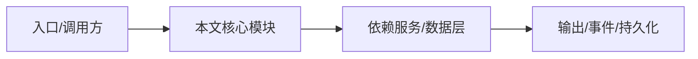

# 工程证明体系

NightHawk 用契约、一致性套件、安全冒烟和 e2e 来证明正确性，而不只是 demo。

## SDK 契约钉死

`packages/klient` 每个线上方法都有 zod schema 镜像，并通过 `test/contract-parity.ts` 与引擎类型做编译期一致性断言。

## 传输一致性

同一套 conformance suite 在 memory 和 IPC 两种传输上运行，保证字节级一致。

## 安全冒烟

`scripts/smoke-security.ts` 用已知漏洞样本驱动 SecurityScan、SecretScan、TaintTrace、DepAudit。

## 仓库守卫

`scripts/check-no-comments.mjs`、`scripts/check-nix-workspace.mjs`、`scripts/check-service-naming.mjs` 等作为 lint 的一部分。

## 专业实现要点（开发流程视角）

### 需求分析

先明确产品要解决的核心问题：终端 AI Agent 需要同时具备编程、代码审计、渗透测试能力。

### 架构选型

选择 TypeScript monorepo，让应用、服务端、SDK、数据层共享类型；选择 pnpm workspace 管理依赖。

### 实现步骤

先做 Agent 内核（v1），再沉淀公共包（kosong/kaos），随后演进 v2 DI×Scope 引擎，最后包装 CLI/TUI/VS Code/Server。

### 验证方式

使用 `pnpm lint`、`pnpm typecheck`、`pnpm test`、`node scripts/smoke-security.ts` 形成回归防线。

### 维护注意

新增包必须同步 `pnpm-workspace.yaml` 与 `flake.nix`；公开 API 变更需 changeset。

## 逐函数实现说明

以下按源码文件列出可验证的导出函数/类，并给出实现职责说明。

## 核心代码片段

以下片段直接从仓库源码截取，用于展示关键实现形态；完整实现请打开对应文件。

> 本文证据路径没有可直接展示的 TS 源码片段。

## 时序/状态图

> 图注：`00-overview/engineering-proof.md` 的抽象流程；具体参与者与状态以源码和上文函数说明为准。

## 核心实现细节（源码导出）

以下是本文涉及路径中的真实源码导出/结构，帮助你把概念映射到函数、类与方法：

  - `packages/klient/README.md`（非 TS 源码，可直接阅读）
  - `scripts/smoke-security.ts`（未发现直接 export 符号，可能以副作用注册为主）
  - `package.json`（非 TS 源码，可直接阅读）

## 证据与代码位置

- `packages/klient/README.md`
- `scripts/smoke-security.ts`
- `package.json`

> 本文所有路径均相对仓库根目录；引用内容以仓库当前 `HEAD` 为准。
