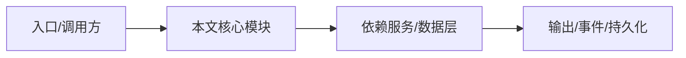

# 常见问题

回答 NightHawk 是什么、和扫描器有什么区别、v1/v2 是什么、如何扩展等高频问题。

## NightHawk 是扫描器吗？

不是。扫描器是它的一部分，但它本身是完整 coding agent，能读、改、跑、审计、修复。

## v1 和 v2 引擎区别？

v1 是 `packages/agent-core` 的统一引擎，包含 Agent/Session/profile/skills/安全工具；v2 是 `packages/agent-core-v2`，基于 DI×Scope 的 App/Workspace/Session/Agent 四层生命周期。当前服务端和 CLI 新能力主要走 v2。

## 如何扩展？

通过 MCP server、SKILL.md、插件 manifest、OpenAI 风格工具 schema 都能进入统一 tool registry。

## 是否只能在终端用？

不是。有 VS Code 扩展、REST/WS 服务端、Web inspector、可视化工具；但终端是主力形态。

## 专业实现要点（开发流程视角）

### 需求分析

先明确产品要解决的核心问题：终端 AI Agent 需要同时具备编程、代码审计、渗透测试能力。

### 架构选型

选择 TypeScript monorepo，让应用、服务端、SDK、数据层共享类型；选择 pnpm workspace 管理依赖。

### 实现步骤

先做 Agent 内核（v1），再沉淀公共包（kosong/kaos），随后演进 v2 DI×Scope 引擎，最后包装 CLI/TUI/VS Code/Server。

### 验证方式

使用 `pnpm lint`、`pnpm typecheck`、`pnpm test`、`node scripts/smoke-security.ts` 形成回归防线。

### 维护注意

新增包必须同步 `pnpm-workspace.yaml` 与 `flake.nix`；公开 API 变更需 changeset。

## 逐函数实现说明

以下按源码文件列出可验证的导出函数/类，并给出实现职责说明。

## 核心代码片段

以下片段直接从仓库源码截取，用于展示关键实现形态；完整实现请打开对应文件。

> 本文证据路径没有可直接展示的 TS 源码片段。

## 时序/状态图

> 图注：`00-overview/faq.md` 的抽象流程；具体参与者与状态以源码和上文函数说明为准。

## 核心实现细节（源码导出）

以下是本文涉及路径中的真实源码导出/结构，帮助你把概念映射到函数、类与方法：

  - `README.zh-CN.md`（非 TS 源码，可直接阅读）
  - `docs/architecture/plugin-and-extension-design.md`（非 TS 源码，可直接阅读）

## 证据与代码位置

- `README.zh-CN.md`
- `docs/architecture/plugin-and-extension-design.md`

> 本文所有路径均相对仓库根目录；引用内容以仓库当前 `HEAD` 为准。
