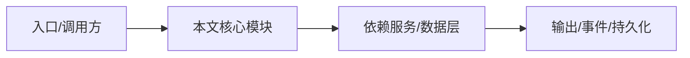

# Monorepo 结构与依赖方向

依赖方向是：应用层只通过公开 SDK 访问内核，核心包按领域分层，数据层和协议层被服务端与客户端共享。

## 应用依赖约束

`apps/nighthawk` 只能通过 `@nighthawk/nighthawk-sdk` 使用核心能力，不能直接依赖 `@nighthawk/agent-core`；v2 能力需要 deep-path 且有架构注释。见 `apps/nighthawk/AGENTS.md`。

## 包依赖

`agent-core-v2` 依赖 `minidb`、`protocol`、`oauth`、`tree-sitter-bash`；`kap-server` 依赖 `agent-core-v2`、`minidb`、`transcript`；`klient` 依赖 `agent-core-v2`、`protocol`。

## 共享契约

`protocol` 提供 REST/WS 协议 schema；`transcript` 拥有 transcript 契约类型；`klient` 的 contract 与引擎类型做编译期 parity。

## 数据流概要

用户输入 → CLI/TUI/SDK → server/dispatcher → agent-core-v2 Session/Agent → LLM 工具调用 → 结果写回 transcript/records/session。

## 专业实现要点（开发流程视角）

### 需求分析

先明确产品要解决的核心问题：终端 AI Agent 需要同时具备编程、代码审计、渗透测试能力。

### 架构选型

选择 TypeScript monorepo，让应用、服务端、SDK、数据层共享类型；选择 pnpm workspace 管理依赖。

### 实现步骤

先做 Agent 内核（v1），再沉淀公共包（kosong/kaos），随后演进 v2 DI×Scope 引擎，最后包装 CLI/TUI/VS Code/Server。

### 验证方式

使用 `pnpm lint`、`pnpm typecheck`、`pnpm test`、`node scripts/smoke-security.ts` 形成回归防线。

### 维护注意

新增包必须同步 `pnpm-workspace.yaml` 与 `flake.nix`；公开 API 变更需 changeset。

## 逐函数实现说明

以下按源码文件列出可验证的导出函数/类，并给出实现职责说明。

## 核心代码片段

以下片段直接从仓库源码截取，用于展示关键实现形态；完整实现请打开对应文件。

> 本文证据路径没有可直接展示的 TS 源码片段。

## 时序/状态图

> 图注：`00-overview/monorepo-layout.md` 的抽象流程；具体参与者与状态以源码和上文函数说明为准。

## 核心实现细节（源码导出）

以下是本文涉及路径中的真实源码导出/结构，帮助你把概念映射到函数、类与方法：

  - `AGENTS.md`（非 TS 源码，可直接阅读）
  - `apps/nighthawk/AGENTS.md`（非 TS 源码，可直接阅读）
  - `packages/klient/AGENTS.md`（非 TS 源码，可直接阅读）

## 证据与代码位置

- `AGENTS.md`
- `apps/nighthawk/AGENTS.md`
- `packages/klient/AGENTS.md`

> 本文所有路径均相对仓库根目录；引用内容以仓库当前 `HEAD` 为准。
