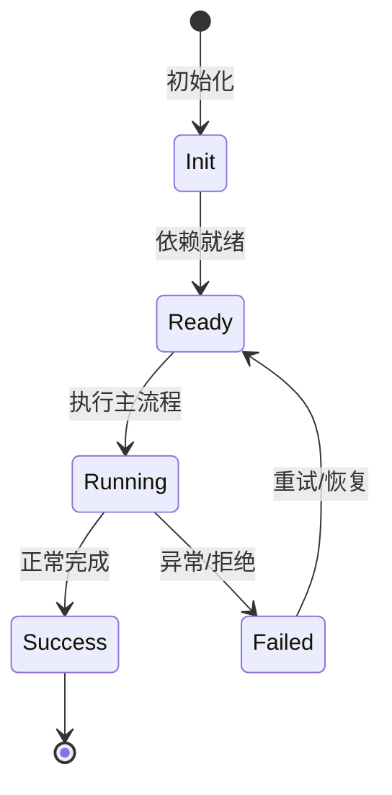

# 关键架构决策记录（ADR 风格）

本文按“决策记录”方式整理 NightHawk 项目中的关键技术决策，说明背景、选择、后果与代码证据。

## ADR-001：使用 TypeScript 严格模式 + pnpm monorepo

- **背景**：需要同时维护 CLI、SDK、Server、引擎、数据层，共享类型与协议。
- **决策**：TypeScript strict + pnpm workspace + tsdown + Vitest。
- **后果**：
  - 类型在包之间直接复用，减少协议漂移。
  - monorepo 增加依赖管理成本，因此用 `flake.nix` 同步 workspace 列表。
- **证据**：`package.json`、`pnpm-workspace.yaml`、`tsconfig.json`

## ADR-002：v1 引擎 → v2 DI×Scope 引擎

- **背景**：v1 将大量能力集中在 Agent/Session 类中，生命周期与依赖关系不够清晰。
- **决策**：新增 `agent-core-v2`，采用 App/Workspace/Session/Agent 四层 Scope，并用 Service/Feature/Contribution 组织能力。
- **后果**：
  - 状态归属更清晰，支持级联销毁和运行时装配。
  - 需要维护 v1/v2 迁移层，例如 `packages/node-sdk/src/sdk-rpc-client-v2.ts`。
- **证据**：`packages/agent-core-v2/AGENTS.md`、`docs/di.md`、`docs/features.md`

## ADR-003：安全能力作为一等 Agent 工具

- **背景**：安全审计不应依赖外部扫描器，而应融入 Agent 工作流。
- **决策**：将 SecurityScan、SecretScan、TaintTrace、DepAudit 作为内置工具暴露给 Agent。
- **后果**：用户可以一句提示词触发完整审计；工具共享统一审批与路径安全。
- **证据**：`packages/agent-core/src/tools/builtin/security/`

## ADR-004：SDK 契约由 zod 钉死

- **背景**：客户端 SDK 与引擎类型容易漂移。
- **决策**：`klient` 为每个线上方法维护 zod schema，并通过编译期 parity 测试与引擎类型对齐。
- **后果**：schema 漂移会在 CI 失败，而不是线上报错。
- **证据**：`packages/klient/README.md`、`test/contract-parity.ts`

## ADR-005：扩展格式兼容，不发明新方言

- **背景**：MCP、SKILL.md、Plugin manifest、OpenAI function schema 都已是生态事实标准。
- **决策**：运行时统一内部表示，外部格式做薄适配。
- **后果**：扩展作者可以用熟悉的格式接入，同时遵守统一审批与审计。
- **证据**：`docs/architecture/plugin-and-extension-design.md`

## ADR-006：Workspace Trust 作为启动安全门

- **背景**：恶意仓库可能通过 PATH 或配置文件诱导 agent 执行危险命令。
- **决策**：启动阶段在 workspace trust 确认前不得以裸命令名 spawn 子进程。
- **后果**：需要额外的一次信任交互，但显著降低 binary planting 风险。
- **证据**：`apps/nighthawk/AGENTS.md`

## ADR-007：Comment-free 区域

- **背景**：核心引擎代码注释过多会漂移，增加维护负担。
- **决策**：`agent-core-v2`、`kap-server`、`transcript` 禁止普通注释，只允许 JSDoc 与 lint suppression。
- **后果**：代码更接近自文档，但要求命名和 JSDoc 质量更高。
- **证据**：`AGENTS.md`、`scripts/check-no-comments.mjs`

## ADR-008：MiniDb 使用 WAL + Snapshot + Generation

- **背景**：需要嵌入式持久化、全文索引、崩溃恢复，又不能依赖原生数据库。
- **决策**：实现纯 Node MiniDb，使用 WAL、snapshot、二级索引、text index 和持久化 generation。
- **后果**：重启更快，支持跨会话搜索，但实现复杂度高。
- **证据**：`packages/minidb/README.md`、`AGENTS.md`

## ADR-009：Transcript 使用 op-batch 与订阅粒度

- **背景**：UI 需要实时增量渲染，同时要支持重放和持久化。
- **决策**：`transcript` 包提供 L1 store、L2 幂等操作、L3 订阅粒度、L4 视图注册。
- **后果**：前端可以按 off/turn/block/delta 粒度订阅，避免不必要渲染。
- **证据**：`packages/transcript/AGENTS.md`

## ADR-010：Node SEA 单文件分发

- **背景**：用户希望不需要安装 Node.js 也能使用 CLI。
- **决策**：构建 Node Single Executable Application，并支持原生安装脚本。
- **后果**：启动更快、分发更简单，但需要维护 native 构建流水线。
- **证据**：`apps/nighthawk/scripts/native/`、`install.sh`

## 专业实现要点（开发流程视角）

### 需求分析

架构要支撑多会话、多 agent、可扩展工具、可观测 DI、持久化和安全边界。

### 设计决策

使用四层 Scope 表达状态生命周期；用 Service/Feature/Contribution 替代中心化注册表；用事件和 veto 解耦模块。

### 实现步骤

先实现 `_base/di` 与 `_base/lifecycle`，再建立 App/Workspace/Session/Agent scope，最后把领域能力实现为 Feature。

### 验证方式

通过 `packages/agent-core-v2/test/` 的 scope host 测试、DI 级联测试和 nighthawk-inspect 的可视化验证。

### 维护注意

遵循依赖方向：子 scope 依赖父 scope；App 服务不得持有 session 级 Map 状态。

## 逐函数实现说明

以下按源码文件列出可验证的导出函数/类，并给出实现职责说明。

## 核心代码片段

以下片段直接从仓库源码截取，用于展示关键实现形态；完整实现请打开对应文件。

> 本文证据路径没有可直接展示的 TS 源码片段。

## 时序/状态图

> 图注：`01-architecture/decisions.md` 的抽象流程；具体参与者与状态以源码和上文函数说明为准。

## 核心实现细节（源码导出）

以下是本文涉及路径中的真实源码导出/结构，帮助你把概念映射到函数、类与方法：

  - `package.json`（非 TS 源码，可直接阅读）
  - `pnpm-workspace.yaml`（非 TS 源码，可直接阅读）
  - `packages/agent-core-v2/AGENTS.md`（非 TS 源码，可直接阅读）
  - `packages/agent-core-v2/docs/di.md`（非 TS 源码，可直接阅读）
  - `packages/agent-core-v2/docs/features.md`（非 TS 源码，可直接阅读）
  - `packages/klient/README.md`（非 TS 源码，可直接阅读）
  - `packages/minidb/README.md`（非 TS 源码，可直接阅读）
  - `packages/transcript/AGENTS.md`（非 TS 源码，可直接阅读）
  - `apps/nighthawk/AGENTS.md`（非 TS 源码，可直接阅读）
  - `docs/architecture/plugin-and-extension-design.md`（非 TS 源码，可直接阅读）

## 证据与代码位置

- `package.json`
- `pnpm-workspace.yaml`
- `packages/agent-core-v2/AGENTS.md`
- `packages/agent-core-v2/docs/di.md`
- `packages/agent-core-v2/docs/features.md`
- `packages/klient/README.md`
- `packages/minidb/README.md`
- `packages/transcript/AGENTS.md`
- `apps/nighthawk/AGENTS.md`
- `docs/architecture/plugin-and-extension-design.md`
