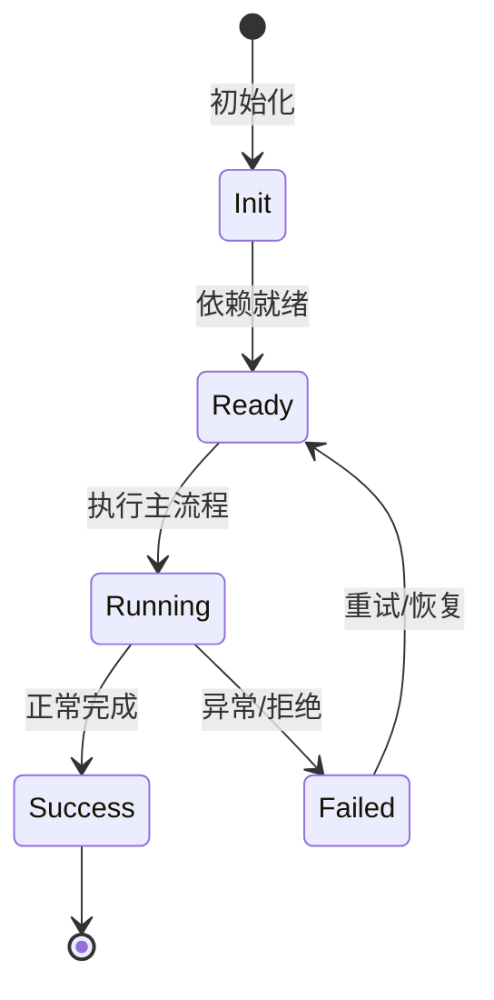

# DI × Scope 架构

agent-core-v2 使用自研依赖注入与四层 Scope，服务通过装饰器身份注册，状态归属决定生命周期。

## 服务身份

每个服务接口用 `createDecorator(name)` 创建全局唯一 `ServiceIdentifier`，实现类通过 `registerScopedService(scope, id, ctor, activation, domain)` 注册。

## Scope

App（进程级）、Workspace（每工作区）、Session（每会话）、Agent（每 agent）。子 scope 可以访问父 scope 服务，反之不行。

## 贡献点

Collection、ScopeUnits、Feature、ConfigSection、AgentToolContribution、EventStateContribution、CommandContribution 等。

## 级联与 Ledger

provide/unprovide/update 以事务方式执行，依赖图变化触发级联重建；Ledger 记录有序副作用并逆序销毁。

## 专业实现要点（开发流程视角）

### 需求分析

架构要支撑多会话、多 agent、可扩展工具、可观测 DI、持久化和安全边界。

### 设计决策

使用四层 Scope 表达状态生命周期；用 Service/Feature/Contribution 替代中心化注册表；用事件和 veto 解耦模块。

### 实现步骤

先实现 `_base/di` 与 `_base/lifecycle`，再建立 App/Workspace/Session/Agent scope，最后把领域能力实现为 Feature。

### 验证方式

通过 `packages/agent-core-v2/test/` 的 scope host 测试、DI 级联测试和 nighthawk-inspect 的可视化验证。

### 维护注意

遵循依赖方向：子 scope 依赖父 scope；App 服务不得持有 session 级 Map 状态。

## 逐函数实现说明

以下按源码文件列出可验证的导出函数/类，并给出实现职责说明。

### packages/agent-core-v2/src/_base/di/scope.ts

| 函数 | 行号 | 签名 | 实现说明 |
| --- | --- | --- | --- |
| `setScopeTopology` | 17 | `export function setScopeTopology(kinds: readonly string[]): void {` | `setScopeTopology` 负责写入或更新状态。 |
| `getScopedServiceDescriptors` | 93 | `export function getScopedServiceDescriptors(scope: ScopeKind): ReadonlyArray<ScopedEntry> {` | `getScopedServiceDescriptors` 负责读取或查询数据。 |
| `_clearScopedRegistryForTests` | 97 | `export function _clearScopedRegistryForTests(): void {` | `_clearScopedRegistryForTests` 是本文涉及模块中的一个导出函数/类，具体语义以源码实现为准。 |
| `createScopedChildHandle` | 153 | `export function createScopedChildHandle(` | `createScopedChildHandle` 负责创建/构建相关对象或流程。 |
| `createAppScope` | 287 | `export function createAppScope(options: ScopeOptions = {}): Scope {` | `createAppScope` 负责创建/构建相关对象或流程。 |

| 类 | 行号 | 声明 | 实现说明 |
| --- | --- | --- | --- |
| `Scope` | 177 | `export class Scope implements IDisposable {` | 该类封装本文模块的核心状态与行为。 |


## 核心代码片段

以下片段直接从仓库源码截取，用于展示关键实现形态；完整实现请打开对应文件。

### 来自 `packages/agent-core-v2/src/_base/di/scope.ts` 的 `setScopeTopology`

源码位置：`packages/agent-core-v2/src/_base/di/scope.ts:17` 附近。

```ts
export function setScopeTopology(kinds: readonly string[]): void {
  if (_scopeTopology === undefined) {
    _scopeTopology = [...kinds];
    return;
  }
  if (
    _scopeTopology.length === kinds.length &&
    _scopeTopology.every((kind, index) => kind === kinds[index])
  ) {
    return;
  }
  throw new BugIndicatingError(
    `scope topology already declared as [${_scopeTopology.join(', ')}]; cannot redeclare as [${kinds.join(', ')}]`,
  );
}

export interface ScopedEntry {
  readonly scope: ScopeKind;
  readonly id: ServiceIdentifier<unknown>;
  readonly descriptor: SyncDescriptor<unknown>;
  readonly domain: string;
  readonly activation: ScopeActivation;
}

// ...
```


## 时序/状态图



> 图注：`01-architecture/di-scope.md` 的抽象流程；具体参与者与状态以源码和上文函数说明为准。

## 核心实现细节（源码导出）

以下是本文涉及路径中的真实源码导出/结构，帮助你把概念映射到函数、类与方法：

  - `packages/agent-core-v2/src/_base/di/scope.ts`：
    - 导出签名/声明：
      - `export type ScopeKind = string;`
      - `export function setScopeTopology(kinds: readonly string[]): void`
      - `export interface ScopedEntry {`
      - `export function registerScopedService<T>(
  scope: ScopeKind,
  id: ServiceIdentifier<T>,
  ctor: new (...args: any[]) => T,
  activation: ScopeActivation = ...`
      - `export function overrideScopedService<T>(
  scope: ScopeKind,
  id: ServiceIdentifier<T>,
  ctor: new (...args: any[]) => T,
  activation: ScopeActivation = ...`
      - `export function getScopedServiceDescriptors(scope: ScopeKind): ReadonlyArray<ScopedEntry>`
      - `export function _clearScopedRegistryForTests(): void`
      - `export type ScopeSeed = ReadonlyArray<`
      - `export interface ScopeOptions {`
      - `export interface IScopeHandle<K extends ScopeKind = ScopeKind> {`
      - `export type IAppScopeHandle = IScopeHandle<'app'>;`
      - `export type ISessionScopeHandle = IScopeHandle<'session'>;`
      - `export type IAgentScopeHandle = IScopeHandle<'agent'>;`
      - `export function createScopedChildHandle(
  parent: IInstantiationService,
  kind: ScopeKind,
  id: string,
  options: ScopeOptions =`
      - `export class Scope implements IDisposable`
      - `export function createAppScope(options: ScopeOptions =`
  - `packages/agent-core-v2/docs/di.md`（非 TS 源码，可直接阅读）
  - `packages/agent-core-v2/src/app/scopes.ts`：
    - 导出签名/声明：
      - `export enum LifecycleScope {`
      - `export const SCOPE_TOPOLOGY: readonly LifecycleScope[] = [`

## 证据与代码位置

- `packages/agent-core-v2/src/_base/di/scope.ts`
- `packages/agent-core-v2/docs/di.md`
- `packages/agent-core-v2/src/app/scopes.ts`

> 本文所有路径均相对仓库根目录；引用内容以仓库当前 `HEAD` 为准。
