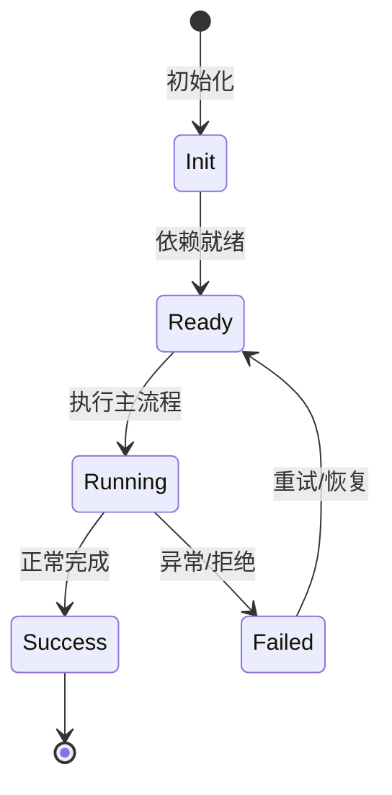

# 扩展架构

MCP、Skill、Plugin、Tool Schema 四条扩展路径最终都进入统一 tool registry。

## 统一内部表示

工具定义采用 OpenAI function calling JSON Schema 作为交换格式，内部转为 `AgentTool`。

## MCP

`McpConnectionManager` 管理 stdio/http/sse server；工具命名 `mcp__<server>__<tool>`。

## Skill

Markdown + frontmatter 的 playbook，按项目/用户/plugin/builtin 多层发现。

## Plugin

包含 manifest 的分发包，可携带 skills、mcpServers、tools。

## 专业实现要点（开发流程视角）

### 需求分析

架构要支撑多会话、多 agent、可扩展工具、可观测 DI、持久化和安全边界。

### 设计决策

使用四层 Scope 表达状态生命周期；用 Service/Feature/Contribution 替代中心化注册表；用事件和 veto 解耦模块。

### 实现步骤

先实现 `_base/di` 与 `_base/lifecycle`，再建立 App/Workspace/Session/Agent scope，最后把领域能力实现为 Feature。

### 验证方式

通过 `packages/agent-core-v2/test/` 的 scope host 测试、DI 级联测试和 nighthawk-inspect 的可视化验证。

### 维护注意

遵循依赖方向：子 scope 依赖父 scope；App 服务不得持有 session 级 Map 状态。

## 逐函数实现说明

以下按源码文件列出可验证的导出函数/类，并给出实现职责说明。

### packages/agent-core/src/mcp/auth-tool.ts

| 函数 | 行号 | 签名 | 实现说明 |
| --- | --- | --- | --- |
| `createMcpAuthTool` | 83 | `export function createMcpAuthTool(options: CreateMcpAuthToolOptions): ExecutableTool {` | `createMcpAuthTool` 负责创建/构建相关对象或流程。 |

### packages/agent-core/src/mcp/client-http.ts

| 函数 | 行号 | 签名 | 实现说明 |
| --- | --- | --- | --- |
| `isTerminalTransportError` | 214 | `export function isTerminalTransportError(error: Error): boolean {` | `isTerminalTransportError` 是本文涉及模块中的一个导出函数/类，具体语义以源码实现为准。 |
| `buildMcpHttpHeaders` | 220 | `export function buildMcpHttpHeaders(` | `buildMcpHttpHeaders` 负责创建/构建相关对象或流程。 |

| 类 | 行号 | 声明 | 实现说明 |
| --- | --- | --- | --- |
| `HttpMcpClient` | 47 | `export class HttpMcpClient implements MCPClient {` | 该类封装本文模块的核心状态与行为。 |

### packages/agent-core/src/mcp/client-remote.ts

| 函数 | 行号 | 签名 | 实现说明 |
| --- | --- | --- | --- |
| `buildMcpRemoteHeaders` | 4 | `export function buildMcpRemoteHeaders(` | `buildMcpRemoteHeaders` 负责创建/构建相关对象或流程。 |
| `isRemoteMcpConfig` | 30 | `export function isRemoteMcpConfig(config: McpServerConfig): config is McpRemoteServerConfig {` | `isRemoteMcpConfig` 是本文涉及模块中的一个导出函数/类，具体语义以源码实现为准。 |

### packages/agent-core/src/mcp/client-shared.ts

| 函数 | 行号 | 签名 | 实现说明 |
| --- | --- | --- | --- |
| `buildRequestOptions` | 40 | `export function buildRequestOptions(` | `buildRequestOptions` 负责创建/构建相关对象或流程。 |
| `toMcpToolDefinition` | 54 | `export function toMcpToolDefinition(tool: SdkListedTool): MCPToolDefinition {` | `toMcpToolDefinition` 是本文涉及模块中的一个导出函数/类，具体语义以源码实现为准。 |
| `toMcpToolResult` | 68 | `export function toMcpToolResult(result: unknown): MCPToolResult {` | `toMcpToolResult` 是本文涉及模块中的一个导出函数/类，具体语义以源码实现为准。 |

### packages/agent-core/src/mcp/client-sse.ts

| 函数 | 行号 | 签名 | 实现说明 |
| --- | --- | --- | --- |
| `isTerminalSseTransportError` | 176 | `export function isTerminalSseTransportError(error: Error): boolean {` | `isTerminalSseTransportError` 是本文涉及模块中的一个导出函数/类，具体语义以源码实现为准。 |

| 类 | 行号 | 声明 | 实现说明 |
| --- | --- | --- | --- |
| `SseMcpClient` | 46 | `export class SseMcpClient implements MCPClient {` | 该类封装本文模块的核心状态与行为。 |

### packages/agent-core/src/mcp/client-stdio.ts

| 函数 | 行号 | 签名 | 实现说明 |
| --- | --- | --- | --- |
| `resolveStdioCwd` | 231 | `export function resolveStdioCwd(configCwd: string \| undefined, defaultCwd: string \| undefined): string \| undefined {` | `resolveStdioCwd` 是本文涉及模块中的一个导出函数/类，具体语义以源码实现为准。 |
| `mergeStdioEnv` | 256 | `export function mergeStdioEnv(` | `mergeStdioEnv` 是本文涉及模块中的一个导出函数/类，具体语义以源码实现为准。 |

| 类 | 行号 | 声明 | 实现说明 |
| --- | --- | --- | --- |
| `StdioMcpClient` | 36 | `export class StdioMcpClient implements MCPClient {` | 该类封装本文模块的核心状态与行为。 |

### packages/agent-core/src/mcp/config-loader.ts

| 函数 | 行号 | 签名 | 实现说明 |
| --- | --- | --- | --- |
| `resolveMcpJsonPaths` | 40 | `export async function resolveMcpJsonPaths(input: ResolveMcpJsonPathsInput): Promise<McpJsonPaths> {` | `resolveMcpJsonPaths` 是本文涉及模块中的一个导出函数/类，具体语义以源码实现为准。 |
| `loadMcpServers` | 73 | `export async function loadMcpServers(` | `loadMcpServers` 是本文涉及模块中的一个导出函数/类，具体语义以源码实现为准。 |
| `loadMcpServersDetailed` | 83 | `export async function loadMcpServersDetailed(` | `loadMcpServersDetailed` 是本文涉及模块中的一个导出函数/类，具体语义以源码实现为准。 |

### packages/agent-core/src/mcp/config-view.ts

| 函数 | 行号 | 签名 | 实现说明 |
| --- | --- | --- | --- |
| `toMcpServerConfigView` | 22 | `export function toMcpServerConfigView(config: McpServerConfig): McpServerConfigView {` | `toMcpServerConfigView` 是本文涉及模块中的一个导出函数/类，具体语义以源码实现为准。 |

### packages/agent-core/src/mcp/connection-manager.ts

| 函数 | 行号 | 签名 | 实现说明 |
| --- | --- | --- | --- |
| `resolveMcpStartupTimeoutMs` | 76 | `export function resolveMcpStartupTimeoutMs(configMs?: number): number \| undefined {` | `resolveMcpStartupTimeoutMs` 是本文涉及模块中的一个导出函数/类，具体语义以源码实现为准。 |
| `resolveMcpToolTimeoutMs` | 92 | `export function resolveMcpToolTimeoutMs(configMs?: number): number \| undefined {` | `resolveMcpToolTimeoutMs` 是本文涉及模块中的一个导出函数/类，具体语义以源码实现为准。 |

| 类 | 行号 | 声明 | 实现说明 |
| --- | --- | --- | --- |
| `McpConnectionManager` | 154 | `export class McpConnectionManager {` | 该类封装本文模块的核心状态与行为。 |

### packages/agent-core/src/mcp/global-config.ts

| 函数 | 行号 | 签名 | 实现说明 |
| --- | --- | --- | --- |
| `normalizeServerName` | 140 | `export function normalizeServerName(name: string): string {` | `normalizeServerName` 是本文涉及模块中的一个导出函数/类，具体语义以源码实现为准。 |

| 类 | 行号 | 声明 | 实现说明 |
| --- | --- | --- | --- |
| `GlobalMcpConfigStore` | 17 | `export class GlobalMcpConfigStore {` | 该类封装本文模块的核心状态与行为。 |

### packages/agent-core/src/mcp/oauth/callback-server.ts

| 函数 | 行号 | 签名 | 实现说明 |
| --- | --- | --- | --- |
| `startCallbackServer` | 54 | `export async function startCallbackServer(): Promise<CallbackServer> {` | `startCallbackServer` 负责执行核心流程。 |

| 类 | 行号 | 声明 | 实现说明 |
| --- | --- | --- | --- |
| `OAuthCallbackClosedError` | 33 | `export class OAuthCallbackClosedError extends Error {` | 该类封装本文模块的核心状态与行为。 |

### packages/agent-core/src/mcp/oauth/provider.ts

| 函数 | 行号 | 签名 | 实现说明 |
| --- | --- | --- | --- |
| `createMcpOAuthFetch` | 305 | `export function createMcpOAuthFetch(` | `createMcpOAuthFetch` 负责创建/构建相关对象或流程。 |

| 类 | 行号 | 声明 | 实现说明 |
| --- | --- | --- | --- |
| `McpOAuthClientProvider` | 77 | `export class McpOAuthClientProvider implements OAuthClientProvider {` | 该类封装本文模块的核心状态与行为。 |

### packages/agent-core/src/mcp/oauth/service.ts

| 类 | 行号 | 声明 | 实现说明 |
| --- | --- | --- | --- |
| `McpOAuthService` | 148 | `export class McpOAuthService {` | 该类封装本文模块的核心状态与行为。 |
| `AlreadyAuthorizedError` | 607 | `export class AlreadyAuthorizedError extends Error {` | 该类封装本文模块的核心状态与行为。 |

### packages/agent-core/src/mcp/oauth/store.ts

| 函数 | 行号 | 签名 | 实现说明 |
| --- | --- | --- | --- |
| `mcpCredentialsDir` | 31 | `export function mcpCredentialsDir(nighthawkHomeDir: string): string {` | `mcpCredentialsDir` 是本文涉及模块中的一个导出函数/类，具体语义以源码实现为准。 |
| `defaultMcpCredentialsDir` | 35 | `export function defaultMcpCredentialsDir(): string {` | `defaultMcpCredentialsDir` 是本文涉及模块中的一个导出函数/类，具体语义以源码实现为准。 |
| `sanitizeStoreKey` | 39 | `export function sanitizeStoreKey(name: string): string {` | `sanitizeStoreKey` 是本文涉及模块中的一个导出函数/类，具体语义以源码实现为准。 |
| `canonicalMcpOAuthResource` | 49 | `export function canonicalMcpOAuthResource(serverUrl: string \| URL): string {` | `canonicalMcpOAuthResource` 是本文涉及模块中的一个导出函数/类，具体语义以源码实现为准。 |
| `mcpOAuthStoreKey` | 55 | `export function mcpOAuthStoreKey(serverName: string, serverUrl: string \| URL): string {` | `mcpOAuthStoreKey` 是本文涉及模块中的一个导出函数/类，具体语义以源码实现为准。 |

| 类 | 行号 | 声明 | 实现说明 |
| --- | --- | --- | --- |
| `JsonFileStore` | 67 | `export class JsonFileStore {` | 该类封装本文模块的核心状态与行为。 |

### packages/agent-core/src/mcp/output.ts

| 函数 | 行号 | 签名 | 实现说明 |
| --- | --- | --- | --- |
| `convertMCPContentBlock` | 83 | `export function convertMCPContentBlock(block: MCPContentBlock): ContentPart \| null {` | `convertMCPContentBlock` 是本文涉及模块中的一个导出函数/类，具体语义以源码实现为准。 |
| `mcpResultToExecutableOutput` | 171 | `export async function mcpResultToExecutableOutput(` | `mcpResultToExecutableOutput` 是本文涉及模块中的一个导出函数/类，具体语义以源码实现为准。 |

### packages/agent-core/src/mcp/registry.ts

| 函数 | 行号 | 签名 | 实现说明 |
| --- | --- | --- | --- |
| `mcpServerConfigsEqual` | 165 | `export function mcpServerConfigsEqual(a: McpServerConfig, b: McpServerConfig): boolean {` | `mcpServerConfigsEqual` 是本文涉及模块中的一个导出函数/类，具体语义以源码实现为准。 |

| 类 | 行号 | 声明 | 实现说明 |
| --- | --- | --- | --- |
| `McpServerRegistry` | 70 | `export class McpServerRegistry {` | 该类封装本文模块的核心状态与行为。 |

### packages/agent-core/src/mcp/session-config.ts

| 函数 | 行号 | 签名 | 实现说明 |
| --- | --- | --- | --- |
| `resolveSessionMcpConfig` | 22 | `export async function resolveSessionMcpConfig(` | `resolveSessionMcpConfig` 是本文涉及模块中的一个导出函数/类，具体语义以源码实现为准。 |
| `mergeCallerMcpServers` | 36 | `export function mergeCallerMcpServers(` | `mergeCallerMcpServers` 是本文涉及模块中的一个导出函数/类，具体语义以源码实现为准。 |

### packages/agent-core/src/mcp/tool-naming.ts

| 函数 | 行号 | 签名 | 实现说明 |
| --- | --- | --- | --- |
| `sanitizeMcpNamePart` | 17 | `export function sanitizeMcpNamePart(part: string): string {` | `sanitizeMcpNamePart` 是本文涉及模块中的一个导出函数/类，具体语义以源码实现为准。 |
| `isMcpToolName` | 21 | `export function isMcpToolName(name: string): boolean {` | `isMcpToolName` 是本文涉及模块中的一个导出函数/类，具体语义以源码实现为准。 |
| `qualifyMcpToolName` | 30 | `export function qualifyMcpToolName(serverName: string, toolName: string): string {` | `qualifyMcpToolName` 是本文涉及模块中的一个导出函数/类，具体语义以源码实现为准。 |

### packages/agent-core/src/mcp/types.ts

| 函数 | 行号 | 签名 | 实现说明 |
| --- | --- | --- | --- |
| `assertMcpInputSchema` | 99 | `export function assertMcpInputSchema(` | `assertMcpInputSchema` 是本文涉及模块中的一个导出函数/类，具体语义以源码实现为准。 |

### packages/agent-core-v2/src/agent/plugin/agentPluginOps.ts

| 类 | 行号 | 声明 | 实现说明 |
| --- | --- | --- | --- |
| `PluginSessionStartEvent` | 17 | `export class PluginSessionStartEvent extends AgentEvent2<` | 该类封装本文模块的核心状态与行为。 |

### packages/agent-core-v2/src/agent/plugin/agentPluginService.ts

| 类 | 行号 | 声明 | 实现说明 |
| --- | --- | --- | --- |
| `AgentPluginService` | 65 | `export class AgentPluginService extends Service implements IAgentPluginService {` | 该类封装本文模块的核心状态与行为。 |


## 核心代码片段

以下片段直接从仓库源码截取，用于展示关键实现形态；完整实现请打开对应文件。

### 来自 `packages/agent-core/src/mcp/auth-tool.ts` 的 `createMcpAuthTool`

源码位置：`packages/agent-core/src/mcp/auth-tool.ts:83` 附近。

```ts
export function createMcpAuthTool(options: CreateMcpAuthToolOptions): ExecutableTool {
  const { serverName, serverUrl, oauthService, reconnect, timeoutMs } = options;
  const name = qualifyMcpToolName(serverName, AUTH_TOOL_TOOL_NAME);
  const description = DESCRIPTION_TEMPLATE(serverName);
  // No arguments; an empty object schema keeps providers happy across SDKs.
  const parameters = toInputJsonSchema(z.object({}));
  const execute = async (ctx: ExecutableToolContext): Promise<ExecutableToolResult> => {
    const { signal, onUpdate } = ctx;
    signal.throwIfAborted();

    onUpdate?.({ kind: 'status', text: `Discovering OAuth metadata for ${serverName}…` });

    let flow: Awaited<ReturnType<McpOAuthService['beginAuthorization']>>;
    try {
      flow = await oauthService.beginAuthorization(serverName, serverUrl);
    } catch (error) {
      if (error instanceof AlreadyAuthorizedError) {
        onUpdate?.({ kind: 'status', text: `Already authorized; reconnecting ${serverName}…` });
        try {
          await reconnect(signal);
        } catch (reconnectError) {
          return errorResult(serverName, reconnectError);
        }
        return {
// ...
```

### 来自 `packages/agent-core/src/mcp/client-http.ts` 的 `isTerminalTransportError`

源码位置：`packages/agent-core/src/mcp/client-http.ts:214` 附近。

```ts
export function isTerminalTransportError(error: Error): boolean {
  if (error.name === 'UnauthorizedError') return true;
  if (/Maximum reconnection attempts/i.test(error.message)) return true;
  return false;
}

export function buildMcpHttpHeaders(
  config: McpServerHttpConfig,
  envLookup: (name: string) => string | undefined,
): Record<string, string> | undefined {
  return buildMcpRemoteHeaders(config, envLookup);
}
```

### 来自 `packages/agent-core/src/mcp/client-remote.ts` 的 `buildMcpRemoteHeaders`

源码位置：`packages/agent-core/src/mcp/client-remote.ts:4` 附近。

```ts
export function buildMcpRemoteHeaders(
  config: McpRemoteServerConfig,
  envLookup: (name: string) => string | undefined,
): Record<string, string> | undefined {
  const headers: Record<string, string> = { ...config.headers };
  if (config.bearerTokenEnvVar !== undefined) {
    const token = envLookup(config.bearerTokenEnvVar);
    if (token === undefined || token.length === 0) {
      throw new NighthawkError(
        ErrorCodes.CONFIG_INVALID,
        `MCP ${config.transport.toUpperCase()} bearer token env var "${config.bearerTokenEnvVar}" is not set or is empty`,
      );
    }
    // Strip any case-variant 'authorization' static header before injecting the
    // bearer; Fetch Headers folds duplicate keys into a comma-joined value,
    // which produces an invalid auth header rather than letting the bearer win.
    for (const key of Object.keys(headers)) {
      if (key.toLowerCase() === 'authorization') {
        delete headers[key];
      }
    }
    headers['Authorization'] = `Bearer ${token}`;
  }
  return Object.keys(headers).length > 0 ? headers : undefined;
// ...
```


## 时序/状态图



> 图注：`01-architecture/extension-architecture.md` 的抽象流程；具体参与者与状态以源码和上文函数说明为准。

## 核心实现细节（源码导出）

以下是本文涉及路径中的真实源码导出/结构，帮助你把概念映射到函数、类与方法：

  - `docs/architecture/plugin-and-extension-design.md`（非 TS 源码，可直接阅读）
  - `packages/agent-core/src/mcp//` 目录下源码文件示例：
    - `packages/agent-core/src/mcp/auth-tool.ts`
    - `packages/agent-core/src/mcp/client-http.ts`
    - `packages/agent-core/src/mcp/client-remote.ts`
    - `packages/agent-core/src/mcp/client-shared.ts`
    - `packages/agent-core/src/mcp/client-sse.ts`
    - `packages/agent-core/src/mcp/client-stdio.ts`
    - `packages/agent-core/src/mcp/config-loader.ts`
    - `packages/agent-core/src/mcp/config-view.ts`
    - `packages/agent-core/src/mcp/connection-manager.ts`
    - `packages/agent-core/src/mcp/global-config.ts`
    - `packages/agent-core/src/mcp/index.ts`
    - `packages/agent-core/src/mcp/oauth/callback-server.ts`
    - `packages/agent-core/src/mcp/oauth/index.ts`
    - `packages/agent-core/src/mcp/oauth/provider.ts`
    - `packages/agent-core/src/mcp/oauth/service.ts`
    - `packages/agent-core/src/mcp/oauth/store.ts`
    - `packages/agent-core/src/mcp/output.ts`
    - `packages/agent-core/src/mcp/registry.ts`
    - `packages/agent-core/src/mcp/session-config.ts`
    - `packages/agent-core/src/mcp/tool-naming.ts`
    - `packages/agent-core/src/mcp/types.ts`
  - `packages/agent-core-v2/src/agent/plugin//` 目录下源码文件示例：
    - `packages/agent-core-v2/src/agent/plugin/agentPlugin.ts`
    - `packages/agent-core-v2/src/agent/plugin/agentPluginOps.ts`
    - `packages/agent-core-v2/src/agent/plugin/agentPluginService.ts`
    - `packages/agent-core-v2/src/agent/plugin/index.ts`

## 证据与代码位置

- `docs/architecture/plugin-and-extension-design.md`
- `packages/agent-core/src/mcp/`
- `packages/agent-core-v2/src/agent/plugin/`

> 本文所有路径均相对仓库根目录；引用内容以仓库当前 `HEAD` 为准。
