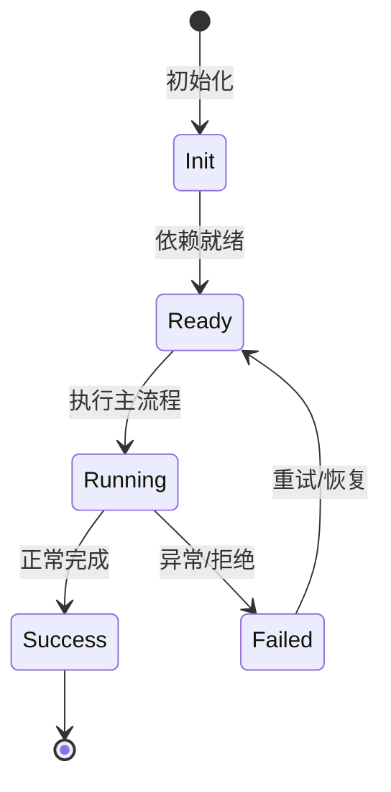

# Feature 系统

Feature 是自包含的内置能力单元，一个 Feature 可以贡献服务、工具、profile、配置、命令。

## 定义

`src/features/feature.ts` 定义 `Feature` 基类；`registerFeature(Recipe)` 注册；`src/features/featureRegistry.ts` 保存模块表。

## 贡献方式

`contributeService`、`contributeAgentService`、`contributeTool`、`contributeProfiles`、`contributeConfig`、`contributeCommand`。

## 现有 Feature

plan、goal、skill、swarm、todo、cron、externalHooks、interaction、security、sessionInit、staleGuard、tokenCounting、usage、tower、btw、debugEvents、dateChange。

## 装配

App scope 创建时 `IFeatureAssemblyService` 灌入 `IFeatureManager`；每个 feature 都是可 introspection、可 retract 的 unit。

## 专业实现要点（开发流程视角）

### 需求分析

架构要支撑多会话、多 agent、可扩展工具、可观测 DI、持久化和安全边界。

### 设计决策

使用四层 Scope 表达状态生命周期；用 Service/Feature/Contribution 替代中心化注册表；用事件和 veto 解耦模块。

### 实现步骤

先实现 `_base/di` 与 `_base/lifecycle`，再建立 App/Workspace/Session/Agent scope，最后把领域能力实现为 Feature。

### 验证方式

通过 `packages/agent-core-v2/test/` 的 scope host 测试、DI 级联测试和 nighthawk-inspect 的可视化验证。

### 维护注意

遵循依赖方向：子 scope 依赖父 scope；App 服务不得持有 session 级 Map 状态。

## 逐函数实现说明

以下按源码文件列出可验证的导出函数/类，并给出实现职责说明。

### packages/agent-core-v2/src/features/feature.ts

| 类 | 行号 | 声明 | 实现说明 |
| --- | --- | --- | --- |
| `Feature` | 43 | `export abstract class Feature extends Service {` | 该类封装本文模块的核心状态与行为。 |

### packages/agent-core-v2/src/features/featureAssemblyService.ts

| 类 | 行号 | 声明 | 实现说明 |
| --- | --- | --- | --- |
| `FeatureAssemblyService` | 9 | `export class FeatureAssemblyService extends Service implements IFeatureAssemblyService {` | 该类封装本文模块的核心状态与行为。 |


## 核心代码片段

以下片段直接从仓库源码截取，用于展示关键实现形态；完整实现请打开对应文件。

### 来自 `packages/agent-core-v2/src/features/feature.ts` 的 `Feature`

源码位置：`packages/agent-core-v2/src/features/feature.ts:43` 附近。

```ts
export abstract class Feature extends Service {
  contribute<T>(token: CollectionToken<T>, value: T): FiberHandle {
    return this.provide(token, value);
  }

  contributeSessionModel<State>(definition: SessionModelDefinition<State>): FiberHandle {
    return this.provide(SessionModelContribution, definition as SessionModelDefinition);
  }

  contributeAgentModel<S, M extends AgentModel<S>>(
    definition: AgentModelDefinition<S, M>,
  ): FiberHandle {
    return this.provide(AgentModelContribution, definition as AgentModelDefinition<any, any>);
  }

  contributeAgentRuntime<Runtime>(provider: AgentRuntimeProvider<Runtime>): FiberHandle {
    return this.provide(AgentRuntimeContributionPoint, provider);
  }

  overrideAgentRuntime<Runtime>(provider: AgentRuntimeProvider<Runtime>): FiberHandle {
    return this.provide(AgentRuntimeOverrideContributionPoint, provider);
  }

  contributeConfig<T>(
// ...
```

### 来自 `packages/agent-core-v2/src/features/featureAssemblyService.ts` 的 `FeatureAssemblyService`

源码位置：`packages/agent-core-v2/src/features/featureAssemblyService.ts:9` 附近。

```ts
export class FeatureAssemblyService extends Service implements IFeatureAssemblyService {
  declare readonly _serviceBrand: undefined;

  constructor(@IFeatureManager featureManager: IFeatureManager) {
    super();
    for (const recipe of getFeatureRecipes()) {
      featureManager.provideUnit(recipe);
    }
  }
}

registerScopedService(
  LifecycleScope.App,
  IFeatureAssemblyService,
  FeatureAssemblyService,
  ScopeActivation.OnScopeCreated,
  'features',
);
```


## 时序/状态图



> 图注：`01-architecture/feature-system.md` 的抽象流程；具体参与者与状态以源码和上文函数说明为准。

## 核心实现细节（源码导出）

以下是本文涉及路径中的真实源码导出/结构，帮助你把概念映射到函数、类与方法：

  - `packages/agent-core-v2/src/features/feature.ts`：
    - 导出签名/声明：
      - `export abstract class Feature extends Service`
  - `packages/agent-core-v2/src/features/featureAssemblyService.ts`：
    - 导出签名/声明：
      - `export class FeatureAssemblyService extends Service implements IFeatureAssemblyService`
  - `packages/agent-core-v2/docs/features.md`（非 TS 源码，可直接阅读）

## 证据与代码位置

- `packages/agent-core-v2/src/features/feature.ts`
- `packages/agent-core-v2/src/features/featureAssemblyService.ts`
- `packages/agent-core-v2/docs/features.md`

> 本文所有路径均相对仓库根目录；引用内容以仓库当前 `HEAD` 为准。
