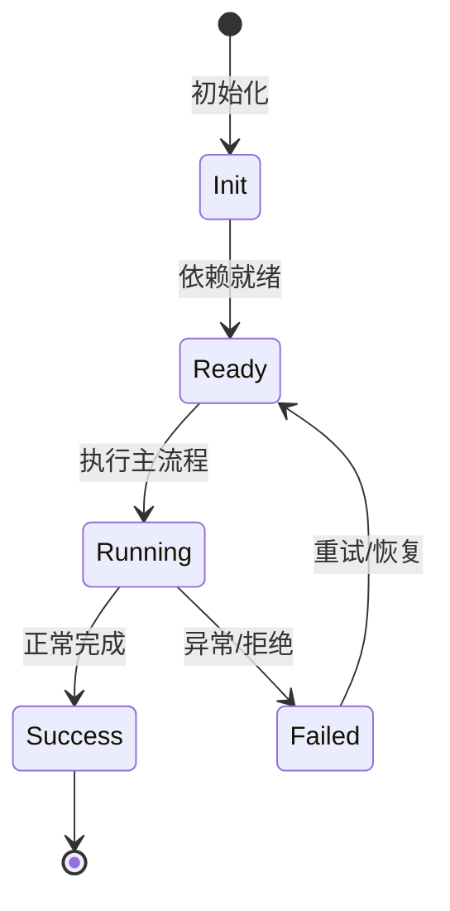

# 分层架构详解

从 UI 到存储的每一层职责、接口和依赖方向。

## UI 层

CLI/TUI 负责参数解析、交互渲染、审批弹窗、slash 命令；VS Code 负责 webview 会话；inspect 负责反射查看 DI/服务。UI 层通过 SDK 或 RPC 与内核通信。

## 传输层

kap-server 提供 REST `/api/v1`、WebSocket `/api/v1/ws`、debug `/api/v1/debug`。`klient` 提供 memory/IPC 传输。

## 引擎层

agent-core-v2 提供 workspace/session/agent 生命周期、agent loop、工具注册/执行、权限、MCP、skill、profile、plugin、transcript。

## 存储层

minidb 提供会话索引和搜索；文件系统存储 sessions/blobs/store/cache/logs；transcript 提供内存/持久化的 transcript 数据层。

## 专业实现要点（开发流程视角）

### 需求分析

架构要支撑多会话、多 agent、可扩展工具、可观测 DI、持久化和安全边界。

### 设计决策

使用四层 Scope 表达状态生命周期；用 Service/Feature/Contribution 替代中心化注册表；用事件和 veto 解耦模块。

### 实现步骤

先实现 `_base/di` 与 `_base/lifecycle`，再建立 App/Workspace/Session/Agent scope，最后把领域能力实现为 Feature。

### 验证方式

通过 `packages/agent-core-v2/test/` 的 scope host 测试、DI 级联测试和 nighthawk-inspect 的可视化验证。

### 维护注意

遵循依赖方向：子 scope 依赖父 scope；App 服务不得持有 session 级 Map 状态。

## 逐函数实现说明

以下按源码文件列出可验证的导出函数/类，并给出实现职责说明。

### packages/kap-server/src/routes/registerApiV2Routes.ts

| 函数 | 行号 | 签名 | 实现说明 |
| --- | --- | --- | --- |
| `registerApiV2Routes` | 13 | `export async function registerApiV2Routes(app: ApiV2AppHost, core: Scope): Promise<void> {` | `registerApiV2Routes` 是本文涉及模块中的一个导出函数/类，具体语义以源码实现为准。 |

### packages/agent-core-v2/src/app/bootstrap/bootstrap.ts

| 函数 | 行号 | 签名 | 实现说明 |
| --- | --- | --- | --- |
| `resolveHostArgs` | 34 | `export function resolveHostArgs(input: HostArgsInput \| undefined): HostArgs {` | `resolveHostArgs` 是本文涉及模块中的一个导出函数/类，具体语义以源码实现为准。 |
| `resolveBootstrapOptions` | 104 | `export function resolveBootstrapOptions(input: BootstrapInput): IBootstrapOptions {` | `resolveBootstrapOptions` 是本文涉及模块中的一个导出函数/类，具体语义以源码实现为准。 |
| `bootstrapSeed` | 122 | `export function bootstrapSeed(input: BootstrapInput): ScopeSeed {` | `bootstrapSeed` 是本文涉及模块中的一个导出函数/类，具体语义以源码实现为准。 |
| `bootstrap` | 135 | `export function bootstrap(input: BootstrapInput, extraSeeds: ScopeSeed = []): BootstrapResult {` | 创建 App Scope 并注入基础种子依赖。 |
| `resolveNighthawkHome` | 160 | `export function resolveNighthawkHome(` | `resolveNighthawkHome` 是本文涉及模块中的一个导出函数/类，具体语义以源码实现为准。 |
| `resolveConfigPath` | 168 | `export function resolveConfigPath(input: {` | `resolveConfigPath` 是本文涉及模块中的一个导出函数/类，具体语义以源码实现为准。 |
| `ensureNighthawkHome` | 175 | `export function ensureNighthawkHome(homeDir: string): void {` | `ensureNighthawkHome` 是本文涉及模块中的一个导出函数/类，具体语义以源码实现为准。 |

### packages/minidb/src/mini-db.ts

| 类 | 行号 | 声明 | 实现说明 |
| --- | --- | --- | --- |
| `MiniDb` | 76 | `export class MiniDb<V = unknown> {` | 该类封装本文模块的核心状态与行为。 |


## 核心代码片段

以下片段直接从仓库源码截取，用于展示关键实现形态；完整实现请打开对应文件。

### 来自 `packages/kap-server/src/routes/registerApiV2Routes.ts` 的 `registerApiV2Routes`

源码位置：`packages/kap-server/src/routes/registerApiV2Routes.ts:13` 附近。

```ts
export async function registerApiV2Routes(app: ApiV2AppHost, core: Scope): Promise<void> {
  await app.register(
    async (apiV2) => {
      registerV2SessionsRoutes(apiV2 as Parameters<typeof registerV2SessionsRoutes>[0], core);
      registerV2McpRoutes(apiV2 as Parameters<typeof registerV2McpRoutes>[0], core);
    },
    { prefix: '/api/v2' },
  );
}
```

### 来自 `packages/agent-core-v2/src/app/bootstrap/bootstrap.ts` 的 `resolveHostArgs`

源码位置：`packages/agent-core-v2/src/app/bootstrap/bootstrap.ts:34` 附近。

```ts
export function resolveHostArgs(input: HostArgsInput | undefined): HostArgs {
  return {
    agentFiles: input?.agentFiles,
    skillDirs: input?.skillDirs,
    requestHeaders: input?.requestHeaders ?? {},
    displayName: input?.displayName,
    replyStyleGuide: input?.replyStyleGuide,
  };
}

export interface IBootstrapOptions {
  readonly homeDir: string;
  readonly configPath: string;
  readonly osHomeDir: string;
  readonly platform: NodeJS.Platform;
  readonly arch: string;
  readonly cwd: string;
  readonly env: NodeJS.ProcessEnv;
  readonly clientIdentity: NighthawkHostIdentity;
  readonly args: HostArgs;
}

export const IBootstrapOptions: ServiceIdentifier<IBootstrapOptions> =
  createDecorator<IBootstrapOptions>('bootstrapOptions');
// ...
```

### 来自 `packages/minidb/src/mini-db.ts` 的 `MiniDb`

源码位置：`packages/minidb/src/mini-db.ts:76` 附近。

```ts
export class MiniDb<V = unknown> {
  dir!: string;
  walPath!: string;
  /* Non-private (package-internal): lifecycle.ts reads/writes this through its LifecycleHost view. */ indexPath!: string;
  /* Non-private (package-internal): lifecycle.ts reads/writes this through its LifecycleHost view. */ compoundIndexPath!: string;
  store!: Store;
  wal!: WAL;
  valueReader?: ValueReader;
  valueMode: ValueMode = 'memory';
  readonly indexes = new IndexManager();
  readonly dt = new DtIndex();
  readonly compound = new CompoundIndexManager();
  /** Text-index registry state lives in the TextRegistry facet (declared
   *  below, after stats); these views keep the generation / compaction /
   *  write paths' call sites unchanged. */
  private get text(): Map<string, TextIndex> {
    return this.textRegistry.text;
  }
  private get textDefs(): TextIndexDef[] {
    return this.textRegistry.textDefs;
  }
  private get textDrops(): Set<string> {
    return this.textRegistry.textDrops;
  }
// ...
```


## 时序/状态图



> 图注：`01-architecture/layered-architecture.md` 的抽象流程；具体参与者与状态以源码和上文函数说明为准。

## 核心实现细节（源码导出）

以下是本文涉及路径中的真实源码导出/结构，帮助你把概念映射到函数、类与方法：

  - `packages/kap-server/src/routes/registerApiV2Routes.ts`：
    - 导出签名/声明：
      - `export async function registerApiV2Routes(app: ApiV2AppHost, core: Scope): Promise<void>`
  - `packages/agent-core-v2/src/app/bootstrap/bootstrap.ts`：
    - 导出签名/声明：
      - `export interface HostArgs {`
      - `export interface HostArgsInput {`
      - `export function resolveHostArgs(input: HostArgsInput | undefined): HostArgs`
      - `export interface IBootstrapOptions {`
      - `export const IBootstrapOptions: ServiceIdentifier<IBootstrapOptions> =`
      - `export type PersistenceScopeName =`
      - `export interface IBootstrapService {`
      - `export const IBootstrapService: ServiceIdentifier<IBootstrapService> =`
      - `export interface BootstrapInput {`
      - `export function resolveBootstrapOptions(input: BootstrapInput): IBootstrapOptions`
      - `export function bootstrapSeed(input: BootstrapInput): ScopeSeed`
      - `export interface BootstrapResult {`
      - `export function bootstrap(input: BootstrapInput, extraSeeds: ScopeSeed = []): BootstrapResult`
      - `export function resolveNighthawkHome(
  homeDir?: string,
  env: NodeJS.ProcessEnv = process.env,
  osHomeDir: string = homedir(),
): string`
      - `export function resolveConfigPath(input:`
      - `export function ensureNighthawkHome(homeDir: string): void`
  - `packages/minidb/src/mini-db.ts`：
    - 导出签名/声明：
      - `export class MiniDb<V = unknown>`

## 证据与代码位置

- `packages/kap-server/src/routes/registerApiV2Routes.ts`
- `packages/agent-core-v2/src/app/bootstrap/bootstrap.ts`
- `packages/minidb/src/mini-db.ts`

> 本文所有路径均相对仓库根目录；引用内容以仓库当前 `HEAD` 为准。
