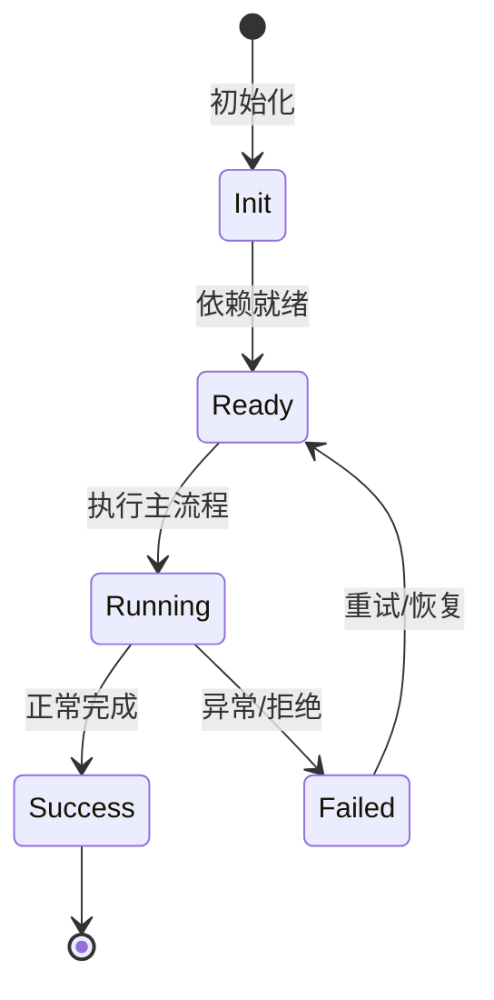

# 四层生命周期

App、Workspace、Session、Agent 各自的创建、持有和销毁语义。

## App

进程内单例；`bootstrap()` 创建 app scope；config、plugin、workspace service、session index 等常驻。

## Workspace

按 workspaceId 持有 handler；`workspaceLifecycle.handlerFor` 创建或获取，handler 不随 session 关闭而销毁。

## Session

一个会话一个 scope；session lifecycle 负责 create/resume/fork/close/delete。

## Agent

一个会话内可有一个 main agent 和多个 subagent；agent lifecycle 管理 runtime、contextMemory、toolExecutor 等。

## 专业实现要点（开发流程视角）

### 需求分析

架构要支撑多会话、多 agent、可扩展工具、可观测 DI、持久化和安全边界。

### 设计决策

使用四层 Scope 表达状态生命周期；用 Service/Feature/Contribution 替代中心化注册表；用事件和 veto 解耦模块。

### 实现步骤

先实现 `_base/di` 与 `_base/lifecycle`，再建立 App/Workspace/Session/Agent scope，最后把领域能力实现为 Feature。

### 验证方式

通过 `packages/agent-core-v2/test/` 的 scope host 测试、DI 级联测试和 nighthawk-inspect 的可视化验证。

### 维护注意

遵循依赖方向：子 scope 依赖父 scope；App 服务不得持有 session 级 Map 状态。

## 逐函数实现说明

以下按源码文件列出可验证的导出函数/类，并给出实现职责说明。

### packages/agent-core-v2/src/session/agentLifecycle/agentLifecycleService.ts

| 类 | 行号 | 声明 | 实现说明 |
| --- | --- | --- | --- |
| `AgentLifecycleService` | 70 | `export class AgentLifecycleService extends Disposable implements IAgentLifecycleService {` | 该类封装本文模块的核心状态与行为。 |

### packages/agent-core-v2/src/session/agentLifecycle/mainAgent.ts

| 函数 | 行号 | 签名 | 实现说明 |
| --- | --- | --- | --- |
| `ensureMainAgent` | 6 | `export async function ensureMainAgent(` | `ensureMainAgent` 是本文涉及模块中的一个导出函数/类，具体语义以源码实现为准。 |

### packages/agent-core-v2/src/session/agentLifecycle/managedAgent.ts

| 类 | 行号 | 声明 | 实现说明 |
| --- | --- | --- | --- |
| `ManagedAgent` | 8 | `export class ManagedAgent {` | 该类封装本文模块的核心状态与行为。 |

### packages/agent-core-v2/src/session/agentLifecycle/profile/gitContext.ts

| 函数 | 行号 | 签名 | 实现说明 |
| --- | --- | --- | --- |
| `collectGitContext` | 30 | `export async function collectGitContext(` | `collectGitContext` 是本文涉及模块中的一个导出函数/类，具体语义以源码实现为准。 |
| `sanitizeRemoteUrl` | 100 | `export function sanitizeRemoteUrl(remoteUrl: string): string \| null {` | `sanitizeRemoteUrl` 是本文涉及模块中的一个导出函数/类，具体语义以源码实现为准。 |
| `parseProjectName` | 119 | `export function parseProjectName(remoteUrl: string): string \| null {` | `parseProjectName` 是本文涉及模块中的一个导出函数/类，具体语义以源码实现为准。 |

### packages/agent-core-v2/src/session/agentLifecycle/subagentMetadata.ts

| 函数 | 行号 | 签名 | 实现说明 |
| --- | --- | --- | --- |
| `subagentLabels` | 3 | `export function subagentLabels(` | `subagentLabels` 是本文涉及模块中的一个导出函数/类，具体语义以源码实现为准。 |
| `labelsFromAgentMeta` | 14 | `export function labelsFromAgentMeta(` | `labelsFromAgentMeta` 是本文涉及模块中的一个导出函数/类，具体语义以源码实现为准。 |
| `isSubagentMeta` | 29 | `export function isSubagentMeta(meta: AgentMeta \| undefined): boolean {` | `isSubagentMeta` 是本文涉及模块中的一个导出函数/类，具体语义以源码实现为准。 |
| `subagentParentAgentId` | 35 | `export function subagentParentAgentId(meta: AgentMeta \| undefined): string \| undefined {` | `subagentParentAgentId` 是本文涉及模块中的一个导出函数/类，具体语义以源码实现为准。 |
| `subagentSwarmItem` | 40 | `export function subagentSwarmItem(meta: AgentMeta \| undefined): string \| undefined {` | `subagentSwarmItem` 是本文涉及模块中的一个导出函数/类，具体语义以源码实现为准。 |


## 核心代码片段

以下片段直接从仓库源码截取，用于展示关键实现形态；完整实现请打开对应文件。

### 来自 `packages/agent-core-v2/src/session/agentLifecycle/agentLifecycleService.ts` 的 `AgentLifecycleService`

源码位置：`packages/agent-core-v2/src/session/agentLifecycle/agentLifecycleService.ts:70` 附近。

```ts
export class AgentLifecycleService extends Disposable implements IAgentLifecycleService {
  declare readonly _serviceBrand: undefined;
  private readonly roster = new Map<string, ManagedAgent>();
  private readonly creating = new Map<string, Promise<AgentContext>>();
  private nextLifecycleGeneration = 0;
  private readonly records = new Map<string, AgentRuntimeDefinitionRecord>();
  private readonly recordGenerations = new Map<string, number>();
  private readonly contributions = new Map<AgentRuntimeContribution, AgentRuntimeDefinitionRecord>();
  private readonly onDidCreateEmitter = this._register(new Emitter<AgentContext>());
  private readonly onDidCreateScopeEmitter = this._register(new Emitter<AgentScopeCreatedEvent>());
  private readonly onWillCloseEmitter = this._register(new Emitter<AgentContext>());
  private readonly onDidCloseEmitter = this._register(new Emitter<AgentContext>());

  get onDidCreate() {
    return this.onDidCreateEmitter.event;
  }
  get onDidCreateScope() {
    return this.onDidCreateScopeEmitter.event;
  }
  get onWillClose() {
    return this.onWillCloseEmitter.event;
  }
  get onDidClose() {
    return this.onDidCloseEmitter.event;
// ...
```

### 来自 `packages/agent-core-v2/src/session/agentLifecycle/mainAgent.ts` 的 `ensureMainAgent`

源码位置：`packages/agent-core-v2/src/session/agentLifecycle/mainAgent.ts:6` 附近。

```ts
export async function ensureMainAgent(
  session: ISessionScopeHandle,
  opts?: Omit<CreateAgentOptions, 'agentId'>,
): Promise<AgentContext> {
  return session.accessor.get(IAgentLifecycleService).create({
    ...opts,
    agentId: MAIN_AGENT_ID,
  });
}
```

### 来自 `packages/agent-core-v2/src/session/agentLifecycle/managedAgent.ts` 的 `ManagedAgent`

源码位置：`packages/agent-core-v2/src/session/agentLifecycle/managedAgent.ts:8` 附近。

```ts
export class ManagedAgent {
  active = false;
  closing = false;
  readonly runtimeSet: AgentRuntimeSet;

  constructor(
    readonly context: AgentContext,
    readonly handle: IAgentScopeHandle,
    records: readonly AgentRuntimeDefinitionRecord[],
  ) {
    this.runtimeSet = new AgentRuntimeSet(context, handle.accessor);
    for (const record of records) this.runtimeSet.apply(record);
  }

  attachDurableRuntimes(): void {
    this.runtimeSet.attachDurable(this.handle.accessor.get(IEventDispatcher));
  }

  killSpace(): void {
    const space = this.context.space;
    if (space instanceof AgentSpaceImpl) space._kill();
  }
}
```


## 时序/状态图



> 图注：`01-architecture/lifecycle-scopes.md` 的抽象流程；具体参与者与状态以源码和上文函数说明为准。

## 核心实现细节（源码导出）

以下是本文涉及路径中的真实源码导出/结构，帮助你把概念映射到函数、类与方法：

  - `packages/agent-core-v2/src/app/workspace/workspace.ts`：
    - 导出签名/声明：
      - `export interface Workspace {`
      - `export interface WorkspaceUpdate {`
      - `export interface IWorkspaceService {`
      - `export const IWorkspaceService: ServiceIdentifier<IWorkspaceService> =`
  - `packages/agent-core-v2/src/app/sessionIndex/sessionIndex.ts`：
    - 导出签名/声明：
      - `export const PARENT_SESSION_ID_KEY = 'parent_session_id';`
      - `export const CHILD_SESSION_KIND_KEY = 'child_session_kind';`
      - `export const CHILD_SESSION_KIND = 'child';`
      - `export interface SessionSummary {`
      - `export interface SessionListQuery {`
      - `export interface SessionCountQuery {`
      - `export type SessionIndexState = 'uninitialized' | 'preparing' | 'ready' | 'degraded';`
      - `export interface SessionIndexStatus {`
      - `export interface ISessionIndex {`
      - `export const ISessionIndex: ServiceIdentifier<ISessionIndex> =`
      - `export interface ISessionIndexMirror {`
      - `export const ISessionIndexMirror: ServiceIdentifier<ISessionIndexMirror> =`
  - `packages/agent-core-v2/src/session/agentLifecycle//` 目录下源码文件示例：
    - `packages/agent-core-v2/src/session/agentLifecycle/agentLifecycle.ts`
    - `packages/agent-core-v2/src/session/agentLifecycle/agentLifecycleService.ts`
    - `packages/agent-core-v2/src/session/agentLifecycle/errors.ts`
    - `packages/agent-core-v2/src/session/agentLifecycle/mainAgent.ts`
    - `packages/agent-core-v2/src/session/agentLifecycle/managedAgent.ts`
    - `packages/agent-core-v2/src/session/agentLifecycle/profile/gitContext.ts`
    - `packages/agent-core-v2/src/session/agentLifecycle/profile/profiles.ts`
    - `packages/agent-core-v2/src/session/agentLifecycle/subagentMetadata.ts`

## 证据与代码位置

- `packages/agent-core-v2/src/app/workspace/workspace.ts`
- `packages/agent-core-v2/src/app/sessionIndex/sessionIndex.ts`
- `packages/agent-core-v2/src/session/agentLifecycle/`

> 本文所有路径均相对仓库根目录；引用内容以仓库当前 `HEAD` 为准。
