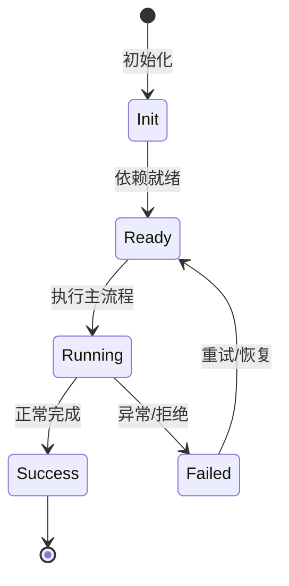

# 架构总览

NightHawk 是分层架构：应用层、服务端/传输层、Agent 引擎层、基础设施层。

## 分层模型

从上到下：`apps/nighthawk`（CLI/TUI）、`apps/vscode`（IDE 扩展）、`apps/nighthawk-inspect`（调试器）、`apps/vis`（可视化）；`packages/kap-server`（REST+WS）；`packages/agent-core-v2`（DI×Scope 引擎）；`packages/minidb`、`packages/transcript`、`packages/protocol` 等支撑层。

## 核心边界

应用不能直接 import 内核；`apps/nighthawk` 通过 `@nighthawk/nighthawk-sdk` 使用能力。服务端通过 dispatcher 把 REST/WS 调用翻译成 scope 内服务调用。

## 状态生命周期

引擎有 App/Workspace/Session/Agent 四层 scope；状态归属于哪一层就放在哪一层，避免用 App 级 Map 存 session 状态。

## 数据流向

用户输入进入 Session → Agent Loop → LLM Requester → 工具执行 → 结果回写 context/transcript → 事件广播到 TUI/Web。

## 专业实现要点（开发流程视角）

### 需求分析

架构要支撑多会话、多 agent、可扩展工具、可观测 DI、持久化和安全边界。

### 设计决策

使用四层 Scope 表达状态生命周期；用 Service/Feature/Contribution 替代中心化注册表；用事件和 veto 解耦模块。

### 实现步骤

先实现 `_base/di` 与 `_base/lifecycle`，再建立 App/Workspace/Session/Agent scope，最后把领域能力实现为 Feature。

### 验证方式

通过 `packages/agent-core-v2/test/` 的 scope host 测试、DI 级联测试和 nighthawk-inspect 的可视化验证。

### 维护注意

遵循依赖方向：子 scope 依赖父 scope；App 服务不得持有 session 级 Map 状态。

## 逐函数实现说明

以下按源码文件列出可验证的导出函数/类，并给出实现职责说明。

### packages/kap-server/src/transport/dispatcher.ts

| 函数 | 行号 | 签名 | 实现说明 |
| --- | --- | --- | --- |
| `resolveScope` | 31 | `export async function resolveScope(` | `resolveScope` 是本文涉及模块中的一个导出函数/类，具体语义以源码实现为准。 |
| `resolveService` | 72 | `export async function resolveService(` | `resolveService` 是本文涉及模块中的一个导出函数/类，具体语义以源码实现为准。 |
| `dispatch` | 100 | `export async function dispatch(` | `dispatch` 是本文涉及模块中的一个导出函数/类，具体语义以源码实现为准。 |


## 核心代码片段

以下片段直接从仓库源码截取，用于展示关键实现形态；完整实现请打开对应文件。

### 来自 `packages/kap-server/src/transport/dispatcher.ts` 的 `resolveScope`

源码位置：`packages/kap-server/src/transport/dispatcher.ts:31` 附近。

```ts
export async function resolveScope(
  core: Scope,
  scopeKind: ScopeKind,
  params: Record<string, string>,
): Promise<Scope | IScopeHandle> {
  switch (scopeKind) {
    case 'core':
      return core;
    case 'session': {
      const sessionId = params['session_id'] ?? '';
      const session = getLiveSessionById(core.accessor, sessionId);
      if (session === undefined) {
        throw new Error2(ErrorCodes.SESSION_NOT_FOUND, `session ${sessionId} not found`);
      }
      return session;
    }
    case 'agent': {
      const sessionId = params['session_id'] ?? '';
      const agentId = params['agent_id'] ?? '';
      const session = getLiveSessionById(core.accessor, sessionId);
      if (session === undefined) {
        throw new Error2(ErrorCodes.SESSION_NOT_FOUND, `session ${sessionId} not found`);
      }
      if (agentId === MAIN_AGENT_ID) return ensureMainAgent(session);
// ...
```


## 时序/状态图



> 图注：`01-architecture/overview.md` 的抽象流程；具体参与者与状态以源码和上文函数说明为准。

## 核心实现细节（源码导出）

以下是本文涉及路径中的真实源码导出/结构，帮助你把概念映射到函数、类与方法：

  - `packages/agent-core-v2/src/app/scopes.ts`：
    - 导出签名/声明：
      - `export enum LifecycleScope {`
      - `export const SCOPE_TOPOLOGY: readonly LifecycleScope[] = [`
  - `packages/kap-server/src/transport/dispatcher.ts`：
    - 导出签名/声明：
      - `export type ChannelLookup = (name: string) => ServiceIdentifier<unknown> | undefined;`
      - `export async function resolveScope(
  core: Scope,
  scopeKind: ScopeKind,
  params: Record<string, string>,
): Promise<Scope | IScopeHandle>`
      - `export async function resolveService(
  core: Scope,
  scopeKind: ScopeKind,
  params: Record<string, string>,
  serviceName: string,
  lookup: ChannelLookup...`
      - `export async function dispatch(
  core: Scope,
  scopeKind: ScopeKind,
  params: Record<string, string>,
  serviceName: string,
  method: string,
  arg: unkn...`
  - `apps/nighthawk/AGENTS.md`（非 TS 源码，可直接阅读）

## 证据与代码位置

- `packages/agent-core-v2/src/app/scopes.ts`
- `packages/kap-server/src/transport/dispatcher.ts`
- `apps/nighthawk/AGENTS.md`

> 本文所有路径均相对仓库根目录；引用内容以仓库当前 `HEAD` 为准。
