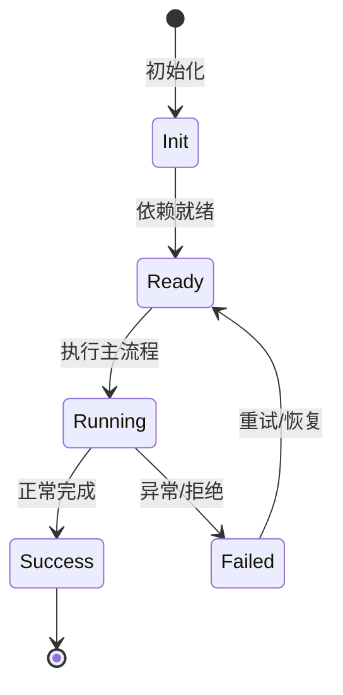

# 持久化与索引层

session 文件、minidb 查询索引、transcript、blob、cache 的持久化关系。

## 目录

`~/.nighthawk/sessions` 存会话，`blobs` 存媒体，`store` 存查询/状态，`cache` 存扫描缓存，`logs` 存日志，`credentials` 存 OAuth。

## Session Index

minidb read model 存 session summary，支持 keyset pagination、workspace 过滤、count。

## Search

kap-server search 服务基于 minidb text index，提供跨 session 全文搜索。

## Transcript

transcript 层把 agent 状态变更序列化为可重放事件，供 replay/UI。

## 专业实现要点（开发流程视角）

### 需求分析

架构要支撑多会话、多 agent、可扩展工具、可观测 DI、持久化和安全边界。

### 设计决策

使用四层 Scope 表达状态生命周期；用 Service/Feature/Contribution 替代中心化注册表；用事件和 veto 解耦模块。

### 实现步骤

先实现 `_base/di` 与 `_base/lifecycle`，再建立 App/Workspace/Session/Agent scope，最后把领域能力实现为 Feature。

### 验证方式

通过 `packages/agent-core-v2/test/` 的 scope host 测试、DI 级联测试和 nighthawk-inspect 的可视化验证。

### 维护注意

遵循依赖方向：子 scope 依赖父 scope；App 服务不得持有 session 级 Map 状态。

## 逐函数实现说明

以下按源码文件列出可验证的导出函数/类，并给出实现职责说明。

### packages/agent-core-v2/src/app/bootstrap/bootstrapService.ts

| 类 | 行号 | 声明 | 实现说明 |
| --- | --- | --- | --- |
| `BootstrapService` | 14 | `export class BootstrapService implements IBootstrapService {` | 该类封装本文模块的核心状态与行为。 |

### packages/kap-server/src/search/searchService.ts

| 函数 | 行号 | 签名 | 实现说明 |
| --- | --- | --- | --- |
| `drainGlobalSearchDisposals` | 100 | `export async function drainGlobalSearchDisposals(): Promise<void> {` | `drainGlobalSearchDisposals` 是本文涉及模块中的一个导出函数/类，具体语义以源码实现为准。 |

| 类 | 行号 | 声明 | 实现说明 |
| --- | --- | --- | --- |
| `InlineSearchBackend` | 219 | `export class InlineSearchBackend implements SearchBackend {` | 该类封装本文模块的核心状态与行为。 |
| `GlobalSearchService` | 268 | `export class GlobalSearchService implements IGlobalSearchService {` | 该类封装本文模块的核心状态与行为。 |


## 核心代码片段

以下片段直接从仓库源码截取，用于展示关键实现形态；完整实现请打开对应文件。

### 来自 `packages/agent-core-v2/src/app/bootstrap/bootstrapService.ts` 的 `BootstrapService`

源码位置：`packages/agent-core-v2/src/app/bootstrap/bootstrapService.ts:14` 附近。

```ts
export class BootstrapService implements IBootstrapService {
  declare readonly _serviceBrand: undefined;

  readonly platform: NodeJS.Platform;
  readonly arch: string;
  readonly cwd: string;
  readonly osHomeDir: string;
  readonly homeDir: string;
  readonly configPath: string;
  readonly clientIdentity: NighthawkHostIdentity;
  readonly args: HostArgs;
  readonly sessionsDir: string;
  readonly blobsDir: string;
  readonly storeDir: string;
  readonly cacheDir: string;
  readonly logsDir: string;
  readonly configKey: string;

  private readonly env: NodeJS.ProcessEnv;
  private readonly scopes: Readonly<Record<PersistenceScopeName, string>>;

  constructor(@IBootstrapOptions options: IBootstrapOptions) {
    this.platform = options.platform;
    this.arch = options.arch;
// ...
```

### 来自 `packages/kap-server/src/search/searchService.ts` 的 `drainGlobalSearchDisposals`

源码位置：`packages/kap-server/src/search/searchService.ts:100` 附近。

```ts
export async function drainGlobalSearchDisposals(): Promise<void> {
  while (pendingDisposals.size > 0) {
    await Promise.all(pendingDisposals);
  }
}

export interface IGlobalSearchService {
  readonly _serviceBrand: undefined;
  search(query: GlobalSearchQuery): Promise<GlobalSearchPage>;
  /** Full rebuild: wipe the index and rescan every wire file. */
  reindex(): Promise<{ sessions: number; documents: number }>;
  /**
   * Diagnostic status (the `/api/v1/debug` surface reflects it). Never
   * throws: a backend that cannot answer (failed open, worker down) reports
   * a degraded lifecycle instead of rejecting. `lifecycle` is the aggregate
   * state machine (stage 5): stopped → opening → ready → building/degraded →
   * closing. NOTE the historical contract: the call may kick/await the
   * backend's open and read-only refresh — use `lifecycleReport()` for a
   * non-intrusive local read.
   */
  status(): Promise<{
    sessions: number;
    documents: number;
    lastIndexedAt: number | null;
// ...
```


## 时序/状态图



> 图注：`01-architecture/persistence-layer.md` 的抽象流程；具体参与者与状态以源码和上文函数说明为准。

## 核心实现细节（源码导出）

以下是本文涉及路径中的真实源码导出/结构，帮助你把概念映射到函数、类与方法：

  - `packages/agent-core-v2/src/app/bootstrap/bootstrapService.ts`：
    - 导出签名/声明：
      - `export class BootstrapService implements IBootstrapService`
  - `packages/minidb/README.md`（非 TS 源码，可直接阅读）
  - `packages/kap-server/src/search/searchService.ts`：
    - 导出签名/声明：
      - `export type { GlobalSearchErrorReason } from './contract';`
      - `export const SEARCH_WORKER_FLAG_ID = 'search_worker';`
      - `export async function drainGlobalSearchDisposals(): Promise<void>`
      - `export interface IGlobalSearchService {`
      - `export const IGlobalSearchService = createDecorator<IGlobalSearchService>('globalSearch');`
      - `export interface LiveTranscriptSource {`
      - `export interface SearchBackend {`
      - `export class InlineSearchBackend implements SearchBackend`
      - `export class GlobalSearchService implements IGlobalSearchService`
    - 类内方法（节选）：`dropLiveLockToken`

## 证据与代码位置

- `packages/agent-core-v2/src/app/bootstrap/bootstrapService.ts`
- `packages/minidb/README.md`
- `packages/kap-server/src/search/searchService.ts`

> 本文所有路径均相对仓库根目录；引用内容以仓库当前 `HEAD` 为准。
