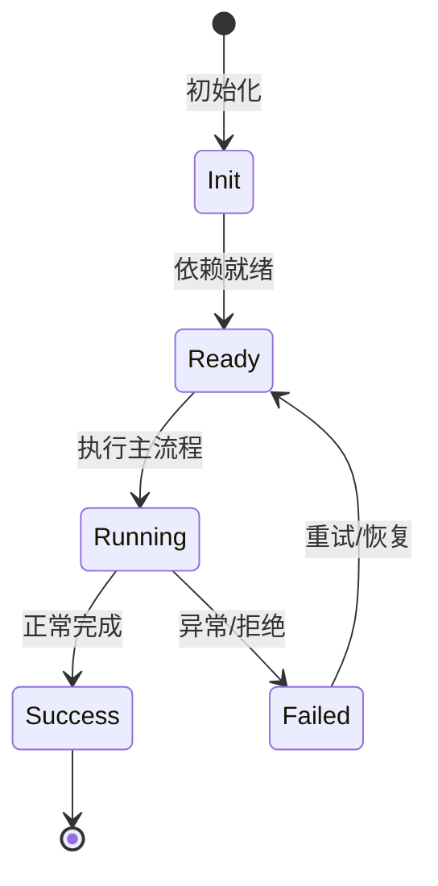

# Kap Server 架构

服务端把 agent-core-v2 的 scope 树映射成 REST/WS 可调用面，并负责认证、安全头、速率限制、实例注册。

## 启动

`start.ts` 解析 options，拒绝非 loopback 无 TLS，创建 engine bootstrap，注册 Fastify 路由，启动 model catalog scheduler。

## 中间件

auth hook、origin/host check、security headers、rate limit、request logging、schema validation。

## 路由组

sessions、workspaces、prompts、approvals、questions、files、fs、terminals、plugins、search、transcript、snapshot、tasks 等。

## 认证

持久 bearer token + 可选密码；loopback 下 debug endpoints 可开启。

## 专业实现要点（开发流程视角）

### 需求分析

架构要支撑多会话、多 agent、可扩展工具、可观测 DI、持久化和安全边界。

### 设计决策

使用四层 Scope 表达状态生命周期；用 Service/Feature/Contribution 替代中心化注册表；用事件和 veto 解耦模块。

### 实现步骤

先实现 `_base/di` 与 `_base/lifecycle`，再建立 App/Workspace/Session/Agent scope，最后把领域能力实现为 Feature。

### 验证方式

通过 `packages/agent-core-v2/test/` 的 scope host 测试、DI 级联测试和 nighthawk-inspect 的可视化验证。

### 维护注意

遵循依赖方向：子 scope 依赖父 scope；App 服务不得持有 session 级 Map 状态。

## 逐函数实现说明

以下按源码文件列出可验证的导出函数/类，并给出实现职责说明。

### packages/kap-server/src/start.ts

| 函数 | 行号 | 签名 | 实现说明 |
| --- | --- | --- | --- |
| `startServer` | 205 | `export async function startServer(opts: ServerStartOptions): Promise<RunningServer> {` | 启动 kap-server，包含认证、路由、WebSocket 和引擎初始化。 |
| `listenWithPortRetry` | 664 | `export async function listenWithPortRetry(` | `listenWithPortRetry` 负责读取或查询数据。 |

### packages/kap-server/src/middleware/auth.ts

| 函数 | 行号 | 签名 | 实现说明 |
| --- | --- | --- | --- |
| `createAuthHook` | 61 | `export function createAuthHook(` | `createAuthHook` 负责创建/构建相关对象或流程。 |

### packages/kap-server/src/routes/registerApiV2Routes.ts

| 函数 | 行号 | 签名 | 实现说明 |
| --- | --- | --- | --- |
| `registerApiV2Routes` | 13 | `export async function registerApiV2Routes(app: ApiV2AppHost, core: Scope): Promise<void> {` | `registerApiV2Routes` 是本文涉及模块中的一个导出函数/类，具体语义以源码实现为准。 |


## 核心代码片段

以下片段直接从仓库源码截取，用于展示关键实现形态；完整实现请打开对应文件。

### 来自 `packages/kap-server/src/start.ts` 的 `startServer`

源码位置：`packages/kap-server/src/start.ts:205` 附近。

```ts
export async function startServer(opts: ServerStartOptions): Promise<RunningServer> {
  const host = opts.host ?? DEFAULT_HOST;
  const port = opts.port ?? DEFAULT_PORT;
  const homeDir = resolveNighthawkHome(opts.homeDir);
  const serverVersion = opts.serverVersion ?? getServerVersion();
  const registry = createInstanceRegistry({
    instancesDir: opts.instancesDir ?? join(homeDir, 'server', 'instances'),
  });
  const registration: InstanceRegistration = await registry.register({
    pid: process.pid,
    host,
    port,
    startedAt: Date.now(),
    serverVersion,
  });
  const exposureClass = classify(host, { bindClass: opts.bindClass });
  if (exposureClass !== 'loopback' && opts.insecureNoTls !== true) {
    await registration.release();
    throw new Error(
      `Refusing to bind ${host} (${exposureClass}) without TLS; terminate TLS at a reverse proxy or pass --insecure-no-tls.`,
    );
  }
  const enableShutdown = exposureClass === 'loopback' || opts.allowRemoteShutdown === true;
  const enableTerminals = exposureClass === 'loopback' || opts.allowRemoteTerminals === true;
// ...
```

### 来自 `packages/kap-server/src/middleware/auth.ts` 的 `createAuthHook`

源码位置：`packages/kap-server/src/middleware/auth.ts:61` 附近。

```ts
export function createAuthHook(
  authTokenService: IAuthTokenService,
  opts?: AuthHookOptions,
): (req: FastifyRequest, reply: FastifyReply) => Promise<FastifyReply | void> {
  const isBypassed = opts?.isBypassed ?? defaultIsBypassed;
  const validateCredential: CredentialValidator =
    opts?.validateCredential ?? ((candidate) => authTokenService.isValid(candidate));

  return async (req, reply) => {
    if (opts?.limiter?.isBanned(req.ip) === true) {
      return reply.code(429).send(errEnvelope(AUTH_RATE_LIMIT_CODE, AUTH_RATE_LIMIT_MSG, req.id));
    }

    const header = req.headers.authorization;
    const token = extractBearer(header);

    if (isBypassed(req)) {
      return;
    }

    if (header !== undefined) {
      req.headers.authorization = REDACTED;
    }

// ...
```

### 来自 `packages/kap-server/src/routes/registerApiV2Routes.ts` 的 `registerApiV2Routes`

源码位置：`packages/kap-server/src/routes/registerApiV2Routes.ts:13` 附近。

```ts
export async function registerApiV2Routes(app: ApiV2AppHost, core: Scope): Promise<void> {
  await app.register(
    async (apiV2) => {
      registerV2SessionsRoutes(apiV2 as Parameters<typeof registerV2SessionsRoutes>[0], core);
      registerV2McpRoutes(apiV2 as Parameters<typeof registerV2McpRoutes>[0], core);
    },
    { prefix: '/api/v2' },
  );
}
```


## 时序/状态图



> 图注：`01-architecture/server-architecture.md` 的抽象流程；具体参与者与状态以源码和上文函数说明为准。

## 核心实现细节（源码导出）

以下是本文涉及路径中的真实源码导出/结构，帮助你把概念映射到函数、类与方法：

  - `packages/kap-server/src/start.ts`：
    - 导出签名/声明：
      - `export interface ServerHostIdentity extends NighthawkHostIdentity {`
      - `export interface ServerStartOptions {`
      - `export interface RunningServer {`
      - `export async function startServer(opts: ServerStartOptions): Promise<RunningServer>`
      - `export const PORT_RETRY_LIMIT = 100;`
      - `export interface ListenWithPortRetryOptions {`
      - `export async function listenWithPortRetry(
  opts: ListenWithPortRetryOptions,
): Promise<`
  - `packages/kap-server/src/middleware/auth.ts`：
    - 导出签名/声明：
      - `export interface AuthHookOptions {`
      - `export function createAuthHook(
  authTokenService: IAuthTokenService,
  opts?: AuthHookOptions,
): (req: FastifyRequest, reply: FastifyReply) => Promise<Fas...`
  - `packages/kap-server/src/routes/registerApiV2Routes.ts`：
    - 导出签名/声明：
      - `export async function registerApiV2Routes(app: ApiV2AppHost, core: Scope): Promise<void>`

## 证据与代码位置

- `packages/kap-server/src/start.ts`
- `packages/kap-server/src/middleware/auth.ts`
- `packages/kap-server/src/routes/registerApiV2Routes.ts`

> 本文所有路径均相对仓库根目录；引用内容以仓库当前 `HEAD` 为准。
