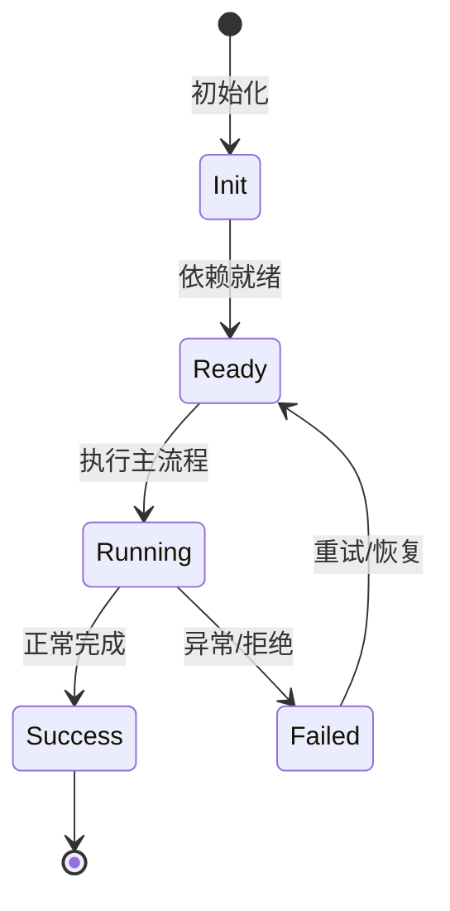

# Transcript 数据层

transcript 包提供 L1 store、L2 idempotent ops、L3 订阅粒度、L4 视图注册。

## L1

agent-granular store：按 agent 保存 transcript items。

## L2

idempotent 操作：同样的 op 多次应用结果一致，支持持久化重放。

## L3

订阅粒度 off/turn/block/delta，避免客户端收到不必要事件。

## L4

framework-free view registry，可在 React/Vue/终端等不同 UI 复用。

## 专业实现要点（开发流程视角）

### 需求分析

架构要支撑多会话、多 agent、可扩展工具、可观测 DI、持久化和安全边界。

### 设计决策

使用四层 Scope 表达状态生命周期；用 Service/Feature/Contribution 替代中心化注册表；用事件和 veto 解耦模块。

### 实现步骤

先实现 `_base/di` 与 `_base/lifecycle`，再建立 App/Workspace/Session/Agent scope，最后把领域能力实现为 Feature。

### 验证方式

通过 `packages/agent-core-v2/test/` 的 scope host 测试、DI 级联测试和 nighthawk-inspect 的可视化验证。

### 维护注意

遵循依赖方向：子 scope 依赖父 scope；App 服务不得持有 session 级 Map 状态。

## 逐函数实现说明

以下按源码文件列出可验证的导出函数/类，并给出实现职责说明。

### packages/transcript/src/contract/schema.ts

| 函数 | 行号 | 签名 | 实现说明 |
| --- | --- | --- | --- |
| `isPlainAgentId` | 17 | `export function isPlainAgentId(agentId: string): boolean {` | `isPlainAgentId` 是本文涉及模块中的一个导出函数/类，具体语义以源码实现为准。 |


## 核心代码片段

以下片段直接从仓库源码截取，用于展示关键实现形态；完整实现请打开对应文件。

### 来自 `packages/transcript/src/contract/schema.ts` 的 `isPlainAgentId`

源码位置：`packages/transcript/src/contract/schema.ts:17` 附近。

```ts
export function isPlainAgentId(agentId: string): boolean {
  return AGENT_ID_PATTERN.test(agentId) && agentId !== '.' && agentId !== '..';
}

export const turnOriginSchema = z.discriminatedUnion('kind', [
  z.object({ kind: z.literal('user'), payload: z.unknown().optional() }),
  z.object({
    kind: z.literal('cron'),
    taskId: taskIdSchema.optional(),
    payload: z.unknown().optional(),
  }),
  z.object({ kind: z.literal('task'), taskId: taskIdSchema, payload: z.unknown().optional() }),
  z.object({ kind: z.literal('hook'), payload: z.unknown().optional() }),
  z.object({ kind: z.literal('compaction'), payload: z.unknown().optional() }),
  z.object({ kind: z.literal('side'), payload: z.unknown().optional() }),
  z.object({ kind: z.literal('other'), payload: z.unknown().optional() }),
]);

export const transcriptUsageSchema = z.object({
  inputTokens: z.number().optional(),
  outputTokens: z.number().optional(),
  cachedTokens: z.number().optional(),
  cost: z.number().optional(),
});
// ...
```


## 时序/状态图



> 图注：`01-architecture/transcript-layer.md` 的抽象流程；具体参与者与状态以源码和上文函数说明为准。

## 核心实现细节（源码导出）

以下是本文涉及路径中的真实源码导出/结构，帮助你把概念映射到函数、类与方法：

  - `packages/transcript/AGENTS.md`（非 TS 源码，可直接阅读）
  - `packages/transcript/src/index.ts`：
    - 导出签名/声明：
      - `export type { AgentState, ApplyResult } from './ops/apply';`
    - 再导出：`./model/ids`, `./model/turn`, `./model/frame`, `./model/interaction`, `./model/attachment`, `./model/todo`, `./model/item`, `./model/task`, `./model/meta`, `./model/prompt`, `./ops/operation`, `./store/agentTranscript`, `./store/transcriptStore`, `./granularity/grade`, `./granularity/filterOps`, `./view/registry`, `./pagination/paginate`, `./history/groupTurns`, `./history/foldFacts`, `./contract/schema`, `./contract/events`, `./contract/mediaRef`
  - `packages/transcript/src/contract/schema.ts`：
    - 导出签名/声明：
      - `export const turnIdSchema = z.string().min(1);`
      - `export const stepIdSchema = z.string().min(1);`
      - `export const frameIdSchema = z.string().min(1);`
      - `export const taskIdSchema = z.string().min(1);`
      - `export const agentIdSchema = z.string().min(1);`
      - `export function isPlainAgentId(agentId: string): boolean`
      - `export const turnOriginSchema = z.discriminatedUnion('kind', [`
      - `export const transcriptUsageSchema = z.object({`
      - `export const stepUsageSchema = z.object({`
      - `export const stepTimingSchema = z.object({`
      - `export const stepRetrySchema = z.object({`
      - `export const turnStateSchema = z.enum(['queued', 'running', 'completed', 'failed', 'cancelled']);`
      - `export const stepStateSchema = z.enum(['running', 'completed', 'interrupted', 'failed']);`
      - `export const textFrameSchema = z.object({`
      - `export const thinkingFrameSchema = z.object({`
      - `export const agentRefSchema = z.object({`
      - `export const toolFrameProgressSchema = z.object({`
      - `export const toolCallFrameSchema = z.object({`
      - `export const interactionSchema = z.object({`
      - `export const noticeFrameSchema = z.object({`
      - `export const transcriptFrameSchema = z.discriminatedUnion('kind', [`
      - `export const transcriptStepSchema = z.object({`
      - `export const transcriptTurnSchema = z.object({`
      - `export const transcriptMarkerSchema = z.object({`
      - `export const transcriptTaskRefSchema = z.object({`
      - `export const transcriptItemSchema = z.discriminatedUnion('kind', [`
      - `export const transcriptTaskSchema = z.object({`
      - `export const goalMetaSchema = z.object({`
      - `export const modesMetaSchema = z.object({`
      - `export const modesMetaMergeSchema = z.object({`
      - `export const agentPhaseMetaSchema = z.discriminatedUnion('kind', [`
      - `export const agentUsageMetaSchema = z.object({`
      - `export const agentStatusMetaSchema = z.object({`
      - `export const transcriptMetaSchema = z.object({`
      - `export const transcriptMetaMergeSchema = transcriptMetaSchema.extend({`
      - `export const attachmentSchema = z.object({`
      - `export const todoItemSchema = z.object({`
      - `export const todoSchema = z.object({`
      - `export const transcriptPromptSchema = z.object({`
      - `export const agentTranscriptSnapshotSchema = z.object({`
      - `export const turnHeaderSchema = transcriptTurnSchema.omit({ steps: true });`
      - `export const stepHeaderSchema = transcriptStepSchema.omit({ frames: true });`
      - `export const appendTargetSchema = z.discriminatedUnion('type', [`
      - `export const transcriptOperationSchema = z.discriminatedUnion('op', [`
      - `export const transcriptOpBatchSchema = z.object({`
      - `export const transcriptGradeSchema = z.enum(['off', 'turn', 'block', 'delta']);`
      - `export const transcriptSeqSchema = z.number().int().nonnegative();`
      - `export const transcriptGradeSpecSchema = z.record(z.string(), transcriptGradeSchema);`
      - `export const transcriptSubscribeV2PayloadSchema = z.object({`
      - `export type TranscriptSubscribeV2Payload = z.infer<typeof transcriptSubscribeV2PayloadSchema>;`
      - `export const transcriptQuerySchema = z`
      - `export const agentDescriptorSchema = z.object({`
      - `export const transcriptResponseSchema = z.object({`
      - `export const transcriptOpsCatchupResponseSchema = z.object({`
      - `export const transcriptUserMessageSchema = z.object({`
      - `export const transcriptUserMessagesResponseSchema = z.object({`
      - `export const transcriptPlanReviewSchema = z.object({`
      - `export const transcriptPlanEntrySchema = z.object({`
      - `export const transcriptPlanResponseSchema = z.object({`
      - `export const transcriptResetPayloadSchema = z.object({`
      - `export const transcriptOpsPayloadSchema = z.object({`

## 证据与代码位置

- `packages/transcript/AGENTS.md`
- `packages/transcript/src/index.ts`
- `packages/transcript/src/contract/schema.ts`

> 本文所有路径均相对仓库根目录；引用内容以仓库当前 `HEAD` 为准。
