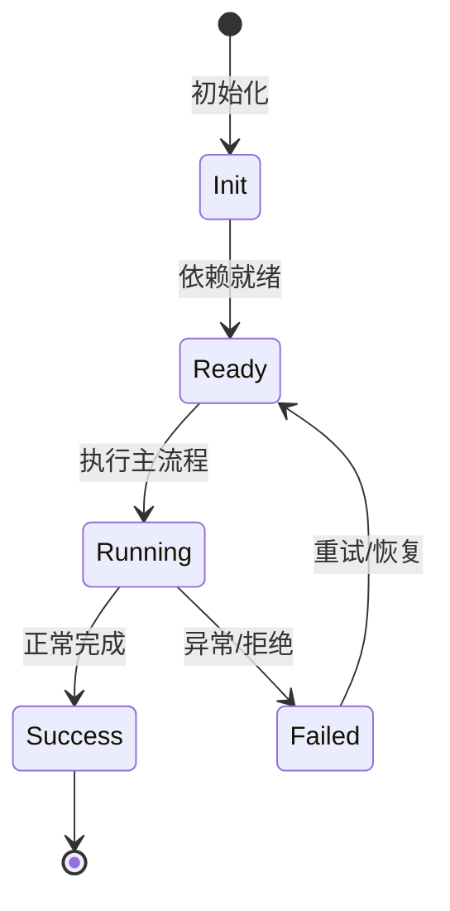

# 传输层与 RPC

REST、WebSocket、memory、IPC 四种方式访问同一套引擎能力。

## REST

kap-server 使用 Fastify，`/api/v1/*` 路由；envelope 统一 `{code,msg,data,request_id}`。

## WebSocket

`/api/v1/ws` 支持 server_hello、client_hello、subscribe、subscribe_v2、事件推送、心跳。

## memory/IPC

klient 的 `createKlient({scope})` 或 `/ipc`；memory 直接进程内 dispatcher，IPC 走 unix socket NDJSON。

## Debug RPC

`/api/v1/debug` 暴露 scoped DI 服务反射，供 nighthawk-inspect 使用。

## 专业实现要点（开发流程视角）

### 需求分析

架构要支撑多会话、多 agent、可扩展工具、可观测 DI、持久化和安全边界。

### 设计决策

使用四层 Scope 表达状态生命周期；用 Service/Feature/Contribution 替代中心化注册表；用事件和 veto 解耦模块。

### 实现步骤

先实现 `_base/di` 与 `_base/lifecycle`，再建立 App/Workspace/Session/Agent scope，最后把领域能力实现为 Feature。

### 验证方式

通过 `packages/agent-core-v2/test/` 的 scope host 测试、DI 级联测试和 nighthawk-inspect 的可视化验证。

### 维护注意

遵循依赖方向：子 scope 依赖父 scope；App 服务不得持有 session 级 Map 状态。

## 逐函数实现说明

以下按源码文件列出可验证的导出函数/类，并给出实现职责说明。

### packages/kap-server/src/transport/dispatcher.ts

| 函数 | 行号 | 签名 | 实现说明 |
| --- | --- | --- | --- |
| `resolveScope` | 31 | `export async function resolveScope(` | `resolveScope` 是本文涉及模块中的一个导出函数/类，具体语义以源码实现为准。 |
| `resolveService` | 72 | `export async function resolveService(` | `resolveService` 是本文涉及模块中的一个导出函数/类，具体语义以源码实现为准。 |
| `dispatch` | 100 | `export async function dispatch(` | `dispatch` 是本文涉及模块中的一个导出函数/类，具体语义以源码实现为准。 |

### packages/kap-server/src/protocol/ws-control.ts

| 函数 | 行号 | 签名 | 实现说明 |
| --- | --- | --- | --- |
| `getClientControlOperation` | 694 | `export function getClientControlOperation(` | `getClientControlOperation` 负责读取或查询数据。 |


## 核心代码片段

以下片段直接从仓库源码截取，用于展示关键实现形态；完整实现请打开对应文件。

### 来自 `packages/kap-server/src/transport/dispatcher.ts` 的 `resolveScope`

源码位置：`packages/kap-server/src/transport/dispatcher.ts:31` 附近。

```ts
export async function resolveScope(
  core: Scope,
  scopeKind: ScopeKind,
  params: Record<string, string>,
): Promise<Scope | IScopeHandle> {
  switch (scopeKind) {
    case 'core':
      return core;
    case 'session': {
      const sessionId = params['session_id'] ?? '';
      const session = getLiveSessionById(core.accessor, sessionId);
      if (session === undefined) {
        throw new Error2(ErrorCodes.SESSION_NOT_FOUND, `session ${sessionId} not found`);
      }
      return session;
    }
    case 'agent': {
      const sessionId = params['session_id'] ?? '';
      const agentId = params['agent_id'] ?? '';
      const session = getLiveSessionById(core.accessor, sessionId);
      if (session === undefined) {
        throw new Error2(ErrorCodes.SESSION_NOT_FOUND, `session ${sessionId} not found`);
      }
      if (agentId === MAIN_AGENT_ID) return ensureMainAgent(session);
// ...
```

### 来自 `packages/kap-server/src/protocol/ws-control.ts` 的 `getClientControlOperation`

源码位置：`packages/kap-server/src/protocol/ws-control.ts:694` 附近。

```ts
export function getClientControlOperation(
  type: string,
): (typeof clientControlOperations)[number] | undefined {
  return clientControlOperations.find((operation) => operation.type === type);
}
```


## 时序/状态图



> 图注：`01-architecture/transport-layer.md` 的抽象流程；具体参与者与状态以源码和上文函数说明为准。

## 核心实现细节（源码导出）

以下是本文涉及路径中的真实源码导出/结构，帮助你把概念映射到函数、类与方法：

  - `packages/kap-server/src/transport/dispatcher.ts`：
    - 导出签名/声明：
      - `export type ChannelLookup = (name: string) => ServiceIdentifier<unknown> | undefined;`
      - `export async function resolveScope(
  core: Scope,
  scopeKind: ScopeKind,
  params: Record<string, string>,
): Promise<Scope | IScopeHandle>`
      - `export async function resolveService(
  core: Scope,
  scopeKind: ScopeKind,
  params: Record<string, string>,
  serviceName: string,
  lookup: ChannelLookup...`
      - `export async function dispatch(
  core: Scope,
  scopeKind: ScopeKind,
  params: Record<string, string>,
  serviceName: string,
  method: string,
  arg: unkn...`
  - `packages/kap-server/src/protocol/ws-control.ts`：
    - 导出签名/声明：
      - `export const WS_PROTOCOL_VERSION = 2;`
      - `export const sessionCursorSchema = z.object({`
      - `export type SessionCursor = z.infer<typeof sessionCursorSchema>;`
      - `export const cursorsBySessionSchema = z.record(z.string(), sessionCursorSchema);`
      - `export type CursorsBySession = z.infer<typeof cursorsBySessionSchema>;`
      - `export const wsEventEnvelopeSchema = <T extends z.ZodTypeAny>(payload: T) =>`
      - `export const wsControlEnvelopeSchema = <T extends z.ZodTypeAny>(payload: T) =>`
      - `export const wsAckEnvelopeSchema = <T extends z.ZodTypeAny>(payload: T) =>`
      - `export const serverHelloPayloadSchema = z.object({`
      - `export const serverHelloMessageSchema = z.object({`
      - `export type ServerHelloMessage = z.infer<typeof serverHelloMessageSchema>;`
      - `export const agentFilterSchema = z.record(z.string(), z.array(z.string()).min(1));`
      - `export type AgentFilter = z.infer<typeof agentFilterSchema>;`
      - `export const clientHelloPayloadSchema = z.object({`
      - `export const clientHelloMessageSchema = z.object({`
      - `export type ClientHelloMessage = z.infer<typeof clientHelloMessageSchema>;`
      - `export const clientHelloAckPayloadSchema = z.object({`
      - `export const helloAckPayloadSchema = clientHelloAckPayloadSchema;`
      - `export const clientHelloAckMessageSchema = wsAckEnvelopeSchema(clientHelloAckPayloadSchema);`
      - `export const watchFsConfigSchema = z.object({`
      - `export const subscribePayloadSchema = z.object({`
      - `export const subscribeMessageSchema = z.object({`
      - `export type SubscribeMessage = z.infer<typeof subscribeMessageSchema>;`
      - `export const subscribeV2PayloadSchema = z.object({`
      - `export const subscribeV2MessageSchema = z.object({`
      - `export type SubscribeV2Message = z.infer<typeof subscribeV2MessageSchema>;`
      - `export const unsubscribeV2PayloadSchema = z.object({`
      - `export const unsubscribeV2MessageSchema = z.object({`
      - `export type UnsubscribeV2Message = z.infer<typeof unsubscribeV2MessageSchema>;`
      - `export const subscribeAckPayloadSchema = z.object({`
      - `export const subscribeAckMessageSchema = wsAckEnvelopeSchema(subscribeAckPayloadSchema);`
      - `export const subscribeV2AckMessageSchema = wsAckEnvelopeSchema(subscribeAckPayloadSchema);`
      - `export const unsubscribeV2AckMessageSchema = wsAckEnvelopeSchema(subscribeAckPayloadSchema);`
      - `export const unsubscribePayloadSchema = z.object({`
      - `export const unsubscribeMessageSchema = z.object({`
      - `export type UnsubscribeMessage = z.infer<typeof unsubscribeMessageSchema>;`
      - `export const unsubscribeAckPayloadSchema = subscribeAckPayloadSchema;`
      - `export const unsubscribeAckMessageSchema = wsAckEnvelopeSchema(unsubscribeAckPayloadSchema);`
      - `export const watchFsAddPayloadSchema = z.object({`
      - `export const watchFsAddMessageSchema = z.object({`
      - `export type WatchFsAddMessage = z.infer<typeof watchFsAddMessageSchema>;`
      - `export const watchFsRemovePayloadSchema = z.object({`
      - `export const watchFsRemoveMessageSchema = z.object({`
      - `export type WatchFsRemoveMessage = z.infer<typeof watchFsRemoveMessageSchema>;`
      - `export const watchFsAckPayloadSchema = z.object({`
      - `export const watchFsAckMessageSchema = wsAckEnvelopeSchema(watchFsAckPayloadSchema);`
      - `export const fsChangeKindSchema = z.enum(['file', 'directory', 'symlink']);`
      - `export type FsChangeKind = z.infer<typeof fsChangeKindSchema>;`
      - `export const fsChangeActionSchema = z.enum(['created', 'modified', 'deleted']);`
      - `export type FsChangeAction = z.infer<typeof fsChangeActionSchema>;`
      - `export const fsChangeEntrySchema = z.object({`
      - `export type FsChangeEntry = z.infer<typeof fsChangeEntrySchema>;`
      - `export const fsChangeEventSchema = z.object({`
      - `export type FsChangeEvent = z.infer<typeof fsChangeEventSchema>;`
      - `export const abortPayloadSchema = z.object({`
      - `export const abortMessageSchema = z.object({`
      - `export type AbortMessage = z.infer<typeof abortMessageSchema>;`
      - `export const abortAckPayloadSchema = z.object({`
      - `export const abortAckMessageSchema = wsAckEnvelopeSchema(abortAckPayloadSchema);`
      - `export const terminalAttachPayloadSchema = z.object({`
      - `export const terminalAttachMessageSchema = z.object({`
      - `export type TerminalAttachMessage = z.infer<typeof terminalAttachMessageSchema>;`
      - `export const terminalAttachAckPayloadSchema = z.object({`
      - `export const terminalAttachAckMessageSchema = wsAckEnvelopeSchema(`
      - `export const terminalDetachPayloadSchema = z.object({`
      - `export const terminalDetachMessageSchema = z.object({`
      - `export type TerminalDetachMessage = z.infer<typeof terminalDetachMessageSchema>;`
      - `export const terminalDetachAckPayloadSchema = z.object({`
      - `export const terminalDetachAckMessageSchema = wsAckEnvelopeSchema(`
      - `export const terminalInputPayloadSchema = z.object({`
      - `export const terminalInputMessageSchema = z.object({`
      - `export type TerminalInputMessage = z.infer<typeof terminalInputMessageSchema>;`
      - `export const terminalInputAckPayloadSchema = z.object({`
      - `export const terminalInputAckMessageSchema = wsAckEnvelopeSchema(`
      - `export const terminalResizePayloadSchema = z.object({`
      - `export const terminalResizeMessageSchema = z.object({`
      - `export type TerminalResizeMessage = z.infer<typeof terminalResizeMessageSchema>;`
      - `export const terminalResizeAckPayloadSchema = z.object({`
      - `export const terminalResizeAckMessageSchema = wsAckEnvelopeSchema(`
      - `export const terminalClosePayloadSchema = z.object({`
  - `packages/klient/README.md`（非 TS 源码，可直接阅读）

## 证据与代码位置

- `packages/kap-server/src/transport/dispatcher.ts`
- `packages/kap-server/src/protocol/ws-control.ts`
- `packages/klient/README.md`

> 本文所有路径均相对仓库根目录；引用内容以仓库当前 `HEAD` 为准。
