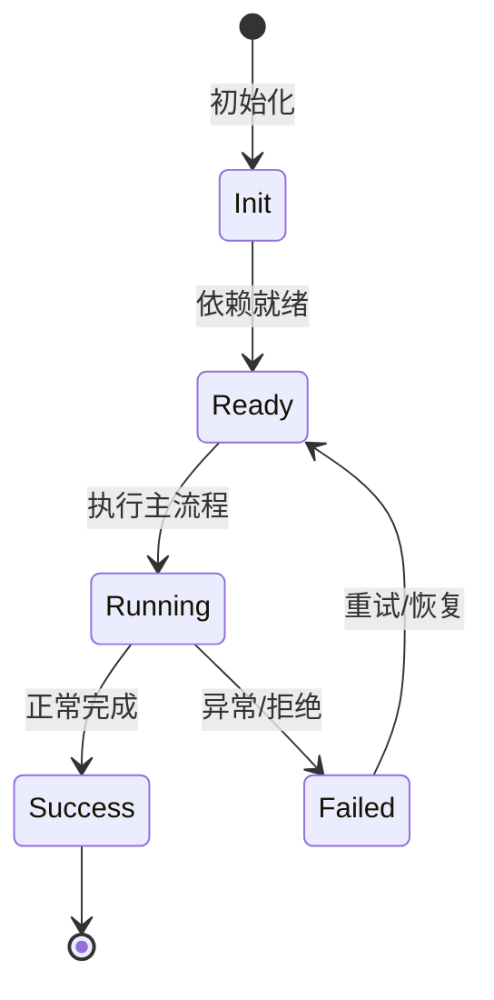

# 工作区生命周期

Workspace 是多个 session 共享的资源层，加载一次，fs watch 刷新。

## workspaceId

由 workdir slug 生成；`WorkspaceService.createOrTouch` 写 workspace catalog。

## 共享资源

workspaceSkillCatalog、workspaceAgentProfileLoader、workspaceInstructions、workspaceMcp、workspaceDirs、workspaceFs、workspaceGit、workspaceTrust 等。

## handler

`IWorkspaceLifecycleService.handlerFor(workspaceId)` 创建或获取 handler；handler 存活到进程结束。

## Session seed

workspace 服务通过 session seed adapters 向 session 提供数据并转发变更事件。

## 专业实现要点（开发流程视角）

### 需求分析

架构要支撑多会话、多 agent、可扩展工具、可观测 DI、持久化和安全边界。

### 设计决策

使用四层 Scope 表达状态生命周期；用 Service/Feature/Contribution 替代中心化注册表；用事件和 veto 解耦模块。

### 实现步骤

先实现 `_base/di` 与 `_base/lifecycle`，再建立 App/Workspace/Session/Agent scope，最后把领域能力实现为 Feature。

### 验证方式

通过 `packages/agent-core-v2/test/` 的 scope host 测试、DI 级联测试和 nighthawk-inspect 的可视化验证。

### 维护注意

遵循依赖方向：子 scope 依赖父 scope；App 服务不得持有 session 级 Map 状态。

## 逐函数实现说明

以下按源码文件列出可验证的导出函数/类，并给出实现职责说明。

### packages/agent-core-v2/src/workspace/workspaceInstance/workspaceInstance.ts

| 类 | 行号 | 声明 | 实现说明 |
| --- | --- | --- | --- |
| `WorkspaceInstance` | 17 | `export class WorkspaceInstance {` | 该类封装本文模块的核心状态与行为。 |

### packages/agent-core-v2/src/workspace/workspaceInstance/workspaceInstanceManagerService.ts

| 类 | 行号 | 声明 | 实现说明 |
| --- | --- | --- | --- |
| `WorkspaceInstanceManager` | 42 | `export class WorkspaceInstanceManager implements IWorkspaceInstanceManager {` | 该类封装本文模块的核心状态与行为。 |
| `RuntimeResolver` | 292 | `export class RuntimeResolver implements IRuntimeResolver {` | 该类封装本文模块的核心状态与行为。 |

### packages/agent-core-v2/src/app/workspace/workspaceService.ts

| 类 | 行号 | 声明 | 实现说明 |
| --- | --- | --- | --- |
| `WorkspaceService` | 24 | `export class WorkspaceService implements IWorkspaceService {` | 该类封装本文模块的核心状态与行为。 |


## 核心代码片段

以下片段直接从仓库源码截取，用于展示关键实现形态；完整实现请打开对应文件。

### 来自 `packages/agent-core-v2/src/workspace/workspaceInstance/workspaceInstance.ts` 的 `WorkspaceInstance`

源码位置：`packages/agent-core-v2/src/workspace/workspaceInstance/workspaceInstance.ts:17` 附近。

```ts
export class WorkspaceInstance {
  readonly runtimes: RuntimeRegistry;
  readonly unitHost: RuntimeUnitHost;
  readonly program: Program;
  private lifecycle: WorkspaceInstanceLifecycle = 'materializing';

  constructor(
    readonly metadata: Workspace,
    runtimes: RuntimeRegistry,
    unitHost: RuntimeUnitHost,
    context: IWorkspaceContext,
    dependencies: ProgramDependencies,
  ) {
    this.runtimes = runtimes;
    this.unitHost = unitHost;
    this.program = new Program(metadata.id, this.runtimes, context, dependencies);
  }

  get id(): string {
    return this.metadata.id;
  }

  get root(): string {
    return this.metadata.root;
// ...
```

### 来自 `packages/agent-core-v2/src/workspace/workspaceInstance/workspaceInstanceManagerService.ts` 的 `WorkspaceInstanceManager`

源码位置：`packages/agent-core-v2/src/workspace/workspaceInstance/workspaceInstanceManagerService.ts:42` 附近。

```ts
export class WorkspaceInstanceManager implements IWorkspaceInstanceManager {
  declare readonly _serviceBrand: undefined;
  private readonly instances = new Map<string, WorkspaceInstance>();
  private readonly requests = new Map<string, Promise<WorkspaceInstance>>();
  private readonly inflight = new Map<string, Promise<WorkspaceInstance>>();
  private readonly providers = new Map<string, RuntimeProviderFactory>();
  private readonly attachments = new Map<string, Map<string, RuntimeUnitHandle>>();
  private readonly changeEmitter = new Emitter<{ workspaceId: string; instance?: WorkspaceInstance }>();
  readonly onDidChange = this.changeEmitter.event;

  constructor(
    @IInstantiationService private readonly instantiation: IInstantiationService,
    @IBootstrapService private readonly bootstrap: IBootstrapService,
    @IWorkspaceService private readonly workspaces: IWorkspaceService,
    @IHostEnvironment private readonly environment: IHostEnvironment,
    @IAppStateService private readonly appState: IAppStateService,
    @IConfigService private readonly config: IConfigService,
    @IEventService private readonly event: IEventService,
    @IFlagService private readonly flags: IFlagService,
    @ref(IGitService) private readonly git: LiveRef<IGitService>,
    @IAgentIdentity private readonly identity: IAgentIdentity,
    @ISessionIndex private readonly index: ISessionIndex,
    @ISessionIndexMirror private readonly indexMirror: ISessionIndexMirror,
    @ILogService private readonly log: ILogService,
// ...
```

### 来自 `packages/agent-core-v2/src/app/workspace/workspaceService.ts` 的 `WorkspaceService`

源码位置：`packages/agent-core-v2/src/app/workspace/workspaceService.ts:24` 附近。

```ts
export class WorkspaceService implements IWorkspaceService {
  declare readonly _serviceBrand: undefined;

  private merged = false;
  private opQueue: Promise<unknown> = Promise.resolve();

  constructor(
    @IWorkspacePersistence private readonly store: IWorkspacePersistence,
    @IFileSystemStorageService private readonly storage: IFileSystemStorageService,
    @IHostFileSystem private readonly hostFs: IHostFileSystem,
    @IEventService private readonly event: IEventService,
  ) {}

  list(): Promise<readonly Workspace[]> {
    return this.runExclusive(async () => {
      await this.ensureMerged();
      const catalog = await this.loadCatalog();
      const byId = new Map(catalog.workspaces.map((ws) => [ws.id, ws]));
      return dedupeByRoot(byId);
    });
  }

  get(id: string): Promise<Workspace | undefined> {
    return this.runExclusive(async () => {
// ...
```


## 时序/状态图



> 图注：`01-architecture/workspace-lifecycle.md` 的抽象流程；具体参与者与状态以源码和上文函数说明为准。

## 核心实现细节（源码导出）

以下是本文涉及路径中的真实源码导出/结构，帮助你把概念映射到函数、类与方法：

  - `packages/agent-core-v2/src/app/workspace/workspaceService.ts`：
    - 导出签名/声明：
      - `export class WorkspaceService implements IWorkspaceService`
  - `packages/agent-core-v2/src/workspace/workspaceInstance//` 目录下源码文件示例：
    - `packages/agent-core-v2/src/workspace/workspaceInstance/workspaceInstance.ts`
    - `packages/agent-core-v2/src/workspace/workspaceInstance/workspaceInstanceManager.ts`
    - `packages/agent-core-v2/src/workspace/workspaceInstance/workspaceInstanceManagerService.ts`
  - `packages/agent-core-v2/AGENTS.md`（非 TS 源码，可直接阅读）

## 证据与代码位置

- `packages/agent-core-v2/src/app/workspace/workspaceService.ts`
- `packages/agent-core-v2/src/workspace/workspaceInstance/`
- `packages/agent-core-v2/AGENTS.md`

> 本文所有路径均相对仓库根目录；引用内容以仓库当前 `HEAD` 为准。
