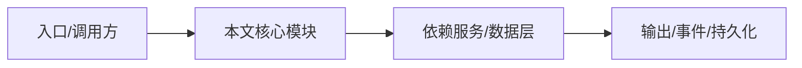

# 迁移工具

`nighthawk migrate` 把 legacy kimi-cli 数据迁移到 nighthawk。

## 包

`packages/migration-legacy` 实现检测、读取、转换、写入。

## 数据

迁移 `~/.kimi/` 的 session 和 config 到 `~/.nighthawk/`。

## 流程

`src/run-migration.ts` 编排步骤；`src/report.ts` 生成报告；原子写保护。

## 命令

`nighthawk migrate` 交互式引导。

## 专业实现要点（开发流程视角）

### 需求分析

应用层要把引擎能力包装成用户可操作的产品：CLI 参数、TUI 交互、IDE 集成、Web 访问。

### 设计决策

应用层不直接 import 内核，通过 SDK/RPC 通信；TUI 使用 pi-tui 组件化渲染。

### 实现步骤

CLI 解析参数 → 创建 Harness/SDK 客户端 → 进入 TUI 或 headless；TUI 通过 reverse-rpc 桥接审批/提问。

### 验证方式

使用 `pnpm -C apps/nighthawk test`、`pnpm -C apps/nighthawk run smoke` 和 e2e。

### 维护注意

TUI 组件不得直接读写 session 状态；启动路径必须遵守 workspace trust。

## 逐函数实现说明

以下按源码文件列出可验证的导出函数/类，并给出实现职责说明。

### apps/nighthawk/src/migration/badge.ts

| 函数 | 行号 | 签名 | 实现说明 |
| --- | --- | --- | --- |
| `isImportedSession` | 17 | `export function isImportedSession(` | `isImportedSession` 是本文涉及模块中的一个导出函数/类，具体语义以源码实现为准。 |
| `formatSessionLabel` | 24 | `export function formatSessionLabel(input: SessionLabelInput): string {` | `formatSessionLabel` 是本文涉及模块中的一个导出函数/类，具体语义以源码实现为准。 |

### apps/nighthawk/src/migration/command.ts

| 函数 | 行号 | 签名 | 实现说明 |
| --- | --- | --- | --- |
| `registerMigrateCommand` | 12 | `export function registerMigrateCommand(parent: Command, onMigrate: () => void): void {` | `registerMigrateCommand` 是本文涉及模块中的一个导出函数/类，具体语义以源码实现为准。 |

### apps/nighthawk/src/migration/detect-pending.ts

| 函数 | 行号 | 签名 | 实现说明 |
| --- | --- | --- | --- |
| `detectPendingMigration` | 25 | `export async function detectPendingMigration(` | `detectPendingMigration` 是本文涉及模块中的一个导出函数/类，具体语义以源码实现为准。 |

### apps/nighthawk/src/migration/migration-screen.ts

| 类 | 行号 | 声明 | 实现说明 |
| --- | --- | --- | --- |
| `MigrationScreenComponent` | 79 | `export class MigrationScreenComponent extends Container implements Focusable {` | 该类封装本文模块的核心状态与行为。 |

### packages/migration-legacy/src/run-migration.ts

| 函数 | 行号 | 签名 | 实现说明 |
| --- | --- | --- | --- |
| `runMigration` | 34 | `export async function runMigration(input: RunMigrationInput): Promise<MigrationReport> {` | `runMigration` 负责执行核心流程。 |


## 核心代码片段

以下片段直接从仓库源码截取，用于展示关键实现形态；完整实现请打开对应文件。

### 来自 `apps/nighthawk/src/migration/badge.ts` 的 `isImportedSession`

源码位置：`apps/nighthawk/src/migration/badge.ts:17` 附近。

```ts
export function isImportedSession(
  metadata: Readonly<Record<string, unknown>> | undefined,
): boolean {
  if (metadata === undefined) return false;
  return metadata[IMPORTED_FLAG_KEY] === true;
}

export function formatSessionLabel(input: SessionLabelInput): string {
  const prefix = isImportedSession(input.metadata) ? `${IMPORTED_BADGE} ` : '';
  return `${prefix}${input.title}`;
}
```

### 来自 `apps/nighthawk/src/migration/command.ts` 的 `registerMigrateCommand`

源码位置：`apps/nighthawk/src/migration/command.ts:12` 附近。

```ts
export function registerMigrateCommand(parent: Command, onMigrate: () => void): void {
  parent
    .command('migrate')
    .description('Migrate data from a legacy legacy-cli installation into nighthawk.')
    .action(() => {
      onMigrate();
    });
}
```

### 来自 `apps/nighthawk/src/migration/detect-pending.ts` 的 `detectPendingMigration`

源码位置：`apps/nighthawk/src/migration/detect-pending.ts:25` 附近。

```ts
export async function detectPendingMigration(
  input: DetectPendingInput,
): Promise<MigrationPlan | null> {
  const { sourceHome, targetHome } = input;
  if (!existsSync(sourceHome)) return null;
  if (
    input.ignoreMarker !== true &&
    shouldSuppressMigration({ sourceHome, targetHome })
  ) {
    return null;
  }

  let plan: MigrationPlan;
  try {
    plan = await detectMigration({ sourcePath: sourceHome });
  } catch {
    // Detection failure must never block startup; skip the screen.
    return null;
  }

  // OAuth credentials are deliberately not migrated, so an install whose
  // only data is `credentials/*.json` has nothing to offer — nighthawk's own
  // /login flow will pick up the auth conversation when the user first uses
  // the app. Treat oauth-only as "nothing to migrate".
// ...
```


## 时序/状态图



> 图注：`02-applications/migration.md` 的抽象流程；具体参与者与状态以源码和上文函数说明为准。

## 核心实现细节（源码导出）

以下是本文涉及路径中的真实源码导出/结构，帮助你把概念映射到函数、类与方法：

  - `packages/migration-legacy/README.md`（路径不存在，请以仓库实际文件为准）
  - `packages/migration-legacy/src/run-migration.ts`：
    - 导出签名/声明：
      - `export interface RunMigrationInput {`
      - `export async function runMigration(input: RunMigrationInput): Promise<MigrationReport>`
  - `apps/nighthawk/src/migration//` 目录下源码文件示例：
    - `apps/nighthawk/src/migration/badge.ts`
    - `apps/nighthawk/src/migration/command.ts`
    - `apps/nighthawk/src/migration/detect-pending.ts`
    - `apps/nighthawk/src/migration/index.ts`
    - `apps/nighthawk/src/migration/migration-screen.ts`

## 证据与代码位置

- `packages/migration-legacy/README.md`
- `packages/migration-legacy/src/run-migration.ts`
- `apps/nighthawk/src/migration/`

> 本文所有路径均相对仓库根目录；引用内容以仓库当前 `HEAD` 为准。
