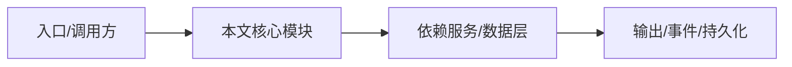

# NightHawk CLI 应用

CLI 是主入口，负责参数解析、TUI 启动、headless 模式、更新、迁移和子命令。

## 入口链

`src/main.ts` → `src/cli/commands.ts` → `src/cli/run-shell.ts` → SDK `NighthawkHarness` → `src/tui/nighthawk-tui.ts`。

## CLI 选项

`-S/--session`、`-c/--continue`、`-y/--yolo`、`--auto`、`-m/--model`、`-p/--prompt`、`--output-format`、`--agent`、`--agent-file`、`--plan`、`--skills-dir`。

## 子命令

`acp`、`doctor`、`export`、`migrate`、`upgrade`、`vis`、`provider`。

## 启动保护

启动路径在 workspace trust 前不得用裸命令名 spawn 子进程，避免 binary planting。

## 专业实现要点（开发流程视角）

### 需求分析

应用层要把引擎能力包装成用户可操作的产品：CLI 参数、TUI 交互、IDE 集成、Web 访问。

### 设计决策

应用层不直接 import 内核，通过 SDK/RPC 通信；TUI 使用 pi-tui 组件化渲染。

### 实现步骤

CLI 解析参数 → 创建 Harness/SDK 客户端 → 进入 TUI 或 headless；TUI 通过 reverse-rpc 桥接审批/提问。

### 验证方式

使用 `pnpm -C apps/nighthawk test`、`pnpm -C apps/nighthawk run smoke` 和 e2e。

### 维护注意

TUI 组件不得直接读写 session 状态；启动路径必须遵守 workspace trust。

## 逐函数实现说明

以下按源码文件列出可验证的导出函数/类，并给出实现职责说明。

### apps/nighthawk/src/main.ts

| 函数 | 行号 | 签名 | 实现说明 |
| --- | --- | --- | --- |
| `handleMainCommand` | 60 | `export async function handleMainCommand(` | `handleMainCommand` 是本文涉及模块中的一个导出函数/类，具体语义以源码实现为准。 |
| `handleUpgradeCommand` | 101 | `export async function handleUpgradeCommand(version: string): Promise<void> {` | `handleUpgradeCommand` 是本文涉及模块中的一个导出函数/类，具体语义以源码实现为准。 |
| `main` | 147 | `export function main(): void {` | `main` 是本文涉及模块中的一个导出函数/类，具体语义以源码实现为准。 |

### apps/nighthawk/src/cli/commands.ts

| 函数 | 行号 | 签名 | 实现说明 |
| --- | --- | --- | --- |
| `createProgram` | 18 | `export function createProgram(` | `createProgram` 负责创建/构建相关对象或流程。 |


## 核心代码片段

以下片段直接从仓库源码截取，用于展示关键实现形态；完整实现请打开对应文件。

### 来自 `apps/nighthawk/src/main.ts` 的 `handleMainCommand`

源码位置：`apps/nighthawk/src/main.ts:60` 附近。

```ts
export async function handleMainCommand(
  opts: CLIOptions,
  version: string,
): Promise<MainCommandOutcome> {
  let validated: ReturnType<typeof validateOptions>;
  startupTrace('main:enter');
  try {
    validated = validateOptions(opts);
  } catch (error) {
    if (error instanceof OptionConflictError) {
      process.stderr.write(`error: ${error.message}\n`);
      process.exit(1);
    }
    throw error;
  }

  startupTrace('preflight:begin');
  const preflightResult = await runUpdatePreflight(
    version,
    validated.uiMode === 'print' ? { track, isTTY: false } : { track },
  );
  startupTrace('preflight:end');
  if (preflightResult === 'exit') {
    process.exit(0);
// ...
```

### 来自 `apps/nighthawk/src/cli/commands.ts` 的 `createProgram`

源码位置：`apps/nighthawk/src/cli/commands.ts:18` 附近。

```ts
export function createProgram(
  version: string,
  onMain: MainCommandHandler,
  onMigrate: MigrateCommandHandler,
  onPluginNodeRunner: PluginNodeRunnerHandler = () => {},
  onUpgrade: UpgradeCommandHandler = () => {},
  onUpdateDownload: UpdateDownloadHandler = () => {},
): Command {
  const program = new Command(CLI_COMMAND_NAME)
    .description('The Starting Point for Next-Gen Agents')
    .version(version, '-V, --version')
    .allowUnknownOption(false)
    .configureHelp({ helpWidth: 100 })
    .helpOption('-h, --help', 'Show help.')
    .usage('[options] [command]')
    .addHelpText('after', '\nDocumentation:        https://AliceGoto.github.io/nighthawk/\n');

  program
    .addOption(
      new Option(
        '-S, --session [id]',
        'Resume a session. With ID: resume that session. Without ID: interactively pick.',
      ).argParser((val: string | boolean) => (val === true ? '' : (val as string))),
    )
// ...
```


## 时序/状态图



> 图注：`02-applications/nighthawk-cli.md` 的抽象流程；具体参与者与状态以源码和上文函数说明为准。

## 核心实现细节（源码导出）

以下是本文涉及路径中的真实源码导出/结构，帮助你把概念映射到函数、类与方法：

  - `apps/nighthawk/src/main.ts`：
    - 导出签名/声明：
      - `export interface MainCommandOutcome {`
      - `export async function handleMainCommand(
  opts: CLIOptions,
  version: string,
): Promise<MainCommandOutcome>`
      - `export async function handleUpgradeCommand(version: string): Promise<void>`
      - `export function main(): void`
  - `apps/nighthawk/src/cli/commands.ts`：
    - 导出签名/声明：
      - `export type MainCommandHandler = (opts: CLIOptions) => void;`
      - `export type MigrateCommandHandler = () => void;`
      - `export type PluginNodeRunnerHandler = (entry: string, args: readonly string[]) => void;`
      - `export type UpgradeCommandHandler = () => void | Promise<void>;`
      - `export type UpdateDownloadHandler = (version: string, manual: boolean) => void;`
      - `export function createProgram(
  version: string,
  onMain: MainCommandHandler,
  onMigrate: MigrateCommandHandler,
  onPluginNodeRunner: PluginNodeRunnerHan...`
  - `apps/nighthawk/AGENTS.md`（非 TS 源码，可直接阅读）

## 证据与代码位置

- `apps/nighthawk/src/main.ts`
- `apps/nighthawk/src/cli/commands.ts`
- `apps/nighthawk/AGENTS.md`

> 本文所有路径均相对仓库根目录；引用内容以仓库当前 `HEAD` 为准。
