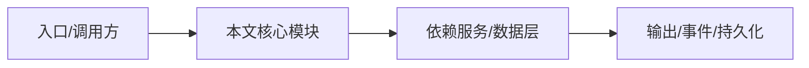

# TUI 架构

TUI 基于 pi-tui，用 NighthawkTUI 协调 state、layout、editor、session 和 dialogs。

## 文件布局

`src/tui/` 下有 `nighthawk-tui.ts`、`tui-state.ts`、`controllers/`、`commands/`、`components/`、`reverse-rpc/`、`theme/`。

## 职责分离

controllers 承担可独立测试的重逻辑；components 只做展示；reverse-rpc 把 SDK approval/question 转成 UI 面板数据。

## 主题系统

theme 是颜色与样式的单一来源，禁止组件直接用 chalk 命名色。

## 键盘协议

比较可打印字符必须先用 `printableChar` 解码，避免 Kitty keyboard protocol 的 CSI-u 序列无法匹配。

## 专业实现要点（开发流程视角）

### 需求分析

应用层要把引擎能力包装成用户可操作的产品：CLI 参数、TUI 交互、IDE 集成、Web 访问。

### 设计决策

应用层不直接 import 内核，通过 SDK/RPC 通信；TUI 使用 pi-tui 组件化渲染。

### 实现步骤

CLI 解析参数 → 创建 Harness/SDK 客户端 → 进入 TUI 或 headless；TUI 通过 reverse-rpc 桥接审批/提问。

### 验证方式

使用 `pnpm -C apps/nighthawk test`、`pnpm -C apps/nighthawk run smoke` 和 e2e。

### 维护注意

TUI 组件不得直接读写 session 状态；启动路径必须遵守 workspace trust。

## 逐函数实现说明

以下按源码文件列出可验证的导出函数/类，并给出实现职责说明。

### apps/nighthawk/src/tui/nighthawk-tui.ts

| 类 | 行号 | 声明 | 实现说明 |
| --- | --- | --- | --- |
| `NighthawkTUI` | 308 | `export class NighthawkTUI {` | 该类封装本文模块的核心状态与行为。 |


## 核心代码片段

以下片段直接从仓库源码截取，用于展示关键实现形态；完整实现请打开对应文件。

### 来自 `apps/nighthawk/src/tui/nighthawk-tui.ts` 的 `NighthawkTUI`

源码位置：`apps/nighthawk/src/tui/nighthawk-tui.ts:308` 附近。

```ts
export class NighthawkTUI {
  readonly harness: NighthawkHarness;
  readonly options: NighthawkTUIOptions;
  session: Session | undefined;
  state: TUIState;
  /** In-flight lazy session creation (v2 engine), shared by concurrent first-use triggers. */
  private ensureSessionPromise: Promise<Session | undefined> | null = null;
  private readonly cacheHint = new CacheHintController(this);
  /** Staged prompt media lifecycle (daemon uploads + cache copies) — see StagingLeaseTracker. */
  private readonly staging: StagingLeaseTracker;
  /** Pentest orchestrator — active only during pentest mode. */
  pentestOrchestrator: PentestOrchestrator | null = null;
  /** Pentest welcome panel — shown when pentest mode is active. */
  pentestWelcomeComponent: PentestWelcomeComponent | null = null;
  private readonly approvalController = new ApprovalController();
  private readonly questionController = new QuestionController();
  private readonly reverseRpcDisposers: Array<() => void> = [];
  private skillCommands: readonly NighthawkSlashCommand[] = [];
  readonly skillCommandMap = new Map<string, string>();
  private pluginCommands: readonly NighthawkSlashCommand[] = [];
  readonly pluginCommandMap = new Map<string, string>();
  private readonly imageStore = new ImageAttachmentStore();
  // Detected lazily in startBackgroundFdAutocomplete() — detection spawns
  // `fd --version`, which must not happen before the workspace trust gate:
// ...
```


## 时序/状态图



> 图注：`02-applications/nighthawk-tui.md` 的抽象流程；具体参与者与状态以源码和上文函数说明为准。

## 核心实现细节（源码导出）

以下是本文涉及路径中的真实源码导出/结构，帮助你把概念映射到函数、类与方法：

  - `apps/nighthawk/AGENTS.md`（非 TS 源码，可直接阅读）
  - `apps/nighthawk/src/tui/nighthawk-tui.ts`：
    - 导出签名/声明：
      - `export type { TUIState } from './tui-state';`
      - `export type {`
      - `export interface NighthawkTUIStartupInput {`
      - `export class NighthawkTUI`
    - 类内方法（节选）：`startupTrace`, `setExperimentalFeatures`, `restoreTerminalModes`, `markTranscriptComponent`, `notifyTerminalOnce`, `endScreenTakeover`
  - `packages/pi-tui/README.md`（非 TS 源码，可直接阅读）

## 证据与代码位置

- `apps/nighthawk/AGENTS.md`
- `apps/nighthawk/src/tui/nighthawk-tui.ts`
- `packages/pi-tui/README.md`

> 本文所有路径均相对仓库根目录；引用内容以仓库当前 `HEAD` 为准。
