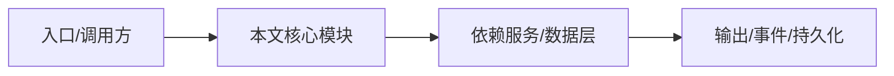

# Web UI 与远程访问

Web UI 的源码不在本仓库，但预构建 bundle 会提交到 `apps/nighthawk/dist-web`。

## 来源

Web UI 在 code-app 仓库的 `apps/web` 开发，通过 `NIGHTHAWK_REPO=<checkout> pnpm run sync:web` 同步到本仓库。

## 打包保护

`apps/nighthawk/scripts/check-web-assets.mjs` 防止缺少 bundle 时打包。

## 运行

本仓库 `pnpm dev:server` 起服务，code-app 的 `pnpm dev:web` 可通过 `NIGHTHAWK_SERVER_URL` 指向它。

## 用途

远程浏览器访问 NightHawk 会话、审批和状态。

## 专业实现要点（开发流程视角）

### 需求分析

应用层要把引擎能力包装成用户可操作的产品：CLI 参数、TUI 交互、IDE 集成、Web 访问。

### 设计决策

应用层不直接 import 内核，通过 SDK/RPC 通信；TUI 使用 pi-tui 组件化渲染。

### 实现步骤

CLI 解析参数 → 创建 Harness/SDK 客户端 → 进入 TUI 或 headless；TUI 通过 reverse-rpc 桥接审批/提问。

### 验证方式

使用 `pnpm -C apps/nighthawk test`、`pnpm -C apps/nighthawk run smoke` 和 e2e。

### 维护注意

TUI 组件不得直接读写 session 状态；启动路径必须遵守 workspace trust。

## 逐函数实现说明

以下按源码文件列出可验证的导出函数/类，并给出实现职责说明。

## 核心代码片段

以下片段直接从仓库源码截取，用于展示关键实现形态；完整实现请打开对应文件。

> 本文证据路径没有可直接展示的 TS 源码片段。

## 时序/状态图

> 图注：`02-applications/webui.md` 的抽象流程；具体参与者与状态以源码和上文函数说明为准。

## 核心实现细节（源码导出）

以下是本文涉及路径中的真实源码导出/结构，帮助你把概念映射到函数、类与方法：

  - `apps/nighthawk/AGENTS.md`（非 TS 源码，可直接阅读）
  - `apps/nighthawk/scripts/check-web-assets.mjs`（路径不存在，请以仓库实际文件为准）
  - `package.json`（非 TS 源码，可直接阅读）

## 证据与代码位置

- `apps/nighthawk/AGENTS.md`
- `apps/nighthawk/scripts/check-web-assets.mjs`
- `package.json`

> 本文所有路径均相对仓库根目录；引用内容以仓库当前 `HEAD` 为准。
