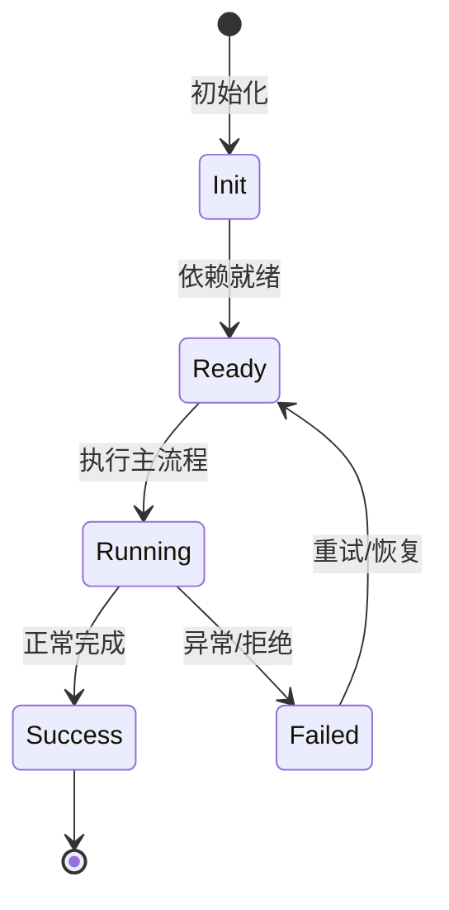

# Goal 系统

Goal 让用户给 agent 设定长期目标，agent 在任务循环中维护目标状态和预算。

## 用途

把一个大的多步任务拆成持久目标，跨轮次跟踪进度。

## 实现

Feature `goal` 提供 `goalAgentRuntime`、`goalDeadlineScheduler`、`goalOps` 等。

## 状态

goal 有创建、更新、完成、清除等 wire records，支持重放。

## 权限

goal 预算/过期拒绝是硬 deny，没有 ask 通道。

## 专业实现要点（开发流程视角）

### 需求分析

Feature 是自包含能力单元，必须能整体安装/卸载而不污染其他模块。

### 设计决策

用 `Feature` 基类组合 Service、Tool、Profile、Config、Command 贡献点；静态契约留在静态注册通道。

### 实现步骤

在 `src/features/<name>/` 写领域代码 → 写 `<name>Feature.ts` → 在 `src/index.ts` 精确导入 → 编写测试。

### 验证方式

通过 `test/features/feature.test.ts` 验证装配/卸载；通过 DI 视图观察 unit 状态。

### 维护注意

不要把所有能力塞进一个 Feature；配置段、wire 事件等静态契约必须保持可重放。

## 逐函数实现说明

以下按源码文件列出可验证的导出函数/类，并给出实现职责说明。

### packages/agent-core-v2/src/features/goal/goalAgentRuntime.ts

| 类 | 行号 | 声明 | 实现说明 |
| --- | --- | --- | --- |
| `GoalRuntime` | 241 | `export class GoalRuntime {` | 该类封装本文模块的核心状态与行为。 |

### packages/agent-core-v2/src/features/goal/goalDeadlineSchedulerService.ts

| 类 | 行号 | 声明 | 实现说明 |
| --- | --- | --- | --- |
| `GoalDeadlineSchedulerService` | 5 | `export class GoalDeadlineSchedulerService implements IGoalDeadlineScheduler {` | 该类封装本文模块的核心状态与行为。 |

### packages/agent-core-v2/src/features/goal/goalFeature.ts

| 类 | 行号 | 声明 | 实现说明 |
| --- | --- | --- | --- |
| `GoalFeature` | 18 | `export class GoalFeature extends Feature {` | 该类封装本文模块的核心状态与行为。 |

### packages/agent-core-v2/src/features/goal/goalOps.ts

| 类 | 行号 | 声明 | 实现说明 |
| --- | --- | --- | --- |
| `GoalCreate` | 54 | `export class GoalCreate extends AgentEvent2<z.infer<typeof goalCreateSchema>> {` | 该类封装本文模块的核心状态与行为。 |
| `GoalUpdate` | 85 | `export class GoalUpdate extends AgentEvent2<z.infer<typeof goalUpdateSchema>> {` | 该类封装本文模块的核心状态与行为。 |
| `GoalClear` | 105 | `export class GoalClear extends AgentEvent2<z.infer<typeof goalClearSchema>> {` | 该类封装本文模块的核心状态与行为。 |
| `GoalForked` | 116 | `export class GoalForked extends AgentEvent2<z.infer<typeof goalForkedSchema>> {` | 该类封装本文模块的核心状态与行为。 |
| `GoalUpdated` | 131 | `export class GoalUpdated extends AgentEvent2<GoalUpdatedPayload> {` | 该类封装本文模块的核心状态与行为。 |

### packages/agent-core-v2/src/features/goal/injection/goalInjection.ts

| 类 | 行号 | 声明 | 实现说明 |
| --- | --- | --- | --- |
| `GoalInjection` | 17 | `export class GoalInjection extends Service {` | 该类封装本文模块的核心状态与行为。 |

### packages/agent-core-v2/src/features/goal/tools/create-goal/createGoalTool.ts

| 类 | 行号 | 声明 | 实现说明 |
| --- | --- | --- | --- |
| `CreateGoalTool` | 20 | `export class CreateGoalTool implements ICreateGoalTool {` | 该类封装本文模块的核心状态与行为。 |

### packages/agent-core-v2/src/features/goal/tools/get-goal/getGoalTool.ts

| 类 | 行号 | 声明 | 实现说明 |
| --- | --- | --- | --- |
| `GetGoalTool` | 13 | `export class GetGoalTool implements IGetGoalTool {` | 该类封装本文模块的核心状态与行为。 |

### packages/agent-core-v2/src/features/goal/tools/outcome-prompts.ts

| 函数 | 行号 | 签名 | 实现说明 |
| --- | --- | --- | --- |
| `buildGoalCompletionSummaryPrompt` | 3 | `export function buildGoalCompletionSummaryPrompt(goal: GoalSnapshot): string {` | `buildGoalCompletionSummaryPrompt` 负责创建/构建相关对象或流程。 |
| `buildGoalBlockedReasonPrompt` | 11 | `export function buildGoalBlockedReasonPrompt(goal: GoalSnapshot): string {` | `buildGoalBlockedReasonPrompt` 负责创建/构建相关对象或流程。 |

### packages/agent-core-v2/src/features/goal/tools/serialize.ts

| 函数 | 行号 | 签名 | 实现说明 |
| --- | --- | --- | --- |
| `goalForModel` | 3 | `export function goalForModel(goal: GoalSnapshot): Omit<GoalSnapshot, 'goalId'> {` | `goalForModel` 是本文涉及模块中的一个导出函数/类，具体语义以源码实现为准。 |
| `goalResultForModel` | 8 | `export function goalResultForModel(` | `goalResultForModel` 是本文涉及模块中的一个导出函数/类，具体语义以源码实现为准。 |

### packages/agent-core-v2/src/features/goal/tools/set-goal-budget/setGoalBudgetTool.ts

| 类 | 行号 | 声明 | 实现说明 |
| --- | --- | --- | --- |
| `SetGoalBudgetTool` | 20 | `export class SetGoalBudgetTool implements ISetGoalBudgetTool {` | 该类封装本文模块的核心状态与行为。 |

### packages/agent-core-v2/src/features/goal/tools/update-goal/updateGoalTool.ts

| 类 | 行号 | 声明 | 实现说明 |
| --- | --- | --- | --- |
| `UpdateGoalTool` | 20 | `export class UpdateGoalTool implements IUpdateGoalTool {` | 该类封装本文模块的核心状态与行为。 |

### packages/agent-core-v2/src/features/todo/todoAgentRuntime.ts

| 类 | 行号 | 声明 | 实现说明 |
| --- | --- | --- | --- |
| `TodoRuntime` | 97 | `export class TodoRuntime {` | 该类封装本文模块的核心状态与行为。 |

### packages/agent-core-v2/src/features/todo/todoFeature.ts

| 类 | 行号 | 声明 | 实现说明 |
| --- | --- | --- | --- |
| `TodoFeature` | 7 | `export class TodoFeature extends Feature {` | 该类封装本文模块的核心状态与行为。 |

### packages/agent-core-v2/src/features/todo/todoItem.ts

| 函数 | 行号 | 签名 | 实现说明 |
| --- | --- | --- | --- |
| `readTodoItems` | 10 | `export function readTodoItems(raw: unknown): readonly TodoItem[] {` | `readTodoItems` 负责读取或查询数据。 |
| `isTodoItem` | 18 | `export function isTodoItem(value: unknown): value is TodoItem {` | `isTodoItem` 是本文涉及模块中的一个导出函数/类，具体语义以源码实现为准。 |
| `renderTodoList` | 28 | `export function renderTodoList(todos: readonly TodoItem[], title = 'Current todo list:'): string {` | `renderTodoList` 是本文涉及模块中的一个导出函数/类，具体语义以源码实现为准。 |

### packages/agent-core-v2/src/features/todo/todoListReminder.ts

| 函数 | 行号 | 签名 | 实现说明 |
| --- | --- | --- | --- |
| `todoListStaleReminder` | 21 | `export function todoListStaleReminder(input: TodoListReminderInput): string \| undefined {` | `todoListStaleReminder` 是本文涉及模块中的一个导出函数/类，具体语义以源码实现为准。 |

### packages/agent-core-v2/src/features/todo/todoOps.ts

| 类 | 行号 | 声明 | 实现说明 |
| --- | --- | --- | --- |
| `ToolsUpdateStore` | 16 | `export class ToolsUpdateStore extends AgentEvent2<z.infer<typeof toolsUpdateStoreSchema>> {` | 该类封装本文模块的核心状态与行为。 |

### packages/agent-core-v2/src/features/todo/tools/todo-list/todoListTool.ts

| 类 | 行号 | 声明 | 实现说明 |
| --- | --- | --- | --- |
| `TodoListTool` | 21 | `export class TodoListTool implements ITodoListTool {` | 该类封装本文模块的核心状态与行为。 |


## 核心代码片段

以下片段直接从仓库源码截取，用于展示关键实现形态；完整实现请打开对应文件。

### 来自 `packages/agent-core-v2/src/features/goal/goalAgentRuntime.ts` 的 `GoalRuntime`

源码位置：`packages/agent-core-v2/src/features/goal/goalAgentRuntime.ts:241` 附近。

```ts
export class GoalRuntime {
  constructor(private readonly runtime: AgentRuntimeContext<GoalRuntimeState>) {}

  getGoal(): GoalToolResult {
    return getGoal(goalOperationContext(this.runtime));
  }

  isGoalToolTarget(turnId: number, goalId: string): boolean {
    return isGoalToolTarget(goalOperationContext(this.runtime), turnId, goalId);
  }

  async createGoal(input: CreateGoalInput, actor: GoalActor = 'user'): Promise<GoalSnapshot> {
    return createGoal(goalOperationContext(this.runtime), input, actor);
  }

  async pauseGoal(input: GoalReasonInput = {}, actor: GoalActor = 'user'): Promise<GoalSnapshot> {
    return pauseGoal(goalOperationContext(this.runtime), input, actor);
  }

  async resumeGoal(input: ResumeGoalInput = {}, actor: GoalActor = 'user'): Promise<GoalSnapshot> {
    return resumeGoal(goalOperationContext(this.runtime), input, actor);
  }

  async setBudgetLimits(
// ...
```

### 来自 `packages/agent-core-v2/src/features/goal/goalDeadlineSchedulerService.ts` 的 `GoalDeadlineSchedulerService`

源码位置：`packages/agent-core-v2/src/features/goal/goalDeadlineSchedulerService.ts:5` 附近。

```ts
export class GoalDeadlineSchedulerService implements IGoalDeadlineScheduler {
  declare readonly _serviceBrand: undefined;

  now(): number {
    return Number(process.hrtime.bigint() / 1_000_000n);
  }

  schedule(delayMs: number, callback: () => void): IDisposable {
    let timeout: ReturnType<typeof setTimeout> | undefined = setTimeout(() => {
      timeout = undefined;
      callback();
    }, Math.max(0, delayMs));
    timeout.unref?.();
    return toDisposable(() => {
      if (timeout !== undefined) clearTimeout(timeout);
      timeout = undefined;
    });
  }
}
```

### 来自 `packages/agent-core-v2/src/features/goal/goalFeature.ts` 的 `GoalFeature`

源码位置：`packages/agent-core-v2/src/features/goal/goalFeature.ts:18` 附近。

```ts
export class GoalFeature extends Feature {
  static override readonly name = 'goal';

  constructor() {
    super();
    this.contributeAgentRuntime(goalAgentRuntimeProvider);
    this.contributeService(LifecycleScope.App, IGoalDeadlineScheduler, GoalDeadlineSchedulerService, {
      activation: ScopeActivation.OnDemand,
    });
    this.contributeTool(ICreateGoalTool, CreateGoalTool, {
      name: 'CreateGoal',
      domain: 'goal',
    });
    this.contributeTool(IGetGoalTool, GetGoalTool, {
      name: 'GetGoal',
      domain: 'goal',
    });
    this.contributeTool(ISetGoalBudgetTool, SetGoalBudgetTool, {
      name: 'SetGoalBudget',
      domain: 'goal',
    });
    this.contributeTool(IUpdateGoalTool, UpdateGoalTool, {
      name: 'UpdateGoal',
      domain: 'goal',
// ...
```


## 时序/状态图



> 图注：`04-features/goals.md` 的抽象流程；具体参与者与状态以源码和上文函数说明为准。

## 核心实现细节（源码导出）

以下是本文涉及路径中的真实源码导出/结构，帮助你把概念映射到函数、类与方法：

  - `packages/agent-core-v2/src/features/goal//` 目录下源码文件示例：
    - `packages/agent-core-v2/src/features/goal/errors.ts`
    - `packages/agent-core-v2/src/features/goal/goal.ts`
    - `packages/agent-core-v2/src/features/goal/goalAgentRuntime.ts`
    - `packages/agent-core-v2/src/features/goal/goalDeadlineScheduler.ts`
    - `packages/agent-core-v2/src/features/goal/goalDeadlineSchedulerService.ts`
    - `packages/agent-core-v2/src/features/goal/goalFeature.ts`
    - `packages/agent-core-v2/src/features/goal/goalOps.ts`
    - `packages/agent-core-v2/src/features/goal/injection/goalInjection.ts`
    - `packages/agent-core-v2/src/features/goal/tools/create-goal/create-goal.ts`
    - `packages/agent-core-v2/src/features/goal/tools/create-goal/createGoalTool.ts`
    - `packages/agent-core-v2/src/features/goal/tools/get-goal/get-goal.ts`
    - `packages/agent-core-v2/src/features/goal/tools/get-goal/getGoalTool.ts`
    - `packages/agent-core-v2/src/features/goal/tools/outcome-prompts.ts`
    - `packages/agent-core-v2/src/features/goal/tools/serialize.ts`
    - `packages/agent-core-v2/src/features/goal/tools/set-goal-budget/set-goal-budget.ts`
    - `packages/agent-core-v2/src/features/goal/tools/set-goal-budget/setGoalBudgetTool.ts`
    - `packages/agent-core-v2/src/features/goal/tools/update-goal/update-goal.ts`
    - `packages/agent-core-v2/src/features/goal/tools/update-goal/updateGoalTool.ts`
    - `packages/agent-core-v2/src/features/goal/types.ts`
  - `packages/agent-core-v2/src/features/todo//` 目录下源码文件示例：
    - `packages/agent-core-v2/src/features/todo/todoAgentRuntime.ts`
    - `packages/agent-core-v2/src/features/todo/todoFeature.ts`
    - `packages/agent-core-v2/src/features/todo/todoItem.ts`
    - `packages/agent-core-v2/src/features/todo/todoListReminder.ts`
    - `packages/agent-core-v2/src/features/todo/todoOps.ts`
    - `packages/agent-core-v2/src/features/todo/tools/todo-list/todo-list.ts`
    - `packages/agent-core-v2/src/features/todo/tools/todo-list/todoListTool.ts`

## 证据与代码位置

- `packages/agent-core-v2/src/features/goal/`
- `packages/agent-core-v2/src/features/todo/`

> 本文所有路径均相对仓库根目录；引用内容以仓库当前 `HEAD` 为准。
