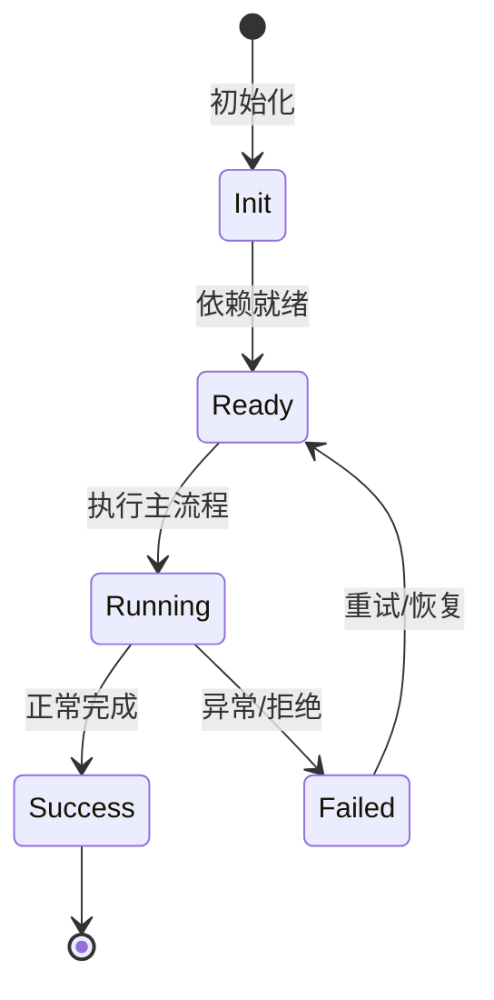

# 生命周期 Hooks

用户可以在关键生命周期点运行本地命令，拦截工具调用或审计决策。

## 事件

PreToolUse、PostToolUse、Notification、SessionStart 等。

## 实现

`externalHooks` Feature 提供 hook 配置与运行器；`onBeforeExecuteTool` 支持 veto。

## 用途

门禁危险命令、发送桌面通知、自动化审批审计。

## 配置

config.toml 中的 hooks 段声明命令和参数。

## 专业实现要点（开发流程视角）

### 需求分析

Feature 是自包含能力单元，必须能整体安装/卸载而不污染其他模块。

### 设计决策

用 `Feature` 基类组合 Service、Tool、Profile、Config、Command 贡献点；静态契约留在静态注册通道。

### 实现步骤

在 `src/features/<name>/` 写领域代码 → 写 `<name>Feature.ts` → 在 `src/index.ts` 精确导入 → 编写测试。

### 验证方式

通过 `test/features/feature.test.ts` 验证装配/卸载；通过 DI 视图观察 unit 状态。

### 维护注意

不要把所有能力塞进一个 Feature；配置段、wire 事件等静态契约必须保持可重放。

## 逐函数实现说明

以下按源码文件列出可验证的导出函数/类，并给出实现职责说明。

### packages/agent-core-v2/src/features/externalHooks/agent/agentExternalHooksService.ts

| 类 | 行号 | 声明 | 实现说明 |
| --- | --- | --- | --- |
| `HookResult` | 57 | `export class HookResult extends AgentEvent2<HookResultPayload> {` | 该类封装本文模块的核心状态与行为。 |
| `AgentExternalHooksService` | 68 | `export class AgentExternalHooksService extends Service implements IAgentExternalHooksService {` | 该类封装本文模块的核心状态与行为。 |

### packages/agent-core-v2/src/features/externalHooks/app/externalHooksRunnerService.ts

| 类 | 行号 | 声明 | 实现说明 |
| --- | --- | --- | --- |
| `ExternalHooksRunnerService` | 17 | `export class ExternalHooksRunnerService extends Disposable implements IExternalHooksRunnerService {` | 该类封装本文模块的核心状态与行为。 |

### packages/agent-core-v2/src/features/externalHooks/externalHooksFeature.ts

| 类 | 行号 | 声明 | 实现说明 |
| --- | --- | --- | --- |
| `ExternalHooksFeature` | 13 | `export class ExternalHooksFeature extends Feature {` | 该类封装本文模块的核心状态与行为。 |

### packages/agent-core-v2/src/features/externalHooks/internal/matchHooks.ts

| 函数 | 行号 | 签名 | 实现说明 |
| --- | --- | --- | --- |
| `indexHooks` | 26 | `export function indexHooks(hooks: readonly HookDef[]): Map<string, HookDef[]> {` | `indexHooks` 是本文涉及模块中的一个导出函数/类，具体语义以源码实现为准。 |
| `runMatchedHooks` | 36 | `export async function runMatchedHooks(` | `runMatchedHooks` 负责执行核心流程。 |
| `blockDecision` | 93 | `export function blockDecision(` | `blockDecision` 是本文涉及模块中的一个导出函数/类，具体语义以源码实现为准。 |

### packages/agent-core-v2/src/features/externalHooks/internal/runHook.ts

| 函数 | 行号 | 签名 | 实现说明 |
| --- | --- | --- | --- |
| `buildHookSpawnOptions` | 16 | `export function buildHookSpawnOptions(options: {` | `buildHookSpawnOptions` 负责创建/构建相关对象或流程。 |
| `runHook` | 58 | `export async function runHook(` | `runHook` 负责执行核心流程。 |

### packages/agent-core-v2/src/features/externalHooks/internal/userPrompt.ts

| 函数 | 行号 | 签名 | 实现说明 |
| --- | --- | --- | --- |
| `renderHookResult` | 3 | `export function renderHookResult(event: string, message: string): string {` | `renderHookResult` 是本文涉及模块中的一个导出函数/类，具体语义以源码实现为准。 |
| `renderUserPromptHookResult` | 13 | `export function renderUserPromptHookResult(` | `renderUserPromptHookResult` 是本文涉及模块中的一个导出函数/类，具体语义以源码实现为准。 |
| `renderUserPromptHookBlockResult` | 31 | `export function renderUserPromptHookBlockResult(` | `renderUserPromptHookBlockResult` 是本文涉及模块中的一个导出函数/类，具体语义以源码实现为准。 |

### packages/agent-core-v2/src/features/externalHooks/session/sessionExternalHooksService.ts

| 类 | 行号 | 声明 | 实现说明 |
| --- | --- | --- | --- |
| `SessionExternalHooksService` | 27 | `export class SessionExternalHooksService` | 该类封装本文模块的核心状态与行为。 |


## 核心代码片段

以下片段直接从仓库源码截取，用于展示关键实现形态；完整实现请打开对应文件。

### 来自 `packages/agent-core-v2/src/features/externalHooks/agent/agentExternalHooksService.ts` 的 `HookResult`

源码位置：`packages/agent-core-v2/src/features/externalHooks/agent/agentExternalHooksService.ts:57` 附近。

```ts
export class HookResult extends AgentEvent2<HookResultPayload> {
  static override readonly type = 'hook.result';
  static override readonly observable = true;
}
export interface HookResult extends HookResultPayload {}

export const externalHooksStopHookContinuationUsedKey = defineState<boolean>(
  'externalHooks.stopHookContinuationUsed',
  () => false,
);

export class AgentExternalHooksService extends Service implements IAgentExternalHooksService {
  declare readonly _serviceBrand: undefined;

  constructor(
    @IExternalHooksRunnerService private readonly runner: IExternalHooksRunnerService,
    @IAgentContextMemoryService private readonly context: IAgentContextMemoryService,
    @IEventBus private readonly eventBus: IEventBus,
    @IInstantiationService private readonly instantiation: IInstantiationService,
    @ISessionContext private readonly sessionContext: ISessionContext,
    @ISessionMetadata private readonly sessionMetadata: ISessionMetadata,
    @IAgentStateService private readonly states: IAgentStateService,
    @IAgentScopeContext private readonly scopeContext: IAgentScopeContext,
    @IEventDispatcher private readonly dispatcher: IEventDispatcher,
// ...
```

### 来自 `packages/agent-core-v2/src/features/externalHooks/app/externalHooksRunnerService.ts` 的 `ExternalHooksRunnerService`

源码位置：`packages/agent-core-v2/src/features/externalHooks/app/externalHooksRunnerService.ts:17` 附近。

```ts
export class ExternalHooksRunnerService extends Disposable implements IExternalHooksRunnerService {
  declare readonly _serviceBrand: undefined;

  private byEvent = new Map<string, HookDef[]>();
  readonly ready: Promise<void>;

  private readonly _onDidReload = this._register(new Emitter<void>());
  readonly onDidReload: Event<void> = this._onDidReload.event;

  constructor(
    @IConfigService private readonly config: IConfigService,
    @IPluginService private readonly plugins: IPluginService,
    @IBootstrapService private readonly bootstrap: IBootstrapService,
    @IHostProcessService private readonly hostProcess: IHostProcessService,
    private readonly callbacks: HookRunCallbacks = {},
  ) {
    super();
    this.ready = this.loadSafe();
    this._register(
      this.plugins.onDidReload(() => {
        void this.reloadSafe();
      }),
    );
  }
// ...
```

### 来自 `packages/agent-core-v2/src/features/externalHooks/externalHooksFeature.ts` 的 `ExternalHooksFeature`

源码位置：`packages/agent-core-v2/src/features/externalHooks/externalHooksFeature.ts:13` 附近。

```ts
export class ExternalHooksFeature extends Feature {
  static override readonly name = 'externalHooks';

  constructor() {
    super();
    this.contributeService(
      LifecycleScope.App,
      IExternalHooksRunnerService,
      ExternalHooksRunnerService,
    );
    this.contributeService(
      LifecycleScope.Session,
      ISessionExternalHooksService,
      SessionExternalHooksService,
    );
    this.contributeAgentService(IAgentExternalHooksService, AgentExternalHooksService);
  }
}

registerFeature(ExternalHooksFeature);
```


## 时序/状态图



> 图注：`04-features/hooks.md` 的抽象流程；具体参与者与状态以源码和上文函数说明为准。

## 核心实现细节（源码导出）

以下是本文涉及路径中的真实源码导出/结构，帮助你把概念映射到函数、类与方法：

  - `packages/agent-core-v2/src/features/externalHooks//` 目录下源码文件示例：
    - `packages/agent-core-v2/src/features/externalHooks/agent/agentExternalHooks.ts`
    - `packages/agent-core-v2/src/features/externalHooks/agent/agentExternalHooksService.ts`
    - `packages/agent-core-v2/src/features/externalHooks/app/externalHooksRunner.ts`
    - `packages/agent-core-v2/src/features/externalHooks/app/externalHooksRunnerService.ts`
    - `packages/agent-core-v2/src/features/externalHooks/configSection.ts`
    - `packages/agent-core-v2/src/features/externalHooks/externalHooksFeature.ts`
    - `packages/agent-core-v2/src/features/externalHooks/internal/matchHooks.ts`
    - `packages/agent-core-v2/src/features/externalHooks/internal/runHook.ts`
    - `packages/agent-core-v2/src/features/externalHooks/internal/types.ts`
    - `packages/agent-core-v2/src/features/externalHooks/internal/userPrompt.ts`
    - `packages/agent-core-v2/src/features/externalHooks/session/sessionExternalHooks.ts`
    - `packages/agent-core-v2/src/features/externalHooks/session/sessionExternalHooksService.ts`
  - `docs/en/customization/hooks.md`（非 TS 源码，可直接阅读）

## 证据与代码位置

- `packages/agent-core-v2/src/features/externalHooks/`
- `docs/en/customization/hooks.md`

> 本文所有路径均相对仓库根目录；引用内容以仓库当前 `HEAD` 为准。
