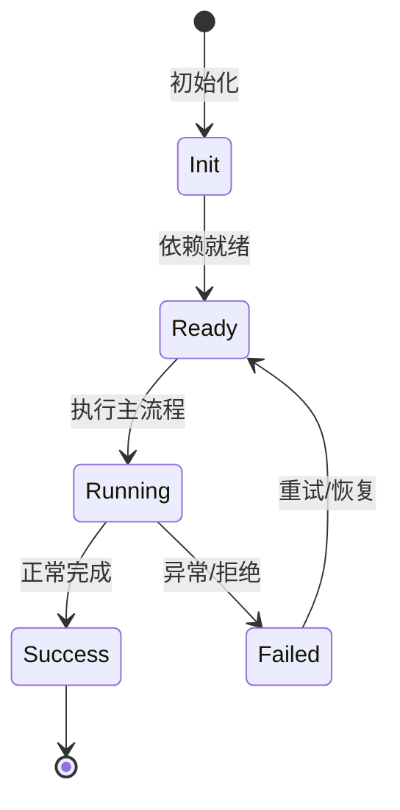

# 持久记忆与会话恢复

NightHawk 通过 session 文件、transcript、compaction 实现跨会话记忆。

## 会话持久化

session 目录保存 metadata、messages、records；`-S`/`-c` 恢复。

## Compaction

上下文超长时压缩：full compaction、micro compaction、handoff summary。

## Replay

transcript 和 records 支持回放。

## 长期记忆

项目记忆文件、AGENTS.md、用户 skill 等构成跨会话上下文。

## 专业实现要点（开发流程视角）

### 需求分析

Feature 是自包含能力单元，必须能整体安装/卸载而不污染其他模块。

### 设计决策

用 `Feature` 基类组合 Service、Tool、Profile、Config、Command 贡献点；静态契约留在静态注册通道。

### 实现步骤

在 `src/features/<name>/` 写领域代码 → 写 `<name>Feature.ts` → 在 `src/index.ts` 精确导入 → 编写测试。

### 验证方式

通过 `test/features/feature.test.ts` 验证装配/卸载；通过 DI 视图观察 unit 状态。

### 维护注意

不要把所有能力塞进一个 Feature；配置段、wire 事件等静态契约必须保持可重放。

## 逐函数实现说明

以下按源码文件列出可验证的导出函数/类，并给出实现职责说明。

### packages/agent-core/src/agent/compaction/full.ts

| 类 | 行号 | 声明 | 实现说明 |
| --- | --- | --- | --- |
| `FullCompaction` | 70 | `export class FullCompaction {` | 该类封装本文模块的核心状态与行为。 |

### packages/agent-core/src/agent/compaction/handoff.ts

| 函数 | 行号 | 签名 | 实现说明 |
| --- | --- | --- | --- |
| `compactionUserMessageDisposition` | 61 | `export function compactionUserMessageDisposition(` | `compactionUserMessageDisposition` 是本文涉及模块中的一个导出函数/类，具体语义以源码实现为准。 |
| `isCompactionSummaryMessage` | 99 | `export function isCompactionSummaryMessage(message: MessageLike): boolean {` | `isCompactionSummaryMessage` 是本文涉及模块中的一个导出函数/类，具体语义以源码实现为准。 |
| `isRealUserInput` | 108 | `export function isRealUserInput(message: MessageLike): boolean {` | `isRealUserInput` 是本文涉及模块中的一个导出函数/类，具体语义以源码实现为准。 |
| `buildCompactionElisionText` | 333 | `export function buildCompactionElisionText(omittedTokens: number): string {` | `buildCompactionElisionText` 负责创建/构建相关对象或流程。 |
| `buildCompactionSummaryText` | 341 | `export function buildCompactionSummaryText(summary: string): string {` | `buildCompactionSummaryText` 负责创建/构建相关对象或流程。 |

### packages/agent-core/src/agent/compaction/micro.ts

| 类 | 行号 | 声明 | 实现说明 |
| --- | --- | --- | --- |
| `MicroCompaction` | 27 | `export class MicroCompaction {` | 该类封装本文模块的核心状态与行为。 |

### packages/agent-core/src/agent/compaction/render-messages.ts

| 函数 | 行号 | 签名 | 实现说明 |
| --- | --- | --- | --- |
| `renderMessagesToText` | 3 | `export function renderMessagesToText(messages: readonly Message[]): string {` | `renderMessagesToText` 是本文涉及模块中的一个导出函数/类，具体语义以源码实现为准。 |

### packages/agent-core/src/agent/compaction/strategy.ts

| 类 | 行号 | 声明 | 实现说明 |
| --- | --- | --- | --- |
| `DefaultCompactionStrategy` | 41 | `export class DefaultCompactionStrategy implements CompactionStrategy {` | 该类封装本文模块的核心状态与行为。 |

### packages/agent-core/src/agent/records/blobref.ts

| 函数 | 行号 | 签名 | 实现说明 |
| --- | --- | --- | --- |
| `isBlobRef` | 13 | `export function isBlobRef(url: string): boolean {` | `isBlobRef` 是本文涉及模块中的一个导出函数/类，具体语义以源码实现为准。 |

| 类 | 行号 | 声明 | 实现说明 |
| --- | --- | --- | --- |
| `BlobStore` | 23 | `export class BlobStore {` | 该类封装本文模块的核心状态与行为。 |

### packages/agent-core/src/agent/records/index.ts

| 类 | 行号 | 声明 | 实现说明 |
| --- | --- | --- | --- |
| `AgentRecords` | 188 | `export class AgentRecords {` | 该类封装本文模块的核心状态与行为。 |

### packages/agent-core/src/agent/records/migration/index.ts

| 函数 | 行号 | 签名 | 实现说明 |
| --- | --- | --- | --- |
| `isNewerWireVersion` | 31 | `export function isNewerWireVersion(readVersion: string): boolean {` | `isNewerWireVersion` 是本文涉及模块中的一个导出函数/类，具体语义以源码实现为准。 |
| `resolveWireMigrations` | 35 | `export function resolveWireMigrations(readVersion: string): readonly WireMigration[] {` | `resolveWireMigrations` 是本文涉及模块中的一个导出函数/类，具体语义以源码实现为准。 |
| `migrateWireRecord` | 54 | `export function migrateWireRecord(` | `migrateWireRecord` 是本文涉及模块中的一个导出函数/类，具体语义以源码实现为准。 |
| `migrateWireRecords` | 64 | `export function migrateWireRecords(` | `migrateWireRecords` 是本文涉及模块中的一个导出函数/类，具体语义以源码实现为准。 |

### packages/agent-core/src/agent/records/persistence.ts

| 类 | 行号 | 声明 | 实现说明 |
| --- | --- | --- | --- |
| `InMemoryAgentRecordPersistence` | 18 | `export class InMemoryAgentRecordPersistence implements AgentRecordPersistence {` | 该类封装本文模块的核心状态与行为。 |
| `FileSystemAgentRecordPersistence` | 48 | `export class FileSystemAgentRecordPersistence implements AgentRecordPersistence {` | 该类封装本文模块的核心状态与行为。 |

### packages/agent-core-v2/src/agent/contextMemory/compactionHandoff.ts

| 函数 | 行号 | 签名 | 实现说明 |
| --- | --- | --- | --- |
| `buildContextCompactionShape` | 60 | `export function buildContextCompactionShape(` | `buildContextCompactionShape` 负责创建/构建相关对象或流程。 |
| `buildCompactionSummaryText` | 120 | `export function buildCompactionSummaryText(summary: string): string {` | `buildCompactionSummaryText` 负责创建/构建相关对象或流程。 |
| `createCompactionSummaryMessage` | 125 | `export function createCompactionSummaryMessage(text: string): ContextMessage {` | `createCompactionSummaryMessage` 负责创建/构建相关对象或流程。 |
| `createCompactionElisionMessage` | 134 | `export function createCompactionElisionMessage(omittedTokens: number): ContextMessage {` | `createCompactionElisionMessage` 负责创建/构建相关对象或流程。 |
| `buildCompactionElisionText` | 143 | `export function buildCompactionElisionText(omittedTokens: number): string {` | `buildCompactionElisionText` 负责创建/构建相关对象或流程。 |
| `isCompactionSummaryMessage` | 155 | `export function isCompactionSummaryMessage(message: MessageLike): boolean {` | `isCompactionSummaryMessage` 是本文涉及模块中的一个导出函数/类，具体语义以源码实现为准。 |
| `isRealUserInput` | 159 | `export function isRealUserInput(message: MessageLike): boolean {` | `isRealUserInput` 是本文涉及模块中的一个导出函数/类，具体语义以源码实现为准。 |
| `compactionUserMessageDisposition` | 163 | `export function compactionUserMessageDisposition(` | `compactionUserMessageDisposition` 是本文涉及模块中的一个导出函数/类，具体语义以源码实现为准。 |

### packages/agent-core-v2/src/agent/contextMemory/contextEvents.ts

| 类 | 行号 | 声明 | 实现说明 |
| --- | --- | --- | --- |
| `ContextAppendMessage` | 17 | `export class ContextAppendMessage extends AgentEvent2<` | 该类封装本文模块的核心状态与行为。 |
| `ContextAppendLoopEvent` | 34 | `export class ContextAppendLoopEvent extends AgentEvent2<` | 该类封装本文模块的核心状态与行为。 |
| `ContextClear` | 48 | `export class ContextClear extends AgentEvent2<z.infer<typeof contextClearSchema>> {` | 该类封装本文模块的核心状态与行为。 |
| `ContextApplyCompaction` | 91 | `export class ContextApplyCompaction extends AgentEvent2<ContextApplyCompactionPayload> {` | 该类封装本文模块的核心状态与行为。 |
| `ContextUndo` | 102 | `export class ContextUndo extends AgentEvent2<z.infer<typeof contextUndoSchema>> {` | 该类封装本文模块的核心状态与行为。 |
| `ContextSpliced` | 120 | `export class ContextSpliced extends AgentEvent2<ContextSplicedPayload> {` | 该类封装本文模块的核心状态与行为。 |

### packages/agent-core-v2/src/agent/contextMemory/contextMemoryService.ts

| 类 | 行号 | 声明 | 实现说明 |
| --- | --- | --- | --- |
| `AgentContextMemoryService` | 33 | `export class AgentContextMemoryService extends Disposable implements IAgentContextMemoryService {` | 该类封装本文模块的核心状态与行为。 |

### packages/agent-core-v2/src/agent/contextMemory/contextOps.ts

| 函数 | 行号 | 签名 | 实现说明 |
| --- | --- | --- | --- |
| `popSwarmModeReminder` | 109 | `export function popSwarmModeReminder(state: ContextMessage[]): ContextMessage[] {` | `popSwarmModeReminder` 是本文涉及模块中的一个导出函数/类，具体语义以源码实现为准。 |
| `applyContextCompactionRecord` | 121 | `export function applyContextCompactionRecord(` | `applyContextCompactionRecord` 是本文涉及模块中的一个导出函数/类，具体语义以源码实现为准。 |
| `readContextCompactionShapeInput` | 129 | `export function readContextCompactionShapeInput(` | `readContextCompactionShapeInput` 负责读取或查询数据。 |
| `readContextCompactedCount` | 149 | `export function readContextCompactedCount(record: ContextCompactionRecord): number {` | `readContextCompactedCount` 负责读取或查询数据。 |
| `readContextCompactionSummary` | 168 | `export function readContextCompactionSummary(record: ContextCompactionRecord): ContextMessage {` | `readContextCompactionSummary` 负责读取或查询数据。 |
| `computeUndoCut` | 249 | `export function computeUndoCut(state: readonly ContextMessage[], count: number): UndoCut {` | `computeUndoCut` 是本文涉及模块中的一个导出函数/类，具体语义以源码实现为准。 |
| `isFullyUndoable` | 276 | `export function isFullyUndoable(cut: UndoCut, count: number): boolean {` | `isFullyUndoable` 是本文涉及模块中的一个导出函数/类，具体语义以源码实现为准。 |
| `precheckUndo` | 295 | `export function precheckUndo(history: readonly ContextMessage[], count: number): UndoPrecheck {` | `precheckUndo` 是本文涉及模块中的一个导出函数/类，具体语义以源码实现为准。 |
| `formatUndoUnavailableMessage` | 306 | `export function formatUndoUnavailableMessage(` | `formatUndoUnavailableMessage` 是本文涉及模块中的一个导出函数/类，具体语义以源码实现为准。 |

### packages/agent-core-v2/src/agent/contextMemory/contextTranscript.ts

| 函数 | 行号 | 签名 | 实现说明 |
| --- | --- | --- | --- |
| `reduceContextTranscript` | 40 | `export function reduceContextTranscript(records: Iterable<WireRecord>): ContextTranscript {` | `reduceContextTranscript` 是本文涉及模块中的一个导出函数/类，具体语义以源码实现为准。 |
| `createContextTranscriptReducer` | 46 | `export function createContextTranscriptReducer(): ContextTranscriptReducer {` | `createContextTranscriptReducer` 负责创建/构建相关对象或流程。 |

### packages/agent-core-v2/src/agent/contextMemory/conversationTime.ts

| 函数 | 行号 | 签名 | 实现说明 |
| --- | --- | --- | --- |
| `isUndoAnchor` | 11 | `export function isUndoAnchor(message: ContextMessage): boolean {` | `isUndoAnchor` 是本文涉及模块中的一个导出函数/类，具体语义以源码实现为准。 |
| `isPromptOwnedInjection` | 21 | `export function isPromptOwnedInjection(` | `isPromptOwnedInjection` 是本文涉及模块中的一个导出函数/类，具体语义以源码实现为准。 |
| `isValidUndoCount` | 33 | `export function isValidUndoCount(count: number): boolean {` | `isValidUndoCount` 是本文涉及模块中的一个导出函数/类，具体语义以源码实现为准。 |

### packages/agent-core-v2/src/agent/contextMemory/loopEventFold.ts

| 函数 | 行号 | 签名 | 实现说明 |
| --- | --- | --- | --- |
| `createLoopEventFold` | 84 | `export function createLoopEventFold(sink: LoopEventFoldSink): LoopEventFold {` | `createLoopEventFold` 负责创建/构建相关对象或流程。 |
| `foldAppendMessage` | 225 | `export function foldAppendMessage(` | `foldAppendMessage` 是本文涉及模块中的一个导出函数/类，具体语义以源码实现为准。 |
| `foldLoopEvent` | 234 | `export function foldLoopEvent(` | `foldLoopEvent` 是本文涉及模块中的一个导出函数/类，具体语义以源码实现为准。 |
| `resetFold` | 243 | `export function resetFold(state: readonly ContextMessage[]): readonly ContextMessage[] {` | `resetFold` 是本文涉及模块中的一个导出函数/类，具体语义以源码实现为准。 |

### packages/agent-core-v2/src/agent/contextMemory/messageId.ts

| 函数 | 行号 | 签名 | 实现说明 |
| --- | --- | --- | --- |
| `newMessageId` | 3 | `export function newMessageId(): string {` | `newMessageId` 是本文涉及模块中的一个导出函数/类，具体语义以源码实现为准。 |

### packages/agent-core-v2/src/agent/contextMemory/openToolExchange.ts

| 函数 | 行号 | 签名 | 实现说明 |
| --- | --- | --- | --- |
| `closeTrailingOpenToolExchange` | 8 | `export function closeTrailingOpenToolExchange(` | `closeTrailingOpenToolExchange` 是本文涉及模块中的一个导出函数/类，具体语义以源码实现为准。 |

### packages/agent-core-v2/src/agent/contextMemory/toolResultRender.ts

| 函数 | 行号 | 签名 | 实现说明 |
| --- | --- | --- | --- |
| `renderToolResultForModel` | 15 | `export function renderToolResultForModel(result: RenderableToolResult): ContentPart[] {` | `renderToolResultForModel` 是本文涉及模块中的一个导出函数/类，具体语义以源码实现为准。 |

### packages/agent-core-v2/src/agent/contextMemory/vacuousContent.ts

| 函数 | 行号 | 签名 | 实现说明 |
| --- | --- | --- | --- |
| `isVacuousContentPart` | 3 | `export function isVacuousContentPart(part: ContentPart): boolean {` | `isVacuousContentPart` 是本文涉及模块中的一个导出函数/类，具体语义以源码实现为准。 |


## 核心代码片段

以下片段直接从仓库源码截取，用于展示关键实现形态；完整实现请打开对应文件。

### 来自 `packages/agent-core/src/agent/compaction/full.ts` 的 `FullCompaction`

源码位置：`packages/agent-core/src/agent/compaction/full.ts:70` 附近。

```ts
export class FullCompaction {
  protected compactionCountInTurn = 0;
  protected compacting: {
    abortController: AbortController;
    promise: Promise<void>;
    blockedByTurn: boolean;
  } | null = null;
  private readonly observedMaxContextTokensByModel = new Map<string, number>();
  // Token count right after the last successful compaction. While no new
  // content has been appended (tokenCountWithPending <= this value), the
  // history is already in its minimal compacted form ([kept user prompts
  // (possibly split around an elision marker), summary]); re-compacting would
  // only nest summaries, so
  // checkAutoCompaction skips in that case even if an observed overflow
  // limit still flags the context as oversized.
  private lastCompactedTokenCount: number | null = null;
  // Counts provider-overflow recoveries in this turn that have not yet been
  // followed by a successful step. Trips MAX_OVERFLOW_COMPACTION_ATTEMPTS to
  // stop an overflow -> compact -> overflow loop when compaction can no
  // longer shrink the request below the model window.
  private consecutiveOverflowCompactions = 0;
  // Trace id (`x-trace-id`, NightHawk/KFC only) of the latest summarizer request,
  // updated on every attempt — success or failure — so a compaction cancelled
  // mid-request can still be attributed to its server-side request.
// ...
```

### 来自 `packages/agent-core/src/agent/compaction/handoff.ts` 的 `compactionUserMessageDisposition`

源码位置：`packages/agent-core/src/agent/compaction/handoff.ts:61` 附近。

```ts
export function compactionUserMessageDisposition(
  origin: PromptOrigin | undefined,
): CompactionUserDisposition {
  if (origin === undefined) return 'keep';
  switch (origin.kind) {
    case 'user':
      return 'keep';
    case 'skill_activation':
    case 'plugin_command':
      return origin.trigger === 'user-slash' ? 'keep' : 'drop';
    case 'injection':
    case 'shell_command':
    case 'compaction_summary':
    case 'system_trigger':
    case 'background_task':
    case 'cron_job':
    case 'cron_missed':
    case 'hook_result':
    case 'retry':
      return 'drop';
    default: {
      const _exhaustive: never = origin;
      void _exhaustive;
      return 'drop';
// ...
```

### 来自 `packages/agent-core/src/agent/compaction/micro.ts` 的 `MicroCompaction`

源码位置：`packages/agent-core/src/agent/compaction/micro.ts:27` 附近。

```ts
export class MicroCompaction {
  private cutoff = 0;
  readonly config: MicroCompactionConfig;

  constructor(
    public readonly agent: Agent,
    config?: Partial<MicroCompactionConfig>,
  ) {
    this.config = { ...DEFAULT_CONFIG, ...config };
  }

  reset(maxCutoff = 0): void {
    this.cutoff = Math.min(this.cutoff, maxCutoff);
  }

  apply(cutoff: number): void {
    this.agent.records.logRecord({
      type: 'micro_compaction.apply',
      cutoff,
    });
    this.cutoff = cutoff;
  }

  detect(): void {
// ...
```


## 时序/状态图



> 图注：`04-features/memory.md` 的抽象流程；具体参与者与状态以源码和上文函数说明为准。

## 核心实现细节（源码导出）

以下是本文涉及路径中的真实源码导出/结构，帮助你把概念映射到函数、类与方法：

  - `packages/agent-core/src/agent/compaction//` 目录下源码文件示例：
    - `packages/agent-core/src/agent/compaction/full.ts`
    - `packages/agent-core/src/agent/compaction/handoff.ts`
    - `packages/agent-core/src/agent/compaction/index.ts`
    - `packages/agent-core/src/agent/compaction/micro.ts`
    - `packages/agent-core/src/agent/compaction/render-messages.ts`
    - `packages/agent-core/src/agent/compaction/strategy.ts`
    - `packages/agent-core/src/agent/compaction/types.ts`
  - `packages/agent-core/src/agent/records//` 目录下源码文件示例：
    - `packages/agent-core/src/agent/records/blobref.ts`
    - `packages/agent-core/src/agent/records/index.ts`
    - `packages/agent-core/src/agent/records/migration/index.ts`
    - `packages/agent-core/src/agent/records/migration/v1.1.ts`
    - `packages/agent-core/src/agent/records/migration/v1.2.ts`
    - `packages/agent-core/src/agent/records/migration/v1.3.ts`
    - `packages/agent-core/src/agent/records/migration/v1.4.ts`
    - `packages/agent-core/src/agent/records/persistence.ts`
    - `packages/agent-core/src/agent/records/types.ts`
  - `packages/agent-core-v2/src/agent/contextMemory//` 目录下源码文件示例：
    - `packages/agent-core-v2/src/agent/contextMemory/compactionHandoff.ts`
    - `packages/agent-core-v2/src/agent/contextMemory/contextEvents.ts`
    - `packages/agent-core-v2/src/agent/contextMemory/contextMemory.ts`
    - `packages/agent-core-v2/src/agent/contextMemory/contextMemoryService.ts`
    - `packages/agent-core-v2/src/agent/contextMemory/contextOps.ts`
    - `packages/agent-core-v2/src/agent/contextMemory/contextTranscript.ts`
    - `packages/agent-core-v2/src/agent/contextMemory/conversationTime.ts`
    - `packages/agent-core-v2/src/agent/contextMemory/conversationUndoParticipants.ts`
    - `packages/agent-core-v2/src/agent/contextMemory/loopEventFold.ts`
    - `packages/agent-core-v2/src/agent/contextMemory/messageId.ts`
    - `packages/agent-core-v2/src/agent/contextMemory/openToolExchange.ts`
    - `packages/agent-core-v2/src/agent/contextMemory/toolResultRender.ts`
    - `packages/agent-core-v2/src/agent/contextMemory/types.ts`
    - `packages/agent-core-v2/src/agent/contextMemory/vacuousContent.ts`

## 证据与代码位置

- `packages/agent-core/src/agent/compaction/`
- `packages/agent-core/src/agent/records/`
- `packages/agent-core-v2/src/agent/contextMemory/`

> 本文所有路径均相对仓库根目录；引用内容以仓库当前 `HEAD` 为准。
