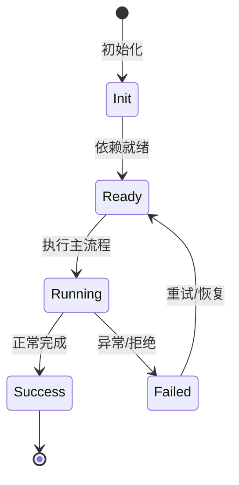

# 官方插件与市场插件

NightHawk 仓库自带插件市场与官方插件，覆盖数据源、浏览器自动化和授权渗透测试。

## 插件市场

市场文件：`plugins/marketplace.json`

| 插件 | Tier | 说明 |
| --- | --- | --- |
| `nighthawk-datasource` | official | 股票、金融、宏观、企业、学术、法律等 25+ 数据源 |
| `nighthawk-webbridge` | official | 通过本地 daemon 控制真实浏览器 |
| `nighthawk-pentest` | official | 授权渗透测试全流程与报告生成 |
| `superpowers` | curated | Planning、TDD、debugging、delivery 工作流 |
| `vercel-plugin` | curated | Vercel 平台技能/Agent/规范 |
| `modern-web-guidance` | curated | Chrome 团队现代 Web 最佳实践 |
| `cloudbase` | curated | 腾讯 CloudBase 数据库/云函数/存储/托管 |

## 1. nighthawk-datasource

- 位置：`plugins/official/nighthawk-datasource/`
- 版本：`3.4.0`
- 能力：通过 MCP server 暴露两个工具：
  - `mcp__plugin-nighthawk-datasource_data__get_data_source_desc`
  - `mcp__plugin-nighthawk-datasource_data__call_data_source_tool`
- 数据源示例：`stock_finance_data`、`yahoo_finance`、`world_bank_open_data`、`tianyancha`、`arxiv`、`scholar`、`wind`、`imf`、`sec_edgar`、`china_nbs`、`fred`、`caixin` 等。
- 使用流程：先 `get_data_source_desc` 获取接口文档，再 `call_data_source_tool` 取数。
- 注意：股票代码必须联网核对；企业查询必须用全称；多数 API 需要 `file_path`。

## 2. nighthawk-webbridge

- 位置：`plugins/official/nighthawk-webbridge/`
- 版本：`1.11.3`
- 能力：控制真实浏览器，导航、点击、输入、读取页面、截图。
- 架构：本地 WebBridge daemon（`http://127.0.0.1:10086`）+ 浏览器扩展 + CDP。
- 数据安全：登录态和页面内容只在本地。
- 能力安装入口：`packages/agent-core-v2/src/app/capability/entries/nighthawkWebbridge.ts`

## 3. nighthawk-pentest

- 位置：`plugins/official/nighthawk-pentest/`
- 版本：`1.0.0`
- 能力：授权渗透测试端到端工作流，包含：
  - 授权与范围确认
  - 被动信息收集
  - 攻击面测绘
  - 漏洞验证
  - 范围内 PoC
  - 后渗透影响评估
  - 修复建议
  - 专业报告生成（HTML 源格式，可转 PDF）
- 合规红线：不 exfiltrate、不破坏、不留持久化 payload、不碰范围外系统。
- 中文优先，双语支持。

## 插件安装与使用

```sh
# 在 TUI 中使用插件市场
nighthawk
/plugin
```

或通过 CLI/SDK 安装：

```ts
await klient.global.plugins.install({ source: 'nighthawk-datasource' });
await klient.global.plugins.setPluginEnabled({ id: 'nighthawk-datasource', enabled: true });
```

## 专业实现要点（开发流程视角）

### 需求分析

Feature 是自包含能力单元，必须能整体安装/卸载而不污染其他模块。

### 设计决策

用 `Feature` 基类组合 Service、Tool、Profile、Config、Command 贡献点；静态契约留在静态注册通道。

### 实现步骤

在 `src/features/<name>/` 写领域代码 → 写 `<name>Feature.ts` → 在 `src/index.ts` 精确导入 → 编写测试。

### 验证方式

通过 `test/features/feature.test.ts` 验证装配/卸载；通过 DI 视图观察 unit 状态。

### 维护注意

不要把所有能力塞进一个 Feature；配置段、wire 事件等静态契约必须保持可重放。

## 逐函数实现说明

以下按源码文件列出可验证的导出函数/类，并给出实现职责说明。

### packages/agent-core-v2/src/app/capability/entries/nighthawkWebbridge.ts

| 函数 | 行号 | 签名 | 实现说明 |
| --- | --- | --- | --- |
| `createNighthawkWebbridgeEntry` | 51 | `export function createNighthawkWebbridgeEntry(ctx: CapabilityEntryContext): CapabilityEntry {` | `createNighthawkWebbridgeEntry` 负责创建/构建相关对象或流程。 |


## 核心代码片段

以下片段直接从仓库源码截取，用于展示关键实现形态；完整实现请打开对应文件。

### 来自 `packages/agent-core-v2/src/app/capability/entries/nighthawkWebbridge.ts` 的 `createNighthawkWebbridgeEntry`

源码位置：`packages/agent-core-v2/src/app/capability/entries/nighthawkWebbridge.ts:51` 附近。

```ts
export function createNighthawkWebbridgeEntry(ctx: CapabilityEntryContext): CapabilityEntry {
  const baseUrl = ctx.webbridgeBaseUrl ?? DEFAULT_DAEMON_BASE_URL;
  const binDir = path.join(ctx.userHomeDir, '.nighthawk-webbridge', 'bin');
  const binName = ctx.platform === 'win32' ? 'nighthawk-webbridge.exe' : 'nighthawk-webbridge';
  const binPath = path.join(binDir, binName);
  const userSourceSkillDirs = [
    {
      label: 'nighthawk',
      path: path.join(ctx.nighthawkHomeDir, 'skills', 'nighthawk-webbridge'),
    },
    {
      label: 'agents',
      path: path.join(ctx.userHomeDir, '.agents', 'skills', 'nighthawk-webbridge'),
    },
  ];
  const standaloneSkillBackupDir = path.join(
    ctx.nighthawkHomeDir,
    'backups',
    'nighthawk-webbridge-skills',
  );
  const supported = binaryAssetName(ctx.platform, ctx.arch) !== undefined;
  let standaloneSkillBackupPath: string | undefined;
  let standaloneSkillMigrationError: string | undefined;

// ...
```


## 时序/状态图



> 图注：`04-features/official-plugins.md` 的抽象流程；具体参与者与状态以源码和上文函数说明为准。

## 核心实现细节（源码导出）

以下是本文涉及路径中的真实源码导出/结构，帮助你把概念映射到函数、类与方法：

  - `plugins/marketplace.json`（非 TS 源码，可直接阅读）
  - `plugins/official/nighthawk-datasource/nighthawk.plugin.json`（非 TS 源码，可直接阅读）
  - `plugins/official/nighthawk-datasource/SKILL.md`（非 TS 源码，可直接阅读）
  - `plugins/official/nighthawk-webbridge/nighthawk.plugin.json`（非 TS 源码，可直接阅读）
  - `plugins/official/nighthawk-pentest/nighthawk.plugin.json`（非 TS 源码，可直接阅读）
  - `packages/agent-core-v2/src/app/capability/entries/nighthawkWebbridge.ts`：
    - 导出签名/声明：
      - `export function createNighthawkWebbridgeEntry(ctx: CapabilityEntryContext): CapabilityEntry`
      - `export const __nighthawkWebbridgeInternals = { binaryAssetName, renameAcrossDevicesFallback };`
  - `docs/en/customization/plugins.md`（非 TS 源码，可直接阅读）

## 证据与代码位置

- `plugins/marketplace.json`
- `plugins/official/nighthawk-datasource/nighthawk.plugin.json`
- `plugins/official/nighthawk-datasource/SKILL.md`
- `plugins/official/nighthawk-webbridge/nighthawk.plugin.json`
- `plugins/official/nighthawk-pentest/nighthawk.plugin.json`
- `packages/agent-core-v2/src/app/capability/entries/nighthawkWebbridge.ts`
- `docs/en/customization/plugins.md`
