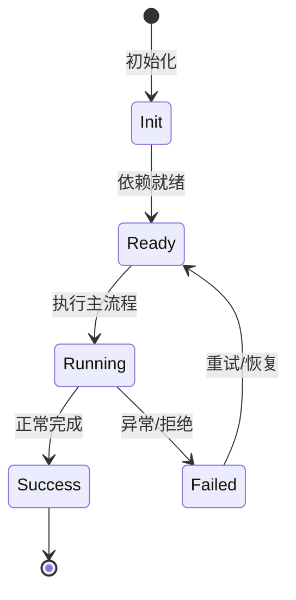

# 插件系统

插件是自包含分发包，可携带 skills、MCP servers 和 tools。

## Manifest

`nighthawk.plugin.json` 声明 `kind`、`name`、`version`、`skills`、`mcpServers`、`tools`。

## 来源

本地路径、GitHub 仓库、市场 catalog。

## 信任

不同来源决定信任级别；安装时明示。

## 运行时

`IPluginService` 管理插件生命周期；feature 可 contribute plugin commands。

## 专业实现要点（开发流程视角）

### 需求分析

Feature 是自包含能力单元，必须能整体安装/卸载而不污染其他模块。

### 设计决策

用 `Feature` 基类组合 Service、Tool、Profile、Config、Command 贡献点；静态契约留在静态注册通道。

### 实现步骤

在 `src/features/<name>/` 写领域代码 → 写 `<name>Feature.ts` → 在 `src/index.ts` 精确导入 → 编写测试。

### 验证方式

通过 `test/features/feature.test.ts` 验证装配/卸载；通过 DI 视图观察 unit 状态。

### 维护注意

不要把所有能力塞进一个 Feature；配置段、wire 事件等静态契约必须保持可重放。

## 逐函数实现说明

以下按源码文件列出可验证的导出函数/类，并给出实现职责说明。

### packages/agent-core/src/plugin/archive.ts

| 函数 | 行号 | 签名 | 实现说明 |
| --- | --- | --- | --- |
| `downloadZip` | 9 | `export async function downloadZip(url: string, signal?: AbortSignal): Promise<Buffer> {` | `downloadZip` 是本文涉及模块中的一个导出函数/类，具体语义以源码实现为准。 |
| `extractZip` | 25 | `export async function extractZip(buffer: Buffer, destDir: string): Promise<string> {` | `extractZip` 是本文涉及模块中的一个导出函数/类，具体语义以源码实现为准。 |

### packages/agent-core/src/plugin/commands.ts

| 函数 | 行号 | 签名 | 实现说明 |
| --- | --- | --- | --- |
| `parseCommandText` | 7 | `export function parseCommandText(input: {` | `parseCommandText` 是本文涉及模块中的一个导出函数/类，具体语义以源码实现为准。 |
| `loadPluginCommand` | 32 | `export async function loadPluginCommand(input: {` | `loadPluginCommand` 是本文涉及模块中的一个导出函数/类，具体语义以源码实现为准。 |
| `expandCommandArguments` | 55 | `export function expandCommandArguments(body: string, args: string): string {` | `expandCommandArguments` 是本文涉及模块中的一个导出函数/类，具体语义以源码实现为准。 |

### packages/agent-core/src/plugin/github-resolver.ts

| 函数 | 行号 | 签名 | 实现说明 |
| --- | --- | --- | --- |
| `resolveGithubSource` | 38 | `export async function resolveGithubSource(` | `resolveGithubSource` 是本文涉及模块中的一个导出函数/类，具体语义以源码实现为准。 |

### packages/agent-core/src/plugin/manager.ts

| 类 | 行号 | 声明 | 实现说明 |
| --- | --- | --- | --- |
| `PluginManager` | 40 | `export class PluginManager {` | 该类封装本文模块的核心状态与行为。 |

### packages/agent-core/src/plugin/manifest.ts

| 函数 | 行号 | 签名 | 实现说明 |
| --- | --- | --- | --- |
| `findManifestPath` | 49 | `export async function findManifestPath(pluginRoot: string): Promise<string \| undefined> {` | `findManifestPath` 是本文涉及模块中的一个导出函数/类，具体语义以源码实现为准。 |
| `parseManifest` | 79 | `export async function parseManifest(pluginRoot: string): Promise<ParsedManifestResult> {` | `parseManifest` 是本文涉及模块中的一个导出函数/类，具体语义以源码实现为准。 |

### packages/agent-core/src/plugin/source.ts

| 函数 | 行号 | 签名 | 实现说明 |
| --- | --- | --- | --- |
| `resolveInstallSource` | 18 | `export function resolveInstallSource(source: string): ResolvedSource {` | `resolveInstallSource` 是本文涉及模块中的一个导出函数/类，具体语义以源码实现为准。 |

### packages/agent-core/src/plugin/store.ts

| 函数 | 行号 | 签名 | 实现说明 |
| --- | --- | --- | --- |
| `readInstalled` | 31 | `export async function readInstalled(nighthawkHomeDir: string): Promise<InstalledFile> {` | `readInstalled` 负责读取或查询数据。 |
| `writeInstalled` | 54 | `export async function writeInstalled(` | `writeInstalled` 负责写入或更新状态。 |

### packages/agent-core/src/plugin/types.ts

| 函数 | 行号 | 签名 | 实现说明 |
| --- | --- | --- | --- |
| `normalizePluginId` | 206 | `export function normalizePluginId(name: string): string {` | `normalizePluginId` 是本文涉及模块中的一个导出函数/类，具体语义以源码实现为准。 |

### packages/agent-core-v2/src/app/plugin/archive.ts

| 函数 | 行号 | 签名 | 实现说明 |
| --- | --- | --- | --- |
| `downloadZip` | 12 | `export async function downloadZip(url: string, signal?: AbortSignal): Promise<Buffer> {` | `downloadZip` 是本文涉及模块中的一个导出函数/类，具体语义以源码实现为准。 |
| `extractZip` | 32 | `export async function extractZip(buffer: Buffer, destDir: string): Promise<string> {` | `extractZip` 是本文涉及模块中的一个导出函数/类，具体语义以源码实现为准。 |

### packages/agent-core-v2/src/app/plugin/commands.ts

| 函数 | 行号 | 签名 | 实现说明 |
| --- | --- | --- | --- |
| `parseCommandText` | 8 | `export function parseCommandText(input: {` | `parseCommandText` 是本文涉及模块中的一个导出函数/类，具体语义以源码实现为准。 |
| `loadPluginCommand` | 33 | `export async function loadPluginCommand(input: {` | `loadPluginCommand` 是本文涉及模块中的一个导出函数/类，具体语义以源码实现为准。 |
| `expandCommandArguments` | 51 | `export function expandCommandArguments(body: string, args: string): string {` | `expandCommandArguments` 是本文涉及模块中的一个导出函数/类，具体语义以源码实现为准。 |

### packages/agent-core-v2/src/app/plugin/github-resolver.ts

| 函数 | 行号 | 签名 | 实现说明 |
| --- | --- | --- | --- |
| `resolveGithubCommitSha` | 19 | `export async function resolveGithubCommitSha(` | `resolveGithubCommitSha` 是本文涉及模块中的一个导出函数/类，具体语义以源码实现为准。 |
| `resolveGithubSource` | 49 | `export async function resolveGithubSource(` | `resolveGithubSource` 是本文涉及模块中的一个导出函数/类，具体语义以源码实现为准。 |

### packages/agent-core-v2/src/app/plugin/manager.ts

| 类 | 行号 | 声明 | 实现说明 |
| --- | --- | --- | --- |
| `PluginManager` | 46 | `export class PluginManager {` | 该类封装本文模块的核心状态与行为。 |

### packages/agent-core-v2/src/app/plugin/manifest.ts

| 函数 | 行号 | 签名 | 实现说明 |
| --- | --- | --- | --- |
| `findManifestPath` | 40 | `export async function findManifestPath(pluginRoot: string): Promise<string \| undefined> {` | `findManifestPath` 是本文涉及模块中的一个导出函数/类，具体语义以源码实现为准。 |
| `parseManifest` | 67 | `export async function parseManifest(pluginRoot: string): Promise<ParsedManifestResult> {` | `parseManifest` 是本文涉及模块中的一个导出函数/类，具体语义以源码实现为准。 |

### packages/agent-core-v2/src/app/plugin/marketplace.ts

| 函数 | 行号 | 签名 | 实现说明 |
| --- | --- | --- | --- |
| `computeUpdateStatus` | 52 | `export function computeUpdateStatus(` | `computeUpdateStatus` 是本文涉及模块中的一个导出函数/类，具体语义以源码实现为准。 |
| `resolveMarketplaceLocation` | 70 | `export function resolveMarketplaceLocation(source: string, workDir: string): MarketplaceLocation {` | `resolveMarketplaceLocation` 是本文涉及模块中的一个导出函数/类，具体语义以源码实现为准。 |
| `readPluginMarketplace` | 85 | `export async function readPluginMarketplace(` | `readPluginMarketplace` 负责读取或查询数据。 |
| `parsePluginMarketplace` | 102 | `export function parsePluginMarketplace(raw: string, location: MarketplaceLocation): PluginMarketplace {` | `parsePluginMarketplace` 是本文涉及模块中的一个导出函数/类，具体语义以源码实现为准。 |
| `withBuiltInEntries` | 127 | `export function withBuiltInEntries(` | `withBuiltInEntries` 是本文涉及模块中的一个导出函数/类，具体语义以源码实现为准。 |
| `withLatestVersions` | 141 | `export async function withLatestVersions(` | `withLatestVersions` 是本文涉及模块中的一个导出函数/类，具体语义以源码实现为准。 |

### packages/agent-core-v2/src/app/plugin/pluginEvents.ts

| 类 | 行号 | 声明 | 实现说明 |
| --- | --- | --- | --- |
| `PluginChanged` | 4 | `export class PluginChanged extends Event2<{ readonly payload: Record<string, never> }> {` | 该类封装本文模块的核心状态与行为。 |

### packages/agent-core-v2/src/app/plugin/pluginService.ts

| 类 | 行号 | 声明 | 实现说明 |
| --- | --- | --- | --- |
| `PluginService` | 53 | `export class PluginService extends Service implements IPluginService {` | 该类封装本文模块的核心状态与行为。 |

### packages/agent-core-v2/src/app/plugin/source.ts

| 函数 | 行号 | 签名 | 实现说明 |
| --- | --- | --- | --- |
| `resolveInstallSource` | 19 | `export function resolveInstallSource(source: string): ResolvedSource {` | `resolveInstallSource` 是本文涉及模块中的一个导出函数/类，具体语义以源码实现为准。 |

### packages/agent-core-v2/src/app/plugin/store.ts

| 函数 | 行号 | 签名 | 实现说明 |
| --- | --- | --- | --- |
| `readInstalled` | 29 | `export async function readInstalled(nighthawkHomeDir: string): Promise<InstalledFile> {` | `readInstalled` 负责读取或查询数据。 |
| `writeInstalled` | 58 | `export async function writeInstalled(nighthawkHomeDir: string, data: InstalledFile): Promise<void> {` | `writeInstalled` 负责写入或更新状态。 |

### packages/agent-core-v2/src/app/plugin/types.ts

| 函数 | 行号 | 签名 | 实现说明 |
| --- | --- | --- | --- |
| `normalizePluginId` | 211 | `export function normalizePluginId(name: string): string {` | `normalizePluginId` 是本文涉及模块中的一个导出函数/类，具体语义以源码实现为准。 |


## 核心代码片段

以下片段直接从仓库源码截取，用于展示关键实现形态；完整实现请打开对应文件。

### 来自 `packages/agent-core/src/plugin/archive.ts` 的 `downloadZip`

源码位置：`packages/agent-core/src/plugin/archive.ts:9` 附近。

```ts
export async function downloadZip(url: string, signal?: AbortSignal): Promise<Buffer> {
  const controller = new AbortController();
  const timeoutHandle = setTimeout(() => {
    controller.abort();
  }, 5 * 60 * 1000);
  try {
    const resp = await fetch(url, { signal: signal ?? controller.signal });
    if (!resp.ok) {
      throw new Error(`Failed to download zip: HTTP ${resp.status} ${resp.statusText}`);
    }
    return Buffer.from(await resp.arrayBuffer());
  } finally {
    clearTimeout(timeoutHandle);
  }
}

export async function extractZip(buffer: Buffer, destDir: string): Promise<string> {
  await mkdir(destDir, { recursive: true });
  const destDirResolved = path.resolve(destDir);
  let settled = false;

  await new Promise<void>((resolve, reject) => {
    yauzlFromBuffer(buffer, { lazyEntries: true }, (openErr, zipfile) => {
      if (openErr !== null || zipfile === undefined) {
// ...
```

### 来自 `packages/agent-core/src/plugin/commands.ts` 的 `parseCommandText`

源码位置：`packages/agent-core/src/plugin/commands.ts:7` 附近。

```ts
export function parseCommandText(input: {
  readonly text: string;
  readonly commandPath: string;
  readonly pluginId: string;
  readonly fallbackName?: string;
}): PluginCommandDef {
  const { text, commandPath, pluginId } = input;
  const parsed = parseFrontmatter(text);
  const frontmatter = isRecord(parsed.data) ? parsed.data : {};

  const baseName = input.fallbackName ?? path.basename(commandPath).replace(/\.md$/i, '');
  const name = nonEmptyString(frontmatter['name']) ?? baseName;

  const body = parsed.body.trim();
  const description = nonEmptyString(frontmatter['description']) ?? descriptionFromBody(body);

  return {
    pluginId,
    name,
    description,
    body,
    path: path.resolve(commandPath),
  };
}
// ...
```

### 来自 `packages/agent-core/src/plugin/github-resolver.ts` 的 `resolveGithubSource`

源码位置：`packages/agent-core/src/plugin/github-resolver.ts:38` 附近。

```ts
export async function resolveGithubSource(
  input: GithubSourceInput,
): Promise<GithubSourceResolution> {
  const { owner, repo } = input;

  if (input.ref !== undefined) {
    return {
      tarballUrl: codeloadUrl(owner, repo, input.ref),
      displayVersion: input.ref.value,
      ref: { kind: input.ref.kind, value: input.ref.value },
    };
  }

  const latestTag = await tryResolveLatestReleaseTag(owner, repo);
  if (latestTag !== undefined) {
    return {
      tarballUrl: codeloadUrl(owner, repo, { kind: 'tag', value: latestTag }),
      displayVersion: latestTag,
      ref: { kind: 'tag', value: latestTag },
    };
  }

  // No release we could resolve. Fall back to the default branch via codeload.
  const headProbe = await fetch(
// ...
```


## 时序/状态图



> 图注：`04-features/plugins.md` 的抽象流程；具体参与者与状态以源码和上文函数说明为准。

## 核心实现细节（源码导出）

以下是本文涉及路径中的真实源码导出/结构，帮助你把概念映射到函数、类与方法：

  - `packages/agent-core/src/plugin//` 目录下源码文件示例：
    - `packages/agent-core/src/plugin/archive.ts`
    - `packages/agent-core/src/plugin/commands.ts`
    - `packages/agent-core/src/plugin/github-resolver.ts`
    - `packages/agent-core/src/plugin/index.ts`
    - `packages/agent-core/src/plugin/manager.ts`
    - `packages/agent-core/src/plugin/manifest.ts`
    - `packages/agent-core/src/plugin/source.ts`
    - `packages/agent-core/src/plugin/store.ts`
    - `packages/agent-core/src/plugin/types.ts`
  - `packages/agent-core-v2/src/app/plugin//` 目录下源码文件示例：
    - `packages/agent-core-v2/src/app/plugin/archive.ts`
    - `packages/agent-core-v2/src/app/plugin/commands.ts`
    - `packages/agent-core-v2/src/app/plugin/errors.ts`
    - `packages/agent-core-v2/src/app/plugin/github-resolver.ts`
    - `packages/agent-core-v2/src/app/plugin/manager.ts`
    - `packages/agent-core-v2/src/app/plugin/manifest.ts`
    - `packages/agent-core-v2/src/app/plugin/marketplace.ts`
    - `packages/agent-core-v2/src/app/plugin/plugin.ts`
    - `packages/agent-core-v2/src/app/plugin/pluginEvents.ts`
    - `packages/agent-core-v2/src/app/plugin/pluginService.ts`
    - `packages/agent-core-v2/src/app/plugin/source.ts`
    - `packages/agent-core-v2/src/app/plugin/store.ts`
    - `packages/agent-core-v2/src/app/plugin/types.ts`
  - `docs/en/customization/plugins.md`（非 TS 源码，可直接阅读）

## 证据与代码位置

- `packages/agent-core/src/plugin/`
- `packages/agent-core-v2/src/app/plugin/`
- `docs/en/customization/plugins.md`

> 本文所有路径均相对仓库根目录；引用内容以仓库当前 `HEAD` 为准。
