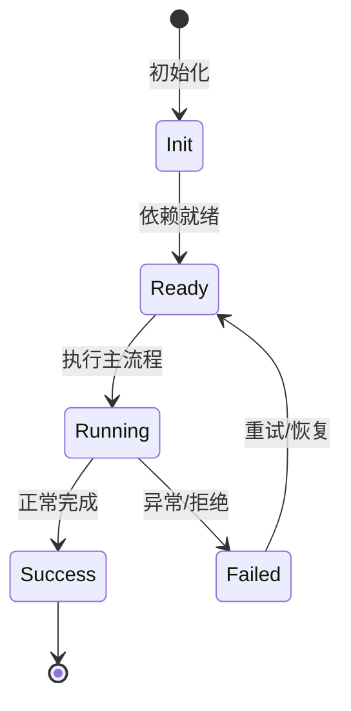

# Skills 系统

Skill 是 Markdown 定义的可复用 playbook，按相关性自动加载到上下文。

## 格式

SKILL.md + YAML frontmatter：`name`、`description`、`whenToUse`、`type`、`disableModelInvocation`。

## 发现

项目、用户、plugin、builtin 多层目录；`FileSkillDiscovery` 扫描。

## 加载

Agent 根据任务相关性自动注入带 origin 标记的 skill 内容。

## 工具

`skill` Feature 提供 skill catalog 和 skill 相关工具。

## 专业实现要点（开发流程视角）

### 需求分析

Feature 是自包含能力单元，必须能整体安装/卸载而不污染其他模块。

### 设计决策

用 `Feature` 基类组合 Service、Tool、Profile、Config、Command 贡献点；静态契约留在静态注册通道。

### 实现步骤

在 `src/features/<name>/` 写领域代码 → 写 `<name>Feature.ts` → 在 `src/index.ts` 精确导入 → 编写测试。

### 验证方式

通过 `test/features/feature.test.ts` 验证装配/卸载；通过 DI 视图观察 unit 状态。

### 维护注意

不要把所有能力塞进一个 Feature；配置段、wire 事件等静态契约必须保持可重放。

## 逐函数实现说明

以下按源码文件列出可验证的导出函数/类，并给出实现职责说明。

### packages/agent-core/src/agent/skill/index.ts

| 类 | 行号 | 声明 | 实现说明 |
| --- | --- | --- | --- |
| `SkillManager` | 15 | `export class SkillManager {` | 该类封装本文模块的核心状态与行为。 |

### packages/agent-core/src/agent/skill/prompt.ts

| 函数 | 行号 | 签名 | 实现说明 |
| --- | --- | --- | --- |
| `renderUserSlashSkillPrompt` | 25 | `export function renderUserSlashSkillPrompt(input: RenderSkillPromptInput): string {` | `renderUserSlashSkillPrompt` 是本文涉及模块中的一个导出函数/类，具体语义以源码实现为准。 |
| `renderModelToolSkillPrompt` | 37 | `export function renderModelToolSkillPrompt(input: RenderModelToolSkillPromptInput): string {` | `renderModelToolSkillPrompt` 是本文涉及模块中的一个导出函数/类，具体语义以源码实现为准。 |
| `renderSkillLoadedBlock` | 45 | `export function renderSkillLoadedBlock(input: RenderSkillLoadedBlockInput): string {` | `renderSkillLoadedBlock` 是本文涉及模块中的一个导出函数/类，具体语义以源码实现为准。 |

### packages/agent-core-v2/src/features/skill/catalog/builtin/builtin.ts

| 函数 | 行号 | 签名 | 实现说明 |
| --- | --- | --- | --- |
| `visibleBuiltinSkills` | 29 | `export function visibleBuiltinSkills(` | `visibleBuiltinSkills` 是本文涉及模块中的一个导出函数/类，具体语义以源码实现为准。 |

### packages/agent-core-v2/src/features/skill/catalog/builtin/registry.ts

| 函数 | 行号 | 签名 | 实现说明 |
| --- | --- | --- | --- |
| `registerBuiltinSkill` | 5 | `export function registerBuiltinSkill(skill: SkillDefinition): void {` | `registerBuiltinSkill` 是本文涉及模块中的一个导出函数/类，具体语义以源码实现为准。 |
| `getBuiltinSkillContributions` | 15 | `export function getBuiltinSkillContributions(): readonly SkillDefinition[] {` | `getBuiltinSkillContributions` 负责读取或查询数据。 |
| `_clearBuiltinSkillContributionsForTests` | 19 | `export function _clearBuiltinSkillContributionsForTests(): void {` | `_clearBuiltinSkillContributionsForTests` 是本文涉及模块中的一个导出函数/类，具体语义以源码实现为准。 |

### packages/agent-core-v2/src/features/skill/catalog/builtinSkillSource.ts

| 类 | 行号 | 声明 | 实现说明 |
| --- | --- | --- | --- |
| `BuiltinSkillSource` | 28 | `export class BuiltinSkillSource extends Disposable implements IBuiltinSkillSource {` | 该类封装本文模块的核心状态与行为。 |

### packages/agent-core-v2/src/features/skill/catalog/configSection.ts

| 函数 | 行号 | 签名 | 实现说明 |
| --- | --- | --- | --- |
| `builtinProductSkillsEnabled` | 56 | `export function builtinProductSkillsEnabled(config: IConfigService): boolean {` | `builtinProductSkillsEnabled` 是本文涉及模块中的一个导出函数/类，具体语义以源码实现为准。 |

### packages/agent-core-v2/src/features/skill/catalog/fileSkillDiscovery.ts

| 函数 | 行号 | 签名 | 实现说明 |
| --- | --- | --- | --- |
| `isSkillScanExcludedEntry` | 13 | `export function isSkillScanExcludedEntry(entryName: string): boolean {` | `isSkillScanExcludedEntry` 是本文涉及模块中的一个导出函数/类，具体语义以源码实现为准。 |
| `discoverFileSkills` | 29 | `export async function discoverFileSkills(` | `discoverFileSkills` 是本文涉及模块中的一个导出函数/类，具体语义以源码实现为准。 |

| 类 | 行号 | 声明 | 实现说明 |
| --- | --- | --- | --- |
| `FileSkillDiscovery` | 17 | `export class FileSkillDiscovery implements ISkillDiscovery {` | 该类封装本文模块的核心状态与行为。 |

### packages/agent-core-v2/src/features/skill/catalog/inMemorySkillDiscovery.ts

| 类 | 行号 | 声明 | 实现说明 |
| --- | --- | --- | --- |
| `InMemorySkillDiscovery` | 9 | `export class InMemorySkillDiscovery implements ISkillDiscovery {` | 该类封装本文模块的核心状态与行为。 |

### packages/agent-core-v2/src/features/skill/catalog/parser.ts

| 函数 | 行号 | 签名 | 实现说明 |
| --- | --- | --- | --- |
| `parseSkillText` | 52 | `export function parseSkillText(options: ParseSkillTextOptions): SkillDefinition {` | `parseSkillText` 是本文涉及模块中的一个导出函数/类，具体语义以源码实现为准。 |
| `parseMermaidFlowchart` | 107 | `export function parseMermaidFlowchart(markdown: string): string \| undefined {` | `parseMermaidFlowchart` 是本文涉及模块中的一个导出函数/类，具体语义以源码实现为准。 |
| `parseD2Flowchart` | 111 | `export function parseD2Flowchart(markdown: string): string \| undefined {` | `parseD2Flowchart` 是本文涉及模块中的一个导出函数/类，具体语义以源码实现为准。 |
| `skillArgumentNames` | 115 | `export function skillArgumentNames(metadata: SkillMetadata): readonly string[] {` | `skillArgumentNames` 是本文涉及模块中的一个导出函数/类，具体语义以源码实现为准。 |

| 类 | 行号 | 声明 | 实现说明 |
| --- | --- | --- | --- |
| `SkillParseError` | 10 | `export class SkillParseError extends Error2 {` | 该类封装本文模块的核心状态与行为。 |
| `UnsupportedSkillTypeError` | 20 | `export class UnsupportedSkillTypeError extends Error2 {` | 该类封装本文模块的核心状态与行为。 |

### packages/agent-core-v2/src/features/skill/catalog/registry.ts

| 类 | 行号 | 声明 | 实现说明 |
| --- | --- | --- | --- |
| `SkillNotFoundError` | 14 | `export class SkillNotFoundError extends Error {` | 该类封装本文模块的核心状态与行为。 |
| `InMemorySkillCatalog` | 24 | `export class InMemorySkillCatalog implements SkillCatalog {` | 该类封装本文模块的核心状态与行为。 |

### packages/agent-core-v2/src/features/skill/catalog/skillRoots.ts

| 函数 | 行号 | 签名 | 实现说明 |
| --- | --- | --- | --- |
| `userRoots` | 17 | `export async function userRoots(` | `userRoots` 是本文涉及模块中的一个导出函数/类，具体语义以源码实现为准。 |
| `projectRoots` | 29 | `export async function projectRoots(` | `projectRoots` 是本文涉及模块中的一个导出函数/类，具体语义以源码实现为准。 |
| `projectSkillRootCandidates` | 46 | `export async function projectSkillRootCandidates(` | `projectSkillRootCandidates` 是本文涉及模块中的一个导出函数/类，具体语义以源码实现为准。 |
| `configuredRoots` | 58 | `export async function configuredRoots(` | `configuredRoots` 是本文涉及模块中的一个导出函数/类，具体语义以源码实现为准。 |

### packages/agent-core-v2/src/features/skill/catalog/types.ts

| 函数 | 行号 | 签名 | 实现说明 |
| --- | --- | --- | --- |
| `normalizeSkillName` | 73 | `export function normalizeSkillName(name: string): string {` | `normalizeSkillName` 是本文涉及模块中的一个导出函数/类，具体语义以源码实现为准。 |
| `isInlineSkillType` | 77 | `export function isInlineSkillType(type: string \| undefined): boolean {` | `isInlineSkillType` 是本文涉及模块中的一个导出函数/类，具体语义以源码实现为准。 |
| `isUserActivatableSkillType` | 81 | `export function isUserActivatableSkillType(type: string \| undefined): boolean {` | `isUserActivatableSkillType` 是本文涉及模块中的一个导出函数/类，具体语义以源码实现为准。 |
| `isSupportedSkillType` | 85 | `export function isSupportedSkillType(type: string \| undefined): boolean {` | `isSupportedSkillType` 是本文涉及模块中的一个导出函数/类，具体语义以源码实现为准。 |
| `summarizeSkill` | 89 | `export function summarizeSkill(skill: SkillDefinition): SkillSummary {` | `summarizeSkill` 是本文涉及模块中的一个导出函数/类，具体语义以源码实现为准。 |

### packages/agent-core-v2/src/features/skill/catalog/userFileSkillSource.ts

| 类 | 行号 | 声明 | 实现说明 |
| --- | --- | --- | --- |
| `UserFileSkillSource` | 24 | `export class UserFileSkillSource extends Disposable implements IUserFileSkillSource {` | 该类封装本文模块的核心状态与行为。 |

### packages/agent-core-v2/src/features/skill/prompt.ts

| 函数 | 行号 | 签名 | 实现说明 |
| --- | --- | --- | --- |
| `promptMetadataTextFromSkill` | 7 | `export function promptMetadataTextFromSkill(input: SkillActivationInput): string \| undefined {` | `promptMetadataTextFromSkill` 是本文涉及模块中的一个导出函数/类，具体语义以源码实现为准。 |
| `renderUserSlashSkillPrompt` | 28 | `export function renderUserSlashSkillPrompt(input: RenderSkillPromptInput): string {` | `renderUserSlashSkillPrompt` 是本文涉及模块中的一个导出函数/类，具体语义以源码实现为准。 |
| `renderModelToolSkillPrompt` | 40 | `export function renderModelToolSkillPrompt(input: RenderModelToolSkillPromptInput): string {` | `renderModelToolSkillPrompt` 是本文涉及模块中的一个导出函数/类，具体语义以源码实现为准。 |
| `renderSkillLoadedBlock` | 48 | `export function renderSkillLoadedBlock(input: RenderSkillLoadedBlockInput): string {` | `renderSkillLoadedBlock` 是本文涉及模块中的一个导出函数/类，具体语义以源码实现为准。 |

### packages/agent-core-v2/src/features/skill/session/skillCatalogData.ts

| 函数 | 行号 | 签名 | 实现说明 |
| --- | --- | --- | --- |
| `sessionSkillCatalogDataSeed` | 18 | `export function sessionSkillCatalogDataSeed(data: ISessionSkillCatalogData): ScopeSeed {` | `sessionSkillCatalogDataSeed` 是本文涉及模块中的一个导出函数/类，具体语义以源码实现为准。 |


## 核心代码片段

以下片段直接从仓库源码截取，用于展示关键实现形态；完整实现请打开对应文件。

### 来自 `packages/agent-core/src/agent/skill/index.ts` 的 `SkillManager`

源码位置：`packages/agent-core/src/agent/skill/index.ts:15` 附近。

```ts
export class SkillManager {
  constructor(
    protected readonly agent: Agent,
    public readonly registry: SkillRegistry,
  ) {}

  activate(input: ActivateSkillPayload): void {
    const skill = this.registry.getSkill(input.name);
    if (skill === undefined) {
      throw new NighthawkError(ErrorCodes.SKILL_NOT_FOUND, `Skill "${input.name}" was not found`);
    }
    if (!isUserActivatableSkillType(skill.metadata.type)) {
      throw new NighthawkError(ErrorCodes.SKILL_TYPE_UNSUPPORTED, `Skill "${skill.name}" cannot be activated by the user`);
    }

    const skillArgs = input.args ?? '';
    const skillContent = this.registry.renderSkillPrompt(skill, skillArgs);
    const wrapped = [
      {
        type: 'text' as const,
        text: renderUserSlashSkillPrompt({
          skillName: skill.name,
          skillArgs,
          skillContent,
// ...
```

### 来自 `packages/agent-core/src/agent/skill/prompt.ts` 的 `renderUserSlashSkillPrompt`

源码位置：`packages/agent-core/src/agent/skill/prompt.ts:25` 附近。

```ts
export function renderUserSlashSkillPrompt(input: RenderSkillPromptInput): string {
  return [
    `User activated the skill "${escapeXml(input.skillName)}". Follow the loaded skill instructions.`,
    '',
    renderSkillLoadedBlock({ ...input, trigger: 'user-slash' }),
  ].join('\n');
}

export interface RenderModelToolSkillPromptInput extends RenderSkillPromptInput {
  readonly trigger: Extract<SkillPromptTrigger, 'model-tool' | 'nested-skill'>;
}

export function renderModelToolSkillPrompt(input: RenderModelToolSkillPromptInput): string {
  return [
    'Skill tool loaded instructions for this request. Follow them.',
    '',
    renderSkillLoadedBlock({ ...input, trigger: input.trigger }),
  ].join('\n');
}

export function renderSkillLoadedBlock(input: RenderSkillLoadedBlockInput): string {
  return [
    `<nighthawk-skill-loaded${renderSkillAttributes(input)}>`,
    input.skillContent,
// ...
```

### 来自 `packages/agent-core-v2/src/features/skill/catalog/builtin/builtin.ts` 的 `visibleBuiltinSkills`

源码位置：`packages/agent-core-v2/src/features/skill/catalog/builtin/builtin.ts:29` 附近。

```ts
export function visibleBuiltinSkills(
  productSkillsEnabled: boolean,
  flags?: IFlagService,
): readonly SkillDefinition[] {
  const all = [...BUILTIN_SKILLS, ...getBuiltinSkillContributions()];
  const visible = productSkillsEnabled
    ? all
    : all.filter((skill) => skill.productSpecific !== true);
  if (flags === undefined) return visible;
  return visible.filter(
    (skill) => skill.experimentalFlag === undefined || flags.enabled(skill.experimentalFlag),
  );
}

export {
  CHECK_NIGHTHAWK_DOCS_SKILL,
  CUSTOM_THEME_SKILL,
  IMPORT_FROM_CC_CODEX_SKILL,
  MCP_CONFIG_SKILL,
  SUB_SKILL_CONSOLIDATE,
  SUB_SKILL_PARENT,
  SUB_SKILL_REVIEW,
  UPDATE_CONFIG_SKILL,
  WRITE_GOAL_SKILL,
// ...
```


## 时序/状态图



> 图注：`04-features/skills.md` 的抽象流程；具体参与者与状态以源码和上文函数说明为准。

## 核心实现细节（源码导出）

以下是本文涉及路径中的真实源码导出/结构，帮助你把概念映射到函数、类与方法：

  - `docs/interview/skill-system.md`（非 TS 源码，可直接阅读）
  - `packages/agent-core/src/agent/skill//` 目录下源码文件示例：
    - `packages/agent-core/src/agent/skill/index.ts`
    - `packages/agent-core/src/agent/skill/prompt.ts`
    - `packages/agent-core/src/agent/skill/types.ts`
  - `packages/agent-core-v2/src/features/skill//` 目录下源码文件示例：
    - `packages/agent-core-v2/src/features/skill/catalog/builtin/builtin.ts`
    - `packages/agent-core-v2/src/features/skill/catalog/builtin/check-nighthawk-docs.ts`
    - `packages/agent-core-v2/src/features/skill/catalog/builtin/custom-theme.ts`
    - `packages/agent-core-v2/src/features/skill/catalog/builtin/import-from-cc-codex.ts`
    - `packages/agent-core-v2/src/features/skill/catalog/builtin/mcp-config.ts`
    - `packages/agent-core-v2/src/features/skill/catalog/builtin/registry.ts`
    - `packages/agent-core-v2/src/features/skill/catalog/builtin/sub-skill.ts`
    - `packages/agent-core-v2/src/features/skill/catalog/builtin/update-config.ts`
    - `packages/agent-core-v2/src/features/skill/catalog/builtin/write-goal.ts`
    - `packages/agent-core-v2/src/features/skill/catalog/builtinSkillSource.ts`
    - `packages/agent-core-v2/src/features/skill/catalog/configSection.ts`
    - `packages/agent-core-v2/src/features/skill/catalog/errors.ts`
    - `packages/agent-core-v2/src/features/skill/catalog/fileSkillDiscovery.ts`
    - `packages/agent-core-v2/src/features/skill/catalog/inMemorySkillDiscovery.ts`
    - `packages/agent-core-v2/src/features/skill/catalog/parser.ts`
    - `packages/agent-core-v2/src/features/skill/catalog/registry.ts`
    - `packages/agent-core-v2/src/features/skill/catalog/skillDiscovery.ts`
    - `packages/agent-core-v2/src/features/skill/catalog/skillRoots.ts`
    - `packages/agent-core-v2/src/features/skill/catalog/skillSource.ts`
    - `packages/agent-core-v2/src/features/skill/catalog/types.ts`
    - `packages/agent-core-v2/src/features/skill/catalog/userFileSkillSource.ts`
    - `packages/agent-core-v2/src/features/skill/prompt.ts`
    - `packages/agent-core-v2/src/features/skill/session/skillCatalog.ts`
    - `packages/agent-core-v2/src/features/skill/session/skillCatalogData.ts`

## 证据与代码位置

- `docs/interview/skill-system.md`
- `packages/agent-core/src/agent/skill/`
- `packages/agent-core-v2/src/features/skill/`

> 本文所有路径均相对仓库根目录；引用内容以仓库当前 `HEAD` 为准。
