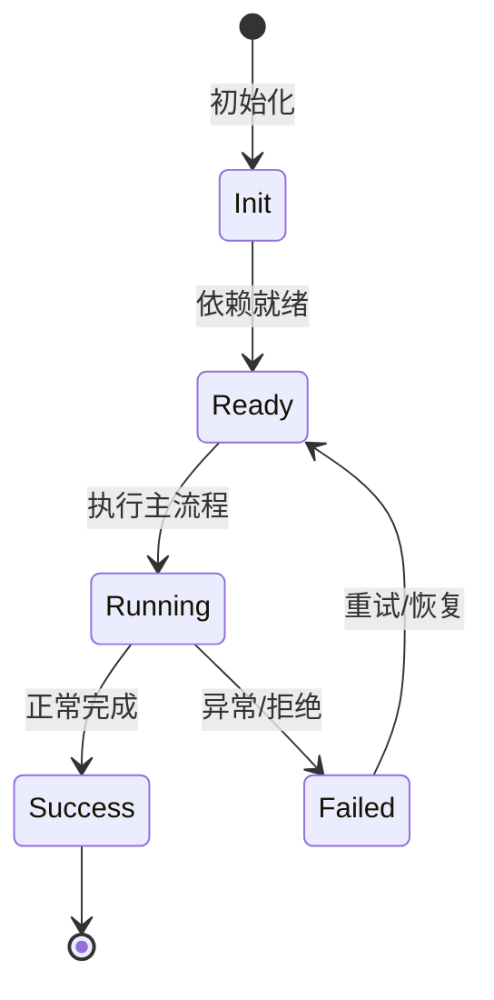

# 子 Agent 与后台任务

子 Agent 在独立上下文窗口并行工作，不污染主上下文。

## 工具

`agent` 工具可 fork 子 agent；`ask-user-question`、后台任务等配合。

## 生命周期

子 agent 是 session 下的 Agent scope，有独立 contextMemory 和 transcript。

## 并行

`AgentSwarm` 可以批量扇出，当前 swarm 上限较高（代码中曾有 cap 提升到 2000）。

## 状态

子 agent 完成/失败后把结果带回主 agent。

## 专业实现要点（开发流程视角）

### 需求分析

Feature 是自包含能力单元，必须能整体安装/卸载而不污染其他模块。

### 设计决策

用 `Feature` 基类组合 Service、Tool、Profile、Config、Command 贡献点；静态契约留在静态注册通道。

### 实现步骤

在 `src/features/<name>/` 写领域代码 → 写 `<name>Feature.ts` → 在 `src/index.ts` 精确导入 → 编写测试。

### 验证方式

通过 `test/features/feature.test.ts` 验证装配/卸载；通过 DI 视图观察 unit 状态。

### 维护注意

不要把所有能力塞进一个 Feature；配置段、wire 事件等静态契约必须保持可重放。

## 逐函数实现说明

以下按源码文件列出可验证的导出函数/类，并给出实现职责说明。

### packages/agent-core/src/agent/swarm/index.ts

| 类 | 行号 | 声明 | 实现说明 |
| --- | --- | --- | --- |
| `SwarmMode` | 13 | `export class SwarmMode {` | 该类封装本文模块的核心状态与行为。 |

### packages/agent-core-v2/src/agent/tools/agent/agentTool.ts

| 类 | 行号 | 声明 | 实现说明 |
| --- | --- | --- | --- |
| `SubagentTool` | 82 | `export class SubagentTool implements ISubagentTool {` | 该类封装本文模块的核心状态与行为。 |

### packages/agent-core-v2/src/agent/tools/agent/subagent-task.ts

| 函数 | 行号 | 签名 | 实现说明 |
| --- | --- | --- | --- |
| `createSubagentExecutor` | 43 | `export function createSubagentExecutor(` | `createSubagentExecutor` 负责创建/构建相关对象或流程。 |

| 类 | 行号 | 声明 | 实现说明 |
| --- | --- | --- | --- |
| `SubagentTask` | 72 | `export class SubagentTask implements AgentTask {` | 该类封装本文模块的核心状态与行为。 |

### packages/agent-core-v2/src/features/swarm/agent/injection/swarmInjection.ts

| 类 | 行号 | 声明 | 实现说明 |
| --- | --- | --- | --- |
| `SwarmInjection` | 25 | `export class SwarmInjection extends Disposable {` | 该类封装本文模块的核心状态与行为。 |

### packages/agent-core-v2/src/features/swarm/agent/swarmService.ts

| 类 | 行号 | 声明 | 实现说明 |
| --- | --- | --- | --- |
| `AgentSwarmService` | 17 | `export class AgentSwarmService extends Service implements IAgentSwarmService {` | 该类封装本文模块的核心状态与行为。 |

### packages/agent-core-v2/src/features/swarm/configSection.ts

| 函数 | 行号 | 签名 | 实现说明 |
| --- | --- | --- | --- |
| `resolveSwarmTimeoutMs` | 40 | `export function resolveSwarmTimeoutMs(config: IConfigService): number {` | `resolveSwarmTimeoutMs` 是本文涉及模块中的一个导出函数/类，具体语义以源码实现为准。 |

### packages/agent-core-v2/src/features/swarm/session/agentRunBatch.ts

| 函数 | 行号 | 签名 | 实现说明 |
| --- | --- | --- | --- |
| `resolveSwarmMaxConcurrency` | 631 | `export function resolveSwarmMaxConcurrency(` | `resolveSwarmMaxConcurrency` 是本文涉及模块中的一个导出函数/类，具体语义以源码实现为准。 |

| 类 | 行号 | 声明 | 实现说明 |
| --- | --- | --- | --- |
| `AgentRunBatch` | 97 | `export class AgentRunBatch<T> {` | 该类封装本文模块的核心状态与行为。 |

### packages/agent-core-v2/src/features/swarm/session/sessionSwarmService.ts

| 类 | 行号 | 声明 | 实现说明 |
| --- | --- | --- | --- |
| `SubagentSuspended` | 42 | `export class SubagentSuspended extends Event2<SubagentSuspendedPayload> {` | 该类封装本文模块的核心状态与行为。 |
| `SessionSwarmService` | 50 | `export class SessionSwarmService implements ISessionSwarmService {` | 该类封装本文模块的核心状态与行为。 |

### packages/agent-core-v2/src/features/swarm/swarmFeature.ts

| 类 | 行号 | 声明 | 实现说明 |
| --- | --- | --- | --- |
| `SwarmFeature` | 13 | `export class SwarmFeature extends Feature {` | 该类封装本文模块的核心状态与行为。 |

### packages/agent-core-v2/src/features/swarm/swarmOps.ts

| 类 | 行号 | 声明 | 实现说明 |
| --- | --- | --- | --- |
| `SwarmModeEnter` | 16 | `export class SwarmModeEnter extends AgentEvent2<z.infer<typeof swarmModeEnterSchema>> {` | 该类封装本文模块的核心状态与行为。 |
| `SwarmModeExit` | 28 | `export class SwarmModeExit extends AgentEvent2<z.infer<typeof swarmModeExitSchema>> {` | 该类封装本文模块的核心状态与行为。 |

### packages/agent-core-v2/src/features/swarm/tools/agent-swarm/agentSwarmTool.ts

| 类 | 行号 | 声明 | 实现说明 |
| --- | --- | --- | --- |
| `AgentSwarmTool` | 71 | `export class AgentSwarmTool implements IAgentSwarmTool {` | 该类封装本文模块的核心状态与行为。 |


## 核心代码片段

以下片段直接从仓库源码截取，用于展示关键实现形态；完整实现请打开对应文件。

### 来自 `packages/agent-core/src/agent/swarm/index.ts` 的 `SwarmMode`

源码位置：`packages/agent-core/src/agent/swarm/index.ts:13` 附近。

```ts
export class SwarmMode {
  protected active: SwarmModeTrigger | null = null;

  constructor(protected readonly agent: Agent) {}

  enter(trigger: SwarmModeTrigger): void {
    if (this.active !== null) return;
    this.agent.records.logRecord({ type: 'swarm_mode.enter', trigger });
    this.active = trigger;
    if (trigger !== 'tool') {
      this.agent.context.appendSystemReminder(SWARM_MODE_ENTER_REMINDER, {
        kind: 'injection',
        variant: 'swarm_mode',
      });
    }
    this.agent.emitStatusUpdated();
  }

  restoreEnter(trigger: SwarmModeTrigger): void {
    this.active = trigger;
  }

  exit(): void {
    if (this.active === null) return;
// ...
```

### 来自 `packages/agent-core-v2/src/agent/tools/agent/agentTool.ts` 的 `SubagentTool`

源码位置：`packages/agent-core-v2/src/agent/tools/agent/agentTool.ts:82` 附近。

```ts
export class SubagentTool implements ISubagentTool {
  declare readonly _serviceBrand: undefined;
  readonly name: string = 'Agent';

  get parameters(): Record<string, unknown> {
    const parameters = exposesSubagentModelChoice(this.config, this.flags)
      ? SUBAGENT_TOOL_PARAMETERS
      : SUBAGENT_TOOL_PARAMETERS_NO_MODEL;
    return this.flags.enabled(SUBAGENT_FORK_FLAG_ID)
      ? parameters
      : stripSubagentForkParameter(parameters);
  }

  private readonly callerAgentId: string;
  private readonly canRunInBackground: () => boolean;
  private catalogReady = false;
  private frozenCatalogProfiles: readonly AgentProfile[] | undefined;

  constructor(
    @IAgentLifecycleService private readonly agentLifecycle: IAgentLifecycleService,
    @ISessionSubagentService private readonly subagents: ISessionSubagentService,
    @ISessionAgentProfileCatalog private readonly catalog: ISessionAgentProfileCatalog,
    @IAgentScopeContext scopeContext: IAgentScopeContext,
    @IAgentTaskService private readonly tasks: IAgentTaskService,
// ...
```

### 来自 `packages/agent-core-v2/src/agent/tools/agent/subagent-task.ts` 的 `createSubagentExecutor`

源码位置：`packages/agent-core-v2/src/agent/tools/agent/subagent-task.ts:43` 附近。

```ts
export function createSubagentExecutor(
  handle: SubagentHandle,
  abortController: AbortController,
): (signal: AbortSignal, output: (data: string) => void) => Promise<SubagentCompletion> {
  return async (signal, output) => {
    const requestAbort = (): void => {
      abortController.abort(signal.reason);
    };
    if (signal.aborted) {
      requestAbort();
    } else {
      signal.addEventListener('abort', requestAbort, { once: true });
    }

    try {
      const outcome = await handle.completion;
      output(outcome.result);
      return outcome;
    } catch (error: unknown) {
      if (signal.aborted && (isAbortError(error) || error === signal.reason)) {
        throw error;
      }
      throw error;
    } finally {
// ...
```


## 时序/状态图



> 图注：`04-features/subagents.md` 的抽象流程；具体参与者与状态以源码和上文函数说明为准。

## 核心实现细节（源码导出）

以下是本文涉及路径中的真实源码导出/结构，帮助你把概念映射到函数、类与方法：

  - `packages/agent-core/src/agent/swarm//` 目录下源码文件示例：
    - `packages/agent-core/src/agent/swarm/index.ts`
  - `packages/agent-core-v2/src/agent/tools/agent//` 目录下源码文件示例：
    - `packages/agent-core-v2/src/agent/tools/agent/agent.ts`
    - `packages/agent-core-v2/src/agent/tools/agent/agentTool.ts`
    - `packages/agent-core-v2/src/agent/tools/agent/subagent-task.ts`
  - `packages/agent-core-v2/src/features/swarm//` 目录下源码文件示例：
    - `packages/agent-core-v2/src/features/swarm/agent/injection/swarmInjection.ts`
    - `packages/agent-core-v2/src/features/swarm/agent/swarm.ts`
    - `packages/agent-core-v2/src/features/swarm/agent/swarmService.ts`
    - `packages/agent-core-v2/src/features/swarm/configSection.ts`
    - `packages/agent-core-v2/src/features/swarm/session/agentRunBatch.ts`
    - `packages/agent-core-v2/src/features/swarm/session/sessionSwarm.ts`
    - `packages/agent-core-v2/src/features/swarm/session/sessionSwarmService.ts`
    - `packages/agent-core-v2/src/features/swarm/swarmFeature.ts`
    - `packages/agent-core-v2/src/features/swarm/swarmOps.ts`
    - `packages/agent-core-v2/src/features/swarm/tools/agent-swarm/agent-swarm.ts`
    - `packages/agent-core-v2/src/features/swarm/tools/agent-swarm/agentSwarmTool.ts`

## 证据与代码位置

- `packages/agent-core/src/agent/swarm/`
- `packages/agent-core-v2/src/agent/tools/agent/`
- `packages/agent-core-v2/src/features/swarm/`

> 本文所有路径均相对仓库根目录；引用内容以仓库当前 `HEAD` 为准。
