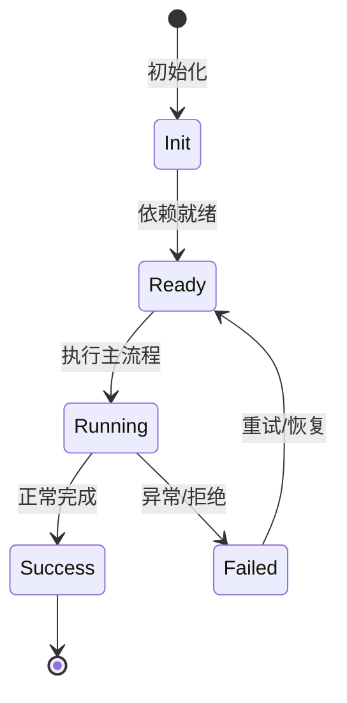

# Tower 模式

Tower 是一个面向 tower-worker 的编排模式，包含协议存储、限流和 11 个 Tower 工具。

## 实现

Feature `tower` 位于 `packages/agent-core-v2/src/features/tower/`，有 `towerService`、`towerRateLimit`、`workerProfile`。

## 模式注入

tower-mode service 带 reminders，承载编排 manual。

## 工具

Tower* 工具集（共 11 个）。

## 用途

批量/worker 型自动化任务编排。

## 专业实现要点（开发流程视角）

### 需求分析

Feature 是自包含能力单元，必须能整体安装/卸载而不污染其他模块。

### 设计决策

用 `Feature` 基类组合 Service、Tool、Profile、Config、Command 贡献点；静态契约留在静态注册通道。

### 实现步骤

在 `src/features/<name>/` 写领域代码 → 写 `<name>Feature.ts` → 在 `src/index.ts` 精确导入 → 编写测试。

### 验证方式

通过 `test/features/feature.test.ts` 验证装配/卸载；通过 DI 视图观察 unit 状态。

### 维护注意

不要把所有能力塞进一个 Feature；配置段、wire 事件等静态契约必须保持可重放。

## 逐函数实现说明

以下按源码文件列出可验证的导出函数/类，并给出实现职责说明。

### packages/agent-core-v2/src/features/tower/injection/towerModeInjection.ts

| 类 | 行号 | 声明 | 实现说明 |
| --- | --- | --- | --- |
| `TowerModeInjection` | 16 | `export class TowerModeInjection extends Service {` | 该类封装本文模块的核心状态与行为。 |

### packages/agent-core-v2/src/features/tower/protocol/frontmatter.ts

| 函数 | 行号 | 签名 | 实现说明 |
| --- | --- | --- | --- |
| `renderFrontmatter` | 3 | `export function renderFrontmatter(fields: Readonly<Record<string, string>>): string {` | `renderFrontmatter` 是本文涉及模块中的一个导出函数/类，具体语义以源码实现为准。 |
| `parseFrontmatter` | 15 | `export function parseFrontmatter(text: string): {` | `parseFrontmatter` 是本文涉及模块中的一个导出函数/类，具体语义以源码实现为准。 |

### packages/agent-core-v2/src/features/tower/protocol/git.ts

| 函数 | 行号 | 签名 | 实现说明 |
| --- | --- | --- | --- |
| `git` | 15 | `export async function git(cwd: string, args: readonly string[]): Promise<string> {` | `git` 是本文涉及模块中的一个导出函数/类，具体语义以源码实现为准。 |
| `tryGit` | 33 | `export async function tryGit(cwd: string, args: readonly string[]): Promise<string \| null> {` | `tryGit` 是本文涉及模块中的一个导出函数/类，具体语义以源码实现为准。 |
| `isInsideRepo` | 41 | `export async function isInsideRepo(cwd: string): Promise<boolean> {` | `isInsideRepo` 是本文涉及模块中的一个导出函数/类，具体语义以源码实现为准。 |
| `hasAnyCommit` | 45 | `export async function hasAnyCommit(cwd: string): Promise<boolean> {` | `hasAnyCommit` 是本文涉及模块中的一个导出函数/类，具体语义以源码实现为准。 |
| `currentBranch` | 49 | `export async function currentBranch(cwd: string): Promise<string> {` | `currentBranch` 是本文涉及模块中的一个导出函数/类，具体语义以源码实现为准。 |
| `branchTip` | 55 | `export async function branchTip(cwd: string, ref: string): Promise<string> {` | `branchTip` 是本文涉及模块中的一个导出函数/类，具体语义以源码实现为准。 |
| `branchExists` | 59 | `export async function branchExists(cwd: string, branch: string): Promise<boolean> {` | `branchExists` 是本文涉及模块中的一个导出函数/类，具体语义以源码实现为准。 |
| `worktreeAdd` | 65 | `export async function worktreeAdd(` | `worktreeAdd` 是本文涉及模块中的一个导出函数/类，具体语义以源码实现为准。 |
| `worktreeRemove` | 83 | `export async function worktreeRemove(cwd: string, path: string): Promise<void> {` | `worktreeRemove` 是本文涉及模块中的一个导出函数/类，具体语义以源码实现为准。 |
| `isWorktreeDirty` | 87 | `export async function isWorktreeDirty(path: string): Promise<boolean> {` | `isWorktreeDirty` 是本文涉及模块中的一个导出函数/类，具体语义以源码实现为准。 |
| `mergeNoFf` | 92 | `export async function mergeNoFf(cwd: string, branch: string): Promise<string> {` | `mergeNoFf` 是本文涉及模块中的一个导出函数/类，具体语义以源码实现为准。 |
| `diffNameOnly` | 98 | `export async function diffNameOnly(` | `diffNameOnly` 是本文涉及模块中的一个导出函数/类，具体语义以源码实现为准。 |

| 类 | 行号 | 声明 | 实现说明 |
| --- | --- | --- | --- |
| `GitError` | 5 | `export class GitError extends Error {` | 该类封装本文模块的核心状态与行为。 |

### packages/agent-core-v2/src/features/tower/protocol/paths.ts

| 函数 | 行号 | 签名 | 实现说明 |
| --- | --- | --- | --- |
| `dateStamp` | 18 | `export function dateStamp(now = new Date()): string {` | `dateStamp` 是本文涉及模块中的一个导出函数/类，具体语义以源码实现为准。 |
| `dateDash` | 26 | `export function dateDash(now = new Date()): string {` | `dateDash` 是本文涉及模块中的一个导出函数/类，具体语义以源码实现为准。 |
| `slugify` | 35 | `export function slugify(text: string, maxLength = 60): string {` | `slugify` 是本文涉及模块中的一个导出函数/类，具体语义以源码实现为准。 |
| `targetSlug` | 46 | `export function targetSlug(target: string): string {` | `targetSlug` 是本文涉及模块中的一个导出函数/类，具体语义以源码实现为准。 |
| `inboxFileName` | 51 | `export function inboxFileName(input: {` | `inboxFileName` 是本文涉及模块中的一个导出函数/类，具体语义以源码实现为准。 |
| `findingFileName` | 60 | `export function findingFileName(input: {` | `findingFileName` 是本文涉及模块中的一个导出函数/类，具体语义以源码实现为准。 |
| `reviewFileName` | 69 | `export function reviewFileName(input: {` | `reviewFileName` 是本文涉及模块中的一个导出函数/类，具体语义以源码实现为准。 |
| `missionFileName` | 77 | `export function missionFileName(id: string, slug: string): string {` | `missionFileName` 是本文涉及模块中的一个导出函数/类，具体语义以源码实现为准。 |

### packages/agent-core-v2/src/features/tower/protocol/repoRoot.ts

| 函数 | 行号 | 签名 | 实现说明 |
| --- | --- | --- | --- |
| `resolveTowerRepoRoot` | 3 | `export function resolveTowerRepoRoot(cwd: string): string {` | `resolveTowerRepoRoot` 是本文涉及模块中的一个导出函数/类，具体语义以源码实现为准。 |

### packages/agent-core-v2/src/features/tower/protocol/store.ts

| 类 | 行号 | 声明 | 实现说明 |
| --- | --- | --- | --- |
| `TowerProtocolError` | 53 | `export class TowerProtocolError extends Error {` | 该类封装本文模块的核心状态与行为。 |
| `TowerStore` | 150 | `export class TowerStore {` | 该类封装本文模块的核心状态与行为。 |

### packages/agent-core-v2/src/features/tower/tools/finding/findingTool.ts

| 类 | 行号 | 声明 | 实现说明 |
| --- | --- | --- | --- |
| `TowerFindingTool` | 14 | `export class TowerFindingTool implements ITowerFindingTool {` | 该类封装本文模块的核心状态与行为。 |

### packages/agent-core-v2/src/features/tower/tools/inbox/inboxTool.ts

| 类 | 行号 | 声明 | 实现说明 |
| --- | --- | --- | --- |
| `TowerInboxTool` | 12 | `export class TowerInboxTool implements ITowerInboxTool {` | 该类封装本文模块的核心状态与行为。 |

### packages/agent-core-v2/src/features/tower/tools/init/initTool.ts

| 类 | 行号 | 声明 | 实现说明 |
| --- | --- | --- | --- |
| `TowerInitTool` | 14 | `export class TowerInitTool implements ITowerInitTool {` | 该类封装本文模块的核心状态与行为。 |

### packages/agent-core-v2/src/features/tower/tools/merge/mergeTool.ts

| 类 | 行号 | 声明 | 实现说明 |
| --- | --- | --- | --- |
| `TowerMergeTool` | 11 | `export class TowerMergeTool implements ITowerMergeTool {` | 该类封装本文模块的核心状态与行为。 |

### packages/agent-core-v2/src/features/tower/tools/mission/missionTool.ts

| 类 | 行号 | 声明 | 实现说明 |
| --- | --- | --- | --- |
| `TowerMissionTool` | 19 | `export class TowerMissionTool implements ITowerMissionTool {` | 该类封装本文模块的核心状态与行为。 |

### packages/agent-core-v2/src/features/tower/tools/plan/planTool.ts

| 类 | 行号 | 声明 | 实现说明 |
| --- | --- | --- | --- |
| `TowerPlanTool` | 12 | `export class TowerPlanTool implements ITowerPlanTool {` | 该类封装本文模块的核心状态与行为。 |

### packages/agent-core-v2/src/features/tower/tools/review/reviewTool.ts

| 类 | 行号 | 声明 | 实现说明 |
| --- | --- | --- | --- |
| `TowerReviewTool` | 14 | `export class TowerReviewTool implements ITowerReviewTool {` | 该类封装本文模块的核心状态与行为。 |


## 核心代码片段

以下片段直接从仓库源码截取，用于展示关键实现形态；完整实现请打开对应文件。

### 来自 `packages/agent-core-v2/src/features/tower/injection/towerModeInjection.ts` 的 `TowerModeInjection`

源码位置：`packages/agent-core-v2/src/features/tower/injection/towerModeInjection.ts:16` 附近。

```ts
export class TowerModeInjection extends Service {
  constructor(
    @IAgentContextInjectorService injector: IAgentContextInjectorService,
    @IAgentTowerService private readonly tower: IAgentTowerService,
    @IAgentContextMemoryService private readonly context: IAgentContextMemoryService,
    @IFlagService private readonly flags: IFlagService,
  ) {
    super();
    this._register(
      injector.register<typeof TOWER_MODE_EXIT_DISCLOSURE>(
        TOWER_MODE_INJECTION_VARIANT,
        ({ injectedPositions, lastInjectedAt: injectedAt, lastDisclosure }) => {
          if (!this.tower.isActive) {
            if (injectedPositions.length === 0 || lastDisclosure === TOWER_MODE_EXIT_DISCLOSURE) {
              return undefined;
            }
            return { content: TOWER_MODE_EXIT_REMINDER, disclosure: TOWER_MODE_EXIT_DISCLOSURE };
          }
          if (!this.flags.enabled(TOWER_FLAG_ID)) return undefined;
          if (injectedPositions.length === 0 || lastDisclosure === TOWER_MODE_EXIT_DISCLOSURE) {
            return TOWER_MODE_FULL_REMINDER;
          }
          const variant = towerModeReminderVariant(injectedAt, this.context.get());
          if (variant === 'full') return TOWER_MODE_FULL_REMINDER;
// ...
```

### 来自 `packages/agent-core-v2/src/features/tower/protocol/frontmatter.ts` 的 `renderFrontmatter`

源码位置：`packages/agent-core-v2/src/features/tower/protocol/frontmatter.ts:3` 附近。

```ts
export function renderFrontmatter(fields: Readonly<Record<string, string>>): string {
  const lines = [FENCE];
  for (const [key, value] of Object.entries(fields)) {
    if (/[\r\n]/.test(value)) {
      throw new Error(`frontmatter value for "${key}" must be single-line`);
    }
    lines.push(`${key}: ${value}`);
  }
  lines.push(FENCE);
  return lines.join('\n');
}

export function parseFrontmatter(text: string): {
  readonly fields: Record<string, string>;
  readonly body: string;
} {
  const lines = text.split(/\r?\n/);
  if (lines[0]?.trim() !== FENCE) return { fields: {}, body: text };
  const close = lines.findIndex((line, index) => index > 0 && line.trim() === FENCE);
  if (close === -1) return { fields: {}, body: text };

  const fields: Record<string, string> = {};
  for (const line of lines.slice(1, close)) {
    const separator = line.indexOf(':');
// ...
```

### 来自 `packages/agent-core-v2/src/features/tower/protocol/git.ts` 的 `git`

源码位置：`packages/agent-core-v2/src/features/tower/protocol/git.ts:15` 附近。

```ts
export async function git(cwd: string, args: readonly string[]): Promise<string> {
  return new Promise((resolve, reject) => {
    execFile(
      'git',
      [...args],
      { cwd, timeout: GIT_TIMEOUT_MS, maxBuffer: 16 * 1024 * 1024 },
      (error, stdout, stderr) => {
        if (error !== null) {
          reject(new GitError(args, stderr || error.message));
          return;
        }
        resolve(stdout.trimEnd());
      },
    );
  });
}
```


## 时序/状态图



> 图注：`04-features/tower.md` 的抽象流程；具体参与者与状态以源码和上文函数说明为准。

## 核心实现细节（源码导出）

以下是本文涉及路径中的真实源码导出/结构，帮助你把概念映射到函数、类与方法：

  - `packages/agent-core-v2/src/features/tower//` 目录下源码文件示例：
    - `packages/agent-core-v2/src/features/tower/flag.ts`
    - `packages/agent-core-v2/src/features/tower/injection/towerModeInjection.ts`
    - `packages/agent-core-v2/src/features/tower/protocol/frontmatter.ts`
    - `packages/agent-core-v2/src/features/tower/protocol/git.ts`
    - `packages/agent-core-v2/src/features/tower/protocol/index.ts`
    - `packages/agent-core-v2/src/features/tower/protocol/paths.ts`
    - `packages/agent-core-v2/src/features/tower/protocol/repoRoot.ts`
    - `packages/agent-core-v2/src/features/tower/protocol/store.ts`
    - `packages/agent-core-v2/src/features/tower/protocol/types.ts`
    - `packages/agent-core-v2/src/features/tower/tools/finding/finding.ts`
    - `packages/agent-core-v2/src/features/tower/tools/finding/findingTool.ts`
    - `packages/agent-core-v2/src/features/tower/tools/inbox/inbox.ts`
    - `packages/agent-core-v2/src/features/tower/tools/inbox/inboxTool.ts`
    - `packages/agent-core-v2/src/features/tower/tools/init/init.ts`
    - `packages/agent-core-v2/src/features/tower/tools/init/initTool.ts`
    - `packages/agent-core-v2/src/features/tower/tools/merge/merge.ts`
    - `packages/agent-core-v2/src/features/tower/tools/merge/mergeTool.ts`
    - `packages/agent-core-v2/src/features/tower/tools/mission/mission.ts`
    - `packages/agent-core-v2/src/features/tower/tools/mission/missionTool.ts`
    - `packages/agent-core-v2/src/features/tower/tools/plan/plan.ts`
    - `packages/agent-core-v2/src/features/tower/tools/plan/planTool.ts`
    - `packages/agent-core-v2/src/features/tower/tools/review/review.ts`
    - `packages/agent-core-v2/src/features/tower/tools/review/reviewTool.ts`
    - `packages/agent-core-v2/src/features/tower/tools/send/send.ts`
  - `packages/agent-core-v2/src/features/tower/flag.ts`：
    - 导出签名/声明：
      - `export const TOWER_FLAG_ENV = 'NIGHTHAWK_EXPERIMENTAL_TOWER';`
      - `export const towerFlag: FlagDefinitionInput = {`

## 证据与代码位置

- `packages/agent-core-v2/src/features/tower/`
- `packages/agent-core-v2/src/features/tower/flag.ts`

> 本文所有路径均相对仓库根目录；引用内容以仓库当前 `HEAD` 为准。
