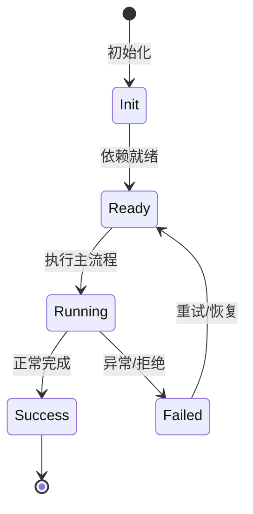

# DepAudit 依赖审计

DepAudit 解析依赖清单，离线标记已知风险，并可查询 OSV 或调用宿主机审计工具。

## 清单

package.json、requirements.txt、go.mod。

## 离线检查

KNOWN_RISKS 内置列表、loose range、http registry、postinstall 远程脚本、Go pseudo-version。

## OSV

`osv-client.ts` 查询 OSV API。

## 外部

`useExternal: true` 运行 npm audit / pnpm audit / pip-audit 等。

## 专业实现要点（开发流程视角）

### 需求分析

安全工具要能作为 Agent 工具被调用，也要能被脚本/CI 使用。

### 设计决策

规则用模板数组声明，统一 CWE/OWASP/严重度/修复建议；扫描用 Kaos 抽象文件系统，便于远程执行。

### 实现步骤

定义规则 → 实现扫描引擎 → 包装为 BuiltinTool → 加缓存/SARIF/冒烟测试。

### 验证方式

运行 `node scripts/smoke-security.ts`，用已知漏洞样本验证 SecurityScan/SecretScan/TaintTrace/DepAudit。

### 维护注意

新规则要覆盖多语言、提供中英文修复建议，并考虑误报率。

## 逐函数实现说明

以下按源码文件列出可验证的导出函数/类，并给出实现职责说明。

### packages/agent-core/src/tools/builtin/security/dep-audit.ts

| 函数 | 行号 | 签名 | 实现说明 |
| --- | --- | --- | --- |
| `collectDependencyManifests` | 102 | `export async function collectDependencyManifests(kaos: Kaos, root: string): Promise<DepAuditManifest[]> {` | `collectDependencyManifests` 是本文涉及模块中的一个导出函数/类，具体语义以源码实现为准。 |
| `parsePackageJson` | 119 | `export function parsePackageJson(manifestPath: string, content: string): DepAuditFinding[] {` | `parsePackageJson` 是本文涉及模块中的一个导出函数/类，具体语义以源码实现为准。 |
| `parseRequirementsTxt` | 184 | `export function parseRequirementsTxt(content: string): DepAuditFinding[] {` | `parseRequirementsTxt` 是本文涉及模块中的一个导出函数/类，具体语义以源码实现为准。 |
| `parseGoMod` | 207 | `export function parseGoMod(content: string): DepAuditFinding[] {` | `parseGoMod` 是本文涉及模块中的一个导出函数/类，具体语义以源码实现为准。 |
| `detectPackageManager` | 250 | `export async function detectPackageManager(kaos: Kaos, root: string): Promise<LockFileInfo \| undefined> {` | `detectPackageManager` 是本文涉及模块中的一个导出函数/类，具体语义以源码实现为准。 |
| `parseNpmAuditJson` | 274 | `export function parseNpmAuditJson(` | `parseNpmAuditJson` 是本文涉及模块中的一个导出函数/类，具体语义以源码实现为准。 |
| `parsePipAuditJson` | 318 | `export function parsePipAuditJson(raw: string): DepAuditFinding[] {` | `parsePipAuditJson` 是本文涉及模块中的一个导出函数/类，具体语义以源码实现为准。 |
| `depFindingToNormalized` | 550 | `export function depFindingToNormalized(f: DepAuditFinding): NormalizedFinding {` | `depFindingToNormalized` 是本文涉及模块中的一个导出函数/类，具体语义以源码实现为准。 |

| 类 | 行号 | 声明 | 实现说明 |
| --- | --- | --- | --- |
| `DepAuditTool` | 356 | `export class DepAuditTool implements BuiltinTool<DepAuditInput> {` | 该类封装本文模块的核心状态与行为。 |

### packages/agent-core/src/tools/builtin/security/osv-client.ts

| 函数 | 行号 | 签名 | 实现说明 |
| --- | --- | --- | --- |
| `mapEcosystem` | 47 | `export function mapEcosystem(ecosystem: 'npm' \| 'pip' \| 'go'): 'npm' \| 'PyPI' \| 'Go' {` | `mapEcosystem` 是本文涉及模块中的一个导出函数/类，具体语义以源码实现为准。 |
| `extractFixedVersion` | 58 | `export function extractFixedVersion(` | `extractFixedVersion` 是本文涉及模块中的一个导出函数/类，具体语义以源码实现为准。 |
| `extractCvssScore` | 77 | `export function extractCvssScore(vuln: OsvVulnerability): number \| undefined {` | `extractCvssScore` 是本文涉及模块中的一个导出函数/类，具体语义以源码实现为准。 |
| `createOsvClient` | 101 | `export function createOsvClient(fetchFn: FetchFn, options?: OsvClientOptions): OsvClient {` | `createOsvClient` 负责创建/构建相关对象或流程。 |


## 核心代码片段

以下片段直接从仓库源码截取，用于展示关键实现形态；完整实现请打开对应文件。

### 来自 `packages/agent-core/src/tools/builtin/security/dep-audit.ts` 的 `collectDependencyManifests`

源码位置：`packages/agent-core/src/tools/builtin/security/dep-audit.ts:102` 附近。

```ts
export async function collectDependencyManifests(kaos: Kaos, root: string): Promise<DepAuditManifest[]> {
  const manifests: DepAuditManifest[] = [];
  for (const candidate of [
    { path: join(root, 'package.json'), ecosystem: 'npm' as const },
    { path: join(root, 'requirements.txt'), ecosystem: 'pip' as const },
    { path: join(root, 'go.mod'), ecosystem: 'go' as const },
  ]) {
    try {
      const stat = await kaos.stat(candidate.path);
      if ((stat.stMode & 0o170000) === 0o100000) {
        manifests.push(candidate);
      }
    } catch {}
  }
  return manifests;
}
```

### 来自 `packages/agent-core/src/tools/builtin/security/osv-client.ts` 的 `mapEcosystem`

源码位置：`packages/agent-core/src/tools/builtin/security/osv-client.ts:47` 附近。

```ts
export function mapEcosystem(ecosystem: 'npm' | 'pip' | 'go'): 'npm' | 'PyPI' | 'Go' {
  switch (ecosystem) {
    case 'npm':
      return 'npm';
    case 'pip':
      return 'PyPI';
    case 'go':
      return 'Go';
  }
}

export function extractFixedVersion(
  vuln: OsvVulnerability,
  packageName: string,
): string | undefined {
  const affected = vuln.affected;
  if (!affected) return undefined;

  for (const entry of affected) {
    if (entry.package.name !== packageName) continue;
    for (const range of entry.ranges ?? []) {
      for (const event of range.events) {
        if (event.fixed !== undefined) return event.fixed;
      }
// ...
```


## 时序/状态图



> 图注：`05-security/dep-audit.md` 的抽象流程；具体参与者与状态以源码和上文函数说明为准。

## 核心实现细节（源码导出）

以下是本文涉及路径中的真实源码导出/结构，帮助你把概念映射到函数、类与方法：

  - `packages/agent-core/src/tools/builtin/security/dep-audit.ts`：
    - 导出签名/声明：
      - `export const DepAuditInputSchema = z.object({`
      - `export type DepAuditInput = z.infer<typeof DepAuditInputSchema>;`
      - `export type DepAuditInputArgs = z.input<typeof DepAuditInputSchema>;`
      - `export interface DepAuditFinding {`
      - `export interface DepAuditManifest {`
      - `export interface DepAuditResult {`
      - `export async function collectDependencyManifests(kaos: Kaos, root: string): Promise<DepAuditManifest[]>`
      - `export function parsePackageJson(manifestPath: string, content: string): DepAuditFinding[]`
      - `export function parseRequirementsTxt(content: string): DepAuditFinding[]`
      - `export function parseGoMod(content: string): DepAuditFinding[]`
      - `export interface LockFileInfo {`
      - `export async function detectPackageManager(kaos: Kaos, root: string): Promise<LockFileInfo | undefined>`
      - `export function parseNpmAuditJson(
  raw: string,
  pm: string,
): DepAuditFinding[]`
      - `export function parsePipAuditJson(raw: string): DepAuditFinding[]`
      - `export interface OsvClient {`
      - `export class DepAuditTool implements BuiltinTool<DepAuditInput>`
      - `export function depFindingToNormalized(f: DepAuditFinding): NormalizedFinding`
  - `packages/agent-core/src/tools/builtin/security/osv-client.ts`：
    - 导出签名/声明：
      - `export interface OsvPackage {`
      - `export interface OsvQuery {`
      - `export interface OsvVulnerability {`
      - `export interface OsvBatchQuery {`
      - `export interface OsvBatchResponse {`
      - `export interface OsvClientOptions {`
      - `export interface OsvClient {`
      - `export function mapEcosystem(ecosystem: 'npm' | 'pip' | 'go'): 'npm' | 'PyPI' | 'Go'`
      - `export function extractFixedVersion(
  vuln: OsvVulnerability,
  packageName: string,
): string | undefined`
      - `export function extractCvssScore(vuln: OsvVulnerability): number | undefined`
      - `export function createOsvClient(fetchFn: FetchFn, options?: OsvClientOptions): OsvClient`

## 证据与代码位置

- `packages/agent-core/src/tools/builtin/security/dep-audit.ts`
- `packages/agent-core/src/tools/builtin/security/osv-client.ts`

> 本文所有路径均相对仓库根目录；引用内容以仓库当前 `HEAD` 为准。
