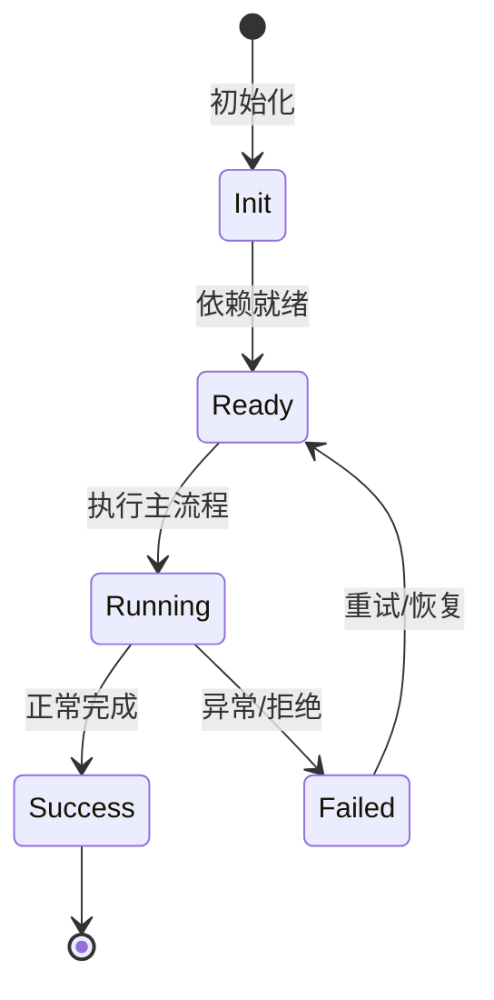

# 安全引擎总览

NightHawk 内置安全工具箱，包含漏洞扫描、密钥扫描、污点追踪、依赖审计和渗透测试工具。

## 四大核心工具

SecurityScan（116 规则）、SecretScan（Shannon 熵 + 模式）、TaintTrace（跨文件污点）、DepAudit（离线/OSV/外部）。

## 渗透测试工具

PortScanner、DirBrute、PasswordBrute、ThreatModel、SubdomainEnum 仅在 `/pentest` 模式可用。

## 生产位置

生产代码在 `packages/agent-core/src/tools/builtin/security/`；`packages/security-core` 已弃用。

## 证据

`rules.ts` 中可数到 116 条规则模板；`scripts/smoke-security.ts` 是安全冒烟。

## 专业实现要点（开发流程视角）

### 需求分析

安全工具要能作为 Agent 工具被调用，也要能被脚本/CI 使用。

### 设计决策

规则用模板数组声明，统一 CWE/OWASP/严重度/修复建议；扫描用 Kaos 抽象文件系统，便于远程执行。

### 实现步骤

定义规则 → 实现扫描引擎 → 包装为 BuiltinTool → 加缓存/SARIF/冒烟测试。

### 验证方式

运行 `node scripts/smoke-security.ts`，用已知漏洞样本验证 SecurityScan/SecretScan/TaintTrace/DepAudit。

### 维护注意

新规则要覆盖多语言、提供中英文修复建议，并考虑误报率。

## 逐函数实现说明

以下按源码文件列出可验证的导出函数/类，并给出实现职责说明。

### packages/agent-core/src/tools/builtin/security/dep-audit.ts

| 函数 | 行号 | 签名 | 实现说明 |
| --- | --- | --- | --- |
| `collectDependencyManifests` | 102 | `export async function collectDependencyManifests(kaos: Kaos, root: string): Promise<DepAuditManifest[]> {` | `collectDependencyManifests` 是本文涉及模块中的一个导出函数/类，具体语义以源码实现为准。 |
| `parsePackageJson` | 119 | `export function parsePackageJson(manifestPath: string, content: string): DepAuditFinding[] {` | `parsePackageJson` 是本文涉及模块中的一个导出函数/类，具体语义以源码实现为准。 |
| `parseRequirementsTxt` | 184 | `export function parseRequirementsTxt(content: string): DepAuditFinding[] {` | `parseRequirementsTxt` 是本文涉及模块中的一个导出函数/类，具体语义以源码实现为准。 |
| `parseGoMod` | 207 | `export function parseGoMod(content: string): DepAuditFinding[] {` | `parseGoMod` 是本文涉及模块中的一个导出函数/类，具体语义以源码实现为准。 |
| `detectPackageManager` | 250 | `export async function detectPackageManager(kaos: Kaos, root: string): Promise<LockFileInfo \| undefined> {` | `detectPackageManager` 是本文涉及模块中的一个导出函数/类，具体语义以源码实现为准。 |
| `parseNpmAuditJson` | 274 | `export function parseNpmAuditJson(` | `parseNpmAuditJson` 是本文涉及模块中的一个导出函数/类，具体语义以源码实现为准。 |
| `parsePipAuditJson` | 318 | `export function parsePipAuditJson(raw: string): DepAuditFinding[] {` | `parsePipAuditJson` 是本文涉及模块中的一个导出函数/类，具体语义以源码实现为准。 |
| `depFindingToNormalized` | 550 | `export function depFindingToNormalized(f: DepAuditFinding): NormalizedFinding {` | `depFindingToNormalized` 是本文涉及模块中的一个导出函数/类，具体语义以源码实现为准。 |

| 类 | 行号 | 声明 | 实现说明 |
| --- | --- | --- | --- |
| `DepAuditTool` | 356 | `export class DepAuditTool implements BuiltinTool<DepAuditInput> {` | 该类封装本文模块的核心状态与行为。 |

### packages/agent-core/src/tools/builtin/security/engine.ts

| 函数 | 行号 | 签名 | 实现说明 |
| --- | --- | --- | --- |
| `collectFiles` | 117 | `export async function collectFiles(` | 收集待扫描/待处理的文件列表，支持目录递归与过滤。 |
| `scanContent` | 160 | `export function scanContent(content: string, file: string, rules: readonly SecurityRule[]): ScanResult[] {` | 对单个文件内容执行规则扫描，返回命中结果。 |
| `runScan` | 205 | `export async function runScan(` | 运行完整扫描流程，包括文件收集、并发扫描、缓存和报告。 |
| `createScanCacheKey` | 409 | `export function createScanCacheKey(version: string, file: string, content: string): ScanCacheKey {` | `createScanCacheKey` 负责创建/构建相关对象或流程。 |
| `formatScanReport` | 425 | `export function formatScanReport(report: ScanReport, outputFormat?: 'text' \| 'sarif'): string {` | 把扫描报告格式化为文本或 SARIF。 |
| `scanSecretsInContent` | 502 | `export function scanSecretsInContent(content: string, file: string): SecretFinding[] {` | `scanSecretsInContent` 是本文涉及模块中的一个导出函数/类，具体语义以源码实现为准。 |
| `scanSecrets` | 539 | `export async function scanSecrets(kaos: Kaos, root: string, include?: string): Promise<SecretFinding[]> {` | 扫描目录或文件中的硬编码密钥。 |
| `formatSecrets` | 562 | `export function formatSecrets(findings: readonly SecretFinding[]): string {` | `formatSecrets` 是本文涉及模块中的一个导出函数/类，具体语义以源码实现为准。 |
| `taintAnalyzeContent` | 683 | `export function taintAnalyzeContent(content: string, file: string): TaintFinding[] {` | `taintAnalyzeContent` 是本文涉及模块中的一个导出函数/类，具体语义以源码实现为准。 |
| `taintAnalyze` | 691 | `export async function taintAnalyze(kaos: Kaos, file: string): Promise<TaintFinding[]> {` | 在单个文件中执行污点分析。 |
| `taintAnalyzeModule` | 831 | `export async function taintAnalyzeModule(kaos: Kaos, file: string): Promise<TaintFinding[]> {` | 沿模块导入关系执行跨文件污点分析。 |
| `formatTaint` | 936 | `export function formatTaint(findings: readonly TaintFinding[]): string {` | `formatTaint` 是本文涉及模块中的一个导出函数/类，具体语义以源码实现为准。 |
| `secretFindingToNormalized` | 954 | `export function secretFindingToNormalized(f: SecretFinding): NormalizedFinding {` | `secretFindingToNormalized` 是本文涉及模块中的一个导出函数/类，具体语义以源码实现为准。 |
| `taintFindingToNormalized` | 971 | `export function taintFindingToNormalized(f: TaintFinding): NormalizedFinding {` | `taintFindingToNormalized` 是本文涉及模块中的一个导出函数/类，具体语义以源码实现为准。 |

| 类 | 行号 | 声明 | 实现说明 |
| --- | --- | --- | --- |
| `ScanCache` | 372 | `export class ScanCache {` | 该类封装本文模块的核心状态与行为。 |

### packages/agent-core/src/tools/builtin/security/osv-client.ts

| 函数 | 行号 | 签名 | 实现说明 |
| --- | --- | --- | --- |
| `mapEcosystem` | 47 | `export function mapEcosystem(ecosystem: 'npm' \| 'pip' \| 'go'): 'npm' \| 'PyPI' \| 'Go' {` | `mapEcosystem` 是本文涉及模块中的一个导出函数/类，具体语义以源码实现为准。 |
| `extractFixedVersion` | 58 | `export function extractFixedVersion(` | `extractFixedVersion` 是本文涉及模块中的一个导出函数/类，具体语义以源码实现为准。 |
| `extractCvssScore` | 77 | `export function extractCvssScore(vuln: OsvVulnerability): number \| undefined {` | `extractCvssScore` 是本文涉及模块中的一个导出函数/类，具体语义以源码实现为准。 |
| `createOsvClient` | 101 | `export function createOsvClient(fetchFn: FetchFn, options?: OsvClientOptions): OsvClient {` | `createOsvClient` 负责创建/构建相关对象或流程。 |

### packages/agent-core/src/tools/builtin/security/rules.ts

| 函数 | 行号 | 签名 | 实现说明 |
| --- | --- | --- | --- |
| `rulesForLanguage` | 272 | `export function rulesForLanguage(lang: string): readonly SecurityRule[] {` | `rulesForLanguage` 是本文涉及模块中的一个导出函数/类，具体语义以源码实现为准。 |
| `detectLanguage` | 276 | `export function detectLanguage(filePath: string): string {` | `detectLanguage` 是本文涉及模块中的一个导出函数/类，具体语义以源码实现为准。 |

### packages/agent-core/src/tools/builtin/security/sarif-formatter.ts

| 函数 | 行号 | 签名 | 实现说明 |
| --- | --- | --- | --- |
| `severityToLevel` | 67 | `export function severityToLevel(severity: Severity): 'error' \| 'warning' \| 'note' \| 'none' {` | `severityToLevel` 是本文涉及模块中的一个导出函数/类，具体语义以源码实现为准。 |
| `normalizeFileUri` | 81 | `export function normalizeFileUri(file: string): string {` | `normalizeFileUri` 是本文涉及模块中的一个导出函数/类，具体语义以源码实现为准。 |
| `buildSarifRules` | 100 | `export function buildSarifRules(` | `buildSarifRules` 负责创建/构建相关对象或流程。 |
| `formatToSarif` | 150 | `export function formatToSarif(` | `formatToSarif` 是本文涉及模块中的一个导出函数/类，具体语义以源码实现为准。 |

### packages/agent-core/src/tools/builtin/security/scan-cache-persist.ts

| 函数 | 行号 | 签名 | 实现说明 |
| --- | --- | --- | --- |
| `createScanCache` | 67 | `export async function createScanCache(workspaceDir: string): Promise<PersistentScanCache> {` | 创建持久化扫描缓存。 |

| 类 | 行号 | 声明 | 实现说明 |
| --- | --- | --- | --- |
| `PersistentScanCache` | 9 | `export class PersistentScanCache extends ScanCache {` | 该类封装本文模块的核心状态与行为。 |

### packages/agent-core/src/tools/builtin/security/secret-scan.ts

| 类 | 行号 | 声明 | 实现说明 |
| --- | --- | --- | --- |
| `SecretScanTool` | 36 | `export class SecretScanTool implements BuiltinTool<SecretScanInput> {` | 该类封装本文模块的核心状态与行为。 |

### packages/agent-core/src/tools/builtin/security/security-scan.ts

| 类 | 行号 | 声明 | 实现说明 |
| --- | --- | --- | --- |
| `SecurityScanTool` | 53 | `export class SecurityScanTool implements BuiltinTool<SecurityScanInput> {` | 该类封装本文模块的核心状态与行为。 |

### packages/agent-core/src/tools/builtin/security/taint-trace.ts

| 类 | 行号 | 声明 | 实现说明 |
| --- | --- | --- | --- |
| `TaintTraceTool` | 41 | `export class TaintTraceTool implements BuiltinTool<TaintTraceInput> {` | 该类封装本文模块的核心状态与行为。 |


## 核心代码片段

以下片段直接从仓库源码截取，用于展示关键实现形态；完整实现请打开对应文件。

### 来自 `packages/agent-core/src/tools/builtin/security/dep-audit.ts` 的 `collectDependencyManifests`

源码位置：`packages/agent-core/src/tools/builtin/security/dep-audit.ts:102` 附近。

```ts
export async function collectDependencyManifests(kaos: Kaos, root: string): Promise<DepAuditManifest[]> {
  const manifests: DepAuditManifest[] = [];
  for (const candidate of [
    { path: join(root, 'package.json'), ecosystem: 'npm' as const },
    { path: join(root, 'requirements.txt'), ecosystem: 'pip' as const },
    { path: join(root, 'go.mod'), ecosystem: 'go' as const },
  ]) {
    try {
      const stat = await kaos.stat(candidate.path);
      if ((stat.stMode & 0o170000) === 0o100000) {
        manifests.push(candidate);
      }
    } catch {}
  }
  return manifests;
}
```

### 来自 `packages/agent-core/src/tools/builtin/security/engine.ts` 的 `collectFiles`

源码位置：`packages/agent-core/src/tools/builtin/security/engine.ts:117` 附近。

```ts
export async function collectFiles(
  kaos: Kaos,
  root: string,
  include?: string,
  maxFiles = MAX_SCAN_FILES,
): Promise<string[]> {
  const files: string[] = [];
  let rootIsFile = false;
  try {
    const stat = await kaos.stat(root);
    rootIsFile = (stat.stMode & 0o170000) === 0o100000;
  } catch {
    return [];
  }
  if (rootIsFile) return [root];

  async function walk(dir: string): Promise<void> {
    if (files.length >= maxFiles) return;
    try {
      for await (const entry of kaos.iterdir(dir)) {
        if (files.length >= maxFiles) return;
        // iterdir yields full paths; derive the basename for filters.
        const name = basename(entry);
        if (SKIP_DIRS.has(name) || (name.startsWith('.') && name !== '.github')) continue;
// ...
```

### 来自 `packages/agent-core/src/tools/builtin/security/osv-client.ts` 的 `mapEcosystem`

源码位置：`packages/agent-core/src/tools/builtin/security/osv-client.ts:47` 附近。

```ts
export function mapEcosystem(ecosystem: 'npm' | 'pip' | 'go'): 'npm' | 'PyPI' | 'Go' {
  switch (ecosystem) {
    case 'npm':
      return 'npm';
    case 'pip':
      return 'PyPI';
    case 'go':
      return 'Go';
  }
}

export function extractFixedVersion(
  vuln: OsvVulnerability,
  packageName: string,
): string | undefined {
  const affected = vuln.affected;
  if (!affected) return undefined;

  for (const entry of affected) {
    if (entry.package.name !== packageName) continue;
    for (const range of entry.ranges ?? []) {
      for (const event of range.events) {
        if (event.fixed !== undefined) return event.fixed;
      }
// ...
```


## 时序/状态图



> 图注：`05-security/overview.md` 的抽象流程；具体参与者与状态以源码和上文函数说明为准。

## 核心实现细节（源码导出）

以下是本文涉及路径中的真实源码导出/结构，帮助你把概念映射到函数、类与方法：

  - `packages/agent-core/src/tools/builtin/security//` 目录下源码文件示例：
    - `packages/agent-core/src/tools/builtin/security/dep-audit.ts`
    - `packages/agent-core/src/tools/builtin/security/engine.ts`
    - `packages/agent-core/src/tools/builtin/security/index.ts`
    - `packages/agent-core/src/tools/builtin/security/osv-client.ts`
    - `packages/agent-core/src/tools/builtin/security/rules.ts`
    - `packages/agent-core/src/tools/builtin/security/sarif-formatter.ts`
    - `packages/agent-core/src/tools/builtin/security/scan-cache-persist.ts`
    - `packages/agent-core/src/tools/builtin/security/secret-scan.ts`
    - `packages/agent-core/src/tools/builtin/security/security-scan.ts`
    - `packages/agent-core/src/tools/builtin/security/taint-trace.ts`
  - `README.zh-CN.md`（非 TS 源码，可直接阅读）

## 证据与代码位置

- `packages/agent-core/src/tools/builtin/security/`
- `README.zh-CN.md`

> 本文所有路径均相对仓库根目录；引用内容以仓库当前 `HEAD` 为准。
