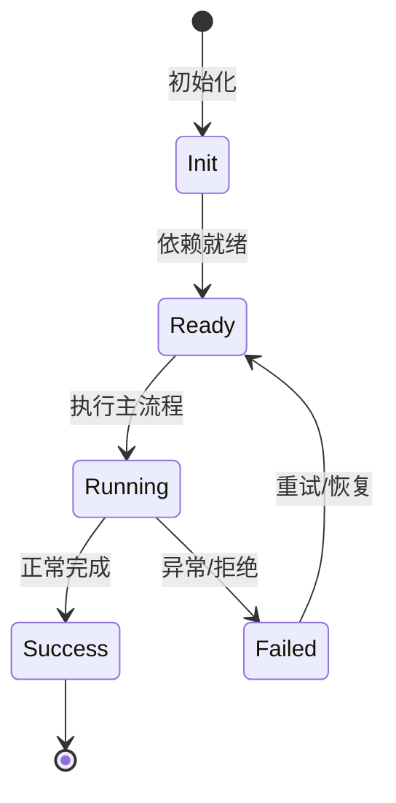

# 渗透测试模式工具

`/pentest` 模式提供 9 阶段编排和 5 个渗透测试专用工具。

## 阶段

合规红线 → 范围确认 → 信息收集 → 攻击面分析 → 漏洞验证 → 漏洞利用 → 后渗透评估 → 修复方案 → 报告生成。

## 工具

PortScanner、DirBrute、PasswordBrute、ThreatModel、SubdomainEnum。

## 报告

生成 HTML/PDF 报告，含风险评分和证据。

## 权限

PasswordBrute 需要显式授权确认；所有工具仅在 pentest 模式可用。

## 专业实现要点（开发流程视角）

### 需求分析

安全工具要能作为 Agent 工具被调用，也要能被脚本/CI 使用。

### 设计决策

规则用模板数组声明，统一 CWE/OWASP/严重度/修复建议；扫描用 Kaos 抽象文件系统，便于远程执行。

### 实现步骤

定义规则 → 实现扫描引擎 → 包装为 BuiltinTool → 加缓存/SARIF/冒烟测试。

### 验证方式

运行 `node scripts/smoke-security.ts`，用已知漏洞样本验证 SecurityScan/SecretScan/TaintTrace/DepAudit。

### 维护注意

新规则要覆盖多语言、提供中英文修复建议，并考虑误报率。

## 逐函数实现说明

以下按源码文件列出可验证的导出函数/类，并给出实现职责说明。

## 核心代码片段

以下片段直接从仓库源码截取，用于展示关键实现形态；完整实现请打开对应文件。

> 本文证据路径没有可直接展示的 TS 源码片段。

## 时序/状态图

> 图注：`05-security/pentest-tools.md` 的抽象流程；具体参与者与状态以源码和上文函数说明为准。

## 核心实现细节（源码导出）

以下是本文涉及路径中的真实源码导出/结构，帮助你把概念映射到函数、类与方法：

  - `README.zh-CN.md`（非 TS 源码，可直接阅读）
  - `docs/en/guides/pentest-mode.md`（非 TS 源码，可直接阅读）

## 证据与代码位置

- `README.zh-CN.md`
- `docs/en/guides/pentest-mode.md`

> 本文所有路径均相对仓库根目录；引用内容以仓库当前 `HEAD` 为准。
