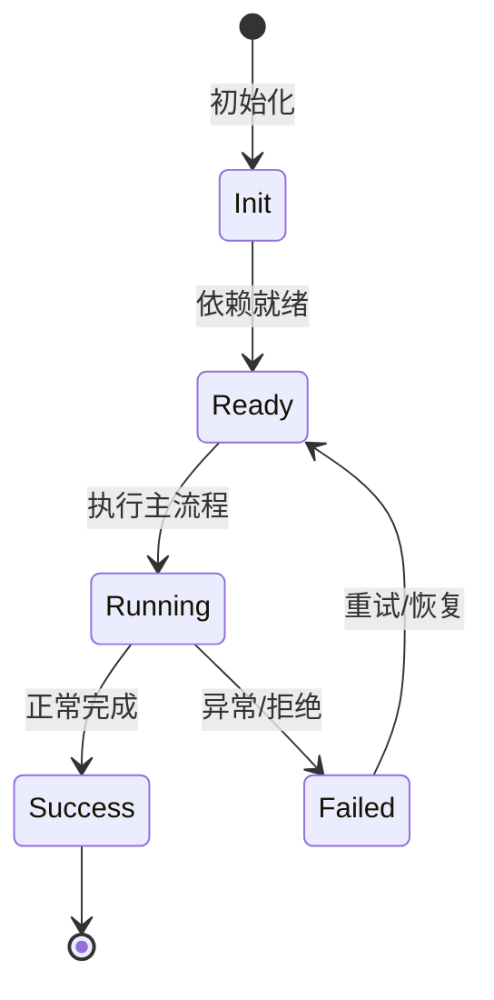

# TaintTrace 污点追踪

TaintTrace 从用户可控源追踪赋值链到危险汇点，默认跨文件按模块图分析。

## 源

HTTP 参数、req.query、环境变量、stdin、superglobals。

## 汇点

SQL execute、shell exec、eval、DOM write、文件操作、HTTP 请求、反序列化。

## 作用域

`scope: file` 单文件，`scope: module` 跨 import/require。

## 输出

source、sink、varName、flow。

## 专业实现要点（开发流程视角）

### 需求分析

安全工具要能作为 Agent 工具被调用，也要能被脚本/CI 使用。

### 设计决策

规则用模板数组声明，统一 CWE/OWASP/严重度/修复建议；扫描用 Kaos 抽象文件系统，便于远程执行。

### 实现步骤

定义规则 → 实现扫描引擎 → 包装为 BuiltinTool → 加缓存/SARIF/冒烟测试。

### 验证方式

运行 `node scripts/smoke-security.ts`，用已知漏洞样本验证 SecurityScan/SecretScan/TaintTrace/DepAudit。

### 维护注意

新规则要覆盖多语言、提供中英文修复建议，并考虑误报率。

## 逐函数实现说明

以下按源码文件列出可验证的导出函数/类，并给出实现职责说明。

### packages/agent-core/src/tools/builtin/security/taint-trace.ts

| 类 | 行号 | 声明 | 实现说明 |
| --- | --- | --- | --- |
| `TaintTraceTool` | 41 | `export class TaintTraceTool implements BuiltinTool<TaintTraceInput> {` | 该类封装本文模块的核心状态与行为。 |

### packages/agent-core/src/tools/builtin/security/engine.ts

| 函数 | 行号 | 签名 | 实现说明 |
| --- | --- | --- | --- |
| `collectFiles` | 117 | `export async function collectFiles(` | 收集待扫描/待处理的文件列表，支持目录递归与过滤。 |
| `scanContent` | 160 | `export function scanContent(content: string, file: string, rules: readonly SecurityRule[]): ScanResult[] {` | 对单个文件内容执行规则扫描，返回命中结果。 |
| `runScan` | 205 | `export async function runScan(` | 运行完整扫描流程，包括文件收集、并发扫描、缓存和报告。 |
| `createScanCacheKey` | 409 | `export function createScanCacheKey(version: string, file: string, content: string): ScanCacheKey {` | `createScanCacheKey` 负责创建/构建相关对象或流程。 |
| `formatScanReport` | 425 | `export function formatScanReport(report: ScanReport, outputFormat?: 'text' \| 'sarif'): string {` | 把扫描报告格式化为文本或 SARIF。 |
| `scanSecretsInContent` | 502 | `export function scanSecretsInContent(content: string, file: string): SecretFinding[] {` | `scanSecretsInContent` 是本文涉及模块中的一个导出函数/类，具体语义以源码实现为准。 |
| `scanSecrets` | 539 | `export async function scanSecrets(kaos: Kaos, root: string, include?: string): Promise<SecretFinding[]> {` | 扫描目录或文件中的硬编码密钥。 |
| `formatSecrets` | 562 | `export function formatSecrets(findings: readonly SecretFinding[]): string {` | `formatSecrets` 是本文涉及模块中的一个导出函数/类，具体语义以源码实现为准。 |
| `taintAnalyzeContent` | 683 | `export function taintAnalyzeContent(content: string, file: string): TaintFinding[] {` | `taintAnalyzeContent` 是本文涉及模块中的一个导出函数/类，具体语义以源码实现为准。 |
| `taintAnalyze` | 691 | `export async function taintAnalyze(kaos: Kaos, file: string): Promise<TaintFinding[]> {` | 在单个文件中执行污点分析。 |
| `taintAnalyzeModule` | 831 | `export async function taintAnalyzeModule(kaos: Kaos, file: string): Promise<TaintFinding[]> {` | 沿模块导入关系执行跨文件污点分析。 |
| `formatTaint` | 936 | `export function formatTaint(findings: readonly TaintFinding[]): string {` | `formatTaint` 是本文涉及模块中的一个导出函数/类，具体语义以源码实现为准。 |
| `secretFindingToNormalized` | 954 | `export function secretFindingToNormalized(f: SecretFinding): NormalizedFinding {` | `secretFindingToNormalized` 是本文涉及模块中的一个导出函数/类，具体语义以源码实现为准。 |
| `taintFindingToNormalized` | 971 | `export function taintFindingToNormalized(f: TaintFinding): NormalizedFinding {` | `taintFindingToNormalized` 是本文涉及模块中的一个导出函数/类，具体语义以源码实现为准。 |

| 类 | 行号 | 声明 | 实现说明 |
| --- | --- | --- | --- |
| `ScanCache` | 372 | `export class ScanCache {` | 该类封装本文模块的核心状态与行为。 |


## 核心代码片段

以下片段直接从仓库源码截取，用于展示关键实现形态；完整实现请打开对应文件。

### 来自 `packages/agent-core/src/tools/builtin/security/taint-trace.ts` 的 `TaintTraceTool`

源码位置：`packages/agent-core/src/tools/builtin/security/taint-trace.ts:41` 附近。

```ts
export class TaintTraceTool implements BuiltinTool<TaintTraceInput> {
  readonly name = 'TaintTrace' as const;
  readonly description = TAINT_TRACE_DESCRIPTION;
  readonly parameters: Record<string, unknown> = toInputJsonSchema(TaintTraceInputSchema);

  constructor(
    private readonly kaos: Kaos,
    private readonly workspace: WorkspaceConfig,
  ) {}

  resolveExecution(args: TaintTraceInputArgs): ToolExecution {
    const filePath = resolvePathAccessPath(args.path, {
      kaos: this.kaos,
      workspace: this.workspace,
      operation: 'read',
      policy: { guardMode: 'absolute-outside-allowed', checkSensitive: false },
    });
    return {
      accesses: ToolAccesses.searchTree(filePath),
      description: `Tracing taint flows in ${args.path}`,
      display: { kind: 'file_io', operation: 'grep', path: filePath },
      approvalRule: literalRulePattern(this.name, args.path),
      execute: async ({ signal }) => {
        if (signal.aborted) {
// ...
```

### 来自 `packages/agent-core/src/tools/builtin/security/engine.ts` 的 `collectFiles`

源码位置：`packages/agent-core/src/tools/builtin/security/engine.ts:117` 附近。

```ts
export async function collectFiles(
  kaos: Kaos,
  root: string,
  include?: string,
  maxFiles = MAX_SCAN_FILES,
): Promise<string[]> {
  const files: string[] = [];
  let rootIsFile = false;
  try {
    const stat = await kaos.stat(root);
    rootIsFile = (stat.stMode & 0o170000) === 0o100000;
  } catch {
    return [];
  }
  if (rootIsFile) return [root];

  async function walk(dir: string): Promise<void> {
    if (files.length >= maxFiles) return;
    try {
      for await (const entry of kaos.iterdir(dir)) {
        if (files.length >= maxFiles) return;
        // iterdir yields full paths; derive the basename for filters.
        const name = basename(entry);
        if (SKIP_DIRS.has(name) || (name.startsWith('.') && name !== '.github')) continue;
// ...
```


## 时序/状态图



> 图注：`05-security/taint-trace.md` 的抽象流程；具体参与者与状态以源码和上文函数说明为准。

## 核心实现细节（源码导出）

以下是本文涉及路径中的真实源码导出/结构，帮助你把概念映射到函数、类与方法：

  - `packages/agent-core/src/tools/builtin/security/taint-trace.ts`：
    - 导出签名/声明：
      - `export const TaintTraceInputSchema = z.object({`
      - `export type TaintTraceInput = z.infer<typeof TaintTraceInputSchema>;`
      - `export type TaintTraceInputArgs = z.input<typeof TaintTraceInputSchema>;`
      - `export class TaintTraceTool implements BuiltinTool<TaintTraceInput>`
  - `packages/agent-core/src/tools/builtin/security/engine.ts`：
    - 导出签名/声明：
      - `export type { Severity } from './rules';`
      - `export interface ScanResult {`
      - `export type FindingKind = 'rule' | 'ast' | 'secret' | 'taint' | 'dep';`
      - `export interface FindingEvidence {`
      - `export interface NormalizedFinding {`
      - `export interface ScanMetrics {`
      - `export interface ScanReport {`
      - `export interface SecretFinding {`
      - `export interface TaintFinding {`
      - `export const SKIP_DIRS = new Set([`
      - `export interface ScanOptions {`
      - `export interface ScanProgress {`
      - `export type ScanProgressCallback = (progress: ScanProgress) => void;`
      - `export async function collectFiles(
  kaos: Kaos,
  root: string,
  include?: string,
  maxFiles = MAX_SCAN_FILES,
): Promise<string[]>`
      - `export function scanContent(content: string, file: string, rules: readonly SecurityRule[]): ScanResult[]`
      - `export async function runScan(
  kaos: Kaos,
  opts: ScanOptions,
  cache?: ScanCache,
  createCache?: () => Promise<ScanCache>,
): Promise<ScanReport>`
      - `export interface ScanCacheKey {`
      - `export interface ScanCacheEntry {`
      - `export class ScanCache`
      - `export function createScanCacheKey(version: string, file: string, content: string): ScanCacheKey`
      - `export function formatScanReport(report: ScanReport, outputFormat?: 'text' | 'sarif'): string`
      - `export function scanSecretsInContent(content: string, file: string): SecretFinding[]`
      - `export async function scanSecrets(kaos: Kaos, root: string, include?: string): Promise<SecretFinding[]>`
      - `export function formatSecrets(findings: readonly SecretFinding[]): string`
      - `export function taintAnalyzeContent(content: string, file: string): TaintFinding[]`
      - `export async function taintAnalyze(kaos: Kaos, file: string): Promise<TaintFinding[]>`
      - `export async function taintAnalyzeModule(kaos: Kaos, file: string): Promise<TaintFinding[]>`
      - `export function formatTaint(findings: readonly TaintFinding[]): string`
      - `export function secretFindingToNormalized(f: SecretFinding): NormalizedFinding`
      - `export function taintFindingToNormalized(f: TaintFinding): NormalizedFinding`

## 证据与代码位置

- `packages/agent-core/src/tools/builtin/security/taint-trace.ts`
- `packages/agent-core/src/tools/builtin/security/engine.ts`

> 本文所有路径均相对仓库根目录；引用内容以仓库当前 `HEAD` 为准。
