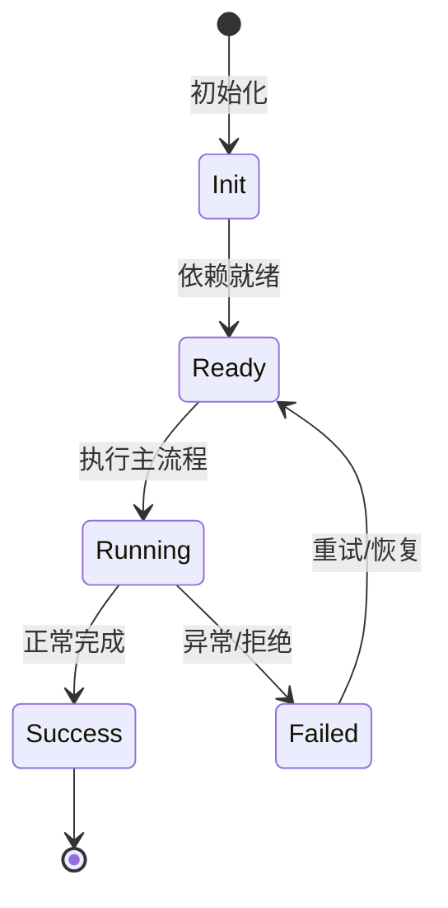

# 威胁模型

NightHawk 自身的安全模型围绕扩展统一权限、路径边界、信任门和最小暴露。

## 扩展风险

MCP/Skill/Plugin 都可能引入不可信代码；所有扩展进入统一审批和审计。

## 网络暴露

server 默认 loopback；非 loopback 需 TLS；debug endpoints 仅 loopback。

## 数据保护

OAuth token 写入使用事务串行化；日志 redact 敏感信息。

## 供应链

依赖审计工具自身可检查 postinstall 脚本和未锁定版本。

## 专业实现要点（开发流程视角）

### 需求分析

安全工具要能作为 Agent 工具被调用，也要能被脚本/CI 使用。

### 设计决策

规则用模板数组声明，统一 CWE/OWASP/严重度/修复建议；扫描用 Kaos 抽象文件系统，便于远程执行。

### 实现步骤

定义规则 → 实现扫描引擎 → 包装为 BuiltinTool → 加缓存/SARIF/冒烟测试。

### 验证方式

运行 `node scripts/smoke-security.ts`，用已知漏洞样本验证 SecurityScan/SecretScan/TaintTrace/DepAudit。

### 维护注意

新规则要覆盖多语言、提供中英文修复建议，并考虑误报率。

## 逐函数实现说明

以下按源码文件列出可验证的导出函数/类，并给出实现职责说明。

### packages/kap-server/src/start.ts

| 函数 | 行号 | 签名 | 实现说明 |
| --- | --- | --- | --- |
| `startServer` | 205 | `export async function startServer(opts: ServerStartOptions): Promise<RunningServer> {` | 启动 kap-server，包含认证、路由、WebSocket 和引擎初始化。 |
| `listenWithPortRetry` | 664 | `export async function listenWithPortRetry(` | `listenWithPortRetry` 负责读取或查询数据。 |


## 核心代码片段

以下片段直接从仓库源码截取，用于展示关键实现形态；完整实现请打开对应文件。

### 来自 `packages/kap-server/src/start.ts` 的 `startServer`

源码位置：`packages/kap-server/src/start.ts:205` 附近。

```ts
export async function startServer(opts: ServerStartOptions): Promise<RunningServer> {
  const host = opts.host ?? DEFAULT_HOST;
  const port = opts.port ?? DEFAULT_PORT;
  const homeDir = resolveNighthawkHome(opts.homeDir);
  const serverVersion = opts.serverVersion ?? getServerVersion();
  const registry = createInstanceRegistry({
    instancesDir: opts.instancesDir ?? join(homeDir, 'server', 'instances'),
  });
  const registration: InstanceRegistration = await registry.register({
    pid: process.pid,
    host,
    port,
    startedAt: Date.now(),
    serverVersion,
  });
  const exposureClass = classify(host, { bindClass: opts.bindClass });
  if (exposureClass !== 'loopback' && opts.insecureNoTls !== true) {
    await registration.release();
    throw new Error(
      `Refusing to bind ${host} (${exposureClass}) without TLS; terminate TLS at a reverse proxy or pass --insecure-no-tls.`,
    );
  }
  const enableShutdown = exposureClass === 'loopback' || opts.allowRemoteShutdown === true;
  const enableTerminals = exposureClass === 'loopback' || opts.allowRemoteTerminals === true;
// ...
```


## 时序/状态图



> 图注：`05-security/threat-model.md` 的抽象流程；具体参与者与状态以源码和上文函数说明为准。

## 核心实现细节（源码导出）

以下是本文涉及路径中的真实源码导出/结构，帮助你把概念映射到函数、类与方法：

  - `packages/kap-server/src/start.ts`：
    - 导出签名/声明：
      - `export interface ServerHostIdentity extends NighthawkHostIdentity {`
      - `export interface ServerStartOptions {`
      - `export interface RunningServer {`
      - `export async function startServer(opts: ServerStartOptions): Promise<RunningServer>`
      - `export const PORT_RETRY_LIMIT = 100;`
      - `export interface ListenWithPortRetryOptions {`
      - `export async function listenWithPortRetry(
  opts: ListenWithPortRetryOptions,
): Promise<`
  - `packages/agent-core-v2/docs/Permission.md`（非 TS 源码，可直接阅读）
  - `docs/architecture/plugin-and-extension-design.md`（非 TS 源码，可直接阅读）

## 证据与代码位置

- `packages/kap-server/src/start.ts`
- `packages/agent-core-v2/docs/Permission.md`
- `docs/architecture/plugin-and-extension-design.md`

> 本文所有路径均相对仓库根目录；引用内容以仓库当前 `HEAD` 为准。
