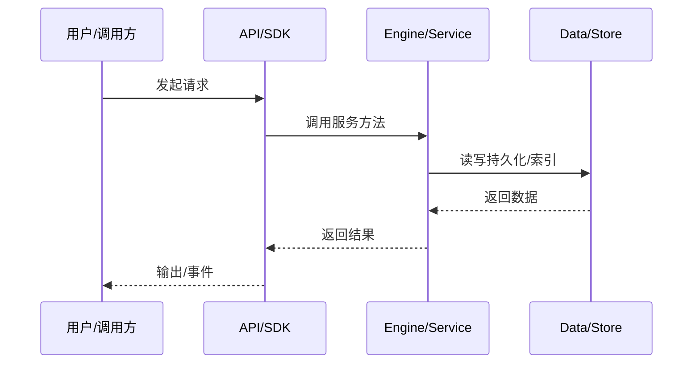

# 端到端 Prompt 数据流

从用户在终端输入到模型回复渲染的完整链路。

## 步骤

1) 用户在 TUI 输入框输入 → 2) SDK `agent.prompt()` → 3) kap-server/dispatcher 或内存 channel → 4) Session/Agent 的 prompt 服务 → 5) LLM Requester 调 kosong → 6) 工具调用循环 → 7) 结果写回 transcript → 8) 事件推回 TUI 渲染。

## 关键文件

`apps/nighthawk/src/tui/nighthawk-tui.ts`、`packages/klient/src/core/facade/`、`packages/agent-core-v2/src/agent/llmRequester/`。

## 事件

`assistant.delta`、`tool_call`、`tool_result`、`prompt.completed` 等。

## 可观测

transcript 记录 op-batch，server 可推送 WS 事件。

## 专业实现要点（开发流程视角）

### 需求分析

数据流文档要回答“一个请求从哪里来、经过哪些服务、最终写到哪里”。

### 设计决策

用事件驱动解耦引擎与 UI；用 transcript 记录可重放状态；用 minidb read model 加速查询。

### 实现步骤

识别入口 API → 跟踪 service 调用链 → 标注持久化点 → 标注事件/WS 推送。

### 验证方式

通过 e2e、klient conformance suite、WS 订阅测试验证链路。

### 维护注意

异步链路要处理取消、重试、幂等；持久化要保证崩溃安全。

## 逐函数实现说明

以下按源码文件列出可验证的导出函数/类，并给出实现职责说明。

### packages/kap-server/src/transport/businessSnapshotDispatcher.ts

| 函数 | 行号 | 签名 | 实现说明 |
| --- | --- | --- | --- |
| `workspaceSnapshots` | 21 | `export function workspaceSnapshots(core: Scope): WorkspaceInstancesSnapshot {` | `workspaceSnapshots` 是本文涉及模块中的一个导出函数/类，具体语义以源码实现为准。 |
| `workspaceSnapshot` | 25 | `export async function workspaceSnapshot(` | `workspaceSnapshot` 是本文涉及模块中的一个导出函数/类，具体语义以源码实现为准。 |
| `sessionWorkspaceAssociation` | 32 | `export function sessionWorkspaceAssociation(` | `sessionWorkspaceAssociation` 是本文涉及模块中的一个导出函数/类，具体语义以源码实现为准。 |
| `agentRuntimeBindingSnapshot` | 43 | `export async function agentRuntimeBindingSnapshot(` | `agentRuntimeBindingSnapshot` 是本文涉及模块中的一个导出函数/类，具体语义以源码实现为准。 |

### packages/kap-server/src/transport/businessSnapshotRoutes.ts

| 函数 | 行号 | 签名 | 实现说明 |
| --- | --- | --- | --- |
| `registerBusinessSnapshotRoutes` | 22 | `export function registerBusinessSnapshotRoutes(` | `registerBusinessSnapshotRoutes` 是本文涉及模块中的一个导出函数/类，具体语义以源码实现为准。 |

### packages/kap-server/src/transport/channelRegistry.ts

| 函数 | 行号 | 签名 | 实现说明 |
| --- | --- | --- | --- |
| `resolveAnyScopedServiceId` | 66 | `export function resolveAnyScopedServiceId(` | `resolveAnyScopedServiceId` 是本文涉及模块中的一个导出函数/类，具体语义以源码实现为准。 |
| `describeAllChannels` | 127 | `export function describeAllChannels(): readonly ChannelDescriptor[] {` | `describeAllChannels` 是本文涉及模块中的一个导出函数/类，具体语义以源码实现为准。 |

### packages/kap-server/src/transport/dispatcher.ts

| 函数 | 行号 | 签名 | 实现说明 |
| --- | --- | --- | --- |
| `resolveScope` | 31 | `export async function resolveScope(` | `resolveScope` 是本文涉及模块中的一个导出函数/类，具体语义以源码实现为准。 |
| `resolveService` | 72 | `export async function resolveService(` | `resolveService` 是本文涉及模块中的一个导出函数/类，具体语义以源码实现为准。 |
| `dispatch` | 100 | `export async function dispatch(` | `dispatch` 是本文涉及模块中的一个导出函数/类，具体语义以源码实现为准。 |

### packages/kap-server/src/transport/errors.ts

| 函数 | 行号 | 签名 | 实现说明 |
| --- | --- | --- | --- |
| `mapError` | 60 | `export function mapError(err: unknown, requestId: string): ReturnType<typeof errEnvelope> {` | `mapError` 是本文涉及模块中的一个导出函数/类，具体语义以源码实现为准。 |
| `validationEnvelope` | 77 | `export function validationEnvelope(` | `validationEnvelope` 是本文涉及模块中的一个导出函数/类，具体语义以源码实现为准。 |
| `assertSerializable` | 108 | `export function assertSerializable(value: unknown): unknown {` | `assertSerializable` 是本文涉及模块中的一个导出函数/类，具体语义以源码实现为准。 |

| 类 | 行号 | 声明 | 实现说明 |
| --- | --- | --- | --- |
| `TimeoutError` | 7 | `export class TimeoutError extends Error {` | 该类封装本文模块的核心状态与行为。 |

### packages/kap-server/src/transport/mainAgent.ts

| 函数 | 行号 | 签名 | 实现说明 |
| --- | --- | --- | --- |
| `ensureMainAgent` | 11 | `export async function ensureMainAgent(session: ISessionScopeHandle): Promise<IAgentScopeHandle> {` | `ensureMainAgent` 是本文涉及模块中的一个导出函数/类，具体语义以源码实现为准。 |

### packages/kap-server/src/transport/registerDebugRoutes.ts

| 函数 | 行号 | 签名 | 实现说明 |
| --- | --- | --- | --- |
| `registerDebugRoutes` | 7 | `export function registerDebugRoutes(app: RouteHost, core: Scope): void {` | `registerDebugRoutes` 是本文涉及模块中的一个导出函数/类，具体语义以源码实现为准。 |

### packages/kap-server/src/transport/serviceDispatcherRoutes.ts

| 函数 | 行号 | 签名 | 实现说明 |
| --- | --- | --- | --- |
| `registerServiceDispatcherRoutes` | 49 | `export function registerServiceDispatcherRoutes(` | `registerServiceDispatcherRoutes` 是本文涉及模块中的一个导出函数/类，具体语义以源码实现为准。 |

### packages/kap-server/src/transport/ws/bearerProtocol.ts

| 函数 | 行号 | 签名 | 实现说明 |
| --- | --- | --- | --- |
| `extractWsBearerToken` | 3 | `export function extractWsBearerToken(protocolHeader: string \| undefined): string \| null {` | `extractWsBearerToken` 是本文涉及模块中的一个导出函数/类，具体语义以源码实现为准。 |
| `selectWsBearerProtocol` | 17 | `export function selectWsBearerProtocol(protocols: Iterable<string>): string \| false {` | `selectWsBearerProtocol` 是本文涉及模块中的一个导出函数/类，具体语义以源码实现为准。 |

### packages/kap-server/src/transport/ws/connectionRegistry.ts

| 类 | 行号 | 声明 | 实现说明 |
| --- | --- | --- | --- |
| `ConnectionRegistry` | 26 | `export class ConnectionRegistry implements IConnectionRegistry {` | 该类封装本文模块的核心状态与行为。 |

### packages/kap-server/src/transport/ws/v1/events.ts

| 函数 | 行号 | 签名 | 实现说明 |
| --- | --- | --- | --- |
| `isVolatileEventType` | 266 | `export function isVolatileEventType(type: string): type is VolatileEventType {` | `isVolatileEventType` 是本文涉及模块中的一个导出函数/类，具体语义以源码实现为准。 |

### packages/kap-server/src/transport/ws/v1/fsWatchBridge.ts

| 类 | 行号 | 声明 | 实现说明 |
| --- | --- | --- | --- |
| `FsWatchBridge` | 74 | `export class FsWatchBridge {` | 该类封装本文模块的核心状态与行为。 |

### packages/kap-server/src/transport/ws/v1/inFlightTurnTracker.ts

| 类 | 行号 | 声明 | 实现说明 |
| --- | --- | --- | --- |
| `InFlightTurnTracker` | 31 | `export class InFlightTurnTracker {` | 该类封装本文模块的核心状态与行为。 |

### packages/kap-server/src/transport/ws/v1/protocol.ts

| 函数 | 行号 | 签名 | 实现说明 |
| --- | --- | --- | --- |
| `buildServerHello` | 19 | `export function buildServerHello(payload: ServerHelloPayload): ServerHelloFrame {` | `buildServerHello` 负责创建/构建相关对象或流程。 |
| `buildPing` | 29 | `export function buildPing(nonce: string): PingFrame {` | `buildPing` 负责创建/构建相关对象或流程。 |
| `buildResyncRequired` | 58 | `export function buildResyncRequired(` | `buildResyncRequired` 负责创建/构建相关对象或流程。 |

### packages/kap-server/src/transport/ws/v1/registerWsV1.ts

| 函数 | 行号 | 签名 | 实现说明 |
| --- | --- | --- | --- |
| `registerWsV1` | 29 | `export function registerWsV1(core: Scope, opts: RegisterWsV1Options): WebSocketServer {` | `registerWsV1` 是本文涉及模块中的一个导出函数/类，具体语义以源码实现为准。 |

### packages/kap-server/src/transport/ws/v1/sessionEventBroadcaster.ts

| 类 | 行号 | 声明 | 实现说明 |
| --- | --- | --- | --- |
| `SessionEventBroadcaster` | 147 | `export class SessionEventBroadcaster {` | 该类封装本文模块的核心状态与行为。 |

### packages/kap-server/src/transport/ws/v1/sessionEventJournal.ts

| 函数 | 行号 | 签名 | 实现说明 |
| --- | --- | --- | --- |
| `sessionJournalPath` | 195 | `export function sessionJournalPath(eventsDir: string, sessionId: string): string {` | `sessionJournalPath` 是本文涉及模块中的一个导出函数/类，具体语义以源码实现为准。 |

| 类 | 行号 | 声明 | 实现说明 |
| --- | --- | --- | --- |
| `SessionEventJournal` | 50 | `export class SessionEventJournal {` | 该类封装本文模块的核心状态与行为。 |

### packages/kap-server/src/transport/ws/v1/subagentRosterTracker.ts

| 类 | 行号 | 声明 | 实现说明 |
| --- | --- | --- | --- |
| `SubagentRosterTracker` | 6 | `export class SubagentRosterTracker {` | 该类封装本文模块的核心状态与行为。 |

### packages/kap-server/src/transport/ws/v1/wsConnectionV1.ts

| 函数 | 行号 | 签名 | 实现说明 |
| --- | --- | --- | --- |
| `coalesceFrames` | 675 | `export function coalesceFrames(frames: readonly unknown[]): unknown[] {` | `coalesceFrames` 是本文涉及模块中的一个导出函数/类，具体语义以源码实现为准。 |

| 类 | 行号 | 声明 | 实现说明 |
| --- | --- | --- | --- |
| `WsConnectionV1` | 82 | `export class WsConnectionV1 implements BroadcastTarget {` | 该类封装本文模块的核心状态与行为。 |


## 核心代码片段

以下片段直接从仓库源码截取，用于展示关键实现形态；完整实现请打开对应文件。

### 来自 `packages/kap-server/src/transport/businessSnapshotDispatcher.ts` 的 `workspaceSnapshots`

源码位置：`packages/kap-server/src/transport/businessSnapshotDispatcher.ts:21` 附近。

```ts
export function workspaceSnapshots(core: Scope): WorkspaceInstancesSnapshot {
  return core.accessor.get(IWorkspaceInstanceManager).snapshot();
}

export async function workspaceSnapshot(
  core: Scope,
  workspaceId: string,
): Promise<WorkspaceInstanceSnapshot> {
  return (await core.accessor.get(IWorkspaceInstanceManager).getOrCreate({ workspaceId })).snapshot();
}

export function sessionWorkspaceAssociation(
  core: Scope,
  sessionId: string,
): SessionWorkspaceAssociationSnapshot {
  const session = getLiveSessionById(core.accessor, sessionId);
  if (session === undefined) {
    throw new Error2(ErrorCodes.SESSION_NOT_FOUND, `session ${sessionId} not found`);
  }
  return snapshotSessionWorkspaceAssociation(session.accessor.get(ISessionContext));
}

export async function agentRuntimeBindingSnapshot(
  core: Scope,
// ...
```

### 来自 `packages/kap-server/src/transport/businessSnapshotRoutes.ts` 的 `registerBusinessSnapshotRoutes`

源码位置：`packages/kap-server/src/transport/businessSnapshotRoutes.ts:22` 附近。

```ts
export function registerBusinessSnapshotRoutes(
  app: RouteHost,
  core: Scope,
  basePath: string,
  callTimeoutMs = 30_000,
): void {
  app.get(`${basePath}/workspaces`, async (req, reply) =>
    sendSnapshot(req, reply, () => workspaceSnapshots(core), callTimeoutMs));
  app.get(`${basePath}/workspace/:workspace_id/snapshot`, async (req, reply) =>
    sendSnapshot(
      req,
      reply,
      () => workspaceSnapshot(core, requestParams(req)['workspace_id'] ?? ''),
      callTimeoutMs,
    ));
  app.get(`${basePath}/session/:session_id/association`, async (req, reply) =>
    sendSnapshot(
      req,
      reply,
      () => sessionWorkspaceAssociation(core, requestParams(req)['session_id'] ?? ''),
      callTimeoutMs,
    ));
  app.get(`${basePath}/session/:session_id/agent/:agent_id/runtime-binding`, async (req, reply) =>
    sendSnapshot(
// ...
```

### 来自 `packages/kap-server/src/transport/channelRegistry.ts` 的 `resolveAnyScopedServiceId`

源码位置：`packages/kap-server/src/transport/channelRegistry.ts:66` 附近。

```ts
export function resolveAnyScopedServiceId(
  core: Scope,
  name: string,
): ServiceIdentifier<unknown> | undefined {
  return (
    scopedServiceNameIndex().get(name) ??
    core.accessor
      .get(IFeatureManager)
      .contributedServices()
      .find((entry) => entry.id.toString() === name)?.id
  );
}

function extractParams(fn: (...args: never[]) => unknown): string {
  const src = fn.toString();
  const start = src.indexOf('(');
  if (start === -1) return '';
  let depth = 0;
  for (let i = start; i < src.length; i++) {
    const ch = src[i];
    if (ch === '(') depth++;
    else if (ch === ')') {
      depth--;
      if (depth === 0) return src.slice(start + 1, i).trim();
// ...
```


## 时序/状态图



> 图注：`06-data-flow/end-to-end-prompt.md` 的抽象流程；具体参与者与状态以源码和上文函数说明为准。

## 核心实现细节（源码导出）

以下是本文涉及路径中的真实源码导出/结构，帮助你把概念映射到函数、类与方法：

  - `packages/klient/README.md`（非 TS 源码，可直接阅读）
  - `packages/agent-core-v2/src/agent/llmRequester/llmRequester.ts`：
    - 导出签名/声明：
      - `export type AgentLLMRequestLogFields = Readonly<LogContext>;`
      - `export type AgentLLMRequestSource =`
      - `export interface AgentLLMRequestFinish {`
      - `export type AgentLLMRequestPartHandler = (part: StreamedMessagePart) => void | Promise<void>;`
      - `export interface AgentLLMRequestOverrides {`
      - `export interface AgentLLMRequestTask {`
      - `export interface PreparedTurnRequestConfig {`
      - `export interface IAgentLLMRequesterService {`
      - `export const IAgentLLMRequesterService = createDecorator<IAgentLLMRequesterService>(`
  - `packages/kap-server/src/transport//` 目录下源码文件示例：
    - `packages/kap-server/src/transport/businessSnapshotDispatcher.ts`
    - `packages/kap-server/src/transport/businessSnapshotRoutes.ts`
    - `packages/kap-server/src/transport/channel.ts`
    - `packages/kap-server/src/transport/channelRegistry.ts`
    - `packages/kap-server/src/transport/dispatcher.ts`
    - `packages/kap-server/src/transport/errors.ts`
    - `packages/kap-server/src/transport/mainAgent.ts`
    - `packages/kap-server/src/transport/registerDebugRoutes.ts`
    - `packages/kap-server/src/transport/serviceDispatcherRoutes.ts`
    - `packages/kap-server/src/transport/ws/bearerProtocol.ts`
    - `packages/kap-server/src/transport/ws/connectionRegistry.ts`
    - `packages/kap-server/src/transport/ws/v1/events.ts`
    - `packages/kap-server/src/transport/ws/v1/fsWatchBridge.ts`
    - `packages/kap-server/src/transport/ws/v1/inFlightTurnTracker.ts`
    - `packages/kap-server/src/transport/ws/v1/protocol.ts`
    - `packages/kap-server/src/transport/ws/v1/registerWsV1.ts`
    - `packages/kap-server/src/transport/ws/v1/sessionEventBroadcaster.ts`
    - `packages/kap-server/src/transport/ws/v1/sessionEventJournal.ts`
    - `packages/kap-server/src/transport/ws/v1/subagentRosterTracker.ts`
    - `packages/kap-server/src/transport/ws/v1/wsConnectionV1.ts`

## 证据与代码位置

- `packages/klient/README.md`
- `packages/agent-core-v2/src/agent/llmRequester/llmRequester.ts`
- `packages/kap-server/src/transport/`

> 本文所有路径均相对仓库根目录；引用内容以仓库当前 `HEAD` 为准。
