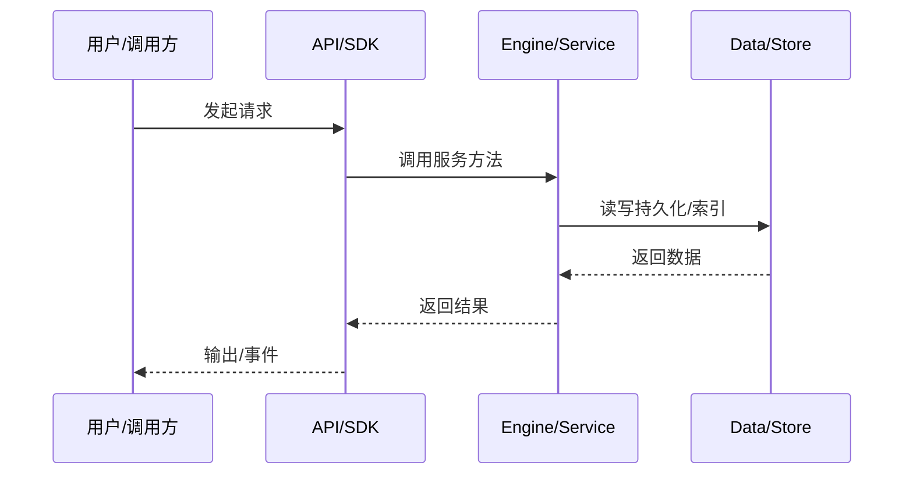

# 事件与 WS 推送

引擎内部事件如何变成客户端可见的 WS 帧。

## EventBus

agent-core-v2 `IEventBus` 发布 `Event2` 对象。

## Wire Records

需要持久化的状态变更写入 wire records。

## Server Broadcast

kap-server 的 WS broadcaster 把 session/agent 事件转成 envelope。

## 客户端

klient `events.*` 订阅并解析。

## 专业实现要点（开发流程视角）

### 需求分析

数据流文档要回答“一个请求从哪里来、经过哪些服务、最终写到哪里”。

### 设计决策

用事件驱动解耦引擎与 UI；用 transcript 记录可重放状态；用 minidb read model 加速查询。

### 实现步骤

识别入口 API → 跟踪 service 调用链 → 标注持久化点 → 标注事件/WS 推送。

### 验证方式

通过 e2e、klient conformance suite、WS 订阅测试验证链路。

### 维护注意

异步链路要处理取消、重试、幂等；持久化要保证崩溃安全。

## 逐函数实现说明

以下按源码文件列出可验证的导出函数/类，并给出实现职责说明。

### packages/agent-core-v2/src/app/event/errors.ts

| 类 | 行号 | 声明 | 实现说明 |
| --- | --- | --- | --- |
| `EventError` | 30 | `export class EventError extends Error2 {` | 该类封装本文模块的核心状态与行为。 |

### packages/agent-core-v2/src/app/event/event2.ts

| 函数 | 行号 | 签名 | 实现说明 |
| --- | --- | --- | --- |
| `registerEvent2Class` | 70 | `export function registerEvent2Class(cls: Event2Class<any, any>): void {` | `registerEvent2Class` 是本文涉及模块中的一个导出函数/类，具体语义以源码实现为准。 |

| 类 | 行号 | 声明 | 实现说明 |
| --- | --- | --- | --- |
| `DuplicateEventError` | 11 | `export class DuplicateEventError extends EventError {` | 该类封装本文模块的核心状态与行为。 |
| `Event2` | 22 | `export abstract class Event2<P = Record<string, unknown>> {` | 该类封装本文模块的核心状态与行为。 |
| `AgentEvent2` | 53 | `export abstract class AgentEvent2<P extends AgentDomainTrait> extends Event2<P> {` | 该类封装本文模块的核心状态与行为。 |

### packages/agent-core-v2/src/app/event/eventBusService.ts

| 类 | 行号 | 声明 | 实现说明 |
| --- | --- | --- | --- |
| `EventBusService` | 12 | `export class EventBusService extends Service implements ISessionEventBus {` | 该类封装本文模块的核心状态与行为。 |
| `AgentEventBusView` | 109 | `export class AgentEventBusView extends Service implements IEventBus {` | 该类封装本文模块的核心状态与行为。 |

### packages/agent-core-v2/src/app/event/eventService.ts

| 类 | 行号 | 声明 | 实现说明 |
| --- | --- | --- | --- |
| `EventService` | 10 | `export class EventService extends Service implements IEventService {` | 该类封装本文模块的核心状态与行为。 |

### packages/kap-server/src/transport/ws/bearerProtocol.ts

| 函数 | 行号 | 签名 | 实现说明 |
| --- | --- | --- | --- |
| `extractWsBearerToken` | 3 | `export function extractWsBearerToken(protocolHeader: string \| undefined): string \| null {` | `extractWsBearerToken` 是本文涉及模块中的一个导出函数/类，具体语义以源码实现为准。 |
| `selectWsBearerProtocol` | 17 | `export function selectWsBearerProtocol(protocols: Iterable<string>): string \| false {` | `selectWsBearerProtocol` 是本文涉及模块中的一个导出函数/类，具体语义以源码实现为准。 |

### packages/kap-server/src/transport/ws/connectionRegistry.ts

| 类 | 行号 | 声明 | 实现说明 |
| --- | --- | --- | --- |
| `ConnectionRegistry` | 26 | `export class ConnectionRegistry implements IConnectionRegistry {` | 该类封装本文模块的核心状态与行为。 |

### packages/kap-server/src/transport/ws/v1/events.ts

| 函数 | 行号 | 签名 | 实现说明 |
| --- | --- | --- | --- |
| `isVolatileEventType` | 266 | `export function isVolatileEventType(type: string): type is VolatileEventType {` | `isVolatileEventType` 是本文涉及模块中的一个导出函数/类，具体语义以源码实现为准。 |

### packages/kap-server/src/transport/ws/v1/fsWatchBridge.ts

| 类 | 行号 | 声明 | 实现说明 |
| --- | --- | --- | --- |
| `FsWatchBridge` | 74 | `export class FsWatchBridge {` | 该类封装本文模块的核心状态与行为。 |

### packages/kap-server/src/transport/ws/v1/inFlightTurnTracker.ts

| 类 | 行号 | 声明 | 实现说明 |
| --- | --- | --- | --- |
| `InFlightTurnTracker` | 31 | `export class InFlightTurnTracker {` | 该类封装本文模块的核心状态与行为。 |

### packages/kap-server/src/transport/ws/v1/protocol.ts

| 函数 | 行号 | 签名 | 实现说明 |
| --- | --- | --- | --- |
| `buildServerHello` | 19 | `export function buildServerHello(payload: ServerHelloPayload): ServerHelloFrame {` | `buildServerHello` 负责创建/构建相关对象或流程。 |
| `buildPing` | 29 | `export function buildPing(nonce: string): PingFrame {` | `buildPing` 负责创建/构建相关对象或流程。 |
| `buildResyncRequired` | 58 | `export function buildResyncRequired(` | `buildResyncRequired` 负责创建/构建相关对象或流程。 |

### packages/kap-server/src/transport/ws/v1/registerWsV1.ts

| 函数 | 行号 | 签名 | 实现说明 |
| --- | --- | --- | --- |
| `registerWsV1` | 29 | `export function registerWsV1(core: Scope, opts: RegisterWsV1Options): WebSocketServer {` | `registerWsV1` 是本文涉及模块中的一个导出函数/类，具体语义以源码实现为准。 |

### packages/kap-server/src/transport/ws/v1/sessionEventBroadcaster.ts

| 类 | 行号 | 声明 | 实现说明 |
| --- | --- | --- | --- |
| `SessionEventBroadcaster` | 147 | `export class SessionEventBroadcaster {` | 该类封装本文模块的核心状态与行为。 |

### packages/kap-server/src/transport/ws/v1/sessionEventJournal.ts

| 函数 | 行号 | 签名 | 实现说明 |
| --- | --- | --- | --- |
| `sessionJournalPath` | 195 | `export function sessionJournalPath(eventsDir: string, sessionId: string): string {` | `sessionJournalPath` 是本文涉及模块中的一个导出函数/类，具体语义以源码实现为准。 |

| 类 | 行号 | 声明 | 实现说明 |
| --- | --- | --- | --- |
| `SessionEventJournal` | 50 | `export class SessionEventJournal {` | 该类封装本文模块的核心状态与行为。 |

### packages/kap-server/src/transport/ws/v1/subagentRosterTracker.ts

| 类 | 行号 | 声明 | 实现说明 |
| --- | --- | --- | --- |
| `SubagentRosterTracker` | 6 | `export class SubagentRosterTracker {` | 该类封装本文模块的核心状态与行为。 |

### packages/kap-server/src/transport/ws/v1/wsConnectionV1.ts

| 函数 | 行号 | 签名 | 实现说明 |
| --- | --- | --- | --- |
| `coalesceFrames` | 675 | `export function coalesceFrames(frames: readonly unknown[]): unknown[] {` | `coalesceFrames` 是本文涉及模块中的一个导出函数/类，具体语义以源码实现为准。 |

| 类 | 行号 | 声明 | 实现说明 |
| --- | --- | --- | --- |
| `WsConnectionV1` | 82 | `export class WsConnectionV1 implements BroadcastTarget {` | 该类封装本文模块的核心状态与行为。 |


## 核心代码片段

以下片段直接从仓库源码截取，用于展示关键实现形态；完整实现请打开对应文件。

### 来自 `packages/agent-core-v2/src/app/event/errors.ts` 的 `EventError`

源码位置：`packages/agent-core-v2/src/app/event/errors.ts:30` 附近。

```ts
export class EventError extends Error2 {
  constructor(code: EventErrorCode, message: string, options?: Error2Options) {
    super(code, message, options);
    this.name = 'EventError';
  }
}
```

### 来自 `packages/agent-core-v2/src/app/event/event2.ts` 的 `registerEvent2Class`

源码位置：`packages/agent-core-v2/src/app/event/event2.ts:70` 附近。

```ts
export function registerEvent2Class(cls: Event2Class<any, any>): void {
  if (!cls.durable) return;
  if (cls.schema === undefined) {
    throw new EventError(
      EventErrors.codes.EVENT_SCHEMA_MISSING,
      `Durable event '${cls.type}' must declare a payload schema`,
      { details: { type: cls.type } },
    );
  }
  const existing = EVENT2_REGISTRY.get(cls.type);
  if (existing === cls) return;
  if (existing !== undefined) {
    throw new DuplicateEventError(cls.type);
  }
  EVENT2_REGISTRY.set(cls.type, cls);
}
```

### 来自 `packages/agent-core-v2/src/app/event/eventBusService.ts` 的 `EventBusService`

源码位置：`packages/agent-core-v2/src/app/event/eventBusService.ts:12` 附近。

```ts
export class EventBusService extends Service implements ISessionEventBus {
  declare readonly _serviceBrand: undefined;

  private readonly allEmitter = this._register(new Emitter<Event2<any>>('*'));
  private readonly perType = new Map<string, Emitter<Event2<any>>>();
  private readonly agents = new Map<string, AgentContext>();
  private readonly sources = new WeakMap<Event2<any>, AgentContext>();

  activateAgent(agent: AgentContext): void {
    this.agents.set(agent.agentId, agent);
  }

  deactivateAgent(agent: AgentContext): void {
    if (this.agents.get(agent.agentId) === agent) this.agents.delete(agent.agentId);
  }

  publish(event: Event2<any>, agent?: AgentContext): void {
    const cls = event.constructor as Event2Class;
    if (cls.agentDomain) {
      if (
        agent === undefined ||
        this.agents.get(agent.agentId) !== agent ||
        (event as Event2<any> & AgentDomainTrait).agentId !== agent.agentId
      ) {
// ...
```


## 时序/状态图



> 图注：`06-data-flow/event-flow.md` 的抽象流程；具体参与者与状态以源码和上文函数说明为准。

## 核心实现细节（源码导出）

以下是本文涉及路径中的真实源码导出/结构，帮助你把概念映射到函数、类与方法：

  - `packages/agent-core-v2/src/app/event//` 目录下源码文件示例：
    - `packages/agent-core-v2/src/app/event/errors.ts`
    - `packages/agent-core-v2/src/app/event/event.ts`
    - `packages/agent-core-v2/src/app/event/event2.ts`
    - `packages/agent-core-v2/src/app/event/eventBus.ts`
    - `packages/agent-core-v2/src/app/event/eventBusService.ts`
    - `packages/agent-core-v2/src/app/event/eventService.ts`
    - `packages/agent-core-v2/src/app/event/fiberEventResolver.ts`
  - `packages/kap-server/src/transport/ws//` 目录下源码文件示例：
    - `packages/kap-server/src/transport/ws/bearerProtocol.ts`
    - `packages/kap-server/src/transport/ws/connectionRegistry.ts`
    - `packages/kap-server/src/transport/ws/v1/events.ts`
    - `packages/kap-server/src/transport/ws/v1/fsWatchBridge.ts`
    - `packages/kap-server/src/transport/ws/v1/inFlightTurnTracker.ts`
    - `packages/kap-server/src/transport/ws/v1/protocol.ts`
    - `packages/kap-server/src/transport/ws/v1/registerWsV1.ts`
    - `packages/kap-server/src/transport/ws/v1/sessionEventBroadcaster.ts`
    - `packages/kap-server/src/transport/ws/v1/sessionEventJournal.ts`
    - `packages/kap-server/src/transport/ws/v1/subagentRosterTracker.ts`
    - `packages/kap-server/src/transport/ws/v1/wsConnectionV1.ts`
  - `packages/klient/src/contract/agent/events.ts`：
    - 导出签名/声明：
      - `export const turnStartedEventSchema = z.object({`
      - `export const turnEndedEventSchema = z.object({`
      - `export const assistantDeltaEventSchema = z.object({`
      - `export const thinkingDeltaEventSchema = z.object({`
      - `export const toolCallStartedEventSchema = z.object({`
      - `export const toolCallDeltaEventSchema = z.object({`
      - `export const toolProgressEventSchema = z.object({`
      - `export const toolResultEventSchema = z.object({`
      - `export const promptCompletedEventSchema = z.object({`
      - `export const promptAbortedEventSchema = z.object({`
      - `export const compactionStartedEventSchema = z.object({`
      - `export const compactionBlockedEventSchema = z.object({`
      - `export const compactionCancelledEventSchema = z.object({`
      - `export const compactionCompletedEventSchema = z.object({`
      - `export const permissionApprovalRequestedEventSchema = z.looseObject({`
      - `export const permissionApprovalResolvedEventSchema = z.looseObject({`
      - `export const errorEventSchema = z.looseObject({`
      - `export const warningEventSchema = z.object({`
      - `export const agentStatusUpdatedEventSchema = z.looseObject({`
      - `export interface AgentEventPayloads {`
      - `export type AgentEventName = keyof AgentEventPayloads;`
      - `export const agentEvents = {`

## 证据与代码位置

- `packages/agent-core-v2/src/app/event/`
- `packages/kap-server/src/transport/ws/`
- `packages/klient/src/contract/agent/events.ts`

> 本文所有路径均相对仓库根目录；引用内容以仓库当前 `HEAD` 为准。
