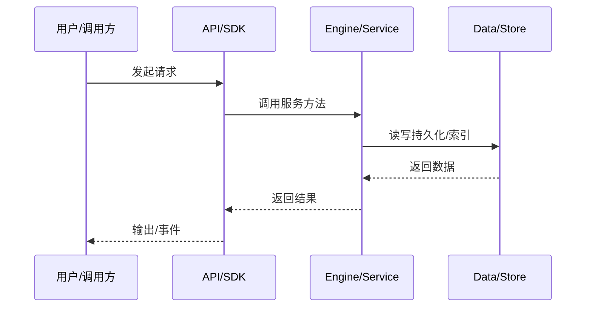

# 持久化数据流

会话状态何时写盘、何时只留在内存。

## Session 写盘

消息、metadata、records 写 session 目录；close/checkpoint 时 flush。

## Read Model

session summary 通过 mirror 异步进入 minidb query store。

## Compaction

上下文压缩会生成 summary 写回 transcript。

## Blob

媒体文件存 blobs，消息里存引用。

## 专业实现要点（开发流程视角）

### 需求分析

数据流文档要回答“一个请求从哪里来、经过哪些服务、最终写到哪里”。

### 设计决策

用事件驱动解耦引擎与 UI；用 transcript 记录可重放状态；用 minidb read model 加速查询。

### 实现步骤

识别入口 API → 跟踪 service 调用链 → 标注持久化点 → 标注事件/WS 推送。

### 验证方式

通过 e2e、klient conformance suite、WS 订阅测试验证链路。

### 维护注意

异步链路要处理取消、重试、幂等；持久化要保证崩溃安全。

## 逐函数实现说明

以下按源码文件列出可验证的导出函数/类，并给出实现职责说明。

### packages/agent-core-v2/src/persistence/backends/memory/inMemoryStorageService.ts

| 类 | 行号 | 声明 | 实现说明 |
| --- | --- | --- | --- |
| `InMemoryStorageService` | 21 | `export class InMemoryStorageService implements IFileSystemStorageService {` | 该类封装本文模块的核心状态与行为。 |

### packages/agent-core-v2/src/persistence/backends/minidb/miniDbQueryStore.ts

| 函数 | 行号 | 签名 | 实现说明 |
| --- | --- | --- | --- |
| `drainQueryStoreDisposals` | 47 | `export async function drainQueryStoreDisposals(): Promise<void> {` | `drainQueryStoreDisposals` 是本文涉及模块中的一个导出函数/类，具体语义以源码实现为准。 |

| 类 | 行号 | 声明 | 实现说明 |
| --- | --- | --- | --- |
| `MiniDbQueryStore` | 51 | `export class MiniDbQueryStore extends Disposable implements IQueryStore {` | 该类封装本文模块的核心状态与行为。 |

### packages/agent-core-v2/src/persistence/backends/node-fs/appendLogStore.ts

| 函数 | 行号 | 签名 | 实现说明 |
| --- | --- | --- | --- |
| `drainAppendLogRetirements` | 16 | `export async function drainAppendLogRetirements(): Promise<void> {` | `drainAppendLogRetirements` 是本文涉及模块中的一个导出函数/类，具体语义以源码实现为准。 |

| 类 | 行号 | 声明 | 实现说明 |
| --- | --- | --- | --- |
| `AppendLogStore` | 35 | `export class AppendLogStore implements IAppendLogStore {` | 该类封装本文模块的核心状态与行为。 |

### packages/agent-core-v2/src/persistence/backends/node-fs/atomicDocumentStore.ts

| 类 | 行号 | 声明 | 实现说明 |
| --- | --- | --- | --- |
| `JsonAtomicDocumentStore` | 86 | `export class JsonAtomicDocumentStore extends AtomicDocumentStoreBase {` | 该类封装本文模块的核心状态与行为。 |
| `TomlAtomicDocumentStore` | 92 | `export class TomlAtomicDocumentStore extends AtomicDocumentStoreBase {` | 该类封装本文模块的核心状态与行为。 |

### packages/agent-core-v2/src/persistence/backends/node-fs/blobStoreService.ts

| 类 | 行号 | 声明 | 实现说明 |
| --- | --- | --- | --- |
| `BlobStoreService` | 7 | `export class BlobStoreService implements IBlobStore {` | 该类封装本文模块的核心状态与行为。 |

### packages/agent-core-v2/src/persistence/backends/node-fs/fileStorageService.ts

| 类 | 行号 | 声明 | 实现说明 |
| --- | --- | --- | --- |
| `FileStorageService` | 25 | `export class FileStorageService implements IFileSystemStorageService {` | 该类封装本文模块的核心状态与行为。 |

### packages/agent-core-v2/src/persistence/backends/node-fs/projectLocalConfigService.ts

| 类 | 行号 | 声明 | 实现说明 |
| --- | --- | --- | --- |
| `FileProjectLocalConfigService` | 30 | `export class FileProjectLocalConfigService implements IProjectLocalConfigService {` | 该类封装本文模块的核心状态与行为。 |

### packages/agent-core-v2/src/persistence/interface/appendLogStore.ts

| 类 | 行号 | 声明 | 实现说明 |
| --- | --- | --- | --- |
| `AppendLogCorruptedError` | 6 | `export class AppendLogCorruptedError extends StorageError {` | 该类封装本文模块的核心状态与行为。 |

### packages/agent-core-v2/src/persistence/interface/storage.ts

| 函数 | 行号 | 签名 | 实现说明 |
| --- | --- | --- | --- |
| `isStorageError` | 72 | `export function isStorageError(error: unknown, code: StorageErrorCode): boolean {` | `isStorageError` 是本文涉及模块中的一个导出函数/类，具体语义以源码实现为准。 |
| `toStorageIoError` | 109 | `export function toStorageIoError(error: unknown, ctx: { path: string; op: string }): StorageError {` | `toStorageIoError` 是本文涉及模块中的一个导出函数/类，具体语义以源码实现为准。 |

| 类 | 行号 | 声明 | 实现说明 |
| --- | --- | --- | --- |
| `StorageError` | 65 | `export class StorageError extends Error2 {` | 该类封装本文模块的核心状态与行为。 |

### packages/agent-core-v2/src/agent/contextMemory/compactionHandoff.ts

| 函数 | 行号 | 签名 | 实现说明 |
| --- | --- | --- | --- |
| `buildContextCompactionShape` | 60 | `export function buildContextCompactionShape(` | `buildContextCompactionShape` 负责创建/构建相关对象或流程。 |
| `buildCompactionSummaryText` | 120 | `export function buildCompactionSummaryText(summary: string): string {` | `buildCompactionSummaryText` 负责创建/构建相关对象或流程。 |
| `createCompactionSummaryMessage` | 125 | `export function createCompactionSummaryMessage(text: string): ContextMessage {` | `createCompactionSummaryMessage` 负责创建/构建相关对象或流程。 |
| `createCompactionElisionMessage` | 134 | `export function createCompactionElisionMessage(omittedTokens: number): ContextMessage {` | `createCompactionElisionMessage` 负责创建/构建相关对象或流程。 |
| `buildCompactionElisionText` | 143 | `export function buildCompactionElisionText(omittedTokens: number): string {` | `buildCompactionElisionText` 负责创建/构建相关对象或流程。 |
| `isCompactionSummaryMessage` | 155 | `export function isCompactionSummaryMessage(message: MessageLike): boolean {` | `isCompactionSummaryMessage` 是本文涉及模块中的一个导出函数/类，具体语义以源码实现为准。 |
| `isRealUserInput` | 159 | `export function isRealUserInput(message: MessageLike): boolean {` | `isRealUserInput` 是本文涉及模块中的一个导出函数/类，具体语义以源码实现为准。 |
| `compactionUserMessageDisposition` | 163 | `export function compactionUserMessageDisposition(` | `compactionUserMessageDisposition` 是本文涉及模块中的一个导出函数/类，具体语义以源码实现为准。 |

### packages/agent-core-v2/src/agent/contextMemory/contextEvents.ts

| 类 | 行号 | 声明 | 实现说明 |
| --- | --- | --- | --- |
| `ContextAppendMessage` | 17 | `export class ContextAppendMessage extends AgentEvent2<` | 该类封装本文模块的核心状态与行为。 |
| `ContextAppendLoopEvent` | 34 | `export class ContextAppendLoopEvent extends AgentEvent2<` | 该类封装本文模块的核心状态与行为。 |
| `ContextClear` | 48 | `export class ContextClear extends AgentEvent2<z.infer<typeof contextClearSchema>> {` | 该类封装本文模块的核心状态与行为。 |
| `ContextApplyCompaction` | 91 | `export class ContextApplyCompaction extends AgentEvent2<ContextApplyCompactionPayload> {` | 该类封装本文模块的核心状态与行为。 |
| `ContextUndo` | 102 | `export class ContextUndo extends AgentEvent2<z.infer<typeof contextUndoSchema>> {` | 该类封装本文模块的核心状态与行为。 |
| `ContextSpliced` | 120 | `export class ContextSpliced extends AgentEvent2<ContextSplicedPayload> {` | 该类封装本文模块的核心状态与行为。 |

### packages/agent-core-v2/src/agent/contextMemory/contextMemoryService.ts

| 类 | 行号 | 声明 | 实现说明 |
| --- | --- | --- | --- |
| `AgentContextMemoryService` | 33 | `export class AgentContextMemoryService extends Disposable implements IAgentContextMemoryService {` | 该类封装本文模块的核心状态与行为。 |

### packages/agent-core-v2/src/agent/contextMemory/contextOps.ts

| 函数 | 行号 | 签名 | 实现说明 |
| --- | --- | --- | --- |
| `popSwarmModeReminder` | 109 | `export function popSwarmModeReminder(state: ContextMessage[]): ContextMessage[] {` | `popSwarmModeReminder` 是本文涉及模块中的一个导出函数/类，具体语义以源码实现为准。 |
| `applyContextCompactionRecord` | 121 | `export function applyContextCompactionRecord(` | `applyContextCompactionRecord` 是本文涉及模块中的一个导出函数/类，具体语义以源码实现为准。 |
| `readContextCompactionShapeInput` | 129 | `export function readContextCompactionShapeInput(` | `readContextCompactionShapeInput` 负责读取或查询数据。 |
| `readContextCompactedCount` | 149 | `export function readContextCompactedCount(record: ContextCompactionRecord): number {` | `readContextCompactedCount` 负责读取或查询数据。 |
| `readContextCompactionSummary` | 168 | `export function readContextCompactionSummary(record: ContextCompactionRecord): ContextMessage {` | `readContextCompactionSummary` 负责读取或查询数据。 |
| `computeUndoCut` | 249 | `export function computeUndoCut(state: readonly ContextMessage[], count: number): UndoCut {` | `computeUndoCut` 是本文涉及模块中的一个导出函数/类，具体语义以源码实现为准。 |
| `isFullyUndoable` | 276 | `export function isFullyUndoable(cut: UndoCut, count: number): boolean {` | `isFullyUndoable` 是本文涉及模块中的一个导出函数/类，具体语义以源码实现为准。 |
| `precheckUndo` | 295 | `export function precheckUndo(history: readonly ContextMessage[], count: number): UndoPrecheck {` | `precheckUndo` 是本文涉及模块中的一个导出函数/类，具体语义以源码实现为准。 |
| `formatUndoUnavailableMessage` | 306 | `export function formatUndoUnavailableMessage(` | `formatUndoUnavailableMessage` 是本文涉及模块中的一个导出函数/类，具体语义以源码实现为准。 |

### packages/agent-core-v2/src/agent/contextMemory/contextTranscript.ts

| 函数 | 行号 | 签名 | 实现说明 |
| --- | --- | --- | --- |
| `reduceContextTranscript` | 40 | `export function reduceContextTranscript(records: Iterable<WireRecord>): ContextTranscript {` | `reduceContextTranscript` 是本文涉及模块中的一个导出函数/类，具体语义以源码实现为准。 |
| `createContextTranscriptReducer` | 46 | `export function createContextTranscriptReducer(): ContextTranscriptReducer {` | `createContextTranscriptReducer` 负责创建/构建相关对象或流程。 |

### packages/agent-core-v2/src/agent/contextMemory/conversationTime.ts

| 函数 | 行号 | 签名 | 实现说明 |
| --- | --- | --- | --- |
| `isUndoAnchor` | 11 | `export function isUndoAnchor(message: ContextMessage): boolean {` | `isUndoAnchor` 是本文涉及模块中的一个导出函数/类，具体语义以源码实现为准。 |
| `isPromptOwnedInjection` | 21 | `export function isPromptOwnedInjection(` | `isPromptOwnedInjection` 是本文涉及模块中的一个导出函数/类，具体语义以源码实现为准。 |
| `isValidUndoCount` | 33 | `export function isValidUndoCount(count: number): boolean {` | `isValidUndoCount` 是本文涉及模块中的一个导出函数/类，具体语义以源码实现为准。 |

### packages/agent-core-v2/src/agent/contextMemory/loopEventFold.ts

| 函数 | 行号 | 签名 | 实现说明 |
| --- | --- | --- | --- |
| `createLoopEventFold` | 84 | `export function createLoopEventFold(sink: LoopEventFoldSink): LoopEventFold {` | `createLoopEventFold` 负责创建/构建相关对象或流程。 |
| `foldAppendMessage` | 225 | `export function foldAppendMessage(` | `foldAppendMessage` 是本文涉及模块中的一个导出函数/类，具体语义以源码实现为准。 |
| `foldLoopEvent` | 234 | `export function foldLoopEvent(` | `foldLoopEvent` 是本文涉及模块中的一个导出函数/类，具体语义以源码实现为准。 |
| `resetFold` | 243 | `export function resetFold(state: readonly ContextMessage[]): readonly ContextMessage[] {` | `resetFold` 是本文涉及模块中的一个导出函数/类，具体语义以源码实现为准。 |

### packages/agent-core-v2/src/agent/contextMemory/messageId.ts

| 函数 | 行号 | 签名 | 实现说明 |
| --- | --- | --- | --- |
| `newMessageId` | 3 | `export function newMessageId(): string {` | `newMessageId` 是本文涉及模块中的一个导出函数/类，具体语义以源码实现为准。 |

### packages/agent-core-v2/src/agent/contextMemory/openToolExchange.ts

| 函数 | 行号 | 签名 | 实现说明 |
| --- | --- | --- | --- |
| `closeTrailingOpenToolExchange` | 8 | `export function closeTrailingOpenToolExchange(` | `closeTrailingOpenToolExchange` 是本文涉及模块中的一个导出函数/类，具体语义以源码实现为准。 |

### packages/agent-core-v2/src/agent/contextMemory/toolResultRender.ts

| 函数 | 行号 | 签名 | 实现说明 |
| --- | --- | --- | --- |
| `renderToolResultForModel` | 15 | `export function renderToolResultForModel(result: RenderableToolResult): ContentPart[] {` | `renderToolResultForModel` 是本文涉及模块中的一个导出函数/类，具体语义以源码实现为准。 |

### packages/agent-core-v2/src/agent/contextMemory/vacuousContent.ts

| 函数 | 行号 | 签名 | 实现说明 |
| --- | --- | --- | --- |
| `isVacuousContentPart` | 3 | `export function isVacuousContentPart(part: ContentPart): boolean {` | `isVacuousContentPart` 是本文涉及模块中的一个导出函数/类，具体语义以源码实现为准。 |

### packages/minidb/src/write-path.ts

| 类 | 行号 | 声明 | 实现说明 |
| --- | --- | --- | --- |
| `WritePath` | 70 | `export class WritePath<V> {` | 该类封装本文模块的核心状态与行为。 |


## 核心代码片段

以下片段直接从仓库源码截取，用于展示关键实现形态；完整实现请打开对应文件。

### 来自 `packages/agent-core-v2/src/persistence/backends/memory/inMemoryStorageService.ts` 的 `InMemoryStorageService`

源码位置：`packages/agent-core-v2/src/persistence/backends/memory/inMemoryStorageService.ts:21` 附近。

```ts
export class InMemoryStorageService implements IFileSystemStorageService {
  declare readonly _serviceBrand: undefined;

  private readonly scopes = new Map<string, Map<string, Uint8Array>>();
  private readonly watchers = new Map<string, WatchEntry>();

  async read(scope: string, key: string): Promise<Uint8Array | undefined> {
    return this.scopes.get(scope)?.get(key);
  }

  async *readStream(
    scope: string,
    key: string,
    range?: StorageReadRange,
  ): AsyncIterable<Uint8Array> {
    const data = this.scopes.get(scope)?.get(key);
    if (data === undefined) return;
    if (range === undefined) {
      yield data;
      return;
    }
    const start = Math.max(0, range.start);
    const end = Math.min(data.byteLength, range.end + 1);
    if (start < end) yield data.subarray(start, end);
// ...
```

### 来自 `packages/agent-core-v2/src/persistence/backends/minidb/miniDbQueryStore.ts` 的 `drainQueryStoreDisposals`

源码位置：`packages/agent-core-v2/src/persistence/backends/minidb/miniDbQueryStore.ts:47` 附近。

```ts
export async function drainQueryStoreDisposals(): Promise<void> {
  await Promise.all(pendingDisposals);
}

export class MiniDbQueryStore extends Disposable implements IQueryStore {
  declare readonly _serviceBrand: undefined;

  private readonly dir: string;
  private dbPromise: Promise<ClusterDb> | undefined;
  private rebuildPromise: Promise<void> | undefined;
  private readonly ensuredIndexes = new Set<string>();

  constructor(
    @IBootstrapService private readonly bootstrap: IBootstrapService,
    @ILogService private readonly log: ILogService,
  ) {
    super();
    this.dir = join(this.bootstrap.cacheDir, STORE_SUBDIR);
    this._register(toDisposable(() => {
      const pending = this.close().catch(() => {});
      pendingDisposals.add(pending);
      void pending.finally(() => pendingDisposals.delete(pending));
    }));
  }
// ...
```

### 来自 `packages/agent-core-v2/src/persistence/backends/node-fs/appendLogStore.ts` 的 `drainAppendLogRetirements`

源码位置：`packages/agent-core-v2/src/persistence/backends/node-fs/appendLogStore.ts:16` 附近。

```ts
export async function drainAppendLogRetirements(): Promise<void> {
  while (pendingRetirements.size > 0) {
    await Promise.all(pendingRetirements);
  }
}

interface LogState {
  pending: unknown[];
  flushPromise: Promise<void> | undefined;
  flushScheduled: boolean;
  storageFailure: { readonly error: unknown } | undefined;
  cutoverEpoch: number;
  refCount: number;
  retired: boolean;
  ready: Promise<void>;
  retirement: Promise<void> | undefined;
  onError?: (error: unknown) => void;
}

export class AppendLogStore implements IAppendLogStore {
  declare readonly _serviceBrand: undefined;

  private readonly logs = new Map<string, LogState>();

// ...
```


## 时序/状态图



> 图注：`06-data-flow/persistence-flow.md` 的抽象流程；具体参与者与状态以源码和上文函数说明为准。

## 核心实现细节（源码导出）

以下是本文涉及路径中的真实源码导出/结构，帮助你把概念映射到函数、类与方法：

  - `packages/agent-core-v2/src/persistence//` 目录下源码文件示例：
    - `packages/agent-core-v2/src/persistence/backends/memory/inMemoryStorageService.ts`
    - `packages/agent-core-v2/src/persistence/backends/minidb/flag.ts`
    - `packages/agent-core-v2/src/persistence/backends/minidb/miniDbQueryStore.ts`
    - `packages/agent-core-v2/src/persistence/backends/node-fs/appendLogStore.ts`
    - `packages/agent-core-v2/src/persistence/backends/node-fs/atomicDocumentStore.ts`
    - `packages/agent-core-v2/src/persistence/backends/node-fs/blobStoreService.ts`
    - `packages/agent-core-v2/src/persistence/backends/node-fs/fileStorageService.ts`
    - `packages/agent-core-v2/src/persistence/backends/node-fs/projectLocalConfigService.ts`
    - `packages/agent-core-v2/src/persistence/interface/appendLogStore.ts`
    - `packages/agent-core-v2/src/persistence/interface/atomicDocumentStore.ts`
    - `packages/agent-core-v2/src/persistence/interface/blobStore.ts`
    - `packages/agent-core-v2/src/persistence/interface/queryStore.ts`
    - `packages/agent-core-v2/src/persistence/interface/storage.ts`
  - `packages/minidb/src/write-path.ts`：
    - 导出签名/声明：
      - `export interface WritePathStats {`
      - `export interface WritePathDeps<V> {`
      - `export class WritePath<V>`
  - `packages/agent-core-v2/src/agent/contextMemory//` 目录下源码文件示例：
    - `packages/agent-core-v2/src/agent/contextMemory/compactionHandoff.ts`
    - `packages/agent-core-v2/src/agent/contextMemory/contextEvents.ts`
    - `packages/agent-core-v2/src/agent/contextMemory/contextMemory.ts`
    - `packages/agent-core-v2/src/agent/contextMemory/contextMemoryService.ts`
    - `packages/agent-core-v2/src/agent/contextMemory/contextOps.ts`
    - `packages/agent-core-v2/src/agent/contextMemory/contextTranscript.ts`
    - `packages/agent-core-v2/src/agent/contextMemory/conversationTime.ts`
    - `packages/agent-core-v2/src/agent/contextMemory/conversationUndoParticipants.ts`
    - `packages/agent-core-v2/src/agent/contextMemory/loopEventFold.ts`
    - `packages/agent-core-v2/src/agent/contextMemory/messageId.ts`
    - `packages/agent-core-v2/src/agent/contextMemory/openToolExchange.ts`
    - `packages/agent-core-v2/src/agent/contextMemory/toolResultRender.ts`
    - `packages/agent-core-v2/src/agent/contextMemory/types.ts`
    - `packages/agent-core-v2/src/agent/contextMemory/vacuousContent.ts`

## 证据与代码位置

- `packages/agent-core-v2/src/persistence/`
- `packages/minidb/src/write-path.ts`
- `packages/agent-core-v2/src/agent/contextMemory/`

> 本文所有路径均相对仓库根目录；引用内容以仓库当前 `HEAD` 为准。
