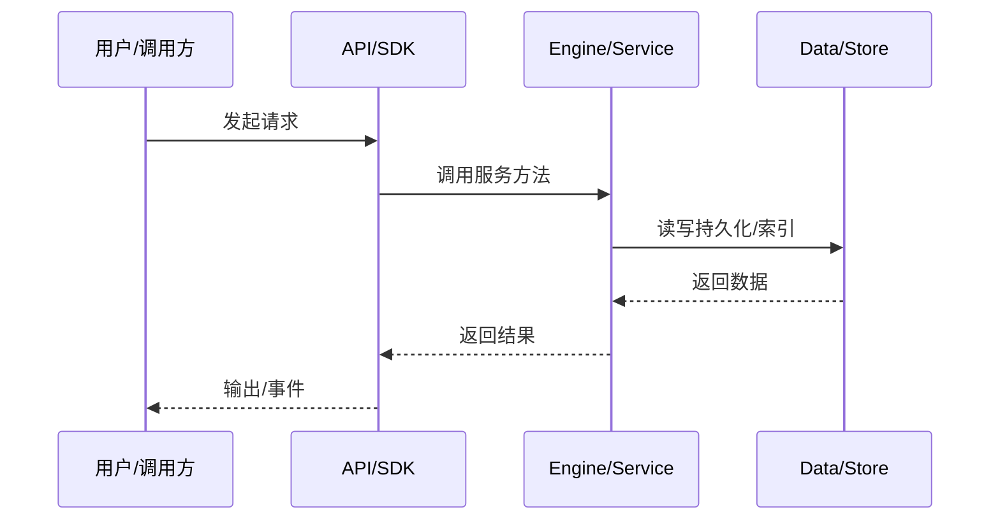

# 搜索索引数据流

session 数据如何进入 minidb 全文索引并被搜索。

## Mirror

Session summary mirror 排队写入 query store。

## Index

minidb text-index 对 transcript/文档建倒排索引，支持 CJK uni/bigram。

## Query

kap-server `/api/v1/search` 调用 search service，支持 live/index 模式。

## Generation

索引 generation 持久化，启动时加载 published generation + WAL replay。

## 专业实现要点（开发流程视角）

### 需求分析

数据流文档要回答“一个请求从哪里来、经过哪些服务、最终写到哪里”。

### 设计决策

用事件驱动解耦引擎与 UI；用 transcript 记录可重放状态；用 minidb read model 加速查询。

### 实现步骤

识别入口 API → 跟踪 service 调用链 → 标注持久化点 → 标注事件/WS 推送。

### 验证方式

通过 e2e、klient conformance suite、WS 订阅测试验证链路。

### 维护注意

异步链路要处理取消、重试、幂等；持久化要保证崩溃安全。

## 逐函数实现说明

以下按源码文件列出可验证的导出函数/类，并给出实现职责说明。

### packages/kap-server/src/search/searchService.ts

| 函数 | 行号 | 签名 | 实现说明 |
| --- | --- | --- | --- |
| `drainGlobalSearchDisposals` | 100 | `export async function drainGlobalSearchDisposals(): Promise<void> {` | `drainGlobalSearchDisposals` 是本文涉及模块中的一个导出函数/类，具体语义以源码实现为准。 |

| 类 | 行号 | 声明 | 实现说明 |
| --- | --- | --- | --- |
| `InlineSearchBackend` | 219 | `export class InlineSearchBackend implements SearchBackend {` | 该类封装本文模块的核心状态与行为。 |
| `GlobalSearchService` | 268 | `export class GlobalSearchService implements IGlobalSearchService {` | 该类封装本文模块的核心状态与行为。 |

### packages/kap-server/src/routes/search.ts

| 函数 | 行号 | 签名 | 实现说明 |
| --- | --- | --- | --- |
| `registerSearchRoutes` | 77 | `export function registerSearchRoutes(app: SearchRouteHost, core: Scope): void {` | `registerSearchRoutes` 是本文涉及模块中的一个导出函数/类，具体语义以源码实现为准。 |


## 核心代码片段

以下片段直接从仓库源码截取，用于展示关键实现形态；完整实现请打开对应文件。

### 来自 `packages/kap-server/src/search/searchService.ts` 的 `drainGlobalSearchDisposals`

源码位置：`packages/kap-server/src/search/searchService.ts:100` 附近。

```ts
export async function drainGlobalSearchDisposals(): Promise<void> {
  while (pendingDisposals.size > 0) {
    await Promise.all(pendingDisposals);
  }
}

export interface IGlobalSearchService {
  readonly _serviceBrand: undefined;
  search(query: GlobalSearchQuery): Promise<GlobalSearchPage>;
  /** Full rebuild: wipe the index and rescan every wire file. */
  reindex(): Promise<{ sessions: number; documents: number }>;
  /**
   * Diagnostic status (the `/api/v1/debug` surface reflects it). Never
   * throws: a backend that cannot answer (failed open, worker down) reports
   * a degraded lifecycle instead of rejecting. `lifecycle` is the aggregate
   * state machine (stage 5): stopped → opening → ready → building/degraded →
   * closing. NOTE the historical contract: the call may kick/await the
   * backend's open and read-only refresh — use `lifecycleReport()` for a
   * non-intrusive local read.
   */
  status(): Promise<{
    sessions: number;
    documents: number;
    lastIndexedAt: number | null;
// ...
```

### 来自 `packages/kap-server/src/routes/search.ts` 的 `registerSearchRoutes`

源码位置：`packages/kap-server/src/routes/search.ts:77` 附近。

```ts
export function registerSearchRoutes(app: SearchRouteHost, core: Scope): void {
  const route = defineRoute(
    {
      method: 'POST',
      path: '/search',
      body: searchMessagesBodySchema,
      success: { data: searchMessagesResponseSchema },
      errors: {
        [ErrorCode.VALIDATION_FAILED]: { detailsSchema },
      },
      description:
        'Global full-text search over user messages, assistant replies and session titles across all sessions',
      tags: ['search'],
    },
    async (req, reply) => {
      try {
        const page = await core.accessor.get(IGlobalSearchService).search(toServiceQuery(req.body));
        reply.send(okEnvelope(toWirePage(page), req.id));
      } catch (error) {
        if (
          error instanceof GlobalSearchError &&
          (error.reason === 'invalid_query' || error.reason === 'invalid_page_token')
        ) {
          reply.send(errEnvelope(ErrorCode.VALIDATION_FAILED, error.message, req.id, error.stack));
// ...
```


## 时序/状态图



> 图注：`06-data-flow/search-index-flow.md` 的抽象流程；具体参与者与状态以源码和上文函数说明为准。

## 核心实现细节（源码导出）

以下是本文涉及路径中的真实源码导出/结构，帮助你把概念映射到函数、类与方法：

  - `packages/minidb/AGENTS.md`（非 TS 源码，可直接阅读）
  - `packages/kap-server/src/search/searchService.ts`：
    - 导出签名/声明：
      - `export type { GlobalSearchErrorReason } from './contract';`
      - `export const SEARCH_WORKER_FLAG_ID = 'search_worker';`
      - `export async function drainGlobalSearchDisposals(): Promise<void>`
      - `export interface IGlobalSearchService {`
      - `export const IGlobalSearchService = createDecorator<IGlobalSearchService>('globalSearch');`
      - `export interface LiveTranscriptSource {`
      - `export interface SearchBackend {`
      - `export class InlineSearchBackend implements SearchBackend`
      - `export class GlobalSearchService implements IGlobalSearchService`
    - 类内方法（节选）：`dropLiveLockToken`
  - `packages/kap-server/src/routes/search.ts`：
    - 导出签名/声明：
      - `export function registerSearchRoutes(app: SearchRouteHost, core: Scope): void`

## 证据与代码位置

- `packages/minidb/AGENTS.md`
- `packages/kap-server/src/search/searchService.ts`
- `packages/kap-server/src/routes/search.ts`

> 本文所有路径均相对仓库根目录；引用内容以仓库当前 `HEAD` 为准。
