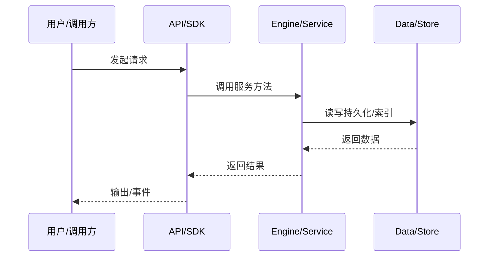

# REST API 请求流

一个 REST 请求从 Fastify 到 engine 服务到响应的路径。

## Route

Fastify route handler 校验参数/body，构造 request。

## Dispatcher

`transport/dispatcher.ts` 按 scope kind 解析 session/agent，调用 service 方法。

## Envelope

成功 `okEnvelope`，失败 `errEnvelope`。

## Auth

中间件先验证 bearer token、origin/host。

## 专业实现要点（开发流程视角）

### 需求分析

数据流文档要回答“一个请求从哪里来、经过哪些服务、最终写到哪里”。

### 设计决策

用事件驱动解耦引擎与 UI；用 transcript 记录可重放状态；用 minidb read model 加速查询。

### 实现步骤

识别入口 API → 跟踪 service 调用链 → 标注持久化点 → 标注事件/WS 推送。

### 验证方式

通过 e2e、klient conformance suite、WS 订阅测试验证链路。

### 维护注意

异步链路要处理取消、重试、幂等；持久化要保证崩溃安全。

## 逐函数实现说明

以下按源码文件列出可验证的导出函数/类，并给出实现职责说明。

### packages/kap-server/src/middleware/auth.ts

| 函数 | 行号 | 签名 | 实现说明 |
| --- | --- | --- | --- |
| `createAuthHook` | 61 | `export function createAuthHook(` | `createAuthHook` 负责创建/构建相关对象或流程。 |

### packages/kap-server/src/transport/dispatcher.ts

| 函数 | 行号 | 签名 | 实现说明 |
| --- | --- | --- | --- |
| `resolveScope` | 31 | `export async function resolveScope(` | `resolveScope` 是本文涉及模块中的一个导出函数/类，具体语义以源码实现为准。 |
| `resolveService` | 72 | `export async function resolveService(` | `resolveService` 是本文涉及模块中的一个导出函数/类，具体语义以源码实现为准。 |
| `dispatch` | 100 | `export async function dispatch(` | `dispatch` 是本文涉及模块中的一个导出函数/类，具体语义以源码实现为准。 |


## 核心代码片段

以下片段直接从仓库源码截取，用于展示关键实现形态；完整实现请打开对应文件。

### 来自 `packages/kap-server/src/middleware/auth.ts` 的 `createAuthHook`

源码位置：`packages/kap-server/src/middleware/auth.ts:61` 附近。

```ts
export function createAuthHook(
  authTokenService: IAuthTokenService,
  opts?: AuthHookOptions,
): (req: FastifyRequest, reply: FastifyReply) => Promise<FastifyReply | void> {
  const isBypassed = opts?.isBypassed ?? defaultIsBypassed;
  const validateCredential: CredentialValidator =
    opts?.validateCredential ?? ((candidate) => authTokenService.isValid(candidate));

  return async (req, reply) => {
    if (opts?.limiter?.isBanned(req.ip) === true) {
      return reply.code(429).send(errEnvelope(AUTH_RATE_LIMIT_CODE, AUTH_RATE_LIMIT_MSG, req.id));
    }

    const header = req.headers.authorization;
    const token = extractBearer(header);

    if (isBypassed(req)) {
      return;
    }

    if (header !== undefined) {
      req.headers.authorization = REDACTED;
    }

// ...
```

### 来自 `packages/kap-server/src/transport/dispatcher.ts` 的 `resolveScope`

源码位置：`packages/kap-server/src/transport/dispatcher.ts:31` 附近。

```ts
export async function resolveScope(
  core: Scope,
  scopeKind: ScopeKind,
  params: Record<string, string>,
): Promise<Scope | IScopeHandle> {
  switch (scopeKind) {
    case 'core':
      return core;
    case 'session': {
      const sessionId = params['session_id'] ?? '';
      const session = getLiveSessionById(core.accessor, sessionId);
      if (session === undefined) {
        throw new Error2(ErrorCodes.SESSION_NOT_FOUND, `session ${sessionId} not found`);
      }
      return session;
    }
    case 'agent': {
      const sessionId = params['session_id'] ?? '';
      const agentId = params['agent_id'] ?? '';
      const session = getLiveSessionById(core.accessor, sessionId);
      if (session === undefined) {
        throw new Error2(ErrorCodes.SESSION_NOT_FOUND, `session ${sessionId} not found`);
      }
      if (agentId === MAIN_AGENT_ID) return ensureMainAgent(session);
// ...
```


## 时序/状态图



> 图注：`06-data-flow/server-api-flow.md` 的抽象流程；具体参与者与状态以源码和上文函数说明为准。

## 核心实现细节（源码导出）

以下是本文涉及路径中的真实源码导出/结构，帮助你把概念映射到函数、类与方法：

  - `packages/kap-server/src/middleware/auth.ts`：
    - 导出签名/声明：
      - `export interface AuthHookOptions {`
      - `export function createAuthHook(
  authTokenService: IAuthTokenService,
  opts?: AuthHookOptions,
): (req: FastifyRequest, reply: FastifyReply) => Promise<Fas...`
  - `packages/kap-server/src/transport/dispatcher.ts`：
    - 导出签名/声明：
      - `export type ChannelLookup = (name: string) => ServiceIdentifier<unknown> | undefined;`
      - `export async function resolveScope(
  core: Scope,
  scopeKind: ScopeKind,
  params: Record<string, string>,
): Promise<Scope | IScopeHandle>`
      - `export async function resolveService(
  core: Scope,
  scopeKind: ScopeKind,
  params: Record<string, string>,
  serviceName: string,
  lookup: ChannelLookup...`
      - `export async function dispatch(
  core: Scope,
  scopeKind: ScopeKind,
  params: Record<string, string>,
  serviceName: string,
  method: string,
  arg: unkn...`
  - `packages/kap-server/src/envelope.ts`（未发现直接 export 符号，可能以副作用注册为主）

## 证据与代码位置

- `packages/kap-server/src/middleware/auth.ts`
- `packages/kap-server/src/transport/dispatcher.ts`
- `packages/kap-server/src/envelope.ts`

> 本文所有路径均相对仓库根目录；引用内容以仓库当前 `HEAD` 为准。
