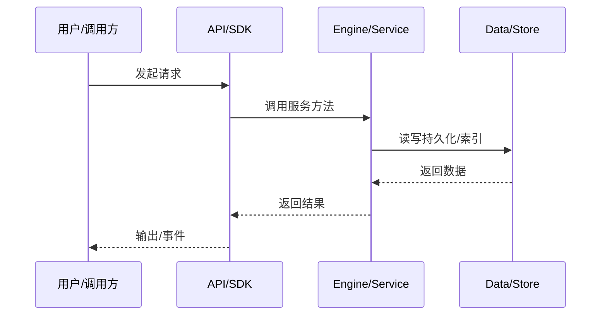

# 会话创建数据流

新会话从 API/SDK 到磁盘持久化的流程。

## API

`POST /api/v1/sessions` 或 `klient.global.sessions.create`。

## Engine

`ISessionIndex` → `workspaceLifecycle.handlerFor` → session lifecycle create。

## 持久化

session metadata、initial context、profile 写入 `~/.nighthawk/sessions/<id>`。

## 返回

session id、workspace id、title 等 summary。

## 专业实现要点（开发流程视角）

### 需求分析

数据流文档要回答“一个请求从哪里来、经过哪些服务、最终写到哪里”。

### 设计决策

用事件驱动解耦引擎与 UI；用 transcript 记录可重放状态；用 minidb read model 加速查询。

### 实现步骤

识别入口 API → 跟踪 service 调用链 → 标注持久化点 → 标注事件/WS 推送。

### 验证方式

通过 e2e、klient conformance suite、WS 订阅测试验证链路。

### 维护注意

异步链路要处理取消、重试、幂等；持久化要保证崩溃安全。

## 逐函数实现说明

以下按源码文件列出可验证的导出函数/类，并给出实现职责说明。

### packages/agent-core-v2/src/app/sessionIndex/sessionIndexMirrorService.ts

| 函数 | 行号 | 签名 | 实现说明 |
| --- | --- | --- | --- |
| `drainSessionIndexMirror` | 28 | `export async function drainSessionIndexMirror(): Promise<void> {` | `drainSessionIndexMirror` 是本文涉及模块中的一个导出函数/类，具体语义以源码实现为准。 |

| 类 | 行号 | 声明 | 实现说明 |
| --- | --- | --- | --- |
| `SessionIndexMirror` | 32 | `export class SessionIndexMirror extends Disposable implements ISessionIndexMirror {` | 该类封装本文模块的核心状态与行为。 |

### packages/agent-core-v2/src/app/sessionIndex/sessionIndexModel.ts

| 函数 | 行号 | 签名 | 实现说明 |
| --- | --- | --- | --- |
| `sessionCollection` | 12 | `export function sessionCollection(generation: number): string {` | `sessionCollection` 是本文涉及模块中的一个导出函数/类，具体语义以源码实现为准。 |
| `sessionCountersCollection` | 16 | `export function sessionCountersCollection(generation: number): string {` | `sessionCountersCollection` 是本文涉及模块中的一个导出函数/类，具体语义以源码实现为准。 |
| `recencyColumn` | 29 | `export function recencyColumn(generation: number): string {` | `recencyColumn` 是本文涉及模块中的一个导出函数/类，具体语义以源码实现为准。 |
| `withRecencyField` | 34 | `export function withRecencyField(generation: number, summary: SessionSummary): SessionSummary {` | `withRecencyField` 是本文涉及模块中的一个导出函数/类，具体语义以源码实现为准。 |
| `stripRecencyField` | 39 | `export function stripRecencyField(generation: number, record: SessionSummary): SessionSummary {` | `stripRecencyField` 是本文涉及模块中的一个导出函数/类，具体语义以源码实现为准。 |

### packages/agent-core-v2/src/app/sessionIndex/sessionIndexProjector.ts

| 类 | 行号 | 声明 | 实现说明 |
| --- | --- | --- | --- |
| `SessionIndexProjector` | 59 | `export class SessionIndexProjector {` | 该类封装本文模块的核心状态与行为。 |

### packages/agent-core-v2/src/app/sessionIndex/sessionIndexService.ts

| 类 | 行号 | 声明 | 实现说明 |
| --- | --- | --- | --- |
| `FileSessionIndex` | 70 | `export class FileSessionIndex extends Disposable implements ISessionIndex {` | 该类封装本文模块的核心状态与行为。 |

### packages/agent-core-v2/src/app/sessionIndex/sessionIndexSource.ts

| 函数 | 行号 | 签名 | 实现说明 |
| --- | --- | --- | --- |
| `parseTime` | 9 | `export function parseTime(value: unknown): number {` | `parseTime` 是本文涉及模块中的一个导出函数/类，具体语义以源码实现为准。 |
| `parseTurnOutcome` | 18 | `export function parseTurnOutcome(value: unknown): 'completed' \| 'cancelled' \| 'failed' \| undefined {` | `parseTurnOutcome` 是本文涉及模块中的一个导出函数/类，具体语义以源码实现为准。 |
| `recoverCwd` | 22 | `export function recoverCwd(meta: Record<string, unknown>): string \| undefined {` | `recoverCwd` 是本文涉及模块中的一个导出函数/类，具体语义以源码实现为准。 |
| `buildSessionSummary` | 38 | `export function buildSessionSummary(fields: {` | `buildSessionSummary` 负责创建/构建相关对象或流程。 |
| `summaryMatchesChildOf` | 66 | `export function summaryMatchesChildOf(` | `summaryMatchesChildOf` 是本文涉及模块中的一个导出函数/类，具体语义以源码实现为准。 |
| `summaryEquals` | 81 | `export function summaryEquals(a: SessionSummary, b: SessionSummary): boolean {` | `summaryEquals` 是本文涉及模块中的一个导出函数/类，具体语义以源码实现为准。 |
| `listWorkspaceIds` | 97 | `export async function listWorkspaceIds(` | `listWorkspaceIds` 负责读取或查询数据。 |
| `listSessionIds` | 108 | `export async function listSessionIds(` | `listSessionIds` 负责读取或查询数据。 |
| `readSessionSummary` | 120 | `export async function readSessionSummary(` | `readSessionSummary` 负责读取或查询数据。 |

### packages/kap-server/src/routes/sessions.ts

| 函数 | 行号 | 签名 | 实现说明 |
| --- | --- | --- | --- |
| `registerSessionsRoutes` | 166 | `export function registerSessionsRoutes(app: SessionRouteHost, core: Scope): void {` | `registerSessionsRoutes` 是本文涉及模块中的一个导出函数/类，具体语义以源码实现为准。 |
| `toWireSession` | 993 | `export function toWireSession(` | `toWireSession` 是本文涉及模块中的一个导出函数/类，具体语义以源码实现为准。 |
| `resolveSessionFacts` | 1040 | `export function resolveSessionFacts(core: Scope, sessionId: string): SessionFacts {` | `resolveSessionFacts` 是本文涉及模块中的一个导出函数/类，具体语义以源码实现为准。 |


## 核心代码片段

以下片段直接从仓库源码截取，用于展示关键实现形态；完整实现请打开对应文件。

### 来自 `packages/agent-core-v2/src/app/sessionIndex/sessionIndexMirrorService.ts` 的 `drainSessionIndexMirror`

源码位置：`packages/agent-core-v2/src/app/sessionIndex/sessionIndexMirrorService.ts:28` 附近。

```ts
export async function drainSessionIndexMirror(): Promise<void> {
  await Promise.all(pendingDrains);
}

export class SessionIndexMirror extends Disposable implements ISessionIndexMirror {
  declare readonly _serviceBrand: undefined;

  private readonly pendingMap = new Map<string, SessionSummary>();
  private readonly timer = this._register(new IntervalTimer({ unref: true }));
  private flushing: Promise<void> | undefined;
  private consecutiveFailures = 0;
  private disposed = false;
  private overflowLogged = false;

  constructor(
    @IQueryStore private readonly queryStore: IQueryStore,
    @IFlagService private readonly flags: IFlagService,
    @ILogService private readonly log: ILogService,
  ) {
    super();
    this._register(
      toDisposable(() => {
        this.disposed = true;
        const pending = this.drain().catch(() => {});
// ...
```

### 来自 `packages/agent-core-v2/src/app/sessionIndex/sessionIndexModel.ts` 的 `sessionCollection`

源码位置：`packages/agent-core-v2/src/app/sessionIndex/sessionIndexModel.ts:12` 附近。

```ts
export function sessionCollection(generation: number): string {
  return `session:g${generation}`;
}

export function sessionCountersCollection(generation: number): string {
  return `sessionCounters:g${generation}`;
}

/**
 * The ordered recency column for a generation. Column names are store-wide,
 * so the column is namespaced per generation: two coexisting generations
 * (one published, one being projected) then walk disjoint ordered
 * structures and can never interleave into each other's pages. The stored
 * record carries the same-named field — the engine orders by the column and
 * its cross-shard merge compares by the value field of that name — and the
 * index strips it again on every read.
 */
export function recencyColumn(generation: number): string {
  return `g${generation}:updatedAt`;
}

/** Attach the generation's recency field to a summary for storage. */
export function withRecencyField(generation: number, summary: SessionSummary): SessionSummary {
  return { ...summary, [recencyColumn(generation)]: summary.updatedAt };
// ...
```

### 来自 `packages/agent-core-v2/src/app/sessionIndex/sessionIndexProjector.ts` 的 `SessionIndexProjector`

源码位置：`packages/agent-core-v2/src/app/sessionIndex/sessionIndexProjector.ts:59` 附近。

```ts
export class SessionIndexProjector {
  private scanSlot: ScanSlot | undefined;

  constructor(private readonly deps: SessionIndexProjectorDeps) {}

  /**
   * The projection's scan: joins a running shared scan, reuses one that
   * settled within the reuse window, or starts a fresh one. The projection
   * publishes a point-in-time derived model by design, so a just-finished
   * snapshot is safe for it (the mirror queue and reconciliation heal the
   * gap) — and this is what keeps a fast first read + kicked projection
   * from scanning the directory tree twice.
   */
  sharedScan(): Promise<AuthoritativeScan> {
    const slot = this.scanSlot;
    if (slot !== undefined && (!slot.settled || Date.now() < slot.reusableUntil)) {
      return slot.promise;
    }
    return this.startScan();
  }

  /**
   * A fallback read's scan: joins a scan that is still in flight or starts a
   * fresh one. A settled snapshot is NEVER served to a read — it could
// ...
```


## 时序/状态图



> 图注：`06-data-flow/session-create-flow.md` 的抽象流程；具体参与者与状态以源码和上文函数说明为准。

## 核心实现细节（源码导出）

以下是本文涉及路径中的真实源码导出/结构，帮助你把概念映射到函数、类与方法：

  - `packages/kap-server/src/routes/sessions.ts`：
    - 导出签名/声明：
      - `export function registerSessionsRoutes(app: SessionRouteHost, core: Scope): void`
      - `export interface SessionWireFields {`
      - `export function toWireSession(
  fields: SessionWireFields,
  cwd: string,
  facts: SessionFacts,
): Session`
      - `export interface SessionFacts {`
      - `export function resolveSessionFacts(core: Scope, sessionId: string): SessionFacts`
  - `packages/agent-core-v2/src/app/sessionIndex//` 目录下源码文件示例：
    - `packages/agent-core-v2/src/app/sessionIndex/sessionIndex.ts`
    - `packages/agent-core-v2/src/app/sessionIndex/sessionIndexMirrorService.ts`
    - `packages/agent-core-v2/src/app/sessionIndex/sessionIndexModel.ts`
    - `packages/agent-core-v2/src/app/sessionIndex/sessionIndexProjector.ts`
    - `packages/agent-core-v2/src/app/sessionIndex/sessionIndexService.ts`
    - `packages/agent-core-v2/src/app/sessionIndex/sessionIndexSource.ts`
  - `packages/kap-server/src/protocol/rest-session.ts`：
    - 导出签名/声明：
      - `export type {`
      - `export const createSessionRequestSchema = sessionCreateSchema;`
      - `export type CreateSessionRequest = z.infer<typeof createSessionRequestSchema>;`
      - `export const createSessionResponseSchema = sessionSchema;`
      - `export type CreateSessionResponse = z.infer<typeof createSessionResponseSchema>;`
      - `export const listSessionsQuerySchema = cursorQuerySchema.and(`
      - `export type ListSessionsQuery = z.infer<typeof listSessionsQuerySchema>;`
      - `export const getSessionResponseSchema = sessionSchema;`
      - `export type GetSessionResponse = z.infer<typeof getSessionResponseSchema>;`
      - `export const getSessionProfileResponseSchema = sessionSchema;`
      - `export type GetSessionProfileResponse = z.infer<typeof getSessionProfileResponseSchema>;`
      - `export const MAX_SESSION_EXPORT_WEB_LOG_BYTES = 256 * 1024;`
      - `export const exportSessionParamsSchema = z.object({`
      - `export type ExportSessionParams = z.infer<typeof exportSessionParamsSchema>;`
      - `export const exportSessionRequestSchema = z`
      - `export type ExportSessionRequest = z.infer<typeof exportSessionRequestSchema>;`
      - `export const updateSessionProfileResponseSchema = sessionSchema;`
      - `export type UpdateSessionProfileResponse = z.infer<typeof updateSessionProfileResponseSchema>;`
      - `export const updateSessionMetaRequestSchema = updateSessionProfileRequestSchema;`
      - `export type UpdateSessionMetaRequest = UpdateSessionProfileRequest;`
      - `export const updateSessionMetaResponseSchema = updateSessionProfileResponseSchema;`
      - `export type UpdateSessionMetaResponse = UpdateSessionProfileResponse;`
      - `export const updateSessionRequestSchema = updateSessionProfileRequestSchema;`
      - `export type UpdateSessionRequest = z.infer<typeof updateSessionRequestSchema>;`
      - `export const updateSessionResponseSchema = sessionSchema;`
      - `export type UpdateSessionResponse = z.infer<typeof updateSessionResponseSchema>;`
      - `export const forkSessionRequestSchema = sessionForkSchema;`
      - `export type ForkSessionRequest = z.infer<typeof forkSessionRequestSchema>;`
      - `export const forkSessionResponseSchema = sessionSchema;`
      - `export type ForkSessionResponse = z.infer<typeof forkSessionResponseSchema>;`
      - `export const startBtwSessionResponseSchema = z.object({`
      - `export type StartBtwSessionResponse = z.infer<typeof startBtwSessionResponseSchema>;`
      - `export const listSessionChildrenQuerySchema = cursorQuerySchema.and(`
      - `export type ListSessionChildrenQuery = z.infer<typeof listSessionChildrenQuerySchema>;`
      - `export const listSessionChildrenResponseSchema = pageResponseSchema(sessionSchema);`
      - `export type ListSessionChildrenResponse = z.infer<typeof listSessionChildrenResponseSchema>;`
      - `export const createSessionChildRequestSchema = sessionChildCreateSchema;`
      - `export type CreateSessionChildRequest = z.infer<typeof createSessionChildRequestSchema>;`
      - `export const createSessionChildResponseSchema = sessionSchema;`
      - `export type CreateSessionChildResponse = z.infer<typeof createSessionChildResponseSchema>;`
      - `export const getSessionGoalResponseSchema = goalSnapshotSchema.nullable();`
      - `export type GetSessionGoalResponse = z.infer<typeof getSessionGoalResponseSchema>;`
      - `export const compactSessionRequestSchema = z.preprocess(`
      - `export type CompactSessionRequest = z.infer<typeof compactSessionRequestSchema>;`
      - `export const compactSessionResponseSchema = z.object({});`
      - `export type CompactSessionResponse = z.infer<typeof compactSessionResponseSchema>;`
      - `export const undoSessionRequestSchema = z.preprocess(`
      - `export type UndoSessionRequest = z.infer<typeof undoSessionRequestSchema>;`
      - `export const undoSessionResponseSchema = z.object({`
      - `export type UndoSessionResponse = z.infer<typeof undoSessionResponseSchema>;`
      - `export const archiveSessionResponseSchema = z.object({`
      - `export type ArchiveSessionResponse = z.infer<typeof archiveSessionResponseSchema>;`
      - `export const restoreSessionResponseSchema = sessionSchema;`
      - `export type RestoreSessionResponse = z.infer<typeof restoreSessionResponseSchema>;`
      - `export const deleteSessionResponseSchema = archiveSessionResponseSchema;`
      - `export type DeleteSessionResponse = ArchiveSessionResponse;`
      - `export const sessionAbortResponseSchema = z.object({`
      - `export type SessionAbortResponse = z.infer<typeof sessionAbortResponseSchema>;`

## 证据与代码位置

- `packages/kap-server/src/routes/sessions.ts`
- `packages/agent-core-v2/src/app/sessionIndex/`
- `packages/kap-server/src/protocol/rest-session.ts`

> 本文所有路径均相对仓库根目录；引用内容以仓库当前 `HEAD` 为准。
