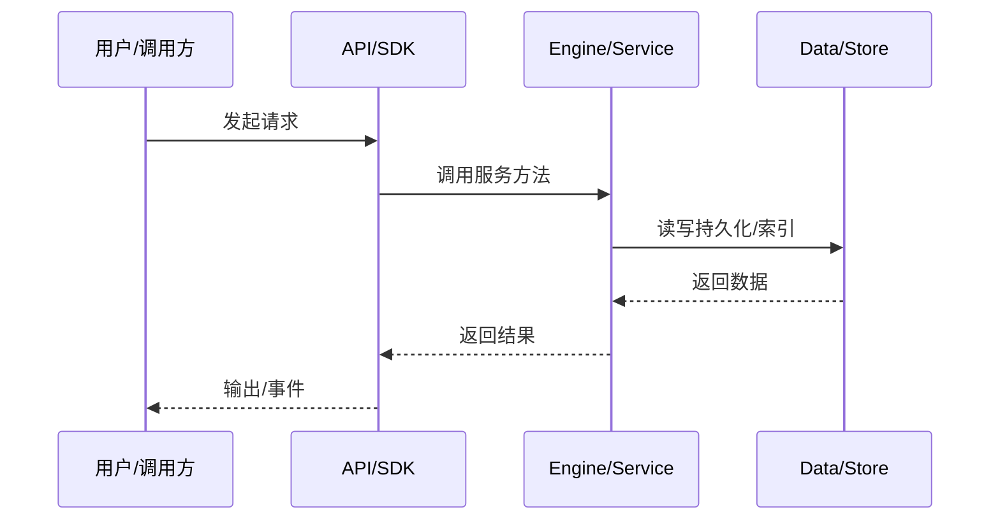

# 工具调用数据流

模型请求工具到工具结果回填上下文的完整链路。

## LLM 返回 tool_calls

kosong 把 provider 格式转成内部 ToolCall。

## Tool Activation/Policy

`toolActivation` 过滤可用工具，`toolPolicy` 评估策略，`toolApproval` 处理审批。

## Executor

`toolExecutor` 触发 before/after 事件，执行 `resolveExecution().execute`。

## 结果

ToolMessage 回填 contextMemory，并作为下一轮 LLM 输入。

## 专业实现要点（开发流程视角）

### 需求分析

数据流文档要回答“一个请求从哪里来、经过哪些服务、最终写到哪里”。

### 设计决策

用事件驱动解耦引擎与 UI；用 transcript 记录可重放状态；用 minidb read model 加速查询。

### 实现步骤

识别入口 API → 跟踪 service 调用链 → 标注持久化点 → 标注事件/WS 推送。

### 验证方式

通过 e2e、klient conformance suite、WS 订阅测试验证链路。

### 维护注意

异步链路要处理取消、重试、幂等；持久化要保证崩溃安全。

## 逐函数实现说明

以下按源码文件列出可验证的导出函数/类，并给出实现职责说明。

### packages/agent-core-v2/src/agent/toolApproval/toolApprovalService.ts

| 类 | 行号 | 声明 | 实现说明 |
| --- | --- | --- | --- |
| `PermissionApprovalRequested` | 43 | `export class PermissionApprovalRequested extends AgentEvent2<PermissionApprovalRequestedPayload> {` | 该类封装本文模块的核心状态与行为。 |
| `PermissionApprovalResolved` | 57 | `export class PermissionApprovalResolved extends AgentEvent2<PermissionApprovalResolvedPayload> {` | 该类封装本文模块的核心状态与行为。 |
| `AgentToolApprovalService` | 63 | `export class AgentToolApprovalService extends Service implements IAgentToolApprovalService {` | 该类封装本文模块的核心状态与行为。 |

### packages/agent-core-v2/src/agent/toolActivation/toolActivationService.ts

| 类 | 行号 | 声明 | 实现说明 |
| --- | --- | --- | --- |
| `AgentToolActivationService` | 18 | `export class AgentToolActivationService extends Service implements IAgentToolActivationService {` | 该类封装本文模块的核心状态与行为。 |


## 核心代码片段

以下片段直接从仓库源码截取，用于展示关键实现形态；完整实现请打开对应文件。

### 来自 `packages/agent-core-v2/src/agent/toolApproval/toolApprovalService.ts` 的 `PermissionApprovalRequested`

源码位置：`packages/agent-core-v2/src/agent/toolApproval/toolApprovalService.ts:43` 附近。

```ts
export class PermissionApprovalRequested extends AgentEvent2<PermissionApprovalRequestedPayload> {
  static override readonly type = 'permission.approval.requested';
  static override readonly observable = true;
}
export interface PermissionApprovalRequested extends PermissionApprovalRequestedPayload {}

export interface PermissionApprovalResolvedPayload extends PermissionApprovalRequestedPayload {
  readonly decision: 'approved' | 'rejected' | 'cancelled' | 'error';
  readonly scope?: 'session';
  readonly feedback?: string;
  readonly selectedLabel?: string;
  readonly error?: string;
}

export class PermissionApprovalResolved extends AgentEvent2<PermissionApprovalResolvedPayload> {
  static override readonly type = 'permission.approval.resolved';
  static override readonly observable = true;
}
export interface PermissionApprovalResolved extends PermissionApprovalResolvedPayload {}

export class AgentToolApprovalService extends Service implements IAgentToolApprovalService {
  declare readonly _serviceBrand: undefined;

  constructor(
// ...
```

### 来自 `packages/agent-core-v2/src/agent/toolActivation/toolActivationService.ts` 的 `AgentToolActivationService`

源码位置：`packages/agent-core-v2/src/agent/toolActivation/toolActivationService.ts:18` 附近。

```ts
export class AgentToolActivationService extends Service implements IAgentToolActivationService {
  declare readonly _serviceBrand: undefined;

  private readonly registrations = new Map<AgentToolContribution, IDisposable>();

  constructor(
    @IInstantiationService private readonly instantiationService: IInstantiationService,
    @IAgentToolRegistryService private readonly toolRegistry: IAgentToolRegistryService,
    @IAgentProfileService private readonly profile: IAgentProfileService,
    @ISessionToolPolicyGate private readonly toolPolicyGate: ISessionToolPolicyGate,
    @IAgentRuntimeService private readonly runtime: IAgentRuntimeService,
    @IEventBus eventBus: IEventBus,
    @AgentToolContribution private readonly contributions: CollectionView<AgentToolContribution>,
  ) {
    super();
    this._register(
      eventBus.subscribe(AgentStatusUpdated, () => {
        void this.activate();
      }),
    );
    this._register(this.runtime.onDidChange(() => this.refreshRuntimeRecords()));
    this._register(
      this.contributions.onDidChange((change) => {
        this.activateRecords(change.added);
// ...
```


## 时序/状态图



> 图注：`06-data-flow/tool-call-flow.md` 的抽象流程；具体参与者与状态以源码和上文函数说明为准。

## 核心实现细节（源码导出）

以下是本文涉及路径中的真实源码导出/结构，帮助你把概念映射到函数、类与方法：

  - `packages/agent-core-v2/src/agent/toolExecutor/toolExecutor.ts`：
    - 导出签名/声明：
      - `export interface ToolCallStartedPayload {`
      - `export interface ToolExecutorExecuteOptions {`
      - `export interface ToolExecutionResult {`
      - `export type MissingToolDescriber = (toolName: string) => string | undefined;`
      - `export type UnavailableToolDescriber = (toolName: string) => string | undefined;`
      - `export type ToolCallGuard = (tool: {`
      - `export type ToolCallDupType = 'same_step' | 'cross_step';`
      - `export interface IAgentToolExecutorService {`
      - `export const IAgentToolExecutorService =`
  - `packages/agent-core-v2/src/agent/toolApproval//` 目录下源码文件示例：
    - `packages/agent-core-v2/src/agent/toolApproval/toolApproval.ts`
    - `packages/agent-core-v2/src/agent/toolApproval/toolApprovalService.ts`
  - `packages/agent-core-v2/src/agent/toolActivation//` 目录下源码文件示例：
    - `packages/agent-core-v2/src/agent/toolActivation/toolActivation.ts`
    - `packages/agent-core-v2/src/agent/toolActivation/toolActivationService.ts`

## 证据与代码位置

- `packages/agent-core-v2/src/agent/toolExecutor/toolExecutor.ts`
- `packages/agent-core-v2/src/agent/toolApproval/`
- `packages/agent-core-v2/src/agent/toolActivation/`

> 本文所有路径均相对仓库根目录；引用内容以仓库当前 `HEAD` 为准。
