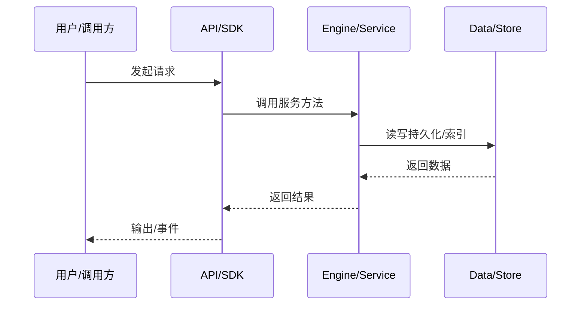

# SDK 传输一致性

klient 的 memory 和 IPC 传输如何共享同一套 dispatcher 和数据。

## Facade

客户端方法统一参数和 zod 校验。

## Channel

`KlientChannel.call/listen` 是唯一传输 SPI。

## Memory

直接使用进程内 dispatcher，JSON round-trip。

## IPC

NDJSON over unix socket，与 memory 共享同一 dispatcher 流量。

## 专业实现要点（开发流程视角）

### 需求分析

数据流文档要回答“一个请求从哪里来、经过哪些服务、最终写到哪里”。

### 设计决策

用事件驱动解耦引擎与 UI；用 transcript 记录可重放状态；用 minidb read model 加速查询。

### 实现步骤

识别入口 API → 跟踪 service 调用链 → 标注持久化点 → 标注事件/WS 推送。

### 验证方式

通过 e2e、klient conformance suite、WS 订阅测试验证链路。

### 维护注意

异步链路要处理取消、重试、幂等；持久化要保证崩溃安全。

## 逐函数实现说明

以下按源码文件列出可验证的导出函数/类，并给出实现职责说明。

### packages/klient/src/transports/args.ts

| 函数 | 行号 | 签名 | 实现说明 |
| --- | --- | --- | --- |
| `trimTrailingUndefined` | 7 | `export function trimTrailingUndefined(args: readonly unknown[]): unknown[] {` | `trimTrailingUndefined` 是本文涉及模块中的一个导出函数/类，具体语义以源码实现为准。 |

### packages/klient/src/transports/ipc/channel.ts

| 类 | 行号 | 声明 | 实现说明 |
| --- | --- | --- | --- |
| `IpcChannel` | 56 | `export class IpcChannel implements KlientChannel {` | 该类封装本文模块的核心状态与行为。 |

### packages/klient/src/transports/ipc/codec.ts

| 函数 | 行号 | 签名 | 实现说明 |
| --- | --- | --- | --- |
| `encodeFrame` | 26 | `export function encodeFrame(frame: IpcFrame): string {` | `encodeFrame` 是本文涉及模块中的一个导出函数/类，具体语义以源码实现为准。 |

| 类 | 行号 | 声明 | 实现说明 |
| --- | --- | --- | --- |
| `NdjsonDecoder` | 31 | `export class NdjsonDecoder {` | 该类封装本文模块的核心状态与行为。 |

### packages/klient/src/transports/ipc/host.ts

| 函数 | 行号 | 签名 | 实现说明 |
| --- | --- | --- | --- |
| `serveKlientIpc` | 51 | `export async function serveKlientIpc(options: ServeKlientIpcOptions): Promise<KlientIpcHost> {` | `serveKlientIpc` 是本文涉及模块中的一个导出函数/类，具体语义以源码实现为准。 |

### packages/klient/src/transports/ipc/index.ts

| 函数 | 行号 | 签名 | 实现说明 |
| --- | --- | --- | --- |
| `createKlient` | 17 | `export function createKlient(options: IpcKlientOptions): Klient {` | 创建 klient 客户端门面。 |

### packages/klient/src/transports/memory/dispatcher.ts

| 函数 | 行号 | 签名 | 实现说明 |
| --- | --- | --- | --- |
| `createMemoryDispatcher` | 198 | `export function createMemoryDispatcher(root: ScopeLike): MemoryDispatcher {` | `createMemoryDispatcher` 负责创建/构建相关对象或流程。 |

### packages/klient/src/transports/memory/index.ts

| 函数 | 行号 | 签名 | 实现说明 |
| --- | --- | --- | --- |
| `createKlient` | 59 | `export function createKlient(options: MemoryKlientOptions): Klient {` | 创建 klient 客户端门面。 |

### packages/klient/test/helpers/conformance.ts

| 函数 | 行号 | 签名 | 实现说明 |
| --- | --- | --- | --- |
| `defineKlientConformance` | 46 | `export function defineKlientConformance(` | `defineKlientConformance` 是本文涉及模块中的一个导出函数/类，具体语义以源码实现为准。 |


## 核心代码片段

以下片段直接从仓库源码截取，用于展示关键实现形态；完整实现请打开对应文件。

### 来自 `packages/klient/src/transports/args.ts` 的 `trimTrailingUndefined`

源码位置：`packages/klient/src/transports/args.ts:7` 附近。

```ts
export function trimTrailingUndefined(args: readonly unknown[]): unknown[] {
  let end = args.length;
  while (end > 0 && args[end - 1] === undefined) end -= 1;
  return end === args.length ? [...args] : args.slice(0, end);
}
```

### 来自 `packages/klient/src/transports/ipc/channel.ts` 的 `IpcChannel`

源码位置：`packages/klient/src/transports/ipc/channel.ts:56` 附近。

```ts
export class IpcChannel implements KlientChannel {
  private readonly socket: Socket;
  private readonly decoder = new NdjsonDecoder();
  private readonly callTimeoutMs: number;
  private readonly pending = new Map<string, PendingCall>();
  private readonly streams = new Map<string, PendingStream>();
  private readonly listens = new Map<
    string,
    { handler: (data: unknown) => void; onError?: (error: Error) => void }
  >();
  private readonly ready: Promise<void>;
  private closed = false;
  private seq = 0;
  private readonly idPrefix = `i${Date.now().toString(36)}`;

  constructor(options: IpcChannelOptions) {
    this.callTimeoutMs = options.callTimeoutMs ?? DEFAULT_CALL_TIMEOUT_MS;
    this.socket = createConnection(options.socketPath);
    this.ready = new Promise<void>((resolve, reject) => {
      const onError = (error: Error): void => {
        reject(error);
      };
      this.socket.once('error', onError);
      this.socket.once('connect', () => {
// ...
```

### 来自 `packages/klient/src/transports/ipc/codec.ts` 的 `encodeFrame`

源码位置：`packages/klient/src/transports/ipc/codec.ts:26` 附近。

```ts
export function encodeFrame(frame: IpcFrame): string {
  return `${JSON.stringify(frame)}\n`;
}

/** Incremental NDJSON decoder; malformed lines are dropped. */
export class NdjsonDecoder {
  private buffer = '';

  push(chunk: string): IpcFrame[] {
    this.buffer += chunk;
    const lines = this.buffer.split('\n');
    this.buffer = lines.pop() ?? '';
    const frames: IpcFrame[] = [];
    for (const line of lines) {
      if (line.length === 0) continue;
      try {
        frames.push(JSON.parse(line) as IpcFrame);
      } catch {
        // drop malformed frames
      }
    }
    return frames;
  }
}
// ...
```


## 时序/状态图



> 图注：`06-data-flow/transport-flow.md` 的抽象流程；具体参与者与状态以源码和上文函数说明为准。

## 核心实现细节（源码导出）

以下是本文涉及路径中的真实源码导出/结构，帮助你把概念映射到函数、类与方法：

  - `packages/klient/src/transports//` 目录下源码文件示例：
    - `packages/klient/src/transports/args.ts`
    - `packages/klient/src/transports/ipc/channel.ts`
    - `packages/klient/src/transports/ipc/codec.ts`
    - `packages/klient/src/transports/ipc/host.ts`
    - `packages/klient/src/transports/ipc/index.ts`
    - `packages/klient/src/transports/memory/dispatcher.ts`
    - `packages/klient/src/transports/memory/index.ts`
    - `packages/klient/src/transports/memory/serviceRegistry.ts`
  - `packages/klient/README.md`（非 TS 源码，可直接阅读）
  - `packages/klient/test/helpers/conformance.ts`：
    - 导出签名/声明：
      - `export interface KlientConformanceTarget {`
      - `export function defineKlientConformance(
  transport: string,
  makeTarget: () => Promise<KlientConformanceTarget>,
): void`

## 证据与代码位置

- `packages/klient/src/transports/`
- `packages/klient/README.md`
- `packages/klient/test/helpers/conformance.ts`

> 本文所有路径均相对仓库根目录；引用内容以仓库当前 `HEAD` 为准。
