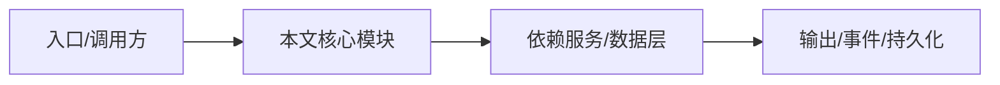

# 差异总结表

一张表总结 NightHawk 与主流 coding agent 的差异。

## 表

| 维度 | NightHawk | Codex | Claude Code | Cursor | Aider |
| --- | --- | --- | --- | --- | --- |
| 形态 | 终端+TUI+Server+VS Code | CLI/IDE | CLI | IDE | CLI |
| 开源 | MIT 仓库 | 否 | 否 | 否 | 是 |
| 模型中立 | 多供应商 | OpenAI 系 | Anthropic 系 | 多供应商 | 多供应商 |
| 内置安全引擎 | 有 | 弱 | 弱 | 弱 | 无 |
| MCP | 是 | 部分 | 是 | 是 | 部分 |
| Skills/Plugin | 是 | 部分 | 部分 | 部分 | 否 |
| 自托管 Server | 是 | 否 | 否 | 否 | 否 |
| 可观测 DI | 是 | 否 | 否 | 否 | 否 |

## 说明

表中“弱/部分”表示该产品可能依赖外部工具或仅有限支持；NightHawk 的结论可从本仓库源码验证。

## 专业实现要点（开发流程视角）

### 需求分析

对比文档要基于可验证事实，而不是营销话术。

### 设计决策

从形态、开源、模型中立、安全、扩展、可观测、部署等维度对比。

### 实现步骤

列出 NightHawk 源码证据 → 与公开产品信息对照 → 给出差异结论。

### 验证方式

每个结论尽量引用仓库文件路径；无法验证的标为“公开信息/生态判断”。

### 维护注意

竞品功能会变化，定期复核，避免过时结论。

## 逐函数实现说明

以下按源码文件列出可验证的导出函数/类，并给出实现职责说明。

## 核心代码片段

以下片段直接从仓库源码截取，用于展示关键实现形态；完整实现请打开对应文件。

> 本文证据路径没有可直接展示的 TS 源码片段。

## 时序/状态图

> 图注：`09-comparison/summary.md` 的抽象流程；具体参与者与状态以源码和上文函数说明为准。

## 核心实现细节（源码导出）

以下是本文涉及路径中的真实源码导出/结构，帮助你把概念映射到函数、类与方法：

  - `README.zh-CN.md`（非 TS 源码，可直接阅读）
  - `packages/agent-core-v2/docs/features.md`（非 TS 源码，可直接阅读）
  - `packages/kap-server/package.json`（非 TS 源码，可直接阅读）

## 证据与代码位置

- `README.zh-CN.md`
- `packages/agent-core-v2/docs/features.md`
- `packages/kap-server/package.json`

> 本文所有路径均相对仓库根目录；引用内容以仓库当前 `HEAD` 为准。
