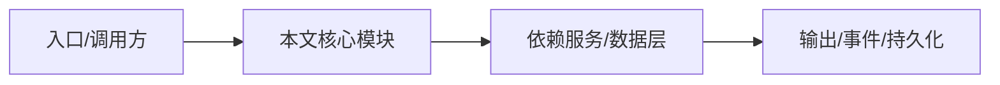

# 对比 OpenAI Codex

NightHawk 与 Codex 的差异集中在安全工具、开放性和终端形态。

## 相同点

都提供 agent loop、文件编辑、shell、上下文管理。

## 安全

NightHawk 内置 116 条漏洞规则、TaintTrace、SecretScan、DepAudit；Codex 依赖外部工具或 API。

## 开放

NightHawk 有完整 TypeScript SDK、REST/WS 协议、可自托管 server；Codex 以托管/IDE 生态为主。

## 终端

NightHawk TUI 原生毫秒启动、可 SSH；Codex CLI 也支持终端，但 NightHawk 把安全审计做成工作流。

## 专业实现要点（开发流程视角）

### 需求分析

对比文档要基于可验证事实，而不是营销话术。

### 设计决策

从形态、开源、模型中立、安全、扩展、可观测、部署等维度对比。

### 实现步骤

列出 NightHawk 源码证据 → 与公开产品信息对照 → 给出差异结论。

### 验证方式

每个结论尽量引用仓库文件路径；无法验证的标为“公开信息/生态判断”。

### 维护注意

竞品功能会变化，定期复核，避免过时结论。

## 逐函数实现说明

以下按源码文件列出可验证的导出函数/类，并给出实现职责说明。

## 核心代码片段

以下片段直接从仓库源码截取，用于展示关键实现形态；完整实现请打开对应文件。

> 本文证据路径没有可直接展示的 TS 源码片段。

## 时序/状态图

> 图注：`09-comparison/vs-codex.md` 的抽象流程；具体参与者与状态以源码和上文函数说明为准。

## 核心实现细节（源码导出）

以下是本文涉及路径中的真实源码导出/结构，帮助你把概念映射到函数、类与方法：

  - `README.zh-CN.md`（非 TS 源码，可直接阅读）
  - `docs/en/reference/tools.md`（非 TS 源码，可直接阅读）

## 证据与代码位置

- `README.zh-CN.md`
- `docs/en/reference/tools.md`

> 本文所有路径均相对仓库根目录；引用内容以仓库当前 `HEAD` 为准。
