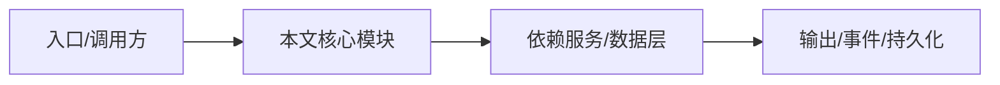

# WebSocket 协议参考

握手、订阅、cursor、ack、事件推送。

## 握手

server_hello → client_hello → ack。

## 订阅

subscribe / subscribe_v2 / unsubscribe / unsubscribe_v2。

## Cursor

`{seq, epoch}`；epoch 变更触发 resync_required。

## 事件

每个事件带 type、seq、epoch、volatile、session_id、timestamp。

## 专业实现要点（开发流程视角）

### 需求分析

参考手册要支持用户快速查找参数、命令、API、协议。

### 设计决策

以表格和代码块为主，保持条目化、可复制。

### 实现步骤

从 CLI 定义、protocol schema、SDK 类型和路由源码提取事实。

### 验证方式

运行 `nighthawk --help`、`pnpm doctor` 或对照 schema 测试。

### 维护注意

参考内容随代码变更同步更新。

## 逐函数实现说明

以下按源码文件列出可验证的导出函数/类，并给出实现职责说明。

### packages/kap-server/src/transport/ws/bearerProtocol.ts

| 函数 | 行号 | 签名 | 实现说明 |
| --- | --- | --- | --- |
| `extractWsBearerToken` | 3 | `export function extractWsBearerToken(protocolHeader: string \| undefined): string \| null {` | `extractWsBearerToken` 是本文涉及模块中的一个导出函数/类，具体语义以源码实现为准。 |
| `selectWsBearerProtocol` | 17 | `export function selectWsBearerProtocol(protocols: Iterable<string>): string \| false {` | `selectWsBearerProtocol` 是本文涉及模块中的一个导出函数/类，具体语义以源码实现为准。 |

### packages/kap-server/src/transport/ws/connectionRegistry.ts

| 类 | 行号 | 声明 | 实现说明 |
| --- | --- | --- | --- |
| `ConnectionRegistry` | 26 | `export class ConnectionRegistry implements IConnectionRegistry {` | 该类封装本文模块的核心状态与行为。 |

### packages/kap-server/src/transport/ws/v1/events.ts

| 函数 | 行号 | 签名 | 实现说明 |
| --- | --- | --- | --- |
| `isVolatileEventType` | 266 | `export function isVolatileEventType(type: string): type is VolatileEventType {` | `isVolatileEventType` 是本文涉及模块中的一个导出函数/类，具体语义以源码实现为准。 |

### packages/kap-server/src/transport/ws/v1/fsWatchBridge.ts

| 类 | 行号 | 声明 | 实现说明 |
| --- | --- | --- | --- |
| `FsWatchBridge` | 74 | `export class FsWatchBridge {` | 该类封装本文模块的核心状态与行为。 |

### packages/kap-server/src/transport/ws/v1/inFlightTurnTracker.ts

| 类 | 行号 | 声明 | 实现说明 |
| --- | --- | --- | --- |
| `InFlightTurnTracker` | 31 | `export class InFlightTurnTracker {` | 该类封装本文模块的核心状态与行为。 |

### packages/kap-server/src/transport/ws/v1/protocol.ts

| 函数 | 行号 | 签名 | 实现说明 |
| --- | --- | --- | --- |
| `buildServerHello` | 19 | `export function buildServerHello(payload: ServerHelloPayload): ServerHelloFrame {` | `buildServerHello` 负责创建/构建相关对象或流程。 |
| `buildPing` | 29 | `export function buildPing(nonce: string): PingFrame {` | `buildPing` 负责创建/构建相关对象或流程。 |
| `buildResyncRequired` | 58 | `export function buildResyncRequired(` | `buildResyncRequired` 负责创建/构建相关对象或流程。 |

### packages/kap-server/src/transport/ws/v1/registerWsV1.ts

| 函数 | 行号 | 签名 | 实现说明 |
| --- | --- | --- | --- |
| `registerWsV1` | 29 | `export function registerWsV1(core: Scope, opts: RegisterWsV1Options): WebSocketServer {` | `registerWsV1` 是本文涉及模块中的一个导出函数/类，具体语义以源码实现为准。 |

### packages/kap-server/src/transport/ws/v1/sessionEventBroadcaster.ts

| 类 | 行号 | 声明 | 实现说明 |
| --- | --- | --- | --- |
| `SessionEventBroadcaster` | 147 | `export class SessionEventBroadcaster {` | 该类封装本文模块的核心状态与行为。 |

### packages/kap-server/src/transport/ws/v1/sessionEventJournal.ts

| 函数 | 行号 | 签名 | 实现说明 |
| --- | --- | --- | --- |
| `sessionJournalPath` | 195 | `export function sessionJournalPath(eventsDir: string, sessionId: string): string {` | `sessionJournalPath` 是本文涉及模块中的一个导出函数/类，具体语义以源码实现为准。 |

| 类 | 行号 | 声明 | 实现说明 |
| --- | --- | --- | --- |
| `SessionEventJournal` | 50 | `export class SessionEventJournal {` | 该类封装本文模块的核心状态与行为。 |

### packages/kap-server/src/transport/ws/v1/subagentRosterTracker.ts

| 类 | 行号 | 声明 | 实现说明 |
| --- | --- | --- | --- |
| `SubagentRosterTracker` | 6 | `export class SubagentRosterTracker {` | 该类封装本文模块的核心状态与行为。 |

### packages/kap-server/src/transport/ws/v1/wsConnectionV1.ts

| 函数 | 行号 | 签名 | 实现说明 |
| --- | --- | --- | --- |
| `coalesceFrames` | 675 | `export function coalesceFrames(frames: readonly unknown[]): unknown[] {` | `coalesceFrames` 是本文涉及模块中的一个导出函数/类，具体语义以源码实现为准。 |

| 类 | 行号 | 声明 | 实现说明 |
| --- | --- | --- | --- |
| `WsConnectionV1` | 82 | `export class WsConnectionV1 implements BroadcastTarget {` | 该类封装本文模块的核心状态与行为。 |

### packages/kap-server/src/protocol/ws-control.ts

| 函数 | 行号 | 签名 | 实现说明 |
| --- | --- | --- | --- |
| `getClientControlOperation` | 694 | `export function getClientControlOperation(` | `getClientControlOperation` 负责读取或查询数据。 |


## 核心代码片段

以下片段直接从仓库源码截取，用于展示关键实现形态；完整实现请打开对应文件。

### 来自 `packages/kap-server/src/transport/ws/bearerProtocol.ts` 的 `extractWsBearerToken`

源码位置：`packages/kap-server/src/transport/ws/bearerProtocol.ts:3` 附近。

```ts
export function extractWsBearerToken(protocolHeader: string | undefined): string | null {
  if (protocolHeader === undefined) {
    return null;
  }
  for (const entry of protocolHeader.split(',')) {
    const protocol = entry.trim();
    if (protocol.startsWith(WS_BEARER_PROTOCOL_PREFIX)) {
      const token = protocol.slice(WS_BEARER_PROTOCOL_PREFIX.length);
      return token.length === 0 ? null : token;
    }
  }
  return null;
}

export function selectWsBearerProtocol(protocols: Iterable<string>): string | false {
  for (const protocol of protocols) {
    if (protocol.startsWith(WS_BEARER_PROTOCOL_PREFIX)) {
      return protocol;
    }
  }
  return false;
}
```

### 来自 `packages/kap-server/src/transport/ws/connectionRegistry.ts` 的 `ConnectionRegistry`

源码位置：`packages/kap-server/src/transport/ws/connectionRegistry.ts:26` 附近。

```ts
export class ConnectionRegistry implements IConnectionRegistry {
  private readonly conns = new Map<string, ConnectionLike>();

  add(conn: ConnectionLike): void {
    this.conns.set(conn.id, conn);
  }

  remove(connId: string): void {
    this.conns.delete(connId);
  }

  get(connId: string): ConnectionLike | undefined {
    return this.conns.get(connId);
  }

  values(): Iterable<ConnectionLike> {
    return this.conns.values();
  }

  closeAll(reason?: string): void {
    const snapshot = Array.from(this.conns.values());
    this.conns.clear();
    for (const conn of snapshot) {
      try {
// ...
```

### 来自 `packages/kap-server/src/transport/ws/v1/events.ts` 的 `isVolatileEventType`

源码位置：`packages/kap-server/src/transport/ws/v1/events.ts:266` 附近。

```ts
export function isVolatileEventType(type: string): type is VolatileEventType {
  return volatileEventTypeSet.has(type);
}
```


## 时序/状态图



> 图注：`11-reference/ws-protocol.md` 的抽象流程；具体参与者与状态以源码和上文函数说明为准。

## 核心实现细节（源码导出）

以下是本文涉及路径中的真实源码导出/结构，帮助你把概念映射到函数、类与方法：

  - `packages/kap-server/src/protocol/ws-control.ts`：
    - 导出签名/声明：
      - `export const WS_PROTOCOL_VERSION = 2;`
      - `export const sessionCursorSchema = z.object({`
      - `export type SessionCursor = z.infer<typeof sessionCursorSchema>;`
      - `export const cursorsBySessionSchema = z.record(z.string(), sessionCursorSchema);`
      - `export type CursorsBySession = z.infer<typeof cursorsBySessionSchema>;`
      - `export const wsEventEnvelopeSchema = <T extends z.ZodTypeAny>(payload: T) =>`
      - `export const wsControlEnvelopeSchema = <T extends z.ZodTypeAny>(payload: T) =>`
      - `export const wsAckEnvelopeSchema = <T extends z.ZodTypeAny>(payload: T) =>`
      - `export const serverHelloPayloadSchema = z.object({`
      - `export const serverHelloMessageSchema = z.object({`
      - `export type ServerHelloMessage = z.infer<typeof serverHelloMessageSchema>;`
      - `export const agentFilterSchema = z.record(z.string(), z.array(z.string()).min(1));`
      - `export type AgentFilter = z.infer<typeof agentFilterSchema>;`
      - `export const clientHelloPayloadSchema = z.object({`
      - `export const clientHelloMessageSchema = z.object({`
      - `export type ClientHelloMessage = z.infer<typeof clientHelloMessageSchema>;`
      - `export const clientHelloAckPayloadSchema = z.object({`
      - `export const helloAckPayloadSchema = clientHelloAckPayloadSchema;`
      - `export const clientHelloAckMessageSchema = wsAckEnvelopeSchema(clientHelloAckPayloadSchema);`
      - `export const watchFsConfigSchema = z.object({`
      - `export const subscribePayloadSchema = z.object({`
      - `export const subscribeMessageSchema = z.object({`
      - `export type SubscribeMessage = z.infer<typeof subscribeMessageSchema>;`
      - `export const subscribeV2PayloadSchema = z.object({`
      - `export const subscribeV2MessageSchema = z.object({`
      - `export type SubscribeV2Message = z.infer<typeof subscribeV2MessageSchema>;`
      - `export const unsubscribeV2PayloadSchema = z.object({`
      - `export const unsubscribeV2MessageSchema = z.object({`
      - `export type UnsubscribeV2Message = z.infer<typeof unsubscribeV2MessageSchema>;`
      - `export const subscribeAckPayloadSchema = z.object({`
      - `export const subscribeAckMessageSchema = wsAckEnvelopeSchema(subscribeAckPayloadSchema);`
      - `export const subscribeV2AckMessageSchema = wsAckEnvelopeSchema(subscribeAckPayloadSchema);`
      - `export const unsubscribeV2AckMessageSchema = wsAckEnvelopeSchema(subscribeAckPayloadSchema);`
      - `export const unsubscribePayloadSchema = z.object({`
      - `export const unsubscribeMessageSchema = z.object({`
      - `export type UnsubscribeMessage = z.infer<typeof unsubscribeMessageSchema>;`
      - `export const unsubscribeAckPayloadSchema = subscribeAckPayloadSchema;`
      - `export const unsubscribeAckMessageSchema = wsAckEnvelopeSchema(unsubscribeAckPayloadSchema);`
      - `export const watchFsAddPayloadSchema = z.object({`
      - `export const watchFsAddMessageSchema = z.object({`
      - `export type WatchFsAddMessage = z.infer<typeof watchFsAddMessageSchema>;`
      - `export const watchFsRemovePayloadSchema = z.object({`
      - `export const watchFsRemoveMessageSchema = z.object({`
      - `export type WatchFsRemoveMessage = z.infer<typeof watchFsRemoveMessageSchema>;`
      - `export const watchFsAckPayloadSchema = z.object({`
      - `export const watchFsAckMessageSchema = wsAckEnvelopeSchema(watchFsAckPayloadSchema);`
      - `export const fsChangeKindSchema = z.enum(['file', 'directory', 'symlink']);`
      - `export type FsChangeKind = z.infer<typeof fsChangeKindSchema>;`
      - `export const fsChangeActionSchema = z.enum(['created', 'modified', 'deleted']);`
      - `export type FsChangeAction = z.infer<typeof fsChangeActionSchema>;`
      - `export const fsChangeEntrySchema = z.object({`
      - `export type FsChangeEntry = z.infer<typeof fsChangeEntrySchema>;`
      - `export const fsChangeEventSchema = z.object({`
      - `export type FsChangeEvent = z.infer<typeof fsChangeEventSchema>;`
      - `export const abortPayloadSchema = z.object({`
      - `export const abortMessageSchema = z.object({`
      - `export type AbortMessage = z.infer<typeof abortMessageSchema>;`
      - `export const abortAckPayloadSchema = z.object({`
      - `export const abortAckMessageSchema = wsAckEnvelopeSchema(abortAckPayloadSchema);`
      - `export const terminalAttachPayloadSchema = z.object({`
      - `export const terminalAttachMessageSchema = z.object({`
      - `export type TerminalAttachMessage = z.infer<typeof terminalAttachMessageSchema>;`
      - `export const terminalAttachAckPayloadSchema = z.object({`
      - `export const terminalAttachAckMessageSchema = wsAckEnvelopeSchema(`
      - `export const terminalDetachPayloadSchema = z.object({`
      - `export const terminalDetachMessageSchema = z.object({`
      - `export type TerminalDetachMessage = z.infer<typeof terminalDetachMessageSchema>;`
      - `export const terminalDetachAckPayloadSchema = z.object({`
      - `export const terminalDetachAckMessageSchema = wsAckEnvelopeSchema(`
      - `export const terminalInputPayloadSchema = z.object({`
      - `export const terminalInputMessageSchema = z.object({`
      - `export type TerminalInputMessage = z.infer<typeof terminalInputMessageSchema>;`
      - `export const terminalInputAckPayloadSchema = z.object({`
      - `export const terminalInputAckMessageSchema = wsAckEnvelopeSchema(`
      - `export const terminalResizePayloadSchema = z.object({`
      - `export const terminalResizeMessageSchema = z.object({`
      - `export type TerminalResizeMessage = z.infer<typeof terminalResizeMessageSchema>;`
      - `export const terminalResizeAckPayloadSchema = z.object({`
      - `export const terminalResizeAckMessageSchema = wsAckEnvelopeSchema(`
      - `export const terminalClosePayloadSchema = z.object({`
  - `packages/kap-server/src/transport/ws//` 目录下源码文件示例：
    - `packages/kap-server/src/transport/ws/bearerProtocol.ts`
    - `packages/kap-server/src/transport/ws/connectionRegistry.ts`
    - `packages/kap-server/src/transport/ws/v1/events.ts`
    - `packages/kap-server/src/transport/ws/v1/fsWatchBridge.ts`
    - `packages/kap-server/src/transport/ws/v1/inFlightTurnTracker.ts`
    - `packages/kap-server/src/transport/ws/v1/protocol.ts`
    - `packages/kap-server/src/transport/ws/v1/registerWsV1.ts`
    - `packages/kap-server/src/transport/ws/v1/sessionEventBroadcaster.ts`
    - `packages/kap-server/src/transport/ws/v1/sessionEventJournal.ts`
    - `packages/kap-server/src/transport/ws/v1/subagentRosterTracker.ts`
    - `packages/kap-server/src/transport/ws/v1/wsConnectionV1.ts`

## 证据与代码位置

- `packages/kap-server/src/protocol/ws-control.ts`
- `packages/kap-server/src/transport/ws/`

> 本文所有路径均相对仓库根目录；引用内容以仓库当前 `HEAD` 为准。
